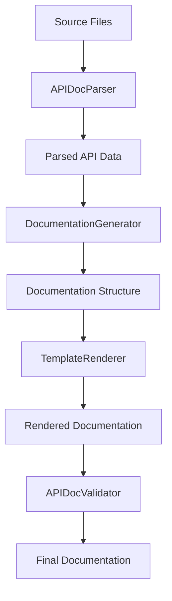
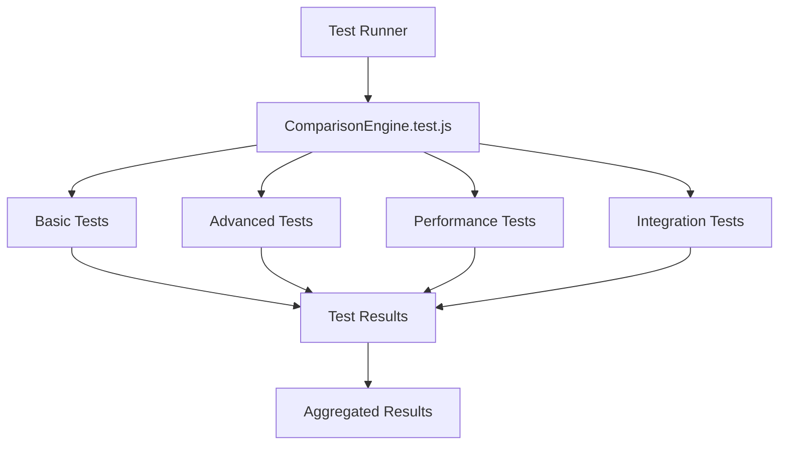

# Design Document

## Overview

This design document outlines the implementation strategy for Phase E.4 of the large file splitting project. Based on the current project analysis, we need to focus on optimizing existing large tool and test files, as the backup files have already been cleaned up in a previous phase.

### Current Status Analysis

- **Backup Files**: Already removed (confirmed via .cleanup-backups metadata)
- **Large Tool Files**: 
  - `tools/api-doc-generator.js` (3,727 words) - Requires splitting
  - `tools/file-size-monitor.js` (666 words) - No splitting needed
- **Large Test Files**:
  - `tests/analytics/ComparisonEngine.test.js` (3,494 words) - Requires splitting

## Architecture

### Component-Based Splitting Strategy

Following the project's established Main Controller Pattern, we will split large files into focused, single-responsibility components while maintaining backward compatibility through main controller files.

### File Organization Structure

```
tools/
├── api-doc-generator.js (Main Controller)
├── api-doc-generator/
│   ├── APIDocParser.js
│   ├── DocumentationGenerator.js
│   ├── TemplateRenderer.js
│   └── APIDocValidator.js
└── file-size-monitor.js (No changes needed)

tests/analytics/
├── ComparisonEngine.test.js (Main Test Suite)
└── comparison-engine-tests/
    ├── ComparisonEngineBasicTests.js
    ├── ComparisonEngineAdvancedTests.js
    ├── ComparisonEnginePerformanceTests.js
    └── ComparisonEngineIntegrationTests.js
```

## Components and Interfaces

### API Documentation Generator Components

#### 1. APIDocParser.js
**Responsibility**: Parse source code and extract API information
- Extract class definitions and method signatures
- Parse Japanese comments and JSDoc annotations
- Identify public/private methods and properties
- Build abstract syntax tree for documentation

#### 2. DocumentationGenerator.js
**Responsibility**: Generate documentation content from parsed data
- Transform parsed data into documentation structure
- Apply documentation templates and formatting
- Generate cross-references and navigation
- Handle multilingual content (Japanese/English)

#### 3. TemplateRenderer.js
**Responsibility**: Render documentation using templates
- Load and process Markdown templates
- Apply styling and formatting rules
- Generate table of contents and indices
- Handle output file generation

#### 4. APIDocValidator.js
**Responsibility**: Validate generated documentation
- Check for missing documentation
- Validate cross-references and links
- Ensure consistency across documentation
- Generate validation reports

#### 5. api-doc-generator.js (Main Controller)
**Responsibility**: Orchestrate the documentation generation process
- Initialize and coordinate all components
- Handle configuration and command-line arguments
- Manage the overall workflow
- Provide backward compatibility

### ComparisonEngine Test Components

#### 1. ComparisonEngineBasicTests.js
**Responsibility**: Basic functionality tests
- Constructor and initialization tests
- Basic comparison operations
- Simple data validation tests
- Core method functionality

#### 2. ComparisonEngineAdvancedTests.js
**Responsibility**: Advanced feature tests
- Complex comparison scenarios
- Edge case handling
- Advanced configuration options
- Error handling and recovery

#### 3. ComparisonEnginePerformanceTests.js
**Responsibility**: Performance and optimization tests
- Large dataset handling
- Memory usage validation
- Execution time benchmarks
- Scalability tests

#### 4. ComparisonEngineIntegrationTests.js
**Responsibility**: Integration and system tests
- Integration with storage systems
- Cross-component interaction tests
- End-to-end workflow validation
- System compatibility tests

#### 5. ComparisonEngine.test.js (Main Test Suite)
**Responsibility**: Test orchestration and common setup
- Import and run all test suites
- Shared test utilities and mocks
- Common setup and teardown
- Test result aggregation

## Data Models

### API Documentation Data Flow



### Test Suite Data Flow



## Error Handling

### API Documentation Generator Error Handling

1. **Parse Errors**: Graceful handling of malformed source files
2. **Template Errors**: Fallback templates for missing or corrupted templates
3. **File System Errors**: Proper error reporting for file access issues
4. **Validation Errors**: Clear reporting of documentation inconsistencies

### Test Suite Error Handling

1. **Test Isolation**: Ensure test failures don't affect other test suites
2. **Mock Failures**: Proper handling of mock setup failures
3. **Async Test Errors**: Proper cleanup and error reporting for async tests
4. **Resource Cleanup**: Ensure proper cleanup even when tests fail

## Testing Strategy

### Unit Testing Approach

1. **Component Isolation**: Each split component will have its own unit tests
2. **Interface Testing**: Verify that component interfaces work correctly
3. **Integration Testing**: Ensure split components work together
4. **Regression Testing**: Verify that splitting doesn't break existing functionality

### Test File Organization

```
tests/
├── unit/
│   ├── tools/
│   │   ├── APIDocParser.test.js
│   │   ├── DocumentationGenerator.test.js
│   │   ├── TemplateRenderer.test.js
│   │   └── APIDocValidator.test.js
│   └── analytics/
│       └── comparison-engine-tests/
│           ├── ComparisonEngineBasicTests.test.js
│           ├── ComparisonEngineAdvancedTests.test.js
│           ├── ComparisonEnginePerformanceTests.test.js
│           └── ComparisonEngineIntegrationTests.test.js
└── integration/
    ├── api-doc-generator-integration.test.js
    └── comparison-engine-integration.test.js
```

### Performance Validation

1. **File Size Validation**: Ensure all split files are under 2,500 words
2. **MCP Tool Compatibility**: Verify find_symbol operations work correctly
3. **Execution Performance**: Ensure splitting doesn't degrade performance
4. **Memory Usage**: Monitor memory consumption of split components

## Implementation Phases

### Phase 1: Backup File Status Verification
- Confirm backup files are properly cleaned up
- Verify .cleanup-backups contains proper metadata
- Update documentation to reflect cleanup status

### Phase 2: API Documentation Generator Splitting
- Analyze current api-doc-generator.js structure
- Extract parsing logic into APIDocParser.js
- Extract generation logic into DocumentationGenerator.js
- Extract rendering logic into TemplateRenderer.js
- Extract validation logic into APIDocValidator.js
- Update main controller to use split components

### Phase 3: ComparisonEngine Test Splitting
- Analyze current test structure and organization
- Split tests by functionality (basic, advanced, performance, integration)
- Ensure proper test isolation and shared utilities
- Verify all tests continue to pass after splitting

### Phase 4: Integration and Validation
- Run comprehensive tests on all split components
- Verify MCP tool compatibility
- Validate file sizes are under 2,500 words
- Update project documentation

## Backward Compatibility

### API Documentation Generator
- Main controller maintains the same command-line interface
- All existing configuration options continue to work
- Output format and structure remain unchanged
- Integration with existing build processes preserved

### Test Suite
- Test runner continues to execute all tests
- Test results format remains consistent
- CI/CD integration continues to work
- Coverage reporting maintains accuracy

## Security Considerations

### File System Access
- Maintain proper file system permissions
- Validate file paths to prevent directory traversal
- Handle file access errors gracefully

### Code Parsing Security
- Sanitize parsed code content
- Prevent code injection through malicious comments
- Validate file types before processing

## Performance Optimization

### Memory Management
- Implement proper cleanup in split components
- Use streaming for large file processing
- Optimize data structures for memory efficiency

### Execution Efficiency
- Minimize redundant operations across components
- Implement caching where appropriate
- Optimize file I/O operations

## Monitoring and Maintenance

### File Size Monitoring
- Automated checks to ensure files stay under 2,500 words
- Alerts when files approach the size limit
- Regular monitoring of component growth

### Performance Monitoring
- Track execution time of split components
- Monitor memory usage patterns
- Identify performance regressions early