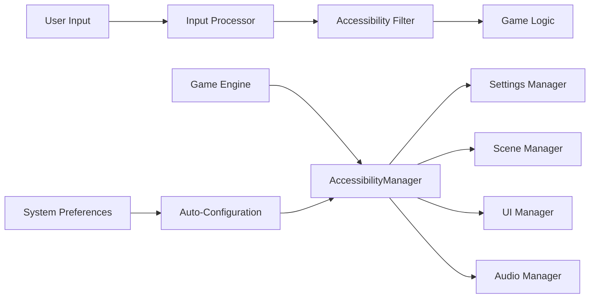

# Design Document

## Overview

このドキュメントは、BubblePop Web Gameの包括的なアクセシビリティサポート強化の設計を定義します。現在の基本的なアクセシビリティ実装を拡張し、WCAG 2.1 AA準拠を達成するための包括的なアクセシビリティフレームワークを構築します。

### Current State Analysis

現在の実装状況：
- 基本的なARIA属性の実装（role, aria-label, aria-live）
- キーボードショートカット管理（KeyboardShortcutManager）
- 基本的な視覚的アクセシビリティ（高コントラスト、大きなテキスト、モーション軽減）
- 統計システム専用のアクセシビリティ管理（StatisticsAccessibilityManager）
- 基本的なスクリーンリーダー対応

### Enhancement Goals

- WCAG 2.1 AA完全準拠
- 包括的なキーボードナビゲーション
- 高度なスクリーンリーダー対応
- 多様な視覚的・聴覚的・運動機能的ニーズへの対応
- 認知的アクセシビリティの向上
- 自動化されたアクセシビリティテスト

## Architecture

### Core Components

```mermaid
graph TB
    A[AccessibilityManager] --> B[KeyboardAccessibilityManager]
    A --> C[ScreenReaderManager]
    A --> D[VisualAccessibilityManager]
    A --> E[AudioAccessibilityManager]
    A --> F[MotorAccessibilityManager]
    A --> G[CognitiveAccessibilityManager]
    A --> H[AccessibilityTestingFramework]
    
    B --> I[FocusManager]
    B --> J[KeyboardNavigationEngine]
    B --> K[ShortcutManager]
    
    C --> L[ARIAManager]
    C --> M[LiveRegionManager]
    C --> N[SpeechSynthesisManager]
    
    D --> O[ContrastManager]
    D --> P[TextScalingManager]
    D --> Q[ColorBlindnessSupport]
    D --> R[MotionManager]
    
    E --> S[VisualFeedbackManager]
    E --> T[CaptionManager]
    E --> U[VibrationManager]
    
    F --> V[AlternativeInputManager]
    F --> W[GestureCustomizer]
    F --> X[TimingAdjustmentManager]
    
    G --> Y[SimplificationManager]
    G --> Z[HelpSystemManager]
    G --> AA[ErrorRecoveryManager]
```



### System Integration



## Components and Interfaces

### 1. AccessibilityManager (Core Orchestrator)

```javascript
class AccessibilityManager {
    constructor(gameEngine) {
        this.gameEngine = gameEngine;
        this.config = new AccessibilityConfiguration();
        this.managers = new Map();
        this.testingFramework = new AccessibilityTestingFramework();
    }
    
    // Core methods
    initialize()
    detectSystemPreferences()
    applyConfiguration(config)
    validateCompliance()
    generateReport()
}
```

**Responsibilities:**
- 全アクセシビリティ機能の統合管理
- システム設定の自動検出と適用
- WCAG準拠の監視と検証
- アクセシビリティレポートの生成

### 2. KeyboardAccessibilityManager

```javascript
class KeyboardAccessibilityManager {
    constructor(accessibilityManager) {
        this.focusManager = new FocusManager();
        this.navigationEngine = new KeyboardNavigationEngine();
        this.shortcutManager = new EnhancedShortcutManager();
    }
    
    // Key methods
    setupKeyboardNavigation()
    createFocusRing()
    handleKeyboardInput(event)
    announceNavigation(element)
}
```

**Key Features:**
- 論理的なタブ順序の自動管理
- 2次元ナビゲーション（矢印キー）
- カスタマイズ可能なキーボードショートカット
- フォーカストラップとスキップリンク
- 視覚的フォーカス表示の強化

### 3. ScreenReaderManager

```javascript
class ScreenReaderManager {
    constructor(accessibilityManager) {
        this.ariaManager = new ARIAManager();
        this.liveRegionManager = new LiveRegionManager();
        this.speechSynthesis = new SpeechSynthesisManager();
        this.contentDescriber = new GameContentDescriber();
    }
    
    // Core methods
    announceGameState(state)
    describeGameElement(element)
    updateLiveRegions(data)
    generateAltText(visualContent)
}
```

**Key Features:**
- 動的コンテンツの適切な通知
- ゲーム状態の詳細な音声説明
- 多言語対応の音声合成
- コンテキストに応じた説明レベル調整

### 4. VisualAccessibilityManager

```javascript
class VisualAccessibilityManager {
    constructor(accessibilityManager) {
        this.contrastManager = new ContrastManager();
        this.textScaling = new TextScalingManager();
        this.colorBlindSupport = new ColorBlindnessSupport();
        this.motionManager = new MotionManager();
    }
    
    // Core methods
    applyHighContrast(level)
    adjustTextSize(scale)
    enableColorBlindSupport(type)
    reduceMotion(level)
}
```

**Key Features:**
- 動的コントラスト調整（AAA準拠）
- レスポンシブテキストスケーリング
- 色覚異常対応（パターン・形状による区別）
- アニメーション制御とモーション軽減

### 5. AudioAccessibilityManager

```javascript
class AudioAccessibilityManager {
    constructor(accessibilityManager) {
        this.visualFeedback = new VisualFeedbackManager();
        this.captionSystem = new CaptionManager();
        this.vibrationManager = new VibrationManager();
        this.audioVisualizer = new AudioVisualizationManager();
    }
    
    // Core methods
    createVisualFeedback(audioEvent)
    displayCaption(audioContent)
    triggerVibration(pattern)
    visualizeAudio(audioData)
}
```

**Key Features:**
- 音響効果の視覚的表現
- リアルタイム字幕システム
- 振動フィードバック（対応デバイス）
- 音楽・効果音の視覚化

### 6. MotorAccessibilityManager

```javascript
class MotorAccessibilityManager {
    constructor(accessibilityManager) {
        this.inputCustomizer = new AlternativeInputManager();
        this.gestureManager = new GestureCustomizer();
        this.timingManager = new TimingAdjustmentManager();
        this.switchSupport = new SwitchInputSupport();
    }
    
    // Core methods
    enableOneHandedMode()
    adjustSensitivity(settings)
    customizeGestures(mappings)
    extendTimeouts(duration)
}
```

**Key Features:**
- ワンハンド操作モード
- 感度とタイミングの調整
- 代替入力デバイス対応
- スイッチ操作サポート

### 7. CognitiveAccessibilityManager

```javascript
class CognitiveAccessibilityManager {
    constructor(accessibilityManager) {
        this.simplificationManager = new SimplificationManager();
        this.helpSystem = new ContextualHelpManager();
        this.errorRecovery = new ErrorRecoveryManager();
        this.guidanceSystem = new StepByStepGuidance();
    }
    
    // Core methods
    simplifyInterface(level)
    provideContextualHelp(context)
    handleError(error, context)
    guideUserAction(action)
}
```

**Key Features:**
- UI簡素化モード
- コンテキスト依存ヘルプ
- エラー回復支援
- ステップバイステップガイダンス

## Data Models

### AccessibilityConfiguration

```javascript
class AccessibilityConfiguration {
    constructor() {
        this.keyboard = {
            enabled: true,
            navigationMode: '2d', // '1d', '2d', 'custom'
            shortcuts: new Map(),
            focusVisible: true,
            skipLinks: true,
            tabOrder: 'logical' // 'logical', 'dom', 'custom'
        };
        
        this.screenReader = {
            enabled: 'auto', // true, false, 'auto'
            verbosity: 'normal', // 'minimal', 'normal', 'verbose'
            announcements: {
                gameState: true,
                score: true,
                actions: true,
                errors: true
            },
            speechRate: 1.0,
            language: 'auto'
        };
        
        this.visual = {
            highContrast: {
                enabled: false,
                level: 'aa', // 'aa', 'aaa'
                customColors: null
            },
            textScaling: {
                enabled: false,
                scale: 1.0, // 0.8 - 2.0
                lineHeight: 1.4
            },
            colorBlindness: {
                enabled: false,
                type: 'none', // 'protanopia', 'deuteranopia', 'tritanopia'
                patterns: true,
                shapes: true
            },
            motion: {
                reduced: false,
                level: 'none' // 'none', 'reduced', 'minimal'
            }
        };
        
        this.audio = {
            visualFeedback: {
                enabled: false,
                intensity: 'medium', // 'low', 'medium', 'high'
                type: 'flash' // 'flash', 'glow', 'pulse'
            },
            captions: {
                enabled: false,
                position: 'bottom', // 'top', 'bottom', 'overlay'
                size: 'medium',
                background: true
            },
            vibration: {
                enabled: false,
                intensity: 0.5, // 0.0 - 1.0
                patterns: new Map()
            }
        };
        
        this.motor = {
            oneHanded: {
                enabled: false,
                dominantHand: 'right' // 'left', 'right'
            },
            sensitivity: {
                mouse: 1.0,
                touch: 1.0,
                keyboard: 1.0
            },
            timing: {
                clickDelay: 0,
                holdDuration: 500,
                doubleClickInterval: 300
            },
            alternativeInput: {
                switches: false,
                eyeTracking: false,
                voiceControl: false
            }
        };
        
        this.cognitive = {
            simplification: {
                enabled: false,
                level: 'basic' // 'basic', 'intermediate', 'advanced'
            },
            help: {
                contextual: true,
                tooltips: true,
                tutorials: true
            },
            errorHandling: {
                recovery: true,
                suggestions: true,
                prevention: true
            }
        };
    }
}
```

### AccessibilityState

```javascript
class AccessibilityState {
    constructor() {
        this.currentFocus = null;
        this.navigationHistory = [];
        this.activeAnnouncements = [];
        this.errorState = null;
        this.helpContext = null;
        this.userPreferences = new Map();
        this.complianceStatus = {
            wcag21AA: false,
            lastCheck: null,
            issues: []
        };
    }
}
```

## Error Handling

### AccessibilityErrorHandler

```javascript
class AccessibilityErrorHandler {
    constructor(accessibilityManager) {
        this.manager = accessibilityManager;
        this.errorRecovery = new Map();
        this.fallbackStrategies = new Map();
    }
    
    handleError(error, context) {
        // エラーの分類と適切な対応
        const errorType = this.classifyError(error);
        const recovery = this.errorRecovery.get(errorType);
        
        if (recovery) {
            return recovery.execute(error, context);
        }
        
        // フォールバック戦略の実行
        return this.executeFallback(error, context);
    }
    
    registerRecoveryStrategy(errorType, strategy) {
        this.errorRecovery.set(errorType, strategy);
    }
}
```

**Error Categories:**
- **Focus Management Errors**: フォーカス喪失、無効な要素へのフォーカス
- **ARIA Errors**: 不正なARIA属性、矛盾するロール
- **Navigation Errors**: キーボードトラップ、到達不可能な要素
- **Content Errors**: 不適切な代替テキスト、欠落したラベル
- **Timing Errors**: タイムアウト、応答性の問題

## Testing Strategy

### Automated Testing Framework

```javascript
class AccessibilityTestingFramework {
    constructor() {
        this.wcagValidator = new WCAGValidator();
        this.screenReaderSimulator = new ScreenReaderSimulator();
        this.keyboardTester = new KeyboardNavigationTester();
        this.colorContrastAnalyzer = new ColorContrastAnalyzer();
    }
    
    async runFullAudit() {
        const results = {
            wcag: await this.wcagValidator.validate(),
            screenReader: await this.screenReaderSimulator.test(),
            keyboard: await this.keyboardTester.test(),
            contrast: await this.colorContrastAnalyzer.analyze()
        };
        
        return this.generateReport(results);
    }
}
```

### Test Categories

1. **WCAG 2.1 Compliance Tests**
   - 自動化されたルールチェック
   - 色彩コントラスト測定
   - キーボードアクセシビリティ検証
   - フォーカス管理テスト

2. **Screen Reader Compatibility Tests**
   - NVDA, JAWS, VoiceOver対応テスト
   - ARIA属性の正確性検証
   - 動的コンテンツの通知テスト
   - 多言語読み上げテスト

3. **Keyboard Navigation Tests**
   - 全機能のキーボードアクセス検証
   - タブ順序の論理性テスト
   - フォーカストラップの動作確認
   - ショートカットの競合チェック

4. **Visual Accessibility Tests**
   - 高コントラストモードの動作確認
   - テキストスケーリングの検証
   - 色覚異常シミュレーション
   - モーション軽減の効果測定

5. **Motor Accessibility Tests**
   - ワンハンド操作の検証
   - タッチターゲットサイズの確認
   - 代替入力デバイスの対応テスト
   - タイミング調整の効果測定

### Performance Considerations

- **Lazy Loading**: アクセシビリティ機能の必要時読み込み
- **Caching**: ARIA属性とフォーカス状態のキャッシュ
- **Debouncing**: 頻繁な状態変更の最適化
- **Memory Management**: イベントリスナーとオブザーバーの適切な管理

### Browser Compatibility

- **Modern Browsers**: Chrome 90+, Firefox 88+, Safari 14+, Edge 90+
- **Screen Readers**: NVDA, JAWS, VoiceOver, TalkBack
- **Assistive Technologies**: Dragon NaturallySpeaking, Switch Access
- **Mobile Support**: iOS VoiceOver, Android TalkBack

### Implementation Phases

**Phase 1: Core Infrastructure**
- AccessibilityManager基盤構築
- 基本的なWCAG準拠
- キーボードナビゲーション強化

**Phase 2: Advanced Features**
- スクリーンリーダー対応強化
- 視覚的アクセシビリティ機能
- 音響アクセシビリティ機能

**Phase 3: Specialized Support**
- 運動機能アクセシビリティ
- 認知的アクセシビリティ
- 代替入力デバイス対応

**Phase 4: Testing and Optimization**
- 包括的テストスイート
- パフォーマンス最適化
- ユーザビリティテスト

### Integration Points

- **Settings System**: アクセシビリティ設定の永続化
- **Localization**: 多言語アクセシビリティサポート
- **Analytics**: アクセシビリティ機能使用統計
- **Error Handling**: アクセシビリティエラーの統合処理