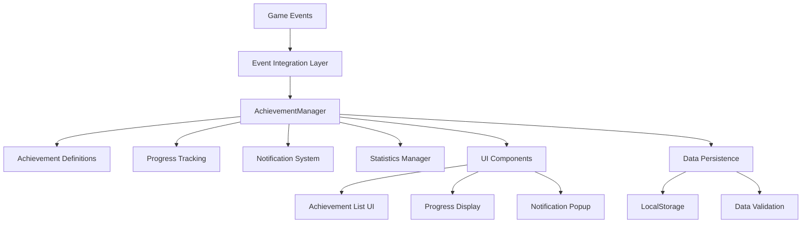

# Design Document

## Overview

実績システム（AchievementManager）の完全実装を行います。現在の基本構造を拡張し、ゲームプレイとの完全統合、UI表示機能、通知システムを実装します。30個以上の実績定義、リアルタイム進捗追跡、視覚的な通知システム、統計表示機能を含む包括的な実績システムを構築します。

## Architecture

### Core Components



### System Integration Points

1. **BubbleManager Integration**: 泡が割れた時の実績進捗更新
2. **ScoreManager Integration**: スコア関連実績の追跡
3. **GameScene Integration**: ゲーム終了時の実績チェック
4. **StatisticsManager Integration**: 統計データとの連携
5. **UserInfoScene Integration**: 実績表示UI

## Components and Interfaces

### Enhanced AchievementManager

```javascript
class AchievementManager {
    constructor(gameEngine)
    
    // Core Methods
    initializeAchievements()
    updateProgress(eventType, data)
    unlockAchievement(achievement)
    
    // Integration Methods
    onBubblePopped(bubbleType, reactionTime, position)
    onGameEnd(gameData)
    onComboUpdate(combo, broken)
    onSpecialEffect(effectType)
    onStageComplete(stageId, data)
    
    // UI Support Methods
    getAchievements()
    getAchievementsByCategory()
    getNotifications()
    getStatistics()
    
    // Data Management
    save()
    load()
    reset()
}
```

### Achievement Categories and Definitions

#### 1. Score Achievements (スコア系実績)
- **First Score Milestones**: 初回スコア達成 (1K, 5K, 10K, 25K, 50K, 100K)
- **High Score Tiers**: 高スコア達成 (段階的: Bronze, Silver, Gold, Platinum, Diamond)
- **Cumulative Score**: 累計スコア達成 (100K, 500K, 1M, 5M, 10M)

#### 2. Play Achievements (プレイ系実績)
- **Consecutive Play Days**: 連続プレイ日数 (3日, 7日, 14日, 30日)
- **Total Play Time**: 総プレイ時間 (1時間, 5時間, 10時間, 25時間, 50時間)
- **Game Count**: ゲーム回数 (10回, 50回, 100回, 500回, 1000回)
- **Stage Completions**: ステージクリア数 (5回, 25回, 50回, 100回)

#### 3. Technique Achievements (テクニック系実績)
- **Combo Achievements**: コンボ達成 (10, 25, 50, 100, 200連鎖)
- **Special Bubble Usage**: 特殊泡の活用 (各タイプ10個, 50個, 100個)
- **Perfect Games**: パーフェクトクリア (泡を逃さない)
- **Speed Challenges**: スピードチャレンジ (時間内に一定数の泡を割る)
- **Accuracy Achievements**: 精度達成 (90%, 95%, 98%, 99%)

#### 4. Collection Achievements (コレクション系実績)
- **All Stages Clear**: 全ステージクリア
- **All Items Purchase**: 全アイテム購入
- **Hidden Features**: 隠し要素の発見
- **Special Events**: 特別イベント参加

### Event Integration System

```javascript
class AchievementEventIntegrator {
    constructor(achievementManager, gameEngine)
    
    // Integration with existing systems
    integrateBubbleManager()
    integrateScoreManager()
    integrateGameScene()
    integrateStatisticsManager()
    
    // Event handlers
    handleBubblePopped(bubbleType, data)
    handleGameEnd(gameData)
    handleComboUpdate(combo, broken)
    handleSpecialEffect(effectType)
}
```

### Notification System

```javascript
class AchievementNotificationSystem {
    constructor(gameEngine)
    
    // Notification management
    showNotification(achievement)
    queueNotification(achievement)
    processNotificationQueue()
    
    // Visual components
    renderNotificationPopup(context, notification)
    animateNotification(notification, deltaTime)
    
    // Sound integration
    playUnlockSound(achievement)
}
```

### UI Components

#### Achievement List Component
```javascript
class AchievementListUI {
    constructor(achievementManager)
    
    // Rendering methods
    render(context, x, y, width, height)
    renderCategory(context, category, achievements)
    renderAchievementItem(context, achievement, x, y, width)
    renderProgressBar(context, progress, x, y, width)
    
    // Interaction handling
    handleClick(x, y)
    handleScroll(direction)
    switchCategory(category)
}
```

#### Achievement Statistics Component
```javascript
class AchievementStatsUI {
    constructor(achievementManager)
    
    // Statistics display
    renderOverallStats(context, x, y, width, height)
    renderCategoryStats(context, x, y, width, height)
    renderProgressChart(context, x, y, width, height)
    renderRecentUnlocks(context, x, y, width, height)
}
```

## Data Models

### Achievement Definition Model
```javascript
const achievementSchema = {
    id: String,           // Unique identifier
    name: String,         // Display name (Japanese)
    description: String,  // Description (Japanese)
    icon: String,         // Emoji or icon identifier
    category: String,     // 'score', 'play', 'technique', 'collection'
    type: String,         // 'single', 'cumulative', 'conditional'
    condition: {
        type: String,     // Condition type
        value: Number,    // Target value
        ...additionalParams
    },
    reward: {
        ap: Number,       // AP reward amount
        items: Array      // Optional item rewards
    },
    hidden: Boolean,      // Whether achievement is hidden until unlocked
    rarity: String        // 'common', 'rare', 'epic', 'legendary'
}
```

### Progress Data Model
```javascript
const progressSchema = {
    achievementId: String,
    current: Number,      // Current progress value
    target: Number,       // Target value for completion
    percentage: Number,   // Completion percentage
    lastUpdated: Date,    // Last update timestamp
    milestones: Array     // Intermediate milestones reached
}
```

### Notification Model
```javascript
const notificationSchema = {
    id: String,
    achievementId: String,
    name: String,
    description: String,
    icon: String,
    reward: Object,
    timestamp: Date,
    displayed: Boolean,
    animationState: String // 'entering', 'displaying', 'exiting'
}
```

## Error Handling

### Achievement System Error Handling
1. **Data Corruption**: 実績データが破損した場合の復旧処理
2. **Invalid Progress**: 不正な進捗データの検証と修正
3. **Storage Failures**: LocalStorage失敗時のフォールバック
4. **Integration Errors**: ゲームシステム統合時のエラー処理

### Error Recovery Strategies
```javascript
class AchievementErrorHandler {
    handleDataCorruption()
    validateProgressData(data)
    recoverFromStorageFailure()
    logAchievementError(error, context)
}
```

## Testing Strategy

### Unit Tests
1. **Achievement Definition Tests**: 実績定義の妥当性テスト
2. **Progress Calculation Tests**: 進捗計算の正確性テスト
3. **Condition Evaluation Tests**: 解除条件の評価テスト
4. **Data Persistence Tests**: データ保存・読み込みテスト

### Integration Tests
1. **Game Event Integration**: ゲームイベントとの統合テスト
2. **UI Integration**: UI表示との統合テスト
3. **Statistics Integration**: 統計システムとの統合テスト
4. **Notification System**: 通知システムのテスト

### Performance Tests
1. **Achievement Checking Performance**: 実績チェック処理の性能テスト
2. **UI Rendering Performance**: UI描画の性能テスト
3. **Data Storage Performance**: データ保存の性能テスト
4. **Memory Usage**: メモリ使用量のテスト

## Implementation Phases

### Phase 1: Core System Enhancement
- 既存AchievementManagerの拡張
- 30個以上の実績定義の追加
- 進捗追跡システムの改善

### Phase 2: Game Integration
- BubbleManager、ScoreManager、GameSceneとの統合
- リアルタイム進捗更新の実装
- イベント統合システムの構築

### Phase 3: UI Implementation
- UserInfoSceneでの実績表示UI実装
- 進捗バー、カテゴリ表示の実装
- レスポンシブデザインの適用

### Phase 4: Notification System
- 実績解除通知ポップアップの実装
- アニメーション効果の追加
- 音響効果の統合

### Phase 5: Statistics and Analytics
- 実績統計の表示機能
- 進捗チャートの実装
- 達成率分析の追加

## Performance Considerations

### Optimization Strategies
1. **Lazy Loading**: 実績データの遅延読み込み
2. **Caching**: 頻繁にアクセスされるデータのキャッシュ
3. **Batch Processing**: 複数の実績チェックのバッチ処理
4. **Event Throttling**: イベント処理の頻度制限

### Memory Management
1. **Object Pooling**: 通知オブジェクトのプール管理
2. **Data Cleanup**: 不要なデータの定期的なクリーンアップ
3. **Storage Optimization**: LocalStorageの効率的な使用

## Security Considerations

### Data Integrity
1. **Progress Validation**: 進捗データの妥当性検証
2. **Anti-Cheat Measures**: 不正な実績解除の防止
3. **Data Sanitization**: 入力データのサニタイゼーション

### Privacy Protection
1. **Local Storage Only**: サーバーへのデータ送信なし
2. **Data Anonymization**: 個人識別情報の除去
3. **User Consent**: データ使用に関するユーザー同意