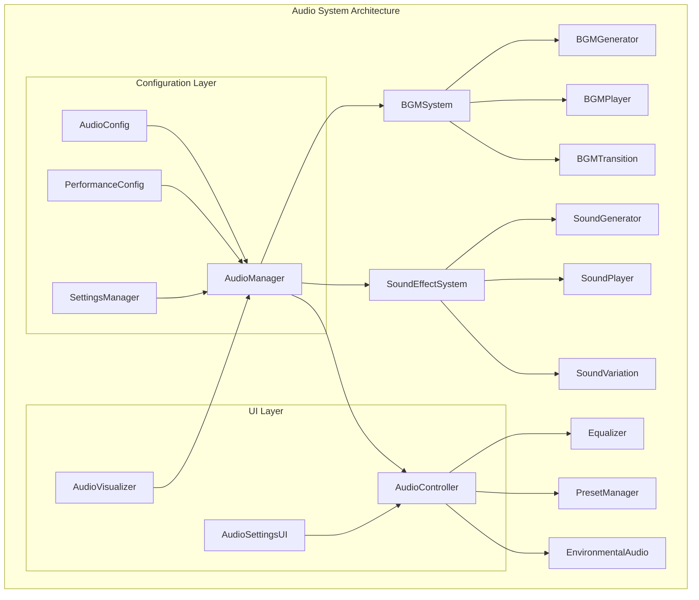
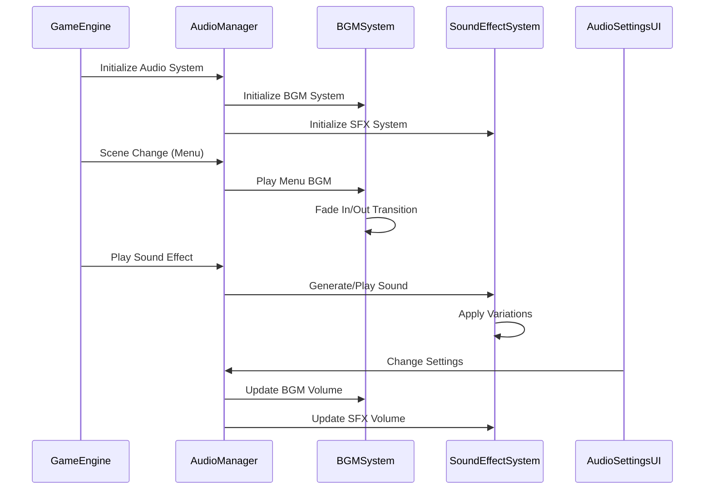

# Design Document

## Overview

音響システム強化は、現在のプロシージャル効果音システムを拡張し、包括的なBGMシステム、多様な効果音、高度な音響制御機能を実装します。Web Audio APIを活用した高品質な音響体験を提供しながら、パフォーマンスとアクセシビリティを両立させます。

### 技術的背景

- **現在の実装**: プロシージャル効果音生成のみ（AudioManager.js）
- **Web Audio API**: 既に実装済み、高度な音響処理が可能
- **パフォーマンス制約**: バンドルサイズ制限（JS < 500KB gzipped）
- **ブラウザ対応**: モダンブラウザ（Chrome, Firefox, Safari, Edge）

## Architecture

### システム構成



### データフロー



## Components and Interfaces

### 1. BGMSystem

**責任**: BGMの生成、再生、管理

```javascript
class BGMSystem {
    // BGMトラックの管理
    tracks: Map<string, BGMTrack>
    currentTrack: BGMTrack | null
    transitionManager: BGMTransitionManager
    
    // メソッド
    playBGM(trackName: string, options?: BGMOptions): void
    stopBGM(): void
    pauseBGM(): void
    resumeBGM(): void
    crossfade(fromTrack: string, toTrack: string, duration: number): void
}
```

**BGMトラック種類**:
- `menu`: メニュー画面用（アンビエント、リラックス）
- `gameplay`: ゲームプレイ用（エネルギッシュ、集中）
- `bonus`: ボーナスタイム用（エキサイティング、高テンポ）
- `gameover`: ゲームオーバー用（ドラマチック、感情的）

### 2. SoundEffectSystem

**責任**: 効果音の生成、バリエーション管理、再生

```javascript
class SoundEffectSystem {
    // 効果音カテゴリ
    bubbleSounds: Map<string, SoundBuffer[]>
    uiSounds: Map<string, SoundBuffer>
    achievementSounds: Map<string, SoundBuffer>
    
    // メソッド
    playBubbleSound(bubbleType: string, comboLevel: number): void
    playUISound(actionType: string): void
    playAchievementSound(rarity: string): void
    generateSoundVariation(baseSound: string, variation: number): SoundBuffer
}
```

**効果音カテゴリ**:
- **泡破壊音**: 10種類の泡タイプ別音響
- **コンボ音**: 5段階のコンボレベル別バリエーション
- **UI音**: クリック、ホバー、エラー、成功音
- **実績音**: レアリティ別（Common, Rare, Epic, Legendary）
- **ゲーム状態音**: レベルアップ、警告、時間切れ

### 3. AudioController

**責任**: 高度な音響制御機能

```javascript
class AudioController {
    equalizer: EqualizerNode
    presetManager: PresetManager
    environmentalAudio: EnvironmentalAudioManager
    
    // メソッド
    applyEqualizer(frequencies: number[]): void
    loadPreset(presetName: string): void
    enableEnvironmentalAudio(enabled: boolean): void
    createCustomPreset(name: string, settings: AudioSettings): void
}
```

### 4. BGMGenerator

**責任**: プロシージャルBGM生成

```javascript
class BGMGenerator {
    // 音楽理論ベースの生成
    generateTrack(style: string, duration: number, key: string): AudioBuffer
    generateMelody(scale: number[], rhythm: number[]): AudioBuffer
    generateHarmony(melody: AudioBuffer, chordProgression: string[]): AudioBuffer
    generateRhythm(tempo: number, timeSignature: string): AudioBuffer
}
```

**生成アルゴリズム**:
- **和声進行**: 基本的なコード進行（I-V-vi-IV等）
- **メロディ生成**: スケールベースの確率的生成
- **リズムパターン**: ジャンル別テンプレート
- **音色合成**: Web Audio APIのオシレーター組み合わせ

### 5. AudioVisualizer

**責任**: 音響の視覚的表現（アクセシビリティ対応）

```javascript
class AudioVisualizer {
    analyser: AnalyserNode
    visualizationCanvas: HTMLCanvasElement
    
    // メソッド
    renderFrequencyBars(): void
    renderWaveform(): void
    renderVolumeIndicator(): void
    enableAccessibilityMode(enabled: boolean): void
}
```

## Data Models

### BGMTrack

```javascript
interface BGMTrack {
    id: string
    name: string
    style: 'ambient' | 'energetic' | 'dramatic' | 'relaxing'
    duration: number
    loop: boolean
    fadeInDuration: number
    fadeOutDuration: number
    buffer: AudioBuffer
    metadata: {
        tempo: number
        key: string
        timeSignature: string
        genre: string
    }
}
```

### SoundEffect

```javascript
interface SoundEffect {
    id: string
    category: 'bubble' | 'ui' | 'achievement' | 'game'
    variations: AudioBuffer[]
    properties: {
        pitch: number
        volume: number
        duration: number
        reverb: number
        delay: number
    }
    metadata: {
        description: string
        tags: string[]
        rarity?: string
    }
}
```

### AudioSettings

```javascript
interface AudioSettings {
    volumes: {
        master: number
        bgm: number
        sfx: number
    }
    quality: {
        sampleRate: number
        bufferSize: number
        compression: boolean
    }
    effects: {
        reverb: boolean
        equalizer: EqualizerSettings
        environmentalAudio: boolean
    }
    accessibility: {
        visualFeedback: boolean
        hapticFeedback: boolean
        captioning: boolean
    }
}
```

## Error Handling

### エラー分類

1. **初期化エラー**: Web Audio API未対応、権限不足
2. **再生エラー**: バッファ不足、デコードエラー
3. **パフォーマンスエラー**: メモリ不足、CPU過負荷
4. **設定エラー**: 無効な設定値、設定保存失敗

### エラー処理戦略

```javascript
class AudioErrorHandler {
    handleInitializationError(error: Error): void {
        // フォールバック: サイレントモード
        this.enableSilentMode()
        this.notifyUser('音響システムを無効化しました')
    }
    
    handlePlaybackError(error: Error, soundId: string): void {
        // フォールバック: 代替音源または無音
        this.playFallbackSound(soundId)
        this.logError(error, { soundId, context: 'playback' })
    }
    
    handlePerformanceError(error: Error): void {
        // 品質自動調整
        this.reduceAudioQuality()
        this.cleanupUnusedBuffers()
    }
}
```

## Testing Strategy

### 単体テスト

- **BGMSystem**: トラック生成、再生、遷移
- **SoundEffectSystem**: 効果音生成、バリエーション
- **AudioController**: イコライザー、プリセット管理
- **AudioConfig**: 設定管理、検証

### 統合テスト

- **シーン遷移**: BGM自動切り替え
- **ゲームプレイ**: 効果音とゲームイベントの同期
- **設定変更**: リアルタイム音響設定反映
- **パフォーマンス**: 大量効果音同時再生

### E2Eテスト

- **ユーザーシナリオ**: 完全なゲームプレイ体験
- **アクセシビリティ**: 視覚的音響表現
- **ブラウザ互換性**: 各ブラウザでの動作確認
- **パフォーマンス**: 低性能デバイスでの動作

### パフォーマンステスト

```javascript
describe('Audio Performance Tests', () => {
    test('同時効果音再生（最大20音）', async () => {
        // 20個の効果音を同時再生
        // CPU使用率 < 30%
        // メモリ使用量 < 50MB
    })
    
    test('BGM生成時間', async () => {
        // 30秒BGM生成時間 < 2秒
        // 生成中のUI応答性維持
    })
    
    test('設定変更応答時間', async () => {
        // 音量変更反映 < 100ms
        // イコライザー変更反映 < 200ms
    })
})
```

## Implementation Considerations

### パフォーマンス最適化

1. **遅延読み込み**: BGMトラックのオンデマンド生成
2. **オブジェクトプール**: AudioBufferSourceNodeの再利用
3. **メモリ管理**: 未使用バッファの自動クリーンアップ
4. **品質調整**: デバイス性能に応じた自動品質調整

### アクセシビリティ対応

1. **視覚的フィードバック**: 音響の視覚化
2. **触覚フィードバック**: Vibration APIとの連携
3. **字幕機能**: 効果音の文字表示
4. **音響説明**: スクリーンリーダー対応

### ブラウザ互換性

1. **Web Audio API**: モダンブラウザ対応
2. **フォールバック**: HTML5 Audio要素
3. **プリフィックス対応**: webkit系ブラウザ
4. **機能検出**: 段階的機能提供

### セキュリティ考慮事項

1. **ユーザー操作**: AudioContext自動再開
2. **リソース制限**: 音響ファイルサイズ制限
3. **メモリ保護**: バッファオーバーフロー防止
4. **プライバシー**: 音響データの外部送信なし