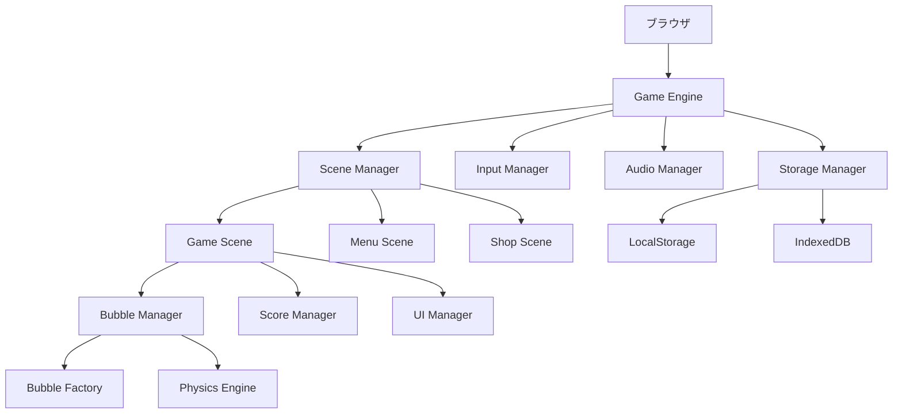

# 設計書

## 概要

Webブラウザ上で動作する泡割りゲーム「BubblePop」の技術設計書です。HTML5 Canvas、JavaScript、Web Audio APIを使用したシングルページアプリケーション（SPA）として実装します。

## アーキテクチャ

### システム全体構成



### 技術スタック
- **フロントエンド**: HTML5, CSS3, JavaScript (ES6+)
- **グラフィックス**: HTML5 Canvas API
- **音響**: Web Audio API
- **データ保存**: LocalStorage, IndexedDB
- **ビルドツール**: Vite
- **パッケージマネージャー**: npm

## コンポーネントと インターフェース

### 1. Game Engine (ゲームエンジン)

```javascript
class GameEngine {
  constructor()
  init()
  start()
  stop()
  update(deltaTime)
  render()
  handleInput(event)
}
```

**責任**: ゲームループの管理、シーン切り替え、全体的な状態管理

### 2. Scene Manager (シーン管理)

```javascript
class SceneManager {
  constructor(gameEngine)
  addScene(name, scene)
  switchScene(name)
  getCurrentScene()
  update(deltaTime)
  render(context)
}
```

**責任**: 画面遷移の管理（メニュー、ゲーム、ショップなど）

### 3. Bubble Manager (泡管理)

```javascript
class BubbleManager {
  constructor()
  spawnBubble(type, position)
  updateBubbles(deltaTime)
  renderBubbles(context)
  handleBubbleClick(position)
  checkCollisions()
  cleanupBubbles()
}
```

**責任**: 泡の生成、更新、描画、衝突判定

### 4. Bubble Factory (泡ファクトリー)

```javascript
class BubbleFactory {
  static createBubble(type, position)
  static getBubbleConfig(type)
  static getRandomBubbleType(stage)
}
```

**責任**: 泡オブジェクトの生成、種類別設定の管理

### 5. Input Manager (入力管理)

```javascript
class InputManager {
  constructor(canvas)
  handleMouseDown(event)
  handleMouseMove(event)
  handleMouseUp(event)
  handleTouchStart(event)
  handleTouchMove(event)
  handleTouchEnd(event)
  getInputPosition(event)
}
```

**責任**: マウス・タッチ入力の統一的な処理

## データモデル

### 1. Bubble (泡)

```javascript
class Bubble {
  constructor(type, position) {
    this.type = type;           // 泡の種類
    this.position = position;   // 位置 {x, y}
    this.velocity = {x: 0, y: 0}; // 速度
    this.size = 50;            // サイズ
    this.health = 1;           // 耐久値
    this.age = 0;              // 生存時間
    this.maxAge = 10000;       // 最大生存時間(ms)
    this.isAlive = true;       // 生存状態
    this.effects = [];         // 特殊効果
  }
  
  update(deltaTime)
  render(context)
  takeDamage(amount)
  destroy()
  applyEffect(effect)
}
```

### 2. Player Data (プレイヤーデータ)

```javascript
class PlayerData {
  constructor() {
    this.username = '';
    this.currentHP = 100;
    this.maxHP = 100;
    this.currentScore = 0;
    this.ap = 0;              // 泡潰しポイント
    this.tap = 0;             // トータル泡潰しポイント
    this.combo = 0;           // 現在のコンボ数
    this.highScores = {};     // ステージ別ハイスコア
    this.unlockedStages = ['tutorial', 'normal']; // 開放済みステージ
    this.ownedItems = [];     // 所持アイテム
  }
  
  save()
  load()
  reset()
  addScore(points)
  takeDamage(amount)
  heal(amount)
}
```

### 3. Game State (ゲーム状態)

```javascript
class GameState {
  constructor() {
    this.currentStage = null;
    this.timeRemaining = 300000; // 5分 (ms)
    this.isPaused = false;
    this.isGameOver = false;
    this.specialEffects = [];
    this.bubbles = [];
  }
  
  startGame(stageName)
  pauseGame()
  resumeGame()
  endGame()
  update(deltaTime)
}
```

### 4. Stage Configuration (ステージ設定)

```javascript
const STAGE_CONFIGS = {
  tutorial: {
    name: '1分ステージ',
    duration: 60000,
    bubbleTypes: ['normal'],
    spawnRate: 1.0,
    maxBubbles: 10
  },
  normal: {
    name: '普通のアワアワ',
    duration: 300000,
    bubbleTypes: ['normal', 'stone', 'rainbow', 'pink', 'clock', 'score'],
    spawnRate: 1.5,
    maxBubbles: 20
  },
  // ... 他のステージ設定
};
```

## エラーハンドリング

### 1. エラー分類
- **システムエラー**: Canvas初期化失敗、Audio API未対応など
- **ゲームプレイエラー**: 不正な操作、データ破損など
- **ネットワークエラー**: 将来的なオンライン機能用

### 2. エラー処理戦略

```javascript
class ErrorHandler {
  static handleError(error, context) {
    console.error(`Error in ${context}:`, error);
    
    switch (error.type) {
      case 'CANVAS_ERROR':
        this.showFallbackUI();
        break;
      case 'AUDIO_ERROR':
        this.disableAudio();
        break;
      case 'STORAGE_ERROR':
        this.useMemoryStorage();
        break;
      default:
        this.showGenericError();
    }
  }
  
  static showFallbackUI()
  static disableAudio()
  static useMemoryStorage()
  static showGenericError()
}
```

### 3. グレースフルデグラデーション
- Canvas未対応: 静的な画像とボタンによるフォールバック
- Audio未対応: 音声なしでゲーム続行
- LocalStorage未対応: セッション内のみでデータ保持

## テスト戦略

### 1. 単体テスト
- **対象**: 各クラスの個別メソッド
- **ツール**: Jest
- **カバレッジ**: 80%以上を目標

```javascript
// 例: Bubble クラスのテスト
describe('Bubble', () => {
  test('should take damage correctly', () => {
    const bubble = new Bubble('normal', {x: 100, y: 100});
    bubble.takeDamage(1);
    expect(bubble.health).toBe(0);
    expect(bubble.isAlive).toBe(false);
  });
});
```

### 2. 統合テスト
- **対象**: コンポーネント間の連携
- **重点**: BubbleManager と GameState の連携、入力処理の統合

### 3. E2Eテスト
- **対象**: ユーザーシナリオ全体
- **ツール**: Playwright
- **シナリオ**: ゲーム開始→泡を割る→スコア獲得→ゲームオーバー

### 4. パフォーマンステスト
- **FPS測定**: 60FPS維持の確認
- **メモリ使用量**: 長時間プレイでのメモリリーク検出
- **レスポンス時間**: 入力から反応までの時間測定

### 5. クロスブラウザテスト
- **対象ブラウザ**: Chrome, Firefox, Safari, Edge
- **デバイス**: PC, スマートフォン, タブレット
- **自動化**: BrowserStack を使用した自動テスト

## パフォーマンス最適化

### 1. レンダリング最適化

```javascript
class OptimizedRenderer {
  constructor() {
    this.offscreenCanvas = new OffscreenCanvas(800, 600);
    this.offscreenContext = this.offscreenCanvas.getContext('2d');
    this.dirtyRegions = [];
  }
  
  // 差分レンダリング
  renderDirtyRegions(context) {
    this.dirtyRegions.forEach(region => {
      this.renderRegion(context, region);
    });
    this.dirtyRegions = [];
  }
  
  // オブジェクトプーリング
  getBubbleFromPool() {
    return this.bubblePool.pop() || new Bubble();
  }
  
  returnBubbleToPool(bubble) {
    bubble.reset();
    this.bubblePool.push(bubble);
  }
}
```

### 2. メモリ管理
- **オブジェクトプーリング**: 泡オブジェクトの再利用
- **ガベージコレクション対策**: 不要なオブジェクト参照の削除
- **画像キャッシュ**: 泡の画像を事前読み込み・キャッシュ

### 3. 計算最適化
- **衝突判定**: 空間分割による効率化
- **物理演算**: 必要最小限の計算に限定
- **タイマー管理**: requestAnimationFrame の適切な使用

## セキュリティ考慮事項

### 1. データ保護
- **ローカルストレージ**: 機密情報は保存しない
- **入力検証**: ユーザー名などの入力値検証
- **XSS対策**: innerHTML の代わりに textContent を使用

### 2. チート対策
- **スコア検証**: 異常に高いスコアの検出
- **時間操作対策**: サーバータイムスタンプとの照合（将来実装）
- **データ整合性**: ローカルデータの妥当性チェック

## 国際化・アクセシビリティ

### 1. 国際化 (i18n)
```javascript
const MESSAGES = {
  ja: {
    'game.start': 'ゲーム開始',
    'game.score': 'スコア',
    'game.hp': 'HP'
  },
  en: {
    'game.start': 'Start Game',
    'game.score': 'Score',
    'game.hp': 'HP'
  }
};
```

### 2. アクセシビリティ
- **キーボード操作**: Tab キーでの要素移動
- **スクリーンリーダー**: ARIA ラベルの適切な設定
- **色覚サポート**: 色以外での泡の識別方法
- **コントラスト**: WCAG 2.1 AA レベルの準拠

## デプロイメント・運用

### 1. ビルド設定
```javascript
// vite.config.js
export default {
  build: {
    target: 'es2015',
    outDir: 'dist',
    assetsDir: 'assets',
    minify: 'terser',
    sourcemap: true
  },
  server: {
    port: 3000,
    host: true
  }
};
```

### 2. 静的ホスティング
- **推奨**: Netlify, Vercel, GitHub Pages
- **CDN**: 画像・音声ファイルの配信最適化
- **キャッシュ戦略**: 適切なCache-Controlヘッダー設定

### 3. 監視・分析
- **エラー監視**: Sentry による実行時エラー収集
- **パフォーマンス監視**: Web Vitals の測定
- **ユーザー分析**: Google Analytics によるプレイ行動分析

## 実装フェーズ

### Phase 1: コア機能 (4週間)
1. ゲームエンジンの基盤構築
2. 基本的な泡の生成・描画
3. 入力処理とクリック判定
4. スコアシステムの実装

### Phase 2: ゲームプレイ (4週間)
1. 全種類の泡の実装
2. 特殊効果システム
3. HPとゲームオーバー処理
4. ステージシステム

### Phase 3: UI・UX (3週間)
1. メニュー画面の実装
2. ショップシステム
3. ユーザーデータ管理
4. 視覚・音響効果の強化

### Phase 4: 最適化・テスト (3週間)
1. パフォーマンス最適化
2. クロスブラウザ対応
3. テスト実装・実行
4. バグ修正・調整

### Phase 5: デプロイ・運用 (2週間)
1. ビルド設定・最適化
2. デプロイメント
3. 監視システム設定
4. ドキュメント整備

## まとめ

この設計書に基づいて実装することで、要件を満たす高品質な泡割りゲームを構築できます。特に以下の点を重視しています：

1. **モジュラー設計**: 各コンポーネントの独立性と再利用性
2. **パフォーマンス**: 60FPS維持とメモリ効率
3. **拡張性**: 新機能追加の容易さ
4. **保守性**: テスト可能で理解しやすいコード
5. **ユーザビリティ**: 直感的で応答性の高いUI

段階的な実装により、リスクを最小化しながら確実に目標を達成できる設計となっています。