# Design Document

## Overview

This design addresses the comprehensive test suite failure affecting 676 out of 1338 tests in the BubblePop web game project. The solution involves a multi-layered approach to fix Jest configuration issues, standardize mock functions, resolve API inconsistencies, stabilize performance tests, and properly separate E2E test execution. The design ensures compatibility with both browser and console environments while maintaining the existing ES Modules architecture.

## Architecture

### Current Test Infrastructure Analysis

The project currently uses:
- **Jest 29.7.0** with ES Modules support via `NODE_OPTIONS='--experimental-vm-modules'`
- **jsdom 26.1.0** for DOM simulation
- **Playwright 1.40.0** for E2E testing
- **jest-canvas-mock 2.5.2** for Canvas API mocking
- **ES Modules** (`"type": "module"` in package.json)

### Problem Categories Identified

1. **Jest Configuration Issues**: `jest is not defined` errors in ES Modules context
2. **Mock Function Problems**: Inconsistent mock implementations across test files
3. **API Method Inconsistencies**: Tests expecting methods that don't exist in implementations
4. **Performance Test Instability**: Unrealistic thresholds causing environment-dependent failures
5. **E2E Test Execution Problems**: Playwright tests running within Jest context

### Solution Architecture

```mermaid
graph TB
    A[Test Suite Fix] --> B[Jest Configuration Layer]
    A --> C[Mock Standardization Layer]
    A --> D[API Consistency Layer]
    A --> E[Performance Test Layer]
    A --> F[E2E Separation Layer]
    
    B --> B1[ES Modules Setup]
    B --> B2[Global Jest Setup]
    B --> B3[Environment Configuration]
    
    C --> C1[Mock Factory System]
    C --> C2[Canvas Mock Integration]
    C --> C3[API Mock Standardization]
    
    D --> D1[Interface Validation]
    D --> D2[Method Implementation Sync]
    D --> D3[Type Definition Updates]
    
    E --> E1[Realistic Thresholds]
    E --> E2[Environment Detection]
    E --> E3[Stability Improvements]
    
    F --> F1[Test Type Separation]
    F --> F2[Configuration Isolation]
    F --> F3[Execution Environment Setup]
```



## Components and Interfaces

### 1. Jest Configuration Enhancement

#### Enhanced Jest Setup
```javascript
// Enhanced jest.config.js
export default {
  testEnvironment: 'jsdom',
  preset: null,
  transform: {},
  extensionsToTreatAsEsm: ['.js'],
  globals: {
    'jest': true
  },
  setupFilesAfterEnv: [
    '<rootDir>/tests/setup.js',
    '<rootDir>/tests/jest-globals.js'  // New global setup
  ],
  // ... other configurations
};
```

#### Global Jest Setup File
```javascript
// tests/jest-globals.js
import { jest } from '@jest/globals';

// Make jest globally available for ES Modules
global.jest = jest;
global.expect = expect;
global.describe = describe;
global.test = test;
global.beforeEach = beforeEach;
global.afterEach = afterEach;
global.beforeAll = beforeAll;
global.afterAll = afterAll;
```

### 2. Mock Factory System

#### Centralized Mock Factory
```javascript
// tests/mocks/MockFactory.js
export class MockFactory {
  static createCanvasMock() {
    // Standardized Canvas mock
  }
  
  static createAudioManagerMock() {
    // Complete AudioManager mock with all expected methods
  }
  
  static createAnalyticsAPIMock() {
    // Complete AnalyticsAPI mock with proper structure
  }
  
  static createPerformanceMock() {
    // Environment-aware performance mock
  }
}
```

#### Mock Integration Pattern
```javascript
// tests/mocks/index.js
export { MockFactory } from './MockFactory.js';
export { CanvasMockProvider } from './CanvasMockProvider.js';
export { AudioMockProvider } from './AudioMockProvider.js';
export { PerformanceMockProvider } from './PerformanceMockProvider.js';
```

### 3. API Consistency Validation System

#### Interface Validator
```javascript
// tests/utils/InterfaceValidator.js
export class InterfaceValidator {
  static validateAPIConsistency(implementation, testExpectations) {
    // Validate that all expected methods exist
    // Generate reports of missing methods
    // Suggest implementation updates
  }
  
  static generateMissingMethodsReport(className, missingMethods) {
    // Generate actionable reports for developers
  }
}
```

#### API Method Synchronization
```javascript
// tests/utils/APISynchronizer.js
export class APISynchronizer {
  static syncAnalyticsAPI() {
    // Ensure AnalyticsAPI has all expected methods
  }
  
  static syncAudioManager() {
    // Ensure AudioManager has all expected methods
  }
  
  static generateSyncReport() {
    // Report on synchronization status
  }
}
```

### 4. Performance Test Stabilization

#### Environment-Aware Performance Testing
```javascript
// tests/utils/PerformanceTestUtils.js
export class PerformanceTestUtils {
  static getEnvironmentThresholds() {
    const isCI = process.env.CI;
    const isMacOS = process.platform === 'darwin';
    
    return {
      frameRate: isCI ? 30 : 45,  // Lower thresholds for CI
      memoryUsage: isCI ? 100 : 80, // Higher limits for CI
      renderTime: isCI ? 50 : 30    // More lenient for CI
    };
  }
  
  static createStablePerformanceTest(testName, testFn, options = {}) {
    // Wrapper for performance tests with retry logic
  }
}
```

#### Performance Test Configuration
```javascript
// tests/config/performance-thresholds.js
export const PERFORMANCE_THRESHOLDS = {
  development: {
    frameRate: { min: 45, target: 60 },
    memoryUsage: { max: 80, warning: 60 },
    renderTime: { max: 30, target: 16 }
  },
  ci: {
    frameRate: { min: 30, target: 45 },
    memoryUsage: { max: 120, warning: 100 },
    renderTime: { max: 50, target: 30 }
  },
  production: {
    frameRate: { min: 55, target: 60 },
    memoryUsage: { max: 60, warning: 40 },
    renderTime: { max: 20, target: 16 }
  }
};
```

### 5. E2E Test Separation System

#### Test Type Configuration
```javascript
// jest.unit.config.js
export default {
  // Unit test specific configuration
  testMatch: [
    '<rootDir>/tests/unit/**/*.test.js',
    '<rootDir>/tests/integration/**/*.test.js',
    '<rootDir>/tests/analytics/**/*.test.js'
  ],
  testPathIgnorePatterns: [
    '<rootDir>/tests/e2e/',
    '<rootDir>/tests/performance/'
  ]
};

// jest.performance.config.js
export default {
  // Performance test specific configuration
  testMatch: ['<rootDir>/tests/performance/**/*.test.js'],
  testTimeout: 30000
};
```

#### Test Execution Scripts
```json
{
  "scripts": {
    "test:unit": "NODE_OPTIONS='--experimental-vm-modules --no-warnings' jest --config=jest.unit.config.js",
    "test:performance": "NODE_OPTIONS='--experimental-vm-modules --no-warnings' jest --config=jest.performance.config.js",
    "test:e2e": "playwright test",
    "test:all": "npm run test:unit && npm run test:performance && npm run test:e2e"
  }
}
```

## Data Models

### Test Configuration Model
```javascript
export interface TestConfiguration {
  environment: 'development' | 'ci' | 'production';
  testType: 'unit' | 'integration' | 'performance' | 'e2e';
  mockLevel: 'minimal' | 'standard' | 'comprehensive';
  performanceThresholds: PerformanceThresholds;
  crossEnvironmentCompatibility: boolean;
}
```

### Mock Definition Model
```javascript
export interface MockDefinition {
  className: string;
  methods: MockMethod[];
  properties: MockProperty[];
  dependencies: string[];
  compatibility: {
    browser: boolean;
    node: boolean;
  };
}
```

### API Consistency Model
```javascript
export interface APIConsistencyReport {
  className: string;
  implementedMethods: string[];
  expectedMethods: string[];
  missingMethods: string[];
  extraMethods: string[];
  inconsistencies: APIInconsistency[];
}
```

## Error Handling

### Jest Configuration Error Recovery
```javascript
// tests/utils/JestErrorRecovery.js
export class JestErrorRecovery {
  static handleJestUndefinedError() {
    // Provide fallback jest implementation
    // Log configuration guidance
    // Suggest fixes
  }
  
  static validateESModulesSetup() {
    // Check ES Modules configuration
    // Validate Node.js version compatibility
    // Provide setup guidance
  }
}
```

### Mock Error Handling
```javascript
// tests/utils/MockErrorHandler.js
export class MockErrorHandler {
  static handleMockCreationError(mockType, error) {
    // Provide fallback mocks
    // Log detailed error information
    // Suggest mock fixes
  }
  
  static validateMockCompatibility(mockDefinition) {
    // Check mock compatibility with environment
    // Validate mock completeness
  }
}
```

### Performance Test Error Recovery
```javascript
// tests/utils/PerformanceErrorRecovery.js
export class PerformanceErrorRecovery {
  static handlePerformanceTestFailure(testName, actualValue, threshold) {
    // Analyze failure reason
    // Suggest threshold adjustments
    // Provide environment-specific guidance
  }
  
  static retryPerformanceTest(testFn, maxRetries = 3) {
    // Implement retry logic with backoff
    // Collect performance metrics across retries
    // Determine if failure is consistent or environmental
  }
}
```

## Testing Strategy

### Phase 1: Jest Configuration Fix
1. **Global Jest Setup**: Create jest-globals.js to make Jest functions available globally
2. **ES Modules Configuration**: Update jest.config.js for proper ES Modules support
3. **Environment Variables**: Set up proper NODE_OPTIONS and Jest globals
4. **Validation**: Test basic Jest functionality across all test files

### Phase 2: Mock Standardization
1. **Mock Factory Creation**: Implement centralized MockFactory class
2. **Canvas Mock Integration**: Standardize Canvas API mocking
3. **Audio Manager Mock**: Create complete AudioManager mock with all expected methods
4. **Performance Mock**: Implement environment-aware performance mocking
5. **Mock Migration**: Update all test files to use standardized mocks

### Phase 3: API Consistency Resolution
1. **Interface Analysis**: Scan all test files for expected API methods
2. **Implementation Validation**: Check actual implementations against test expectations
3. **Method Implementation**: Add missing methods to actual classes
4. **Test Updates**: Update tests to match actual API interfaces
5. **Consistency Validation**: Implement automated consistency checking

### Phase 4: Performance Test Stabilization
1. **Threshold Analysis**: Analyze current performance test failures
2. **Environment Detection**: Implement environment-aware threshold selection
3. **Stability Improvements**: Add retry logic and statistical validation
4. **Realistic Thresholds**: Update thresholds based on actual performance data
5. **Monitoring Integration**: Add performance trend monitoring

### Phase 5: E2E Test Separation
1. **Configuration Separation**: Create separate Jest configs for different test types
2. **Script Updates**: Update npm scripts for isolated test execution
3. **Playwright Integration**: Ensure Playwright runs independently of Jest
4. **Environment Setup**: Configure proper test environments for each test type
5. **CI/CD Integration**: Update CI/CD pipelines for separated test execution

### Cross-Environment Compatibility Testing
1. **Browser Environment**: Test all fixes in jsdom browser simulation
2. **Node.js Environment**: Validate console-based test execution
3. **CI Environment**: Test in GitHub Actions/CI environment
4. **Local Development**: Ensure local development workflow compatibility
5. **Performance Validation**: Verify performance across all environments

### Validation and Monitoring
1. **Test Success Rate Monitoring**: Track improvement from 50% to 95%+ success rate
2. **Performance Regression Detection**: Monitor for performance test stability
3. **API Consistency Monitoring**: Automated checking for API/test mismatches
4. **Environment Compatibility Validation**: Regular cross-environment testing
5. **Developer Experience Metrics**: Track test execution time and reliability