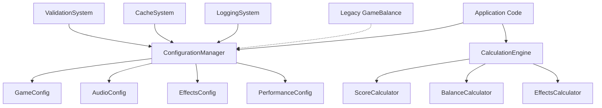

# 設計書

## 概要

現在のBubble Pop Web Gameでは、設定値や計算値が複数のファイルに散らばっており、メンテナンス性に課題があります。この設計では、統一された設定管理システムと計算処理システムを構築し、既存のGameBalanceクラスを拡張する形で実装します。

## アーキテクチャ

### 全体構成



### レイヤー構造

1. **設定管理レイヤー (Configuration Layer)**
   - ConfigurationManager: 設定の統一管理
   - 各種Configクラス: 機能別設定の管理

2. **計算処理レイヤー (Calculation Layer)**
   - CalculationEngine: 計算処理の統一管理
   - 各種Calculatorクラス: 機能別計算処理

3. **サポートレイヤー (Support Layer)**
   - ValidationSystem: 設定値の検証
   - CacheSystem: パフォーマンス最適化
   - LoggingSystem: 変更履歴とデバッグ

## コンポーネントとインターフェース

### 1. ConfigurationManager

中央設定管理クラス。全ての設定値へのアクセスポイント。

```javascript
class ConfigurationManager {
    // 設定の取得
    get(category, key, defaultValue = null)
    
    // 設定の更新
    set(category, key, value)
    
    // 設定の検証
    validate(category, key, value)
    
    // 設定の監視
    watch(category, key, callback)
    
    // 設定のリセット
    reset(category = null)
}
```

### 2. 設定カテゴリクラス

#### GameConfig
ゲームバランス関連の設定を管理

```javascript
class GameConfig {
    // スコア設定
    getScoreConfig()
    
    // ステージ設定
    getStageConfig()
    
    // アイテム設定
    getItemConfig()
    
    // 泡設定
    getBubbleConfig()
}
```

#### AudioConfig
音響関連の設定を管理

```javascript
class AudioConfig {
    // 音量設定
    getVolumeConfig()
    
    // 音響効果設定
    getEffectConfig()
    
    // 音質設定
    getQualityConfig()
}
```

#### EffectsConfig
視覚効果関連の設定を管理

```javascript
class EffectsConfig {
    // パーティクル設定
    getParticleConfig()
    
    // 画面効果設定
    getScreenEffectConfig()
    
    // アニメーション設定
    getAnimationConfig()
}
```

#### PerformanceConfig
パフォーマンス関連の設定を管理

```javascript
class PerformanceConfig {
    // 最適化設定
    getOptimizationConfig()
    
    // リソース制限設定
    getResourceLimitConfig()
    
    // 品質設定
    getQualityConfig()
}
```

### 3. CalculationEngine

計算処理の統一管理クラス

```javascript
class CalculationEngine {
    // 計算実行
    calculate(type, params)
    
    // 計算結果のキャッシュ
    getCachedResult(key)
    setCachedResult(key, result)
    
    // 計算式の登録
    registerCalculator(type, calculator)
}
```

### 4. 計算処理クラス

#### ScoreCalculator
スコア計算の専門クラス

```javascript
class ScoreCalculator {
    // 基本スコア計算
    calculateBaseScore(bubbleType, ageRatio)
    
    // コンボスコア計算
    calculateComboScore(comboCount, baseScore)
    
    // ボーナススコア計算
    calculateBonusScore(bonusType, multiplier)
}
```

#### BalanceCalculator
ゲームバランス計算の専門クラス

```javascript
class BalanceCalculator {
    // 難易度調整計算
    calculateDifficulty(stage, playerLevel)
    
    // アイテムコスト計算
    calculateItemCost(itemId, level)
    
    // 開放条件計算
    calculateUnlockRequirement(feature, progress)
}
```

#### EffectsCalculator
エフェクト関連計算の専門クラス

```javascript
class EffectsCalculator {
    // パーティクル数計算
    calculateParticleCount(effectType, intensity)
    
    // アニメーション時間計算
    calculateAnimationDuration(effectType, complexity)
    
    // 効果強度計算
    calculateEffectIntensity(baseIntensity, modifiers)
}
```

## データモデル

### 設定データ構造

```javascript
const ConfigurationSchema = {
    game: {
        scoring: {
            baseScores: { /* 泡種別スコア */ },
            combo: { /* コンボ設定 */ },
            ageBonus: { /* 年齢ボーナス */ }
        },
        stages: {
            unlockRequirements: { /* 開放条件 */ },
            difficulty: { /* 難易度設定 */ }
        },
        items: {
            baseCosts: { /* 基本コスト */ },
            effects: { /* 効果値 */ },
            maxLevels: { /* 最大レベル */ }
        },
        bubbles: {
            maxAge: { /* 生存時間 */ },
            health: { /* 耐久値 */ },
            specialEffects: { /* 特殊効果 */ }
        }
    },
    audio: {
        volumes: {
            master: 0.7,
            sfx: 0.8,
            bgm: 0.5
        },
        quality: {
            sampleRate: 44100,
            bufferSize: 4096
        },
        effects: {
            reverb: true,
            compression: true
        }
    },
    effects: {
        particles: {
            maxCount: 500,
            poolSize: 100,
            quality: 1.0
        },
        screen: {
            shakeIntensity: 1.0,
            flashDuration: 200,
            zoomSensitivity: 1.0
        },
        animations: {
            duration: 300,
            easing: 'easeOut'
        }
    },
    performance: {
        optimization: {
            maxBubbles: 20,
            maxParticles: 500,
            renderQuality: 1.0
        },
        limits: {
            memoryThreshold: 100,
            fpsThreshold: 30
        }
    }
};
```

### 計算結果キャッシュ構造

```javascript
const CalculationCache = {
    scores: new Map(),
    balance: new Map(),
    effects: new Map(),
    metadata: {
        hitRate: 0,
        missRate: 0,
        lastCleanup: Date.now()
    }
};
```

## エラーハンドリング

### 設定値エラー処理

1. **型エラー**: デフォルト値を使用し警告出力
2. **範囲エラー**: 有効範囲内に調整し警告出力
3. **存在しないキー**: デフォルト値を返し警告出力
4. **設定競合**: 優先順位に基づいて解決

### 計算エラー処理

1. **パラメータエラー**: デフォルトパラメータで再計算
2. **計算オーバーフロー**: 安全な値に制限
3. **無限ループ**: タイムアウト機能で中断
4. **メモリ不足**: キャッシュクリアして再試行

## テスト戦略

### 単体テスト

1. **設定管理テスト**
   - 設定値の取得・設定
   - 検証機能
   - デフォルト値処理

2. **計算処理テスト**
   - 各計算式の正確性
   - エッジケース処理
   - パフォーマンス測定

3. **キャッシュシステムテスト**
   - キャッシュヒット率
   - メモリ使用量
   - クリーンアップ機能

### 統合テスト

1. **既存システムとの互換性**
   - GameBalanceクラスとの連携
   - 既存APIの動作確認
   - 段階的移行の検証

2. **パフォーマンステスト**
   - 設定アクセス速度
   - 計算処理速度
   - メモリ使用量

### E2Eテスト

1. **ゲーム動作確認**
   - 設定変更の反映
   - 計算結果の正確性
   - エラー処理の動作

## 実装方針

### 段階的移行戦略

1. **Phase 1**: 新システムの基盤構築
   - ConfigurationManager実装
   - 基本的な設定カテゴリ実装
   - 既存システムとの並行動作

2. **Phase 2**: 計算処理システム構築
   - CalculationEngine実装
   - 各Calculatorクラス実装
   - キャッシュシステム実装

3. **Phase 3**: 既存コードの移行
   - 段階的なAPI移行
   - 互換性レイヤーの実装
   - テストとデバッグ

4. **Phase 4**: 最適化と完成
   - パフォーマンス最適化
   - 不要なコードの削除
   - ドキュメント整備

### 互換性保証

- 既存のBALANCE_CONFIGとの完全互換性
- 段階的移行期間中の新旧API並行サポート
- 移行警告システムによる開発者支援

### パフォーマンス考慮事項

- 設定値の遅延読み込み
- 計算結果のインテリジェントキャッシュ
- メモリ使用量の最適化
- ガベージコレクション対策