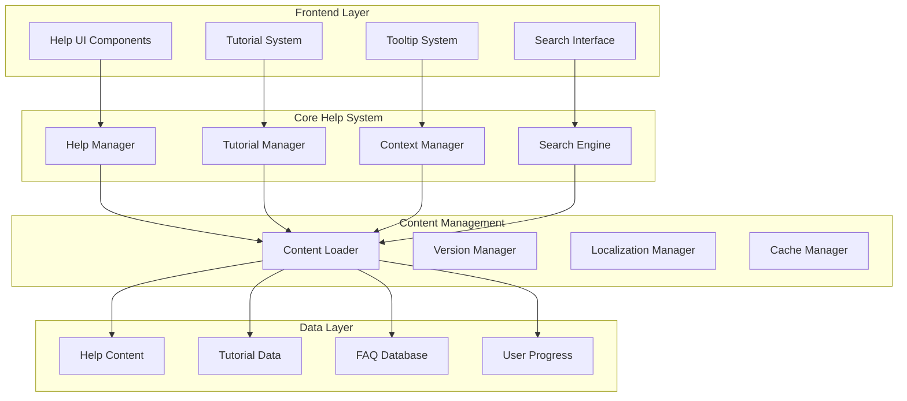

# Design Document

## Overview

このドキュメントは、awaputi（泡割りゲーム）のドキュメント充実とヘルプ機能整備のための設計を定義します。既存のコンポーネントベースアーキテクチャ、ダイアログシステム、多言語対応システムを活用し、包括的なヘルプ・ドキュメントシステムを構築します。

設計の核心は、プレイヤーが必要な時に適切な情報にアクセスできる「コンテキスト対応ヘルプシステム」と、開発者が効率的にドキュメントを管理・更新できる「統合ドキュメント管理システム」の実現です。

## Architecture

### システム全体構成



### 既存システムとの統合

既存のawaputi アーキテクチャとの統合ポイント：

1. **SceneManager統合**: 新しいHelpSceneとTutorialSceneを追加
2. **DialogManager活用**: 既存のBaseDialogを拡張してヘルプダイアログを実装
3. **LocalizationManager連携**: 多言語ヘルプコンテンツの管理
4. **ComponentEventBus利用**: ヘルプシステム間の通信
5. **AccessibilityManager統合**: アクセシブルなヘルプ機能の提供

## Components and Interfaces

### 1. Core Help System Components

#### HelpManager
```javascript
class HelpManager {
    constructor(gameEngine)
    
    // コンテンツ管理
    async loadHelpContent(category, language)
    getHelpSection(sectionId)
    searchContent(query, filters)
    
    // コンテキスト対応
    getContextualHelp(currentScene, userAction)
    showTooltip(element, content)
    hideTooltip()
    
    // ユーザー進捗
    trackHelpUsage(sectionId, duration)
    markAsRead(sectionId)
    getUserHelpProgress()
}
```#### Tut
orialManager
```javascript
class TutorialManager {
    constructor(gameEngine)
    
    // チュートリアル制御
    async startTutorial(tutorialId)
    pauseTutorial()
    resumeTutorial()
    skipTutorial()
    
    // ステップ管理
    nextStep()
    previousStep()
    getCurrentStep()
    getTutorialProgress()
    
    // インタラクション
    highlightElement(selector, message)
    waitForUserAction(actionType)
    showStepInstructions(step)
}
```

#### ContextManager
```javascript
class ContextManager {
    constructor(gameEngine)
    
    // コンテキスト検出
    detectCurrentContext()
    getRelevantHelp(context)
    
    // ツールチップ管理
    registerTooltip(element, content)
    showContextualTooltip(x, y, content)
    
    // 動的ヘルプ
    suggestNextActions(currentState)
    getSmartHelp(userBehavior)
}
```

### 2. UI Components

#### HelpScene
```javascript
class HelpScene extends Scene {
    constructor(gameEngine)
    
    // シーン管理
    enter()
    exit()
    update(deltaTime)
    render(context)
    
    // ヘルプナビゲーション
    showHelpCategory(category)
    renderHelpContent(context)
    handleSearch(query)
    
    // インタラクション
    handleInput(inputType, data)
    handleKeyboard(key)
}
```

#### TutorialOverlay
```javascript
class TutorialOverlay extends BaseDialog {
    constructor(gameEngine, eventBus, state)
    
    // オーバーレイ表示
    show(tutorialStep)
    hide()
    
    // ステップ表示
    renderStep(context, step)
    renderHighlight(context, element)
    renderInstructions(context, instructions)
    
    // ユーザーインタラクション
    handleStepComplete()
    handleSkip()
    handlePrevious()
}
```

#### TooltipSystem
```javascript
class TooltipSystem {
    constructor(gameEngine)
    
    // ツールチップ管理
    show(x, y, content, options)
    hide()
    update(deltaTime)
    
    // 位置調整
    calculatePosition(x, y, tooltipSize)
    adjustForScreenBounds(position)
    
    // アニメーション
    animateIn()
    animateOut()
}
```

### 3. Content Management Components

#### ContentLoader
```javascript
class ContentLoader {
    constructor(localizationManager)
    
    // コンテンツ読み込み
    async loadHelpContent(language)
    async loadTutorialData(language)
    async loadFAQData(language)
    
    // キャッシュ管理
    getCachedContent(key)
    setCachedContent(key, content)
    clearCache()
    
    // バージョン管理
    checkContentVersion()
    updateContent()
}
```

#### SearchEngine
```javascript
class SearchEngine {
    constructor()
    
    // 検索機能
    search(query, options)
    indexContent(content)
    
    // フィルタリング
    applyFilters(results, filters)
    rankResults(results, query)
    
    // 提案機能
    getSuggestions(partialQuery)
    getRelatedContent(contentId)
}
```

## Data Models

### HelpContent Model
```javascript
const HelpContentSchema = {
    id: String,
    category: String, // 'gameplay', 'features', 'troubleshooting', etc.
    title: String,
    content: String,
    tags: [String],
    language: String,
    version: String,
    lastUpdated: Date,
    difficulty: String, // 'beginner', 'intermediate', 'advanced'
    relatedTopics: [String],
    searchKeywords: [String]
}
```

### Tutorial Model
```javascript
const TutorialSchema = {
    id: String,
    title: String,
    description: String,
    category: String,
    steps: [{
        id: String,
        title: String,
        instructions: String,
        targetElement: String,
        highlightArea: Object,
        waitForAction: String,
        validationFunction: String,
        skipAllowed: Boolean
    }],
    prerequisites: [String],
    estimatedDuration: Number,
    language: String
}
```

### FAQ Model
```javascript
const FAQSchema = {
    id: String,
    question: String,
    answer: String,
    category: String,
    tags: [String],
    language: String,
    popularity: Number,
    lastUpdated: Date,
    relatedQuestions: [String],
    helpfulVotes: Number,
    totalVotes: Number
}
```

### User Progress Model
```javascript
const UserProgressSchema = {
    userId: String,
    completedTutorials: [String],
    viewedHelpSections: [String],
    searchHistory: [String],
    preferences: {
        showTooltips: Boolean,
        tutorialSpeed: String,
        helpLanguage: String
    },
    lastActivity: Date
}
```

## Error Handling

### エラー分類と対応

1. **コンテンツ読み込みエラー**
   - ネットワークエラー時のフォールバック表示
   - キャッシュされたコンテンツの利用
   - エラーメッセージの多言語対応

2. **チュートリアル実行エラー**
   - ステップ実行失敗時の自動復旧
   - ユーザーアクション待機のタイムアウト処理
   - チュートリアル中断時の状態保存

3. **検索エラー**
   - 検索インデックス破損時の再構築
   - 検索結果なしの場合の代替提案
   - 検索パフォーマンス低下時の最適化

### エラーハンドリング戦略

```javascript
class HelpErrorHandler {
    constructor(gameEngine)
    
    // エラー処理
    handleContentLoadError(error, fallbackOptions)
    handleTutorialError(error, currentStep)
    handleSearchError(error, query)
    
    // 復旧処理
    attemptRecovery(errorType, context)
    showUserFriendlyError(error, suggestions)
    
    // ログ記録
    logError(error, context)
    reportToAnalytics(error)
}
```

## Testing Strategy

### 1. Unit Testing

**対象コンポーネント:**
- HelpManager: コンテンツ読み込み、検索機能
- TutorialManager: ステップ制御、進捗管理
- ContextManager: コンテキスト検出、ツールチップ表示
- SearchEngine: 検索アルゴリズム、結果ランキング

**テスト項目:**
- 各メソッドの正常動作
- エラー条件での適切な処理
- 多言語コンテンツの正しい読み込み
- キャッシュ機能の動作確認

### 2. Integration Testing

**統合テストシナリオ:**
- ヘルプシステム全体のワークフロー
- 既存ゲームシステムとの連携
- 多言語切り替え時の動作
- アクセシビリティ機能との統合

### 3. User Experience Testing

**UXテスト項目:**
- チュートリアルの分かりやすさ
- ヘルプコンテンツの見つけやすさ
- 検索機能の使いやすさ
- ツールチップの適切なタイミング

### 4. Performance Testing

**パフォーマンステスト:**
- ヘルプコンテンツ読み込み時間
- 検索レスポンス時間
- メモリ使用量の監視
- モバイルデバイスでの動作確認

### 5. Accessibility Testing

**アクセシビリティテスト:**
- スクリーンリーダー対応
- キーボードナビゲーション
- 高コントラスト表示
- 文字サイズ調整機能

### テスト自動化

```javascript
// テスト例
describe('HelpManager', () => {
    test('should load help content for specified language', async () => {
        const helpManager = new HelpManager(mockGameEngine);
        const content = await helpManager.loadHelpContent('gameplay', 'ja');
        expect(content).toBeDefined();
        expect(content.language).toBe('ja');
    });
    
    test('should provide contextual help based on current scene', () => {
        const helpManager = new HelpManager(mockGameEngine);
        const contextHelp = helpManager.getContextualHelp('GameScene', 'bubble_click');
        expect(contextHelp).toContain('bubble');
    });
});
```

この設計により、ユーザーフレンドリーで保守性の高いヘルプ・ドキュメントシステムを構築し、プレイヤーの学習体験と開発者の作業効率を大幅に向上させることができます。