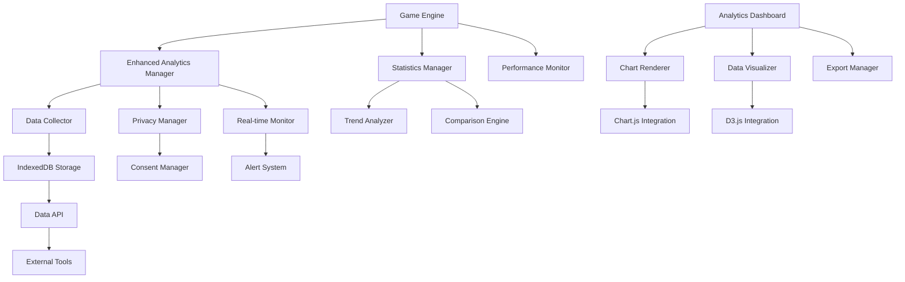
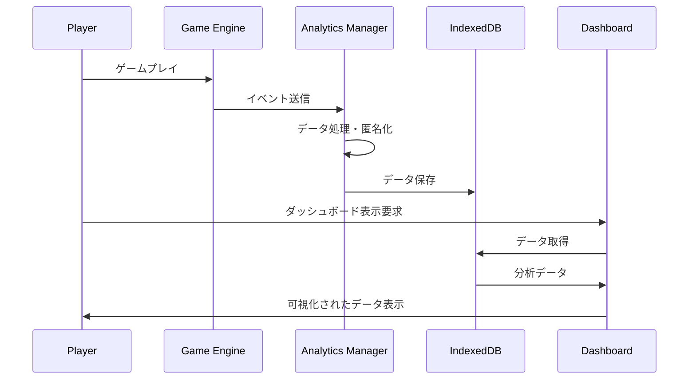

# ゲーム分析機能 - 設計書

## 概要

プレイヤー行動とゲームバランスの分析機能を実装するための詳細設計です。既存のAnalytics.jsとStatisticsManagerを拡張し、新しいデータ可視化とダッシュボード機能を追加します。

## アーキテクチャ

### システム全体構成



### データフロー



## コンポーネントと インターフェース

### 1. Enhanced Analytics Manager

既存のAnalytics.jsを拡張し、より詳細なデータ収集機能を提供します。

```javascript
class EnhancedAnalyticsManager extends Analytics {
    constructor(options = {}) {
        super();
        this.privacyManager = new PrivacyManager();
        this.dataCollector = new DataCollector();
        this.realtimeMonitor = new RealtimeMonitor();
        this.storageManager = new IndexedDBStorageManager();
    }
    
    // プレイヤー行動分析
    trackPlayerBehavior(eventType, data) {}
    
    // ゲームバランス分析
    trackGameBalance(balanceData) {}
    
    // パフォーマンス分析
    trackPerformanceMetrics(metrics) {}
    
    // リアルタイム監視
    startRealtimeMonitoring() {}
}
```

### 2. Data Collector

各種ゲームイベントからデータを収集し、構造化します。

```javascript
class DataCollector {
    constructor(privacyManager) {
        this.privacyManager = privacyManager;
        this.eventQueue = [];
        this.batchSize = 50;
    }
    
    // セッションデータ収集
    collectSessionData(sessionInfo) {}
    
    // バブルインタラクション収集
    collectBubbleInteraction(bubbleData) {}
    
    // パフォーマンスデータ収集
    collectPerformanceData(performanceMetrics) {}
    
    // バッチ処理
    processBatch() {}
}
```

### 3. Privacy Manager

プライバシー保護とGDPR準拠を管理します。

```javascript
class PrivacyManager {
    constructor() {
        this.consentStatus = null;
        this.anonymizationRules = new Map();
        this.optOutFeatures = new Set();
    }
    
    // 同意管理
    requestConsent() {}
    checkConsent() {}
    
    // データ匿名化
    anonymizeData(data) {}
    
    // オプトアウト管理
    setOptOut(feature, status) {}
    isOptedOut(feature) {}
}
```

### 4. IndexedDB Storage Manager

大容量データの効率的な保存・取得を管理します。

```javascript
class IndexedDBStorageManager {
    constructor() {
        this.dbName = 'BubblePopAnalytics';
        this.version = 1;
        this.db = null;
    }
    
    // データベース初期化
    async initialize() {}
    
    // データ保存
    async saveData(storeName, data) {}
    
    // データ取得
    async getData(storeName, query) {}
    
    // データ集計
    async aggregateData(storeName, aggregationRules) {}
    
    // データクリーンアップ
    async cleanupOldData(retentionDays) {}
}
```

### 5. Analytics Dashboard

データ可視化のメインコンポーネントです。

```javascript
class AnalyticsDashboard {
    constructor(container) {
        this.container = container;
        this.chartRenderer = new ChartRenderer();
        this.dataVisualizer = new DataVisualizer();
        this.exportManager = new ExportManager();
    }
    
    // ダッシュボード初期化
    initialize() {}
    
    // 基本統計表示
    renderBasicStats() {}
    
    // トレンド分析表示
    renderTrendAnalysis() {}
    
    // 比較分析表示
    renderComparisonAnalysis() {}
    
    // リアルタイム監視表示
    renderRealtimeMonitoring() {}
}
```

### 6. Chart Renderer

Chart.jsを使用したグラフ描画を管理します。

```javascript
class ChartRenderer {
    constructor() {
        this.charts = new Map();
        this.defaultOptions = {
            responsive: true,
            maintainAspectRatio: false,
            plugins: {
                legend: { position: 'top' },
                tooltip: { mode: 'index' }
            }
        };
    }
    
    // 線グラフ作成
    createLineChart(canvas, data, options) {}
    
    // 棒グラフ作成
    createBarChart(canvas, data, options) {}
    
    // 円グラフ作成
    createPieChart(canvas, data, options) {}
    
    // リアルタイムグラフ更新
    updateRealtimeChart(chartId, newData) {}
}
```

### 7. Trend Analyzer

時系列データの分析とトレンド検出を行います。

```javascript
class TrendAnalyzer {
    constructor(storageManager) {
        this.storageManager = storageManager;
        this.analysisCache = new Map();
    }
    
    // 週次トレンド分析
    analyzeWeeklyTrend(dataType, startDate) {}
    
    // 月次トレンド分析
    analyzeMonthlyTrend(dataType, startDate) {}
    
    // 異常パターン検出
    detectAnomalies(data, threshold) {}
    
    // 季節調整
    seasonalAdjustment(data, period) {}
}
```

### 8. Comparison Engine

比較分析機能を提供します。

```javascript
class ComparisonEngine {
    constructor(storageManager) {
        this.storageManager = storageManager;
        this.benchmarkData = new Map();
    }
    
    // 過去データとの比較
    compareWithPast(currentData, period) {}
    
    // ベンチマーク比較
    compareWithBenchmark(userData, benchmarkType) {}
    
    // ステージ別比較
    compareByStage(stageData) {}
    
    // 改善提案生成
    generateImprovementSuggestions(comparisonResult) {}
}
```

## データモデル

### セッションデータ

```javascript
const SessionData = {
    sessionId: 'string',
    startTime: 'timestamp',
    endTime: 'timestamp',
    duration: 'number',
    stageId: 'string',
    finalScore: 'number',
    bubblesPopped: 'number',
    bubblesMissed: 'number',
    maxCombo: 'number',
    completed: 'boolean',
    exitReason: 'string', // 'completed', 'game_over', 'quit'
    playerSettings: {
        difficulty: 'string',
        soundEnabled: 'boolean',
        effectsEnabled: 'boolean'
    }
};
```

### バブルインタラクションデータ

```javascript
const BubbleInteractionData = {
    sessionId: 'string',
    timestamp: 'timestamp',
    bubbleType: 'string',
    action: 'string', // 'popped', 'missed', 'expired'
    reactionTime: 'number',
    position: { x: 'number', y: 'number' },
    scoreGained: 'number',
    comboCount: 'number',
    contextInfo: {
        remainingBubbles: 'number',
        currentHP: 'number',
        timeRemaining: 'number'
    }
};
```

### パフォーマンスデータ

```javascript
const PerformanceData = {
    sessionId: 'string',
    timestamp: 'timestamp',
    fps: 'number',
    memoryUsage: {
        used: 'number',
        total: 'number',
        limit: 'number'
    },
    loadTimes: {
        assets: 'number',
        scripts: 'number',
        total: 'number'
    },
    errors: [{
        type: 'string',
        message: 'string',
        stack: 'string',
        context: 'object'
    }]
};
```

### 集計データ

```javascript
const AggregatedData = {
    period: 'string', // 'daily', 'weekly', 'monthly'
    startDate: 'timestamp',
    endDate: 'timestamp',
    metrics: {
        totalSessions: 'number',
        totalPlayTime: 'number',
        averageScore: 'number',
        completionRate: 'number',
        bubbleAccuracy: 'number',
        averageFPS: 'number',
        errorRate: 'number'
    },
    trends: {
        scoreImprovement: 'number',
        playTimeChange: 'number',
        accuracyChange: 'number'
    }
};
```

## エラーハンドリング

### エラー分類

1. **データ収集エラー**: イベント収集時の問題
2. **ストレージエラー**: IndexedDB操作の問題
3. **可視化エラー**: グラフ描画の問題
4. **プライバシーエラー**: 同意管理の問題
5. **パフォーマンスエラー**: 分析処理の問題

### エラー処理戦略

```javascript
class AnalyticsErrorHandler {
    constructor() {
        this.errorQueue = [];
        this.retryAttempts = new Map();
        this.maxRetries = 3;
    }
    
    // エラー処理
    handleError(error, context) {
        const errorInfo = {
            type: error.constructor.name,
            message: error.message,
            context: context,
            timestamp: Date.now(),
            stack: error.stack
        };
        
        // エラーログ記録
        this.logError(errorInfo);
        
        // 復旧処理
        this.attemptRecovery(errorInfo);
    }
    
    // 復旧処理
    attemptRecovery(errorInfo) {
        switch (errorInfo.type) {
            case 'IndexedDBError':
                return this.recoverFromStorageError(errorInfo);
            case 'ChartRenderError':
                return this.recoverFromVisualizationError(errorInfo);
            default:
                return this.genericRecovery(errorInfo);
        }
    }
}
```

## テスト戦略

### 単体テスト

- 各コンポーネントの個別機能テスト
- データ収集・保存・取得の正確性テスト
- プライバシー機能のテスト
- エラーハンドリングのテスト

### 統合テスト

- コンポーネント間の連携テスト
- データフローの整合性テスト
- パフォーマンス影響のテスト

### E2Eテスト

- 実際のゲームプレイでのデータ収集テスト
- ダッシュボード表示の正確性テスト
- プライバシー設定の動作テスト

### パフォーマンステスト

- 大量データ処理のパフォーマンステスト
- リアルタイム監視の負荷テスト
- メモリ使用量の監視テスト

## セキュリティ考慮事項

### データ保護

1. **データ匿名化**: 個人特定可能情報の除去
2. **暗号化**: 機密データの暗号化保存
3. **アクセス制御**: データアクセスの制限
4. **データ保持期間**: 自動的なデータ削除

### プライバシー準拠

1. **GDPR準拠**: EU一般データ保護規則への対応
2. **同意管理**: 明示的な同意取得
3. **データポータビリティ**: データエクスポート機能
4. **削除権**: データ削除要求への対応

## パフォーマンス最適化

### データ収集最適化

1. **バッチ処理**: イベントのバッチ処理
2. **非同期処理**: UI阻害の回避
3. **データ圧縮**: ストレージ効率の向上
4. **キャッシュ戦略**: 頻繁アクセスデータのキャッシュ

### 可視化最適化

1. **遅延読み込み**: 必要時のみチャート描画
2. **データサンプリング**: 大量データの間引き表示
3. **レンダリング最適化**: Canvas描画の最適化
4. **メモリ管理**: 不要オブジェクトの解放

## 国際化対応

### 多言語サポート

1. **UI文字列**: ダッシュボードの多言語化
2. **データラベル**: グラフラベルの翻訳
3. **エラーメッセージ**: エラー表示の多言語化
4. **ヘルプテキスト**: 説明文の翻訳

### 地域対応

1. **日時形式**: 地域別の日時表示
2. **数値形式**: 地域別の数値フォーマット
3. **プライバシー法**: 地域別のプライバシー法対応

## 拡張性設計

### プラグインアーキテクチャ

```javascript
class AnalyticsPlugin {
    constructor(name, version) {
        this.name = name;
        this.version = version;
    }
    
    // プラグイン初期化
    initialize(analyticsManager) {}
    
    // データ処理フック
    processData(data) {}
    
    // 可視化拡張
    renderCustomVisualization(container, data) {}
}
```

### API拡張

```javascript
class AnalyticsAPI {
    constructor(storageManager) {
        this.storageManager = storageManager;
        this.endpoints = new Map();
    }
    
    // エンドポイント登録
    registerEndpoint(path, handler) {}
    
    // データ取得API
    async getData(query) {}
    
    // 集計API
    async getAggregatedData(aggregationRules) {}
    
    // エクスポートAPI
    async exportData(format, filters) {}
}
```

## 運用・保守

### 監視項目

1. **データ収集率**: イベント収集の成功率
2. **ストレージ使用量**: IndexedDB使用量の監視
3. **処理性能**: 分析処理の実行時間
4. **エラー率**: 各機能のエラー発生率

### 保守作業

1. **データクリーンアップ**: 古いデータの自動削除
2. **インデックス最適化**: データベースインデックスの最適化
3. **キャッシュクリア**: 分析キャッシュの定期クリア
4. **設定更新**: 分析設定の動的更新