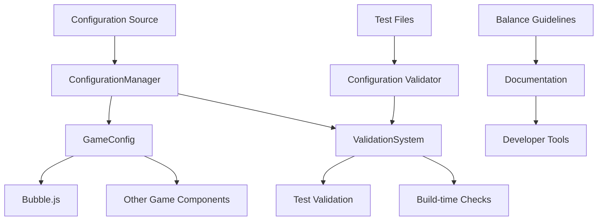

# Design Document

## Overview

This design addresses the synchronization of game balance configuration values between the implementation and tests. The current system has inconsistencies where test expectations don't match actual configuration values, leading to unreliable tests and unpredictable game balance.

The solution involves:
1. Identifying and resolving current configuration discrepancies
2. Creating a unified configuration validation system
3. Establishing balance adjustment guidelines
4. Implementing automated consistency checks

## Architecture

### Current System Analysis

The project currently has multiple configuration systems:

1. **Legacy System**: `GameBalance.js` with `ORIGINAL_BALANCE_CONFIG`
2. **New System**: `ConfigurationManager.js` with `GameConfig.js`
3. **Compatibility Layer**: `GameBalanceCompatibility.js`
4. **Implementation**: `Bubble.js` with hardcoded type configurations

### Identified Discrepancies

Based on analysis of the codebase, the following discrepancies exist:

| Configuration | Test Expectation | Implementation Value | Location |
|---------------|------------------|---------------------|----------|
| Normal bubble score | 10 | 15 | `Bubble.test.js` vs `GameBalance.js` |
| Pink bubble heal amount | 25 (test matches) | 25 | Consistent |
| Poison bubble damage | 8 (test matches) | 8 | Consistent |
| Boss bubble health | 5 (test expects) | 8 (implementation) | `Bubble.test.js` vs `Bubble.js` |
| Boss bubble size | 100 (test expects) | 90 (implementation) | `Bubble.test.js` vs `Bubble.js` |
| Electric bubble intensity | 20 (test expects) | 15 (implementation) | `Bubble.test.js` vs `Bubble.js` |
| Electric bubble duration | 2000 (test expects) | 1500 (implementation) | `Bubble.test.js` vs `Bubble.js` |

### Target Architecture



## Components and Interfaces

### 1. Configuration Synchronizer

**Purpose**: Ensures consistency between all configuration sources

**Interface**:
```javascript
class ConfigurationSynchronizer {
    validateConsistency()
    identifyDiscrepancies()
    generateSyncReport()
    applySyncFixes()
}
```

**Responsibilities**:
- Compare values across different configuration sources
- Identify inconsistencies between tests and implementation
- Generate reports of discrepancies
- Apply automated fixes where possible

### 2. Balance Configuration Validator

**Purpose**: Validates configuration values against defined rules

**Interface**:
```javascript
class BalanceConfigurationValidator {
    validateBubbleConfig(bubbleType, config)
    validateScoreConfig(scoreConfig)
    validateStageConfig(stageConfig)
    validateItemConfig(itemConfig)
}
```

**Responsibilities**:
- Validate individual configuration values
- Check for logical consistency (e.g., boss bubbles should have higher health)
- Ensure values are within acceptable ranges
- Provide detailed error messages for invalid configurations

### 3. Test Configuration Generator

**Purpose**: Generates test expectations from canonical configuration

**Interface**:
```javascript
class TestConfigurationGenerator {
    generateBubbleTests(bubbleType)
    generateScoreTests()
    updateTestExpectations()
    validateTestConsistency()
}
```

**Responsibilities**:
- Generate test cases based on current configuration
- Update existing test expectations
- Ensure test values match implementation values
- Provide migration tools for test updates

### 4. Balance Guidelines Manager

**Purpose**: Manages balance adjustment guidelines and documentation

**Interface**:
```javascript
class BalanceGuidelinesManager {
    getAdjustmentGuidelines(configType)
    validateAdjustment(oldValue, newValue, context)
    documentChange(change, rationale)
    generateImpactReport(changes)
}
```

**Responsibilities**:
- Provide guidelines for balance adjustments
- Validate proposed changes against guidelines
- Document changes with rationale
- Generate impact reports for changes

## Data Models

### Configuration Discrepancy Model

```javascript
class ConfigurationDiscrepancy {
    constructor(key, testValue, implementationValue, locations) {
        this.key = key;
        this.testValue = testValue;
        this.implementationValue = implementationValue;
        this.locations = locations;
        this.severity = this.calculateSeverity();
        this.suggestedResolution = this.generateResolution();
    }
}
```

### Balance Change Model

```javascript
class BalanceChange {
    constructor(key, oldValue, newValue, rationale, impact) {
        this.key = key;
        this.oldValue = oldValue;
        this.newValue = newValue;
        this.rationale = rationale;
        this.impact = impact;
        this.timestamp = new Date();
        this.author = this.getCurrentUser();
    }
}
```

### Validation Rule Model

```javascript
class ValidationRule {
    constructor(key, type, constraints, customValidator) {
        this.key = key;
        this.type = type; // 'number', 'string', 'boolean', 'object'
        this.constraints = constraints; // min, max, enum, pattern, etc.
        this.customValidator = customValidator;
    }
}
```

## Error Handling

### Configuration Error Types

1. **Inconsistency Errors**: When test expectations don't match implementation
2. **Validation Errors**: When configuration values violate defined rules
3. **Missing Configuration Errors**: When expected configuration is not found
4. **Type Mismatch Errors**: When configuration values have wrong types

### Error Resolution Strategy

1. **Automated Resolution**: For simple inconsistencies, apply automatic fixes
2. **Guided Resolution**: Provide suggestions and tools for manual resolution
3. **Documentation**: Generate detailed reports for complex issues
4. **Rollback**: Ability to revert changes if issues are detected

### Error Reporting

```javascript
class ConfigurationError extends Error {
    constructor(type, key, details, suggestions) {
        super(`Configuration ${type}: ${key}`);
        this.type = type;
        this.key = key;
        this.details = details;
        this.suggestions = suggestions;
    }
}
```

## Testing Strategy

### Unit Tests

1. **Configuration Validator Tests**: Test validation rules and error detection
2. **Synchronizer Tests**: Test discrepancy detection and resolution
3. **Balance Guidelines Tests**: Test guideline validation and documentation

### Integration Tests

1. **End-to-End Configuration Tests**: Test entire configuration flow
2. **Cross-System Consistency Tests**: Test consistency across all systems
3. **Migration Tests**: Test configuration migration and updates

### Automated Validation Tests

1. **Build-time Validation**: Run consistency checks during build
2. **Pre-commit Hooks**: Validate configuration changes before commit
3. **Continuous Integration**: Regular consistency checks in CI pipeline

### Test Data Management

1. **Canonical Configuration**: Single source of truth for test expectations
2. **Test Configuration Generator**: Automatically generate test data
3. **Configuration Snapshots**: Track configuration changes over time

## Implementation Phases

### Phase 1: Analysis and Documentation
- Complete analysis of current discrepancies
- Document all configuration sources and their relationships
- Create comprehensive mapping of inconsistencies

### Phase 2: Validation System
- Implement configuration validation rules
- Create automated discrepancy detection
- Build reporting and documentation tools

### Phase 3: Synchronization
- Resolve identified discrepancies
- Update tests to match canonical configuration
- Implement automated synchronization tools

### Phase 4: Guidelines and Governance
- Create balance adjustment guidelines
- Implement change documentation system
- Set up automated validation in CI/CD pipeline

### Phase 5: Monitoring and Maintenance
- Implement ongoing monitoring for configuration drift
- Create tools for balance adjustment impact analysis
- Establish regular configuration review processes