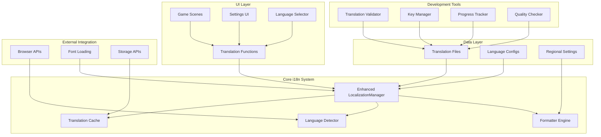
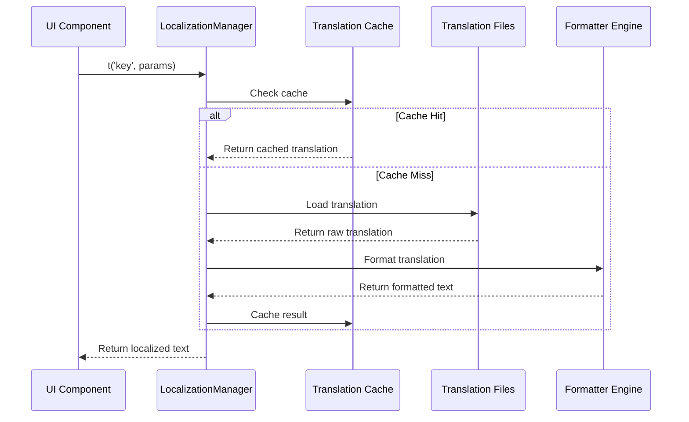

# 多言語対応（国際化・ローカライゼーション）設計書

## 概要

BubblePop Web Gameの包括的な多言語対応システムを設計する。既存の`LocalizationManager`を拡張し、完全な国際化（i18n）とローカライゼーション（l10n）機能を実装する。

## アーキテクチャ

### システム構成図



### データフロー



## コンポーネント設計

### 1. Enhanced LocalizationManager

#### 1.1 クラス構造

```javascript
export class LocalizationManager {
    constructor() {
        this.currentLanguage = 'ja';
        this.fallbackLanguage = 'en';
        this.supportedLanguages = new Map();
        this.translationCache = new Map();
        this.formatters = new Map();
        this.validators = new Map();
        this.loadingPromises = new Map();
        this.changeListeners = new Set();
        
        // 新機能
        this.languageDetector = new LanguageDetector();
        this.translationLoader = new TranslationLoader();
        this.formatterEngine = new FormatterEngine();
        this.qualityChecker = new QualityChecker();
        this.progressTracker = new ProgressTracker();
    }
}
```

#### 1.2 主要メソッド

```javascript
// 翻訳取得（拡張版）
t(key, params = {}, options = {}) {
    const { 
        language = this.currentLanguage,
        fallback = true,
        cache = true,
        format = true 
    } = options;
    
    return this.getTranslation(key, params, language, {
        fallback, cache, format
    });
}

// 複数翻訳の一括取得
tMultiple(keys, params = {}, options = {}) {
    return keys.reduce((result, key) => {
        result[key] = this.t(key, params, options);
        return result;
    }, {});
}

// 条件付き翻訳
tConditional(condition, trueKey, falseKey, params = {}) {
    return this.t(condition ? trueKey : falseKey, params);
}

// 複数形対応翻訳
tPlural(key, count, params = {}) {
    const pluralKey = this.getPluralKey(key, count);
    return this.t(pluralKey, { ...params, count });
}
```

### 2. Translation File Structure

#### 2.1 ファイル構造

```
src/
├── locales/
│   ├── ja/
│   │   ├── common.json          # 共通翻訳
│   │   ├── menu.json           # メニュー関連
│   │   ├── game.json           # ゲーム内テキスト
│   │   ├── settings.json       # 設定画面
│   │   ├── errors.json         # エラーメッセージ
│   │   ├── achievements.json   # 実績システム
│   │   └── help.json          # ヘルプ・説明
│   ├── en/
│   │   └── [same structure]
│   ├── zh-CN/
│   │   └── [same structure]
│   ├── zh-TW/
│   │   └── [same structure]
│   ├── ko/
│   │   └── [same structure]
│   └── config/
│       ├── languages.json      # 言語設定
│       ├── regions.json        # 地域設定
│       └── formats.json        # フォーマット設定
```

#### 2.2 翻訳ファイル形式

```json
// ja/common.json
{
  "meta": {
    "language": "ja",
    "region": "JP",
    "version": "1.0.0",
    "lastUpdated": "2025-01-28T00:00:00Z",
    "completeness": 100,
    "quality": 95
  },
  "translations": {
    "buttons": {
      "ok": "OK",
      "cancel": "キャンセル",
      "confirm": "確認",
      "back": "戻る"
    },
    "messages": {
      "loading": "読み込み中...",
      "saving": "保存中...",
      "error": "エラーが発生しました"
    },
    "plurals": {
      "item": {
        "zero": "アイテムがありません",
        "one": "{{count}}個のアイテム",
        "other": "{{count}}個のアイテム"
      }
    }
  }
}
```

### 3. Language Detection System

#### 3.1 LanguageDetector クラス

```javascript
export class LanguageDetector {
    constructor() {
        this.detectionMethods = [
            this.detectFromURL,
            this.detectFromStorage,
            this.detectFromBrowser,
            this.detectFromDefault
        ];
    }
    
    detect() {
        for (const method of this.detectionMethods) {
            const language = method.call(this);
            if (language && this.isSupported(language)) {
                return language;
            }
        }
        return 'en'; // Ultimate fallback
    }
    
    detectFromURL() {
        const params = new URLSearchParams(window.location.search);
        return params.get('lang') || params.get('language');
    }
    
    detectFromStorage() {
        return localStorage.getItem('bubblePop_language');
    }
    
    detectFromBrowser() {
        const browserLang = navigator.language || navigator.userLanguage;
        return this.normalizeLanguageCode(browserLang);
    }
    
    detectFromDefault() {
        return 'ja'; // Project default
    }
}
```

### 4. Formatter Engine

#### 4.1 FormatterEngine クラス

```javascript
export class FormatterEngine {
    constructor() {
        this.formatters = new Map([
            ['number', new NumberFormatter()],
            ['date', new DateFormatter()],
            ['currency', new CurrencyFormatter()],
            ['relative', new RelativeTimeFormatter()],
            ['list', new ListFormatter()]
        ]);
    }
    
    format(text, params, language, region) {
        let formatted = text;
        
        // パラメータ置換
        formatted = this.replaceParameters(formatted, params);
        
        // 地域固有フォーマット
        formatted = this.applyRegionalFormatting(formatted, language, region);
        
        // 特殊フォーマット処理
        formatted = this.processSpecialFormats(formatted, params, language);
        
        return formatted;
    }
    
    replaceParameters(text, params) {
        return text.replace(/\{\{(\w+)\}\}/g, (match, key) => {
            return params[key] !== undefined ? params[key] : match;
        });
    }
    
    applyRegionalFormatting(text, language, region) {
        // 数値フォーマット
        text = text.replace(/\{\{number:(\w+)\}\}/g, (match, key) => {
            const value = params[key];
            return this.formatters.get('number').format(value, language, region);
        });
        
        // 日付フォーマット
        text = text.replace(/\{\{date:(\w+)\}\}/g, (match, key) => {
            const value = params[key];
            return this.formatters.get('date').format(value, language, region);
        });
        
        return text;
    }
}
```

### 5. Translation Loading System

#### 5.1 TranslationLoader クラス

```javascript
export class TranslationLoader {
    constructor() {
        this.loadedTranslations = new Map();
        this.loadingPromises = new Map();
        this.cache = new Map();
    }
    
    async loadLanguage(language) {
        if (this.loadingPromises.has(language)) {
            return this.loadingPromises.get(language);
        }
        
        const promise = this._loadLanguageFiles(language);
        this.loadingPromises.set(language, promise);
        
        try {
            const translations = await promise;
            this.loadedTranslations.set(language, translations);
            return translations;
        } finally {
            this.loadingPromises.delete(language);
        }
    }
    
    async _loadLanguageFiles(language) {
        const files = [
            'common', 'menu', 'game', 'settings', 
            'errors', 'achievements', 'help'
        ];
        
        const translations = {};
        
        await Promise.all(files.map(async (file) => {
            try {
                const response = await fetch(`/src/locales/${language}/${file}.json`);
                if (response.ok) {
                    const data = await response.json();
                    translations[file] = data.translations;
                }
            } catch (error) {
                console.warn(`Failed to load ${file}.json for ${language}:`, error);
            }
        }));
        
        return translations;
    }
    
    preloadLanguages(languages) {
        return Promise.all(languages.map(lang => this.loadLanguage(lang)));
    }
}
```

### 6. Quality Management System

#### 6.1 QualityChecker クラス

```javascript
export class QualityChecker {
    constructor() {
        this.rules = [
            new ParameterConsistencyRule(),
            new LengthValidationRule(),
            new FormatValidationRule(),
            new ContextValidationRule(),
            new CulturalAppropriatenessRule()
        ];
    }
    
    checkTranslation(key, translation, language, context = {}) {
        const issues = [];
        
        for (const rule of this.rules) {
            const result = rule.validate(key, translation, language, context);
            if (!result.isValid) {
                issues.push(...result.issues);
            }
        }
        
        return {
            isValid: issues.length === 0,
            issues,
            score: this.calculateQualityScore(issues)
        };
    }
    
    checkLanguageCompleteness(language) {
        const baseLanguage = 'ja';
        const baseKeys = this.getAllKeys(baseLanguage);
        const targetKeys = this.getAllKeys(language);
        
        const missing = baseKeys.filter(key => !targetKeys.includes(key));
        const extra = targetKeys.filter(key => !baseKeys.includes(key));
        
        return {
            completeness: ((baseKeys.length - missing.length) / baseKeys.length) * 100,
            missing,
            extra,
            total: baseKeys.length,
            translated: baseKeys.length - missing.length
        };
    }
}
```

### 7. Development Tools

#### 7.1 Translation Key Manager

```javascript
export class TranslationKeyManager {
    constructor() {
        this.keyRegistry = new Map();
        this.usageTracker = new Map();
    }
    
    registerKey(key, metadata = {}) {
        this.keyRegistry.set(key, {
            ...metadata,
            createdAt: new Date(),
            lastUsed: null,
            usageCount: 0
        });
    }
    
    trackUsage(key) {
        if (this.keyRegistry.has(key)) {
            const data = this.keyRegistry.get(key);
            data.lastUsed = new Date();
            data.usageCount++;
        }
    }
    
    findUnusedKeys() {
        return Array.from(this.keyRegistry.entries())
            .filter(([key, data]) => data.usageCount === 0)
            .map(([key]) => key);
    }
    
    generateKeyReport() {
        return {
            totalKeys: this.keyRegistry.size,
            usedKeys: Array.from(this.keyRegistry.values())
                .filter(data => data.usageCount > 0).length,
            unusedKeys: this.findUnusedKeys(),
            mostUsed: this.getMostUsedKeys(10),
            recentlyAdded: this.getRecentlyAddedKeys(10)
        };
    }
}
```

#### 7.2 Progress Tracker

```javascript
export class ProgressTracker {
    constructor() {
        this.progressData = new Map();
    }
    
    trackProgress(language) {
        const completeness = this.calculateCompleteness(language);
        const quality = this.calculateQuality(language);
        
        this.progressData.set(language, {
            completeness,
            quality,
            lastUpdated: new Date(),
            issues: this.getIssues(language)
        });
        
        return { completeness, quality };
    }
    
    generateProgressReport() {
        const report = {
            languages: {},
            overall: {
                averageCompleteness: 0,
                averageQuality: 0,
                totalIssues: 0
            }
        };
        
        let totalCompleteness = 0;
        let totalQuality = 0;
        let totalIssues = 0;
        
        for (const [language, data] of this.progressData) {
            report.languages[language] = data;
            totalCompleteness += data.completeness;
            totalQuality += data.quality;
            totalIssues += data.issues.length;
        }
        
        const languageCount = this.progressData.size;
        report.overall = {
            averageCompleteness: totalCompleteness / languageCount,
            averageQuality: totalQuality / languageCount,
            totalIssues
        };
        
        return report;
    }
}
```

## データモデル

### 1. Language Configuration

```javascript
// config/languages.json
{
  "ja": {
    "name": "日本語",
    "nativeName": "日本語",
    "code": "ja",
    "region": "JP",
    "direction": "ltr",
    "pluralRules": "japanese",
    "dateFormat": "YYYY年MM月DD日",
    "numberFormat": {
      "decimal": ".",
      "thousands": ",",
      "currency": "¥"
    },
    "fonts": ["Noto Sans JP", "Hiragino Sans", "Yu Gothic"],
    "fallbacks": ["en"]
  },
  "en": {
    "name": "English",
    "nativeName": "English",
    "code": "en",
    "region": "US",
    "direction": "ltr",
    "pluralRules": "english",
    "dateFormat": "MM/DD/YYYY",
    "numberFormat": {
      "decimal": ".",
      "thousands": ",",
      "currency": "$"
    },
    "fonts": ["Arial", "Helvetica", "sans-serif"],
    "fallbacks": ["ja"]
  }
}
```

### 2. Regional Settings

```javascript
// config/regions.json
{
  "JP": {
    "currency": "JPY",
    "timezone": "Asia/Tokyo",
    "firstDayOfWeek": 0,
    "numberFormat": {
      "groupSize": 3,
      "groupSeparator": ",",
      "decimalSeparator": "."
    }
  },
  "US": {
    "currency": "USD",
    "timezone": "America/New_York",
    "firstDayOfWeek": 0,
    "numberFormat": {
      "groupSize": 3,
      "groupSeparator": ",",
      "decimalSeparator": "."
    }
  }
}
```

## エラーハンドリング

### 1. Translation Error Types

```javascript
export class TranslationError extends Error {
    constructor(message, code, context = {}) {
        super(message);
        this.name = 'TranslationError';
        this.code = code;
        this.context = context;
    }
}

export const ERROR_CODES = {
    TRANSLATION_NOT_FOUND: 'TRANSLATION_NOT_FOUND',
    LANGUAGE_NOT_SUPPORTED: 'LANGUAGE_NOT_SUPPORTED',
    LOADING_FAILED: 'LOADING_FAILED',
    FORMATTING_ERROR: 'FORMATTING_ERROR',
    VALIDATION_ERROR: 'VALIDATION_ERROR'
};
```

### 2. Fallback Strategy

```javascript
export class FallbackStrategy {
    constructor(localizationManager) {
        this.lm = localizationManager;
        this.strategies = [
            this.tryCurrentLanguage,
            this.tryFallbackLanguage,
            this.tryKeyAsText,
            this.returnErrorMessage
        ];
    }
    
    resolve(key, params, options) {
        for (const strategy of this.strategies) {
            try {
                const result = strategy.call(this, key, params, options);
                if (result !== null) {
                    return result;
                }
            } catch (error) {
                console.warn(`Fallback strategy failed:`, error);
            }
        }
        
        return `[Missing: ${key}]`;
    }
}
```

## テスト戦略

### 1. Unit Tests

```javascript
// tests/unit/LocalizationManager.test.js
describe('LocalizationManager', () => {
    let lm;
    
    beforeEach(() => {
        lm = new LocalizationManager();
    });
    
    describe('Translation', () => {
        test('should return correct translation', () => {
            expect(lm.t('common.buttons.ok')).toBe('OK');
        });
        
        test('should handle parameters', () => {
            expect(lm.t('common.messages.welcome', { name: 'Test' }))
                .toBe('Welcome, Test!');
        });
        
        test('should fallback to default language', () => {
            lm.setLanguage('invalid');
            expect(lm.t('common.buttons.ok')).toBe('OK');
        });
    });
    
    describe('Language Detection', () => {
        test('should detect browser language', () => {
            Object.defineProperty(navigator, 'language', {
                value: 'ja-JP',
                configurable: true
            });
            expect(lm.detectLanguage()).toBe('ja');
        });
    });
});
```

### 2. Integration Tests

```javascript
// tests/integration/i18n-integration.test.js
describe('i18n Integration', () => {
    test('should load and switch languages dynamically', async () => {
        const gameEngine = new GameEngine(canvas);
        
        // Initial language
        expect(gameEngine.localizationManager.getCurrentLanguage()).toBe('ja');
        
        // Switch to English
        await gameEngine.localizationManager.setLanguage('en');
        expect(gameEngine.localizationManager.t('menu.start')).toBe('Start Game');
        
        // Switch back to Japanese
        await gameEngine.localizationManager.setLanguage('ja');
        expect(gameEngine.localizationManager.t('menu.start')).toBe('ゲーム開始');
    });
});
```

### 3. E2E Tests

```javascript
// tests/e2e/language-switching.spec.js
test('Language switching in UI', async ({ page }) => {
    await page.goto('/');
    
    // Open settings
    await page.click('[data-testid="settings-button"]');
    
    // Switch to English
    await page.click('[data-testid="language-en"]');
    
    // Verify UI is in English
    await expect(page.locator('[data-testid="start-button"]'))
        .toHaveText('Start Game');
    
    // Switch back to Japanese
    await page.click('[data-testid="language-ja"]');
    
    // Verify UI is in Japanese
    await expect(page.locator('[data-testid="start-button"]'))
        .toHaveText('ゲーム開始');
});
```

## パフォーマンス最適化

### 1. Lazy Loading

```javascript
export class LazyTranslationLoader {
    constructor() {
        this.loadedNamespaces = new Set();
        this.loadingPromises = new Map();
    }
    
    async loadNamespace(namespace, language) {
        const key = `${language}:${namespace}`;
        
        if (this.loadedNamespaces.has(key)) {
            return;
        }
        
        if (this.loadingPromises.has(key)) {
            return this.loadingPromises.get(key);
        }
        
        const promise = this._loadNamespaceFile(namespace, language);
        this.loadingPromises.set(key, promise);
        
        try {
            await promise;
            this.loadedNamespaces.add(key);
        } finally {
            this.loadingPromises.delete(key);
        }
    }
}
```

### 2. Caching Strategy

```javascript
export class TranslationCache {
    constructor(maxSize = 1000) {
        this.cache = new Map();
        this.maxSize = maxSize;
        this.accessOrder = [];
    }
    
    get(key) {
        if (this.cache.has(key)) {
            this._updateAccessOrder(key);
            return this.cache.get(key);
        }
        return null;
    }
    
    set(key, value) {
        if (this.cache.size >= this.maxSize) {
            this._evictLeastRecentlyUsed();
        }
        
        this.cache.set(key, value);
        this._updateAccessOrder(key);
    }
    
    _evictLeastRecentlyUsed() {
        const lruKey = this.accessOrder.shift();
        this.cache.delete(lruKey);
    }
}
```

## セキュリティ考慮事項

### 1. XSS Prevention

```javascript
export class SecureFormatter {
    static escapeHtml(text) {
        const div = document.createElement('div');
        div.textContent = text;
        return div.innerHTML;
    }
    
    static sanitizeTranslation(translation, params) {
        // パラメータをエスケープ
        const sanitizedParams = {};
        for (const [key, value] of Object.entries(params)) {
            sanitizedParams[key] = this.escapeHtml(String(value));
        }
        
        return this.replaceParameters(translation, sanitizedParams);
    }
}
```

### 2. Content Validation

```javascript
export class ContentValidator {
    static validateTranslationContent(content) {
        // 危険なスクリプトタグをチェック
        if (/<script\b[^<]*(?:(?!<\/script>)<[^<]*)*<\/script>/gi.test(content)) {
            throw new SecurityError('Script tags not allowed in translations');
        }
        
        // 危険なイベントハンドラをチェック
        if (/on\w+\s*=/gi.test(content)) {
            throw new SecurityError('Event handlers not allowed in translations');
        }
        
        return true;
    }
}
```

## 統合ポイント

### 1. GameEngine Integration

```javascript
// GameEngine.js への統合
export class GameEngine {
    constructor(canvas) {
        // ... existing code ...
        
        // Enhanced LocalizationManager
        this.localizationManager = new LocalizationManager();
        
        // Language change listener
        this.localizationManager.addChangeListener((newLanguage, oldLanguage) => {
            this.onLanguageChanged(newLanguage, oldLanguage);
        });
    }
    
    onLanguageChanged(newLanguage, oldLanguage) {
        // Update UI elements
        this.sceneManager.refreshAllScenes();
        
        // Update settings
        this.settingsManager.set('language', newLanguage);
        
        // Trigger re-render
        this.render();
        
        console.log(`Language changed from ${oldLanguage} to ${newLanguage}`);
    }
}
```

### 2. Settings Integration

```javascript
// SettingsManager.js への統合
export class SettingsManager {
    applyLanguageChange(language) {
        // Set HTML lang attribute
        document.documentElement.lang = language;
        
        // Update LocalizationManager
        if (this.gameEngine.localizationManager) {
            this.gameEngine.localizationManager.setLanguage(language);
        }
        
        // Load appropriate fonts
        this.loadLanguageFonts(language);
        
        // Update direction for RTL languages
        this.updateTextDirection(language);
        
        console.log(`Language changed to: ${language}`);
    }
    
    loadLanguageFonts(language) {
        const config = this.gameEngine.localizationManager.getLanguageConfig(language);
        if (config && config.fonts) {
            // Load fonts dynamically
            config.fonts.forEach(font => {
                this.loadFont(font);
            });
        }
    }
}
```

## 実装優先度

### Phase 1: Core Enhancement (高優先度)
1. Enhanced LocalizationManager の実装
2. 翻訳ファイル構造の整理
3. 完全な英語翻訳の追加
4. 動的言語切り替え機能

### Phase 2: Extended Language Support (中優先度)
1. 中国語（簡体字・繁体字）対応
2. 韓国語対応
3. 地域化機能（数値・日付フォーマット）
4. フォント管理システム

### Phase 3: Development Tools (中優先度)
1. 翻訳品質チェッカー
2. 進捗追跡システム
3. 翻訳キー管理ツール
4. 自動化ツール

### Phase 4: Advanced Features (低優先度)
1. RTL言語対応準備
2. 高度な地域化機能
3. 翻訳メモリシステム
4. 外部翻訳サービス統合

## 成功指標

### 技術指標
- 翻訳取得時間: < 10ms
- 言語切り替え時間: < 500ms
- メモリ使用量増加: < 20%
- 翻訳完成度: > 95%

### 品質指標
- 翻訳品質スコア: > 90%
- ユーザビリティテスト満足度: > 80%
- エラー率: < 1%
- パフォーマンス劣化: < 5%