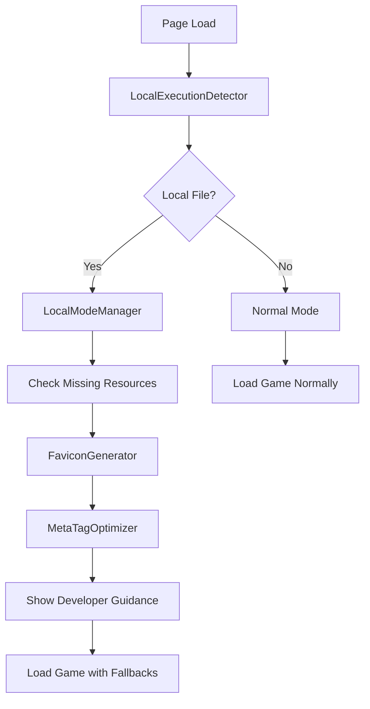

# Design Document

## Overview

ローカル環境でindex.htmlを直接ブラウザで開いた際に発生するCORSエラーとリソース読み込み問題を解決するための包括的なソリューションです。この設計では、ローカル実行検出機能、ファビコン自動生成システム、メタタグ最適化、開発者向けガイダンス強化を組み合わせて、開発体験を大幅に改善します。

## Architecture

### Core Components

1. **LocalExecutionDetector** - ローカル実行環境の検出
2. **FaviconGenerator** - 不足ファビコンファイルの自動生成
3. **MetaTagOptimizer** - セキュリティメタタグの最適化
4. **DeveloperGuidanceSystem** - 開発者向け案内システム
5. **LocalModeManager** - ローカル実行モードの管理

### System Flow



## Components and Interfaces

### 1. LocalExecutionDetector

**Purpose:** ローカルファイル実行環境を検出し、適切なモードに切り替える

**Interface:**
```javascript
class LocalExecutionDetector {
    static isLocalExecution(): boolean
    static getExecutionContext(): ExecutionContext
    static shouldShowWarning(): boolean
}

interface ExecutionContext {
    protocol: string;
    isLocal: boolean;
    canUseModules: boolean;
    supportedFeatures: string[];
}
```

**Implementation Strategy:**
- `window.location.protocol === 'file:'` でローカル実行を検出
- ブラウザの機能サポート状況を確認
- ローカル実行時の制限事項を特定

### 2. FaviconGenerator

**Purpose:** 不足しているファビコンファイルを動的に生成

**Interface:**
```javascript
class FaviconGenerator {
    static async generateMissingFavicons(): Promise<void>
    static async createFaviconICO(sizes: number[]): Promise<Blob>
    static async createPNGFavicon(size: number): Promise<Blob>
    static checkMissingFavicons(): string[]
}
```

**Implementation Strategy:**
- Canvas APIを使用してSVGからPNG/ICOを生成
- 必要なファビコンサイズ: 16x16, 32x32, 48x48, 192x192, 512x512
- 既存のfavicon.svgをベースに動的生成
- ブラウザのIndexedDBまたはlocalStorageにキャッシュ

### 3. MetaTagOptimizer

**Purpose:** ローカル実行時のメタタグを最適化

**Interface:**
```javascript
class MetaTagOptimizer {
    static optimizeForLocalExecution(): void
    static removeProblematicMetaTags(): void
    static addLocalExecutionMetaTags(): void
}
```

**Implementation Strategy:**
- X-Frame-Optionsメタタグを削除
- Content-Security-Policyを緩和
- ローカル実行用の代替メタタグを追加

### 4. DeveloperGuidanceSystem

**Purpose:** 開発者に適切なガイダンスを提供

**Interface:**
```javascript
class DeveloperGuidanceSystem {
    static showLocalExecutionWarning(): void
    static showDeveloperServerGuidance(): void
    static createGuidanceUI(): HTMLElement
    static dismissGuidance(): void
}
```

**Implementation Strategy:**
- 非侵入的な通知バナーを表示
- 開発サーバー起動コマンドを提示
- 制限事項と推奨事項を説明
- ローカルストレージで表示状態を管理

### 5. LocalModeManager

**Purpose:** ローカル実行モード全体を統合管理

**Interface:**
```javascript
class LocalModeManager {
    constructor()
    async initialize(): Promise<void>
    enableLocalMode(): void
    loadFallbackResources(): Promise<void>
    setupLocalEventHandlers(): void
}
```

## Data Models

### ExecutionContext
```javascript
interface ExecutionContext {
    protocol: 'file:' | 'http:' | 'https:';
    isLocal: boolean;
    canUseModules: boolean;
    supportedFeatures: {
        canvas: boolean;
        indexedDB: boolean;
        localStorage: boolean;
        serviceWorker: boolean;
    };
    browserInfo: {
        name: string;
        version: string;
        engine: string;
    };
}
```

### FaviconConfig
```javascript
interface FaviconConfig {
    sizes: number[];
    formats: ('png' | 'ico' | 'svg')[];
    baseSVG: string;
    outputPath: string;
    cacheEnabled: boolean;
}
```

### GuidanceConfig
```javascript
interface GuidanceConfig {
    showWarning: boolean;
    autoHide: boolean;
    hideDelay: number;
    persistDismissal: boolean;
    commands: {
        devServer: string;
        simpleServer: string[];
    };
}
```

## Error Handling

### Error Categories

1. **Resource Loading Errors**
   - ファビコンファイル不足
   - ES6モジュール読み込み失敗
   - CSS/画像リソース読み込み失敗

2. **Browser Compatibility Errors**
   - Canvas API未サポート
   - ES6モジュール未サポート
   - localStorage未サポート

3. **Security Policy Errors**
   - CORS制限
   - Content-Security-Policy違反
   - Mixed Content警告

### Error Handling Strategy

```javascript
class LocalExecutionErrorHandler {
    static handleResourceError(error: Error, resource: string): void
    static handleCompatibilityError(error: Error, feature: string): void
    static handleSecurityError(error: Error, policy: string): void
    static showFallbackContent(errorType: string): void
}
```

**Implementation:**
- エラーカテゴリ別の適切なフォールバック処理
- ユーザーフレンドリーなエラーメッセージ
- 開発者向けの詳細なデバッグ情報
- 自動復旧機能（可能な場合）

## Testing Strategy

### Unit Tests

1. **LocalExecutionDetector Tests**
   - プロトコル検出の正確性
   - ブラウザ機能検出
   - エッジケースの処理

2. **FaviconGenerator Tests**
   - Canvas API使用の動的生成
   - 各サイズ・形式の正確性
   - エラー処理とフォールバック

3. **MetaTagOptimizer Tests**
   - メタタグ削除・追加の正確性
   - DOM操作の安全性
   - 既存メタタグとの競合回避

### Integration Tests

1. **Local Execution Flow Tests**
   - ローカル実行検出から初期化まで
   - ファビコン生成とメタタグ最適化の連携
   - エラー発生時のフォールバック動作

2. **Cross-Browser Compatibility Tests**
   - Chrome, Firefox, Safari, Edgeでの動作確認
   - 各ブラウザの制限事項への対応
   - モバイルブラウザでの動作確認

### E2E Tests

1. **Local File Execution Tests**
   - file://プロトコルでの実際の動作確認
   - ファビコン表示の確認
   - エラーメッセージの非表示確認

2. **Developer Experience Tests**
   - ガイダンス表示の適切性
   - 開発サーバー案内の有効性
   - 警告の表示・非表示制御

## Implementation Phases

### Phase 1: Core Detection and Optimization
- LocalExecutionDetector実装
- MetaTagOptimizer実装
- 基本的なローカル実行対応

### Phase 2: Favicon Generation System
- FaviconGenerator実装
- Canvas APIベースの動的生成
- 不足ファビコンの自動補完

### Phase 3: Developer Guidance System
- DeveloperGuidanceSystem実装
- 非侵入的な通知システム
- 開発サーバー案内機能

### Phase 4: Integration and Polish
- LocalModeManager統合
- エラーハンドリング強化
- パフォーマンス最適化

### Phase 5: Documentation and Tools
- README.md更新
- 開発者向けドキュメント整備
- ファビコン生成スクリプト改善

## Performance Considerations

### Optimization Strategies

1. **Lazy Loading**
   - ファビコン生成は必要時のみ実行
   - ガイダンスUIの遅延読み込み

2. **Caching**
   - 生成したファビコンのlocalStorage保存
   - ガイダンス表示状態の永続化

3. **Resource Prioritization**
   - 重要なリソースの優先読み込み
   - 非必須機能の後回し処理

4. **Memory Management**
   - Canvas要素の適切な破棄
   - イベントリスナーのクリーンアップ

## Security Considerations

### Local Execution Security

1. **Content Security Policy**
   - ローカル実行時のCSP緩和
   - 最小限の権限での動作

2. **Resource Validation**
   - 動的生成リソースの検証
   - 外部リソース読み込みの制限

3. **User Data Protection**
   - ローカルストレージの適切な使用
   - 機密情報の非保存

## Browser Compatibility

### Supported Browsers

- **Chrome 58+**: 完全サポート
- **Firefox 57+**: 完全サポート
- **Safari 11+**: 完全サポート（一部制限あり）
- **Edge 79+**: 完全サポート

### Fallback Strategies

- Canvas API未サポート時の静的ファビコン使用
- ES6モジュール未サポート時のバンドル版読み込み
- localStorage未サポート時のセッション管理