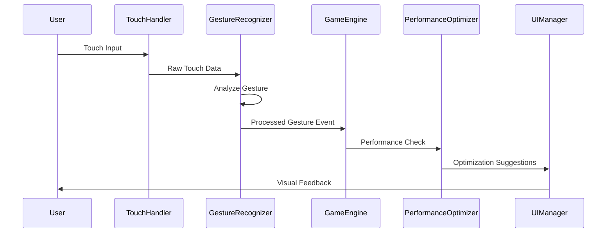

# Design Document

## Overview

モバイル対応強化機能は、BubblePopゲームのモバイルデバイスでのユーザー体験を大幅に向上させるための包括的なシステムです。現在の基本的なレスポンシブ対応とタッチ操作を拡張し、高度なモバイル特化機能、パフォーマンス最適化、PWA機能、デバイス固有対応を実装します。

## Architecture

### システム全体構成

```mermaid
graph TB
    A[Mobile Enhancement System] --> B[Touch Enhancement Manager]
    A --> C[Responsive Layout Manager]
    A --> D[Mobile Performance Optimizer]
    A --> E[PWA Manager]
    A --> F[Device Specific Handler]
    A --> G[Gesture Recognition System]
    A --> H[Mobile UI/UX Manager]
    
    B --> B1[Multi-touch Handler]
    B --> B2[Gesture Detector]
    B --> B3[Touch Sensitivity Controller]
    B --> B4[Accidental Touch Prevention]
    
    C --> C1[Dynamic Layout Calculator]
    C --> C2[Orientation Handler]
    C --> C3[Safe Area Manager]
    C --> C4[Viewport Adapter]
    
    D --> D1[Battery Monitor]
    D --> D2[Thermal Monitor]
    D --> D3[Memory Manager]
    D --> D4[Network Optimizer]
    
    E --> E1[Service Worker]
    E --> E2[App Manifest]
    E --> E3[Offline Manager]
    E --> E4[Push Notification Handler]
    
    F --> F1[iOS Optimizer]
    F --> F2[Android Optimizer]
    F --> F3[Browser Specific Handler]
    
    G --> G1[Swipe Detector]
    G --> G2[Pinch Detector]
    G --> G3[Long Press Handler]
    G --> G4[Double Tap Handler]
    
    H --> H1[One-handed Mode]
    H --> H2[Adaptive UI Scaler]
    H --> H3[Mobile Notification System]
    H --> H4[Accessibility Enhancer]
```



### データフロー



## Components and Interfaces

### 1. Enhanced Touch Manager

**責任**: タッチ操作の改善と高度なタッチ機能の提供

```javascript
class EnhancedTouchManager {
    constructor(canvas, gameEngine) {
        this.canvas = canvas;
        this.gameEngine = gameEngine;
        this.touchSensitivity = 1.0;
        this.multiTouchEnabled = true;
        this.gestureThresholds = {
            swipe: { minDistance: 50, maxTime: 500 },
            pinch: { minScale: 0.1, maxScale: 3.0 },
            longPress: { duration: 500 },
            doubleTap: { maxInterval: 300, maxDistance: 25 }
        };
    }
    
    // Core Methods
    initialize()
    handleTouchStart(event)
    handleTouchMove(event)
    handleTouchEnd(event)
    detectGesture(touchData)
    preventAccidentalTouch(touchEvent)
    adjustTouchSensitivity(level)
    
    // Gesture Detection
    detectSwipe(startTouch, endTouch)
    detectPinch(touches)
    detectLongPress(touch)
    detectDoubleTap(touches)
    
    // Configuration
    configureTouchSettings(settings)
    getTouchCapabilities()
}
```

### 2. Advanced Responsive Layout Manager

**責任**: 画面サイズとデバイス向きに応じた動的レイアウト調整

```javascript
class AdvancedResponsiveLayoutManager {
    constructor(canvas, gameEngine) {
        this.canvas = canvas;
        this.gameEngine = gameEngine;
        this.breakpoints = {
            mobile: { max: 767 },
            tablet: { min: 768, max: 1023 },
            desktop: { min: 1024 }
        };
        this.safeAreaInsets = { top: 0, right: 0, bottom: 0, left: 0 };
    }
    
    // Layout Management
    calculateOptimalLayout(screenSize, orientation)
    handleOrientationChange(orientation)
    applySafeAreaConstraints(insets)
    scaleUIElements(scaleFactor)
    
    // Dynamic Adjustment
    adjustForScreenSize(width, height)
    optimizeForOneHandedUse()
    adaptUIForAccessibility()
    
    // Utilities
    getDeviceCategory()
    calculateScaleFactor()
    detectSafeArea()
}
```

### 3. Mobile Performance Optimizer (Enhanced)

**責任**: モバイル特化のパフォーマンス最適化

```javascript
class MobilePerformanceOptimizer {
    constructor(gameEngine) {
        this.gameEngine = gameEngine;
        this.batteryMonitor = new BatteryMonitor();
        this.thermalMonitor = new ThermalMonitor();
        this.memoryMonitor = new MemoryMonitor();
        this.networkMonitor = new NetworkMonitor();
        
        this.optimizationLevels = {
            battery: { targetFPS: 30, quality: 'low' },
            balanced: { targetFPS: 45, quality: 'medium' },
            performance: { targetFPS: 60, quality: 'high' }
        };
    }
    
    // Performance Monitoring
    startMonitoring()
    checkBatteryLevel()
    monitorThermalState()
    trackMemoryUsage()
    assessNetworkQuality()
    
    // Optimization Strategies
    applyBatteryOptimizations()
    reduceThermalLoad()
    optimizeMemoryUsage()
    minimizeNetworkUsage()
    
    // Adaptive Performance
    adjustQualitySettings(level)
    dynamicFrameRateControl()
    intelligentResourceManagement()
}
```

### 4. PWA Manager

**責任**: Progressive Web App機能の実装と管理

```javascript
class PWAManager {
    constructor(gameEngine) {
        this.gameEngine = gameEngine;
        this.serviceWorker = null;
        this.installPrompt = null;
        this.isInstalled = false;
        this.offlineCapabilities = {
            cacheStrategy: 'cache-first',
            maxCacheSize: '50MB',
            offlinePages: ['/', '/game', '/offline']
        };
    }
    
    // PWA Lifecycle
    initialize()
    registerServiceWorker()
    handleInstallPrompt()
    checkInstallationStatus()
    
    // Offline Support
    enableOfflineMode()
    cacheGameAssets()
    handleOfflineGameplay()
    syncWhenOnline()
    
    // Push Notifications
    requestNotificationPermission()
    subscribeToNotifications()
    handlePushMessage(message)
    
    // App Updates
    checkForUpdates()
    promptForUpdate()
    applyUpdate()
}
```

### 5. Device Specific Handler

**責任**: iOS/Android固有の最適化とブラウザ対応

```javascript
class DeviceSpecificHandler {
    constructor(gameEngine) {
        this.gameEngine = gameEngine;
        this.deviceInfo = this.detectDevice();
        this.browserInfo = this.detectBrowser();
        
        this.optimizations = {
            ios: new iOSOptimizer(),
            android: new AndroidOptimizer(),
            web: new WebOptimizer()
        };
    }
    
    // Device Detection
    detectDevice()
    detectBrowser()
    getDeviceCapabilities()
    
    // Platform Optimizations
    applyiOSOptimizations()
    applyAndroidOptimizations()
    applyWebOptimizations()
    
    // Browser Specific
    handleSafariQuirks()
    optimizeForChrome()
    handleEdgeCompatibility()
    
    // Hardware Acceleration
    enableHardwareAcceleration()
    optimizeForGPU()
    manageMemoryPressure()
}
```

### 6. Advanced Gesture Recognition System

**責任**: 複雑なジェスチャーの認識と処理

```javascript
class AdvancedGestureRecognitionSystem {
    constructor(touchManager) {
        this.touchManager = touchManager;
        this.gestureHistory = [];
        this.recognizers = {
            swipe: new SwipeRecognizer(),
            pinch: new PinchRecognizer(),
            rotate: new RotateRecognizer(),
            longPress: new LongPressRecognizer(),
            doubleTap: new DoubleTapRecognizer(),
            custom: new CustomGestureRecognizer()
        };
    }
    
    // Gesture Recognition
    processTouch(touchData)
    recognizeGesture(touchSequence)
    validateGesture(gesture)
    
    // Gesture Types
    handleSwipeGesture(direction, velocity)
    handlePinchGesture(scale, center)
    handleRotateGesture(angle, center)
    handleLongPressGesture(position, duration)
    handleDoubleTapGesture(position)
    
    // Custom Gestures
    defineCustomGesture(name, pattern)
    trainGestureRecognition(samples)
    
    // Configuration
    setGestureThresholds(thresholds)
    enableGestureType(type, enabled)
}
```

### 7. Mobile UI/UX Manager

**責任**: モバイル向けUI/UX最適化

```javascript
class MobileUIUXManager {
    constructor(gameEngine) {
        this.gameEngine = gameEngine;
        this.oneHandedMode = false;
        this.uiScale = 1.0;
        this.touchTargetMinSize = 44; // iOS HIG recommendation
        
        this.adaptiveElements = new Map();
        this.notificationSystem = new MobileNotificationSystem();
    }
    
    // UI Adaptation
    enableOneHandedMode()
    scaleUIElements(factor)
    adjustTouchTargets()
    optimizeForThumbReach()
    
    // Accessibility
    enhanceMobileAccessibility()
    supportVoiceOver()
    improveColorContrast()
    enableReducedMotion()
    
    // Notifications
    showToast(message, duration)
    displayBanner(content, action)
    handleInAppNotifications()
    
    // Layout Optimization
    calculateOptimalButtonSize()
    positionElementsForReachability()
    adaptToScreenDensity()
}
```

## Data Models

### Touch Event Data Model

```javascript
class TouchEventData {
    constructor() {
        this.id = null;
        this.type = ''; // 'start', 'move', 'end', 'cancel'
        this.position = { x: 0, y: 0 };
        this.pressure = 1.0;
        this.timestamp = 0;
        this.target = null;
        this.phase = ''; // 'began', 'moved', 'ended', 'cancelled'
    }
}

class GestureData {
    constructor() {
        this.type = ''; // 'swipe', 'pinch', 'rotate', 'longpress', 'doubletap'
        this.startTime = 0;
        this.endTime = 0;
        this.startPosition = { x: 0, y: 0 };
        this.endPosition = { x: 0, y: 0 };
        this.velocity = { x: 0, y: 0 };
        this.scale = 1.0;
        this.rotation = 0;
        this.confidence = 1.0;
    }
}
```

### Device Capability Model

```javascript
class DeviceCapabilities {
    constructor() {
        this.platform = ''; // 'ios', 'android', 'web'
        this.deviceType = ''; // 'phone', 'tablet', 'desktop'
        this.screenSize = { width: 0, height: 0 };
        this.pixelRatio = 1.0;
        this.touchSupport = {
            maxTouches: 0,
            pressure: false,
            force: false
        };
        this.sensors = {
            accelerometer: false,
            gyroscope: false,
            magnetometer: false
        };
        this.performance = {
            cpu: '', // 'low', 'medium', 'high'
            gpu: '', // 'low', 'medium', 'high'
            memory: 0, // MB
            battery: {
                level: 1.0,
                charging: false
            }
        };
    }
}
```

### PWA Configuration Model

```javascript
class PWAConfiguration {
    constructor() {
        this.manifest = {
            name: 'BubblePop',
            shortName: 'BubblePop',
            description: '泡を割って高スコアを目指すアクションゲーム',
            startUrl: '/',
            display: 'standalone',
            orientation: 'any',
            themeColor: '#667eea',
            backgroundColor: '#667eea',
            icons: []
        };
        
        this.serviceWorker = {
            scope: '/',
            updateViaCache: 'none',
            cacheStrategy: 'cache-first'
        };
        
        this.offline = {
            enabled: true,
            fallbackPage: '/offline.html',
            cacheAssets: [],
            maxCacheSize: 50 * 1024 * 1024 // 50MB
        };
    }
}
```

## Error Handling

### Mobile-Specific Error Handling

```javascript
class MobileErrorHandler {
    constructor() {
        this.errorTypes = {
            TOUCH_ERROR: 'タッチ操作エラー',
            GESTURE_ERROR: 'ジェスチャー認識エラー',
            ORIENTATION_ERROR: '画面回転エラー',
            PERFORMANCE_ERROR: 'パフォーマンスエラー',
            PWA_ERROR: 'PWA機能エラー',
            DEVICE_ERROR: 'デバイス固有エラー'
        };
    }
    
    handleTouchError(error, context) {
        // タッチイベントエラーの処理
        console.error('Touch Error:', error);
        this.fallbackToMouseEvents();
    }
    
    handleGestureError(error, gesture) {
        // ジェスチャー認識エラーの処理
        console.warn('Gesture Recognition Failed:', error);
        this.simplifyGestureDetection();
    }
    
    handlePerformanceError(error, metrics) {
        // パフォーマンスエラーの処理
        console.warn('Performance Issue:', error);
        this.applyEmergencyOptimizations();
    }
    
    handlePWAError(error, feature) {
        // PWA機能エラーの処理
        console.warn('PWA Feature Error:', error);
        this.disableProblematicFeature(feature);
    }
}
```

## Testing Strategy

### Mobile Testing Framework

```javascript
class MobileTestSuite {
    constructor() {
        this.testDevices = [
            { name: 'iPhone 12', viewport: { width: 390, height: 844 } },
            { name: 'iPhone SE', viewport: { width: 375, height: 667 } },
            { name: 'iPad', viewport: { width: 768, height: 1024 } },
            { name: 'Galaxy S21', viewport: { width: 384, height: 854 } },
            { name: 'Pixel 5', viewport: { width: 393, height: 851 } }
        ];
    }
    
    // Touch Testing
    async testTouchResponsiveness()
    async testMultiTouchGestures()
    async testGestureRecognition()
    async testTouchSensitivity()
    
    // Layout Testing
    async testResponsiveLayout()
    async testOrientationChanges()
    async testSafeAreaHandling()
    async testUIScaling()
    
    // Performance Testing
    async testMobilePerformance()
    async testBatteryUsage()
    async testMemoryUsage()
    async testThermalBehavior()
    
    // PWA Testing
    async testPWAInstallation()
    async testOfflineFunctionality()
    async testServiceWorker()
    async testPushNotifications()
    
    // Device Specific Testing
    async testiOSCompatibility()
    async testAndroidCompatibility()
    async testBrowserCompatibility()
}
```

### Test Scenarios

1. **タッチ操作テスト**
   - シングルタップ、ダブルタップ、長押し
   - マルチタッチジェスチャー（ピンチ、回転）
   - スワイプジェスチャー（4方向）
   - 誤タッチ防止機能

2. **レスポンシブレイアウトテスト**
   - 各ブレークポイントでのレイアウト確認
   - 画面回転時の動作確認
   - セーフエリア対応確認
   - 動的UI要素のスケーリング確認

3. **パフォーマンステスト**
   - 各デバイスでのFPS測定
   - バッテリー消費量測定
   - メモリ使用量監視
   - 熱状態監視

4. **PWA機能テスト**
   - インストール可能性確認
   - オフライン動作確認
   - Service Worker動作確認
   - プッシュ通知機能確認

5. **デバイス固有テスト**
   - iOS Safari固有機能テスト
   - Android Chrome固有機能テスト
   - 各ブラウザでの互換性テスト

## Implementation Phases

### Phase 1: Core Touch Enhancement (Week 1-2)
- Enhanced Touch Manager実装
- 基本的なジェスチャー認識
- タッチ感度調整機能
- 誤タッチ防止機能

### Phase 2: Advanced Responsive Layout (Week 2-3)
- Advanced Responsive Layout Manager実装
- 画面回転対応強化
- セーフエリア対応
- 動的UI要素スケーリング

### Phase 3: Performance Optimization (Week 3-4)
- Mobile Performance Optimizer強化
- バッテリー監視機能
- 熱状態監視機能
- 適応的パフォーマンス調整

### Phase 4: PWA Implementation (Week 4-5)
- PWA Manager実装
- Service Worker作成
- App Manifest作成
- オフライン機能実装

### Phase 5: Device Specific Optimization (Week 5-6)
- Device Specific Handler実装
- iOS固有最適化
- Android固有最適化
- ブラウザ固有対応

### Phase 6: Advanced Features & Testing (Week 6-7)
- Advanced Gesture Recognition System実装
- Mobile UI/UX Manager実装
- 包括的テスト実施
- パフォーマンス調整

### Phase 7: Integration & Polish (Week 7-8)
- 全システム統合
- エラーハンドリング強化
- ドキュメント作成
- 最終テスト・調整