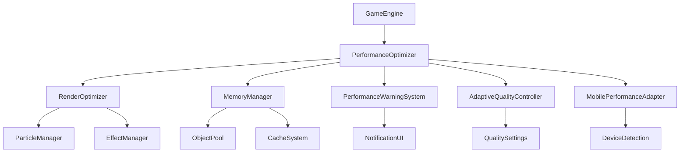

# Design Document

## Overview

This design document outlines the improvements to the performance optimization system for the Bubble Pop Web Game. The system will enhance stability, reduce memory usage, improve frame rate consistency, and provide better performance monitoring and automatic quality adjustment capabilities.

## Architecture

### Core Components

1. **Enhanced PerformanceOptimizer** - Central performance management with improved stability
2. **Advanced RenderOptimizer** - Optimized rendering with better dirty region management
3. **Intelligent MemoryManager** - Proactive memory management with leak detection
4. **Performance Warning System** - Real-time performance monitoring and user notifications
5. **Adaptive Quality Controller** - Intelligent quality adjustment based on performance metrics
6. **Mobile Performance Adapter** - Device-specific optimizations for mobile platforms

### System Integration



## Components and Interfaces

### Enhanced PerformanceOptimizer

**Purpose:** Central performance management with improved stability and monitoring

**Key Improvements:**
- Frame time variance analysis and stabilization
- Predictive performance adjustment
- Enhanced statistics collection
- Better integration with configuration system

**Interface:**
```javascript
class EnhancedPerformanceOptimizer {
    // Stability improvements
    analyzeFrameStability()
    stabilizeFrameRate()
    predictPerformanceIssues()
    
    // Enhanced monitoring
    getDetailedPerformanceMetrics()
    generatePerformanceReport()
    detectPerformanceBottlenecks()
    
    // Improved quality management
    applyIntelligentQualityAdjustment()
    validateQualitySettings()
    optimizeForDevice()
}
```

### Advanced RenderOptimizer

**Purpose:** Optimized rendering with better dirty region management and layer optimization

**Key Improvements:**
- Improved dirty region calculation and merging
- Enhanced viewport culling
- Better layer management
- Optimized canvas operations

**Interface:**
```javascript
class AdvancedRenderOptimizer {
    // Enhanced dirty region management
    calculateOptimalDirtyRegions()
    mergeDirtyRegions()
    optimizeDirtyRegionSize()
    
    // Improved culling
    performIntelligentCulling()
    updateViewportBounds()
    cullOffscreenObjects()
    
    // Layer optimization
    optimizeLayerComposition()
    reorderLayersForPerformance()
    cacheStaticLayers()
}
```

### Intelligent MemoryManager

**Purpose:** Proactive memory management with leak detection and automatic cleanup

**Key Improvements:**
- Advanced memory leak detection
- Intelligent garbage collection timing
- Object pool optimization
- Memory pressure monitoring

**Interface:**
```javascript
class IntelligentMemoryManager {
    // Memory leak detection
    detectMemoryLeaks()
    analyzeMemoryUsagePatterns()
    identifyLeakSources()
    
    // Proactive cleanup
    scheduleIntelligentCleanup()
    optimizeGarbageCollection()
    cleanupUnusedResources()
    
    // Memory pressure handling
    monitorMemoryPressure()
    handleMemoryWarnings()
    prioritizeMemoryUsage()
}
```

### Performance Warning System

**Purpose:** Real-time performance monitoring and user notifications

**Key Features:**
- Real-time performance metric monitoring
- Intelligent warning thresholds
- User-friendly notification system
- Performance suggestion engine

**Interface:**
```javascript
class PerformanceWarningSystem {
    // Warning management
    checkPerformanceThresholds()
    generateWarningMessages()
    displayPerformanceWarnings()
    
    // Suggestion system
    generateOptimizationSuggestions()
    provideTroubleshootingSteps()
    recommendQualitySettings()
}
```

### Adaptive Quality Controller

**Purpose:** Intelligent quality adjustment based on performance metrics

**Key Features:**
- Gradual quality adjustment
- Performance-based decision making
- Visual consistency maintenance
- User preference respect

**Interface:**
```javascript
class AdaptiveQualityController {
    // Quality adjustment
    adjustQualityBasedOnPerformance()
    graduallyIncreaseQuality()
    maintainVisualConsistency()
    
    // Decision making
    analyzePerformanceMetrics()
    calculateOptimalQuality()
    validateQualityChanges()
}
```

### Mobile Performance Adapter

**Purpose:** Device-specific optimizations for mobile platforms

**Key Features:**
- Device capability detection
- Mobile-specific optimizations
- Touch interaction optimization
- Battery usage consideration

**Interface:**
```javascript
class MobilePerformanceAdapter {
    // Device detection
    detectDeviceCapabilities()
    identifyPerformanceLimitations()
    assessBatteryStatus()
    
    // Mobile optimizations
    applyMobileOptimizations()
    optimizeForTouchInteractions()
    reduceBatteryUsage()
}
```

## Data Models

### Performance Metrics Model

```javascript
const PerformanceMetrics = {
    frameRate: {
        current: Number,
        average: Number,
        minimum: Number,
        maximum: Number,
        variance: Number,
        stability: Number
    },
    memory: {
        used: Number,
        total: Number,
        peak: Number,
        leakCount: Number,
        gcFrequency: Number
    },
    rendering: {
        drawCalls: Number,
        culledObjects: Number,
        dirtyRegions: Number,
        layerUpdates: Number
    },
    quality: {
        current: String,
        automatic: Boolean,
        adjustmentCount: Number,
        lastAdjustment: Date
    }
};
```

### Warning Configuration Model

```javascript
const WarningConfiguration = {
    thresholds: {
        fps: {
            warning: 45,
            critical: 30
        },
        memory: {
            warning: 0.8,
            critical: 0.95
        },
        frameVariance: {
            warning: 5,
            critical: 10
        }
    },
    notifications: {
        enabled: Boolean,
        duration: Number,
        position: String,
        style: String
    }
};
```

### Quality Settings Model

```javascript
const QualitySettings = {
    levels: {
        low: {
            renderQuality: 0.7,
            particleQuality: 0.3,
            effectQuality: 0.2,
            maxBubbles: 10,
            maxParticles: 100
        },
        medium: {
            renderQuality: 0.85,
            particleQuality: 0.6,
            effectQuality: 0.6,
            maxBubbles: 15,
            maxParticles: 300
        },
        high: {
            renderQuality: 1.0,
            particleQuality: 1.0,
            effectQuality: 1.0,
            maxBubbles: 20,
            maxParticles: 500
        }
    },
    adaptive: {
        enabled: Boolean,
        sensitivity: Number,
        adjustmentDelay: Number
    }
};
```

## Error Handling

### Performance Error Categories

1. **Frame Rate Errors**
   - Severe frame drops
   - Unstable frame timing
   - Performance degradation

2. **Memory Errors**
   - Memory leaks
   - Out of memory conditions
   - Garbage collection failures

3. **Rendering Errors**
   - Canvas context loss
   - Rendering failures
   - Layer composition errors

### Error Recovery Strategies

1. **Graceful Degradation**
   - Automatic quality reduction
   - Feature disabling
   - Fallback rendering modes

2. **Resource Recovery**
   - Memory cleanup
   - Object pool reset
   - Cache clearing

3. **User Communication**
   - Clear error messages
   - Recovery suggestions
   - Performance recommendations

## Testing Strategy

### Performance Test Categories

1. **Stability Tests**
   - Frame rate consistency
   - Memory usage stability
   - Long-running performance

2. **Load Tests**
   - High particle count scenarios
   - Multiple effect combinations
   - Memory pressure situations

3. **Regression Tests**
   - Performance baseline comparison
   - Quality setting validation
   - Mobile device compatibility

4. **Integration Tests**
   - Component interaction testing
   - Configuration system integration
   - Error handling validation

### Test Implementation

1. **Automated Performance Tests**
   - Continuous performance monitoring
   - Regression detection
   - Performance benchmarking

2. **Manual Testing Scenarios**
   - Device-specific testing
   - User experience validation
   - Edge case verification

3. **Performance Profiling**
   - Memory usage profiling
   - CPU usage analysis
   - Rendering performance measurement

### Success Criteria

1. **Performance Targets**
   - Maintain 60FPS in 95% of scenarios
   - Reduce memory usage by 20%
   - Achieve 15% rendering performance improvement

2. **Stability Targets**
   - Frame variance below 5ms
   - Zero memory leaks in 24-hour test
   - Automatic recovery from performance issues

3. **User Experience Targets**
   - Performance warnings appear within 2 seconds
   - Quality adjustments complete within 1 second
   - Mobile performance matches desktop within 10%

## Implementation Phases

### Phase 1: Core Stability Improvements
- Enhanced PerformanceOptimizer implementation
- Frame stability analysis and correction
- Basic performance warning system

### Phase 2: Memory Management Enhancement
- Intelligent MemoryManager implementation
- Advanced leak detection
- Proactive cleanup mechanisms

### Phase 3: Rendering Optimization
- Advanced RenderOptimizer improvements
- Enhanced dirty region management
- Layer optimization

### Phase 4: Adaptive Quality System
- Adaptive Quality Controller implementation
- Intelligent quality adjustment
- Performance-based decision making

### Phase 5: Mobile Optimization
- Mobile Performance Adapter implementation
- Device-specific optimizations
- Touch interaction improvements

### Phase 6: Testing and Validation
- Comprehensive test suite implementation
- Performance regression testing
- User acceptance testing