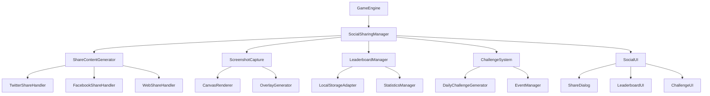

# ソーシャル機能: スコア共有とコミュニティ機能 - 設計書

## 概要

本設計書では、BubblePopゲームにソーシャル機能を統合するためのアーキテクチャと実装方針を定義します。既存のゲームエンジン、統計システム、実績システムとの連携を重視し、パフォーマンスとユーザビリティを両立させます。

## アーキテクチャ

### システム構成図



### コンポーネント設計

#### 1. SocialSharingManager (メインコントローラー)
- **責任**: ソーシャル機能全体の統合管理
- **依存関係**: GameEngine, StatisticsManager, AchievementManager
- **主要メソッド**:
  - `initialize()`: システム初期化
  - `shareScore(scoreData)`: スコア共有
  - `shareAchievement(achievementData)`: 実績共有
  - `captureAndShare()`: スクリーンショット共有

#### 2. ShareContentGenerator (コンテンツ生成)
- **責任**: 共有用コンテンツの生成とフォーマット
- **機能**:
  - メッセージテンプレート管理
  - 多言語対応
  - プラットフォーム別最適化
- **主要メソッド**:
  - `generateScoreMessage(score, platform)`: スコア共有メッセージ生成
  - `generateAchievementMessage(achievement, platform)`: 実績共有メッセージ生成
  - `customizeMessage(template, data)`: カスタムメッセージ生成

#### 3. ScreenshotCapture (スクリーンショット機能)
- **責任**: ゲーム画面のキャプチャと画像生成
- **技術仕様**:
  - Canvas API使用
  - 出力解像度: 1200x630 (OG画像標準)
  - フォーマット: PNG/JPEG
- **主要メソッド**:
  - `captureGameScreen()`: ゲーム画面キャプチャ
  - `addScoreOverlay(canvas, scoreData)`: スコア情報オーバーレイ
  - `addWatermark(canvas)`: ウォーターマーク追加
  - `exportImage(format, quality)`: 画像エクスポート

#### 4. LeaderboardManager (リーダーボード管理)
- **責任**: ランキングデータの管理と表示
- **データ構造**:
  ```javascript
  {
    daily: { scores: [], lastUpdate: timestamp },
    weekly: { scores: [], lastUpdate: timestamp },
    monthly: { scores: [], lastUpdate: timestamp },
    allTime: { scores: [], lastUpdate: timestamp },
    byStage: { [stageId]: { scores: [], lastUpdate: timestamp } }
  }
  ```
- **主要メソッド**:
  - `updateScore(score, stageId)`: スコア更新
  - `getRanking(period, stageId)`: ランキング取得
  - `getPlayerRank(playerId, period)`: プレイヤー順位取得

#### 5. ChallengeSystem (チャレンジシステム)
- **責任**: デイリー/ウィークリーチャレンジの管理
- **チャレンジタイプ**:
  - Daily: 毎日更新される短期目標
  - Weekly: 週単位の中期目標
  - Event: 期間限定の特別チャレンジ
  - Community: 全プレイヤー共通目標
- **主要メソッド**:
  - `generateDailyChallenge()`: デイリーチャレンジ生成
  - `checkProgress(challengeId, playerData)`: 進捗確認
  - `claimReward(challengeId)`: 報酬受け取り

## コンポーネントと インターフェース

### ShareContentGenerator インターフェース

```javascript
class ShareContentGenerator {
    constructor(localizationManager) {
        this.localizationManager = localizationManager;
        this.templates = this.initializeTemplates();
    }
    
    // メッセージテンプレート
    initializeTemplates() {
        return {
            score: {
                twitter: "BubblePopで{score}点を達成！ あなたも挑戦してみませんか？ #BubblePop #ゲーム {url}",
                facebook: "BubblePopで{score}点を達成しました！",
                generic: "BubblePopで{score}点を達成！"
            },
            achievement: {
                twitter: "BubblePopで実績「{name}」を解除！ {description} #BubblePop #実績 {url}",
                facebook: "BubblePopで新しい実績を解除しました！",
                generic: "実績「{name}」を解除しました！"
            }
        };
    }
}
```

### ScreenshotCapture インターフェース

```javascript
class ScreenshotCapture {
    constructor(gameEngine) {
        this.gameEngine = gameEngine;
        this.canvas = gameEngine.canvas;
        this.overlayCanvas = document.createElement('canvas');
    }
    
    async captureGameScreen() {
        // 1. ゲーム画面をキャプチャ
        const gameImageData = this.canvas.toDataURL('image/png');
        
        // 2. オーバーレイ用キャンバス準備
        this.setupOverlayCanvas();
        
        // 3. スコア情報オーバーレイ追加
        await this.addScoreOverlay();
        
        // 4. ウォーターマーク追加
        await this.addWatermark();
        
        // 5. 最終画像生成
        return this.exportFinalImage();
    }
}
```

## データモデル

### ShareData モデル
```javascript
const ShareData = {
    type: 'score' | 'achievement' | 'challenge',
    content: {
        score?: number,
        achievement?: AchievementData,
        challenge?: ChallengeData
    },
    metadata: {
        timestamp: number,
        gameVersion: string,
        platform: string
    },
    customization: {
        message?: string,
        includeScreenshot: boolean,
        privacy: 'public' | 'friends' | 'private'
    }
};
```

### LeaderboardEntry モデル
```javascript
const LeaderboardEntry = {
    id: string,
    playerName: string,
    score: number,
    timestamp: number,
    stageId: string,
    metadata: {
        combo: number,
        accuracy: number,
        playTime: number
    }
};
```

### Challenge モデル
```javascript
const Challenge = {
    id: string,
    type: 'daily' | 'weekly' | 'event' | 'community',
    name: string,
    description: string,
    requirements: {
        type: string,
        target: number,
        conditions?: object
    },
    rewards: {
        ap: number,
        items?: string[],
        achievements?: string[]
    },
    period: {
        start: number,
        end: number
    },
    progress: {
        current: number,
        completed: boolean
    }
};
```

## エラーハンドリング

### エラー分類と対応

1. **Web Share API 非対応**
   - フォールバック: カスタム共有ダイアログ
   - 対象ブラウザ: 古いブラウザ、デスクトップブラウザ

2. **スクリーンショット生成失敗**
   - フォールバック: デフォルト画像使用
   - ログ記録: エラー詳細をローカルに保存

3. **ストレージ容量不足**
   - 対応: 古いデータの自動削除
   - 通知: ユーザーへの警告表示

4. **ネットワークエラー**
   - 対応: オフライン対応、後で再試行
   - UI: 適切なエラーメッセージ表示

### エラーハンドリング実装

```javascript
class SocialErrorHandler {
    static handleShareError(error, context) {
        switch (error.type) {
            case 'WEB_SHARE_NOT_SUPPORTED':
                return this.showCustomShareDialog(context);
            case 'SCREENSHOT_FAILED':
                return this.useDefaultImage(context);
            case 'STORAGE_FULL':
                return this.cleanupOldData();
            default:
                return this.showGenericError(error);
        }
    }
}
```

## テスト戦略

### 単体テスト
- ShareContentGenerator: メッセージ生成ロジック
- ScreenshotCapture: 画像生成機能
- LeaderboardManager: ランキング計算
- ChallengeSystem: チャレンジ進捗管理

### 統合テスト
- ゲームエンジンとの連携
- 既存システム（統計、実績）との連携
- UI コンポーネント間の連携

### E2Eテスト
- 共有フロー全体のテスト
- 異なるブラウザでの動作確認
- モバイルデバイスでの動作確認

### パフォーマンステスト
- スクリーンショット生成時間測定
- メモリ使用量監視
- UI応答性テスト

## セキュリティ考慮事項

### プライバシー保護
1. **データの最小化**: 必要最小限の情報のみ共有
2. **ユーザー同意**: 明示的なオプトイン
3. **データ暗号化**: ローカルストレージの暗号化
4. **匿名化**: 個人識別情報の除去

### セキュリティ実装
```javascript
class PrivacyManager {
    static sanitizeShareData(data) {
        // 個人情報の除去
        const sanitized = { ...data };
        delete sanitized.personalInfo;
        delete sanitized.deviceInfo;
        return sanitized;
    }
    
    static validateShareContent(content) {
        // 不適切なコンテンツのチェック
        return this.contentFilter.validate(content);
    }
}
```

## パフォーマンス最適化

### 最適化戦略
1. **遅延読み込み**: 必要時のみコンポーネント読み込み
2. **キャッシュ活用**: 生成済みコンテンツの再利用
3. **バッチ処理**: 複数操作の一括実行
4. **メモリ管理**: 不要なオブジェクトの適切な解放

### 実装例
```javascript
class PerformanceOptimizer {
    constructor() {
        this.cache = new Map();
        this.batchQueue = [];
        this.batchTimer = null;
    }
    
    // キャッシュ機能
    getCachedContent(key) {
        return this.cache.get(key);
    }
    
    setCachedContent(key, content, ttl = 300000) {
        this.cache.set(key, { content, expires: Date.now() + ttl });
    }
    
    // バッチ処理
    addToBatch(operation) {
        this.batchQueue.push(operation);
        this.scheduleBatchExecution();
    }
}
```

## 国際化対応

### 多言語サポート
- 対応言語: 日本語、英語、中国語（簡体字・繁体字）、韓国語
- メッセージテンプレート: 言語別テンプレート管理
- 文化的配慮: 地域別のソーシャルメディア対応

### 実装方針
```javascript
class SocialI18nManager {
    constructor(localizationManager) {
        this.localizationManager = localizationManager;
        this.platformTemplates = this.loadPlatformTemplates();
    }
    
    getLocalizedShareMessage(type, data, platform, locale) {
        const template = this.platformTemplates[platform][type][locale];
        return this.localizationManager.format(template, data);
    }
}
```

## 展開計画

### フェーズ1: 基本共有機能
- Web Share API実装
- スクリーンショット機能
- 基本的なメッセージ生成

### フェーズ2: リーダーボード
- ローカルランキング
- 期間別ランキング
- ステージ別ランキング

### フェーズ3: チャレンジシステム
- デイリーチャレンジ
- ウィークリーチャレンジ
- 報酬システム

### フェーズ4: 高度な機能
- 期間限定イベント
- コミュニティチャレンジ
- 分析機能

この設計に基づいて、段階的に実装を進めることで、安定性とパフォーマンスを確保しながらソーシャル機能を提供できます。