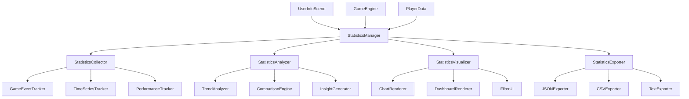

# 統計システム強化 - 設計書

## 概要

現在のStatisticsManagerを拡張し、詳細な統計収集、データ可視化、時系列分析、エクスポート機能を実装する。既存のCanvas 2D APIベースの描画システムと統合し、パフォーマンスを最適化した統計システムを構築する。

## アーキテクチャ

### システム構成



### コンポーネント設計

#### 1. StatisticsManager（拡張）

既存のStatisticsManagerを拡張し、新機能を統合する中核クラス。

```javascript
class StatisticsManager {
    constructor(gameEngine) {
        // 既存プロパティ
        this.gameEngine = gameEngine;
        this.statistics = this.initializeStatistics();
        this.sessionStats = this.initializeSessionStats();
        
        // 新規コンポーネント
        this.collector = new StatisticsCollector(this);
        this.analyzer = new StatisticsAnalyzer(this);
        this.visualizer = new StatisticsVisualizer(this);
        this.exporter = new StatisticsExporter(this);
        
        // 時系列データ管理
        this.timeSeriesData = new TimeSeriesDataManager();
        
        // フィルター・検索機能
        this.filterManager = new StatisticsFilterManager();
        
        // パフォーマンス最適化
        this.performanceOptimizer = new StatisticsPerformanceOptimizer();
    }
}
```

#### 2. StatisticsCollector

統計データの収集を担当する新規クラス。

```javascript
class StatisticsCollector {
    constructor(statisticsManager) {
        this.statisticsManager = statisticsManager;
        this.eventQueue = [];
        this.batchSize = 100;
        this.flushInterval = 1000; // 1秒
        
        this.setupEventListeners();
        this.startBatchProcessing();
    }
    
    // 非同期バッチ処理でパフォーマンス最適化
    collectEvent(eventType, data) {
        this.eventQueue.push({
            type: eventType,
            data: data,
            timestamp: Date.now()
        });
        
        if (this.eventQueue.length >= this.batchSize) {
            this.flushEvents();
        }
    }
}
```

#### 3. StatisticsAnalyzer

統計データの分析・洞察生成を担当する新規クラス。

```javascript
class StatisticsAnalyzer {
    constructor(statisticsManager) {
        this.statisticsManager = statisticsManager;
        this.trendAnalyzer = new TrendAnalyzer();
        this.comparisonEngine = new ComparisonEngine();
        this.insightGenerator = new InsightGenerator();
    }
    
    // トレンド分析
    analyzeTrends(timeRange) {
        return this.trendAnalyzer.analyze(
            this.statisticsManager.getTimeSeriesData(timeRange)
        );
    }
    
    // 比較分析
    comparePerformance(period1, period2) {
        return this.comparisonEngine.compare(
            this.getStatisticsForPeriod(period1),
            this.getStatisticsForPeriod(period2)
        );
    }
    
    // 洞察生成
    generateInsights() {
        return this.insightGenerator.generate(
            this.statisticsManager.getDetailedStatistics()
        );
    }
}
```

#### 4. StatisticsVisualizer

統計データの可視化を担当する新規クラス。

```javascript
class StatisticsVisualizer {
    constructor(statisticsManager) {
        this.statisticsManager = statisticsManager;
        this.chartRenderer = new ChartRenderer();
        this.dashboardRenderer = new DashboardRenderer();
        this.animationManager = new AnimationManager();
        
        // レスポンシブ対応
        this.responsiveManager = new ResponsiveLayoutManager();
    }
    
    // グラフ描画
    renderChart(context, type, data, options) {
        return this.chartRenderer.render(context, type, data, options);
    }
    
    // ダッシュボード描画
    renderDashboard(context, x, y, width, height) {
        return this.dashboardRenderer.render(context, x, y, width, height);
    }
}
```

#### 5. TimeSeriesDataManager

時系列データの管理を担当する新規クラス。

```javascript
class TimeSeriesDataManager {
    constructor() {
        this.dailyData = new Map();
        this.weeklyData = new Map();
        this.monthlyData = new Map();
        
        // データ圧縮・アーカイブ
        this.compressionManager = new DataCompressionManager();
        this.archiveManager = new DataArchiveManager();
    }
    
    // データポイント追加
    addDataPoint(timestamp, category, value) {
        const date = new Date(timestamp);
        const dayKey = this.getDayKey(date);
        const weekKey = this.getWeekKey(date);
        const monthKey = this.getMonthKey(date);
        
        this.updateTimeSeriesData(this.dailyData, dayKey, category, value);
        this.updateTimeSeriesData(this.weeklyData, weekKey, category, value);
        this.updateTimeSeriesData(this.monthlyData, monthKey, category, value);
    }
}
```

### データモデル設計

#### 拡張統計データ構造

```javascript
const enhancedStatistics = {
    // 既存の基本統計（拡張）
    basic: {
        totalGamesPlayed: 0,
        totalPlayTime: 0,
        totalScore: 0,
        highestScore: 0,
        averageScore: 0,
        completionRate: 0,
        // 新規追加
        longestSession: 0,
        shortestSession: Infinity,
        averageSessionLength: 0,
        sessionsToday: 0,
        scoreDistribution: {
            '0-1000': 0,
            '1001-5000': 0,
            '5001-10000': 0,
            '10001-25000': 0,
            '25001+': 0
        }
    },
    
    // 時系列データ（新規）
    timeSeries: {
        daily: {
            playTime: [],
            gamesPlayed: [],
            averageScore: [],
            highScore: [],
            bubblesPopped: []
        },
        weekly: {
            totalPlayTime: [],
            achievementsUnlocked: [],
            scoreImprovement: []
        },
        monthly: {
            overallStats: [],
            growthTrends: [],
            highlights: []
        }
    },
    
    // 詳細泡統計（拡張）
    bubbles: {
        // 既存データ
        totalPopped: 0,
        totalMissed: 0,
        accuracy: 0,
        typeBreakdown: {},
        
        // 新規追加
        efficiencyStats: {
            bubblesPerMinute: 0,
            bubblesPerSecond: 0,
            peakEfficiency: 0,
            efficiencyTrend: []
        },
        reactionTimeStats: {
            average: 0,
            fastest: Infinity,
            slowest: 0,
            distribution: []
        },
        specialEffectStats: {
            rainbowActivations: 0,
            clockActivations: 0,
            chainReactions: 0,
            explosions: 0
        }
    },
    
    // プレイスタイル分析（新規）
    playStyle: {
        clickPattern: {
            clicksPerMinute: 0,
            burstClicking: 0,
            steadyClicking: 0,
            pauseFrequency: 0
        },
        strategyAnalysis: {
            priorityTargeting: 0, // 特殊泡を優先する傾向
            comboFocus: 0,        // コンボを重視する傾向
            survivalFocus: 0      // 生存を重視する傾向
        },
        adaptability: {
            difficultyAdjustment: 0,
            learningCurve: 0,
            consistencyScore: 0
        }
    },
    
    // 成長指標（新規）
    growth: {
        scoreImprovement: {
            daily: 0,
            weekly: 0,
            monthly: 0,
            trend: 'improving' // 'improving', 'stable', 'declining'
        },
        skillImprovement: {
            accuracyImprovement: 0,
            speedImprovement: 0,
            consistencyImprovement: 0
        },
        milestones: [
            {
                date: Date,
                type: 'score_milestone',
                value: 10000,
                description: '初回10,000点達成'
            }
        ]
    }
};
```

### UI/UX設計

#### 統計ダッシュボード

```javascript
class StatisticsDashboard {
    constructor(statisticsManager) {
        this.statisticsManager = statisticsManager;
        this.layout = new DashboardLayout();
        this.widgets = new Map();
        
        this.initializeWidgets();
    }
    
    initializeWidgets() {
        // 主要指標ウィジェット
        this.widgets.set('overview', new OverviewWidget());
        this.widgets.set('trends', new TrendsWidget());
        this.widgets.set('achievements', new AchievementsWidget());
        this.widgets.set('playstyle', new PlayStyleWidget());
        
        // グラフウィジェット
        this.widgets.set('scoreChart', new ScoreChartWidget());
        this.widgets.set('bubbleChart', new BubbleChartWidget());
        this.widgets.set('timeChart', new TimeChartWidget());
    }
}
```

#### グラフ描画システム

```javascript
class ChartRenderer {
    constructor() {
        this.chartTypes = {
            bar: new BarChartRenderer(),
            line: new LineChartRenderer(),
            pie: new PieChartRenderer(),
            area: new AreaChartRenderer(),
            scatter: new ScatterChartRenderer()
        };
        
        this.animationEngine = new ChartAnimationEngine();
        this.interactionManager = new ChartInteractionManager();
    }
    
    render(context, type, data, options) {
        const renderer = this.chartTypes[type];
        if (!renderer) {
            throw new Error(`Unsupported chart type: ${type}`);
        }
        
        // アニメーション対応
        if (options.animated) {
            return this.animationEngine.animateChart(
                context, renderer, data, options
            );
        }
        
        return renderer.render(context, data, options);
    }
}
```

### パフォーマンス最適化

#### データ収集最適化

1. **バッチ処理**: イベントをキューに蓄積し、定期的にバッチ処理
2. **非同期処理**: Web Workersを使用した重い計算の分離
3. **データ圧縮**: 古いデータの圧縮・アーカイブ
4. **キャッシュ戦略**: 計算結果のキャッシュとインクリメンタル更新

```javascript
class StatisticsPerformanceOptimizer {
    constructor() {
        this.worker = new Worker('statistics-worker.js');
        this.cache = new LRUCache(1000);
        this.compressionThreshold = 10000; // データポイント数
    }
    
    optimizeDataCollection() {
        // バッチ処理の最適化
        this.setupBatchProcessing();
        
        // メモリ使用量の監視
        this.setupMemoryMonitoring();
        
        // データ圧縮の自動実行
        this.setupAutoCompression();
    }
}
```

#### 描画最適化

1. **Canvas最適化**: オフスクリーンキャンバスの活用
2. **レンダリング最適化**: 差分更新とビューポートカリング
3. **アニメーション最適化**: requestAnimationFrameの効率的な使用

```javascript
class RenderingOptimizer {
    constructor() {
        this.offscreenCanvas = new OffscreenCanvas(800, 600);
        this.offscreenContext = this.offscreenCanvas.getContext('2d');
        this.dirtyRegions = new Set();
    }
    
    optimizeRendering(context, renderFunction) {
        // オフスクリーンレンダリング
        renderFunction(this.offscreenContext);
        
        // メインキャンバスに転送
        context.drawImage(this.offscreenCanvas, 0, 0);
    }
}
```

### エラーハンドリング

#### 統計システム専用エラーハンドリング

```javascript
class StatisticsErrorHandler {
    constructor() {
        this.errorTypes = {
            DATA_CORRUPTION: 'データ破損',
            STORAGE_FULL: 'ストレージ容量不足',
            CALCULATION_ERROR: '計算エラー',
            RENDERING_ERROR: '描画エラー'
        };
    }
    
    handleError(error, context) {
        console.error(`Statistics Error [${context}]:`, error);
        
        // エラーの種類に応じた復旧処理
        switch (error.type) {
            case 'DATA_CORRUPTION':
                this.recoverFromDataCorruption();
                break;
            case 'STORAGE_FULL':
                this.cleanupOldData();
                break;
            default:
                this.fallbackToSafeMode();
        }
    }
}
```

### テスト戦略

#### 単体テスト

- StatisticsCollectorのイベント収集テスト
- StatisticsAnalyzerの分析ロジックテスト
- ChartRendererの描画テスト
- TimeSeriesDataManagerのデータ管理テスト

#### 統合テスト

- StatisticsManagerと他システムの連携テスト
- UserInfoSceneでの統計表示テスト
- パフォーマンステスト（大量データ処理）

#### E2Eテスト

- 統計データの収集から表示までの全フローテスト
- エクスポート・インポート機能のテスト
- レスポンシブ表示のテスト

### セキュリティ考慮事項

1. **データ検証**: 統計データの整合性チェック
2. **プライバシー**: 個人識別可能な情報の除外
3. **データサニタイゼーション**: エクスポートデータの安全性確保

### 国際化対応

統計項目名、グラフラベル、エラーメッセージの多言語対応を実装。

```javascript
const statisticsI18n = {
    ja: {
        totalGames: '総プレイ回数',
        averageScore: '平均スコア',
        bubbleAccuracy: '泡の精度'
    },
    en: {
        totalGames: 'Total Games',
        averageScore: 'Average Score',
        bubbleAccuracy: 'Bubble Accuracy'
    }
};
```

## 実装優先度

1. **高優先度**: StatisticsCollector、基本的なグラフ描画
2. **中優先度**: 時系列分析、ダッシュボード、エクスポート機能
3. **低優先度**: 高度な分析機能、アニメーション、国際化