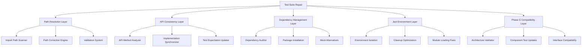

# Design Document

## Overview

This design addresses the test suite repair issue identified in GitHub Issue #106, where 15 out of 114 test files are failing due to structural problems following the Phase G file splitting project. The solution involves a systematic approach to fix module path inconsistencies, resolve API method mismatches, install missing dependencies, stabilize Jest environment issues, and ensure compatibility with the new Phase G architecture. The design prioritizes minimal disruption to existing workflows while achieving 95%+ test success rate.

## Architecture

### Current Test Infrastructure Analysis

The project currently uses:
- **Jest 29.7.0** with ES Modules support via `NODE_OPTIONS='--experimental-vm-modules'`
- **Node.js v22.14.0** with ES Modules (`"type": "module"`)
- **jsdom** test environment for DOM simulation
- **Phase G split architecture** with component-based file organization

### Problem Categories Identified

1. **Module Path Inconsistencies**: Import paths broken after Phase G file reorganization
2. **API Method Mismatches**: Tests expecting methods that don't exist in refactored implementations
3. **Missing Dependencies**: Required packages not installed (fake-indexeddb, inquirer)
4. **Jest Environment Issues**: ES Modules + Jest environment teardown problems
5. **Post-Phase G Compatibility**: Tests not updated for new architecture

### Solution Architecture



## Components and Interfaces

### 1. Module Path Resolution System

#### Path Scanner and Corrector
```javascript
// tools/test-path-resolver.js
export class TestPathResolver {
  static scanImportPaths(testDirectory) {
    // Scan all test files for import statements
    // Identify broken paths
    // Generate correction mapping
  }
  
  static correctImportPaths(filePath, corrections) {
    // Apply path corrections to test files
    // Update relative paths based on new file structure
    // Validate corrected paths exist
  }
  
  static validatePaths(testFiles) {
    // Verify all import paths resolve correctly
    // Report remaining broken paths
    // Generate validation report
  }
}
```

#### Path Mapping Configuration
```javascript
// tests/config/path-mappings.js
export const PATH_CORRECTIONS = {
  // Common path corrections after Phase G
  'ErrorHandler.js': {
    from: '../../src/utils/ErrorHandler.js',
    to: '../../src/utils/ErrorHandler.js',
    verify: true
  },
  'PerformanceOptimizer.js': {
    from: '../../src/utils/PerformanceOptimizer.js', 
    to: '../../src/utils/PerformanceOptimizer.js',
    verify: true
  },
  'MockFactory.js': {
    from: '../utils/MockFactory.js',
    to: '../mocks/MockFactory.js',
    verify: true
  }
};
```

### 2. API Consistency Resolution System

#### API Method Analyzer
```javascript
// tools/api-consistency-analyzer.js
export class APIConsistencyAnalyzer {
  static analyzeTestExpectations(testFiles) {
    // Parse test files for expected method calls
    // Extract API expectations from test assertions
    // Generate expected API interface
  }
  
  static analyzeImplementations(sourceFiles) {
    // Parse implementation files for actual methods
    // Extract actual API interfaces
    // Generate implementation interface
  }
  
  static generateConsistencyReport(expected, actual) {
    // Compare expected vs actual APIs
    // Identify missing methods
    // Generate implementation tasks
  }
}
```

#### Implementation Synchronizer
```javascript
// tools/implementation-synchronizer.js
export class ImplementationSynchronizer {
  static addMissingMethods(className, missingMethods) {
    // Add missing methods to implementation classes
    // Generate method stubs with proper signatures
    // Maintain existing functionality
  }
  
  static updateTestExpectations(testFile, apiChanges) {
    // Update test expectations to match actual APIs
    // Preserve test intent while fixing method calls
    // Update assertions for new interfaces
  }
}
```

### 3. Dependency Management System

#### Dependency Auditor
```javascript
// tools/dependency-auditor.js
export class DependencyAuditor {
  static auditTestDependencies(testFiles) {
    // Scan test files for required packages
    // Check package.json for missing dependencies
    // Identify unused dependencies
  }
  
  static generateInstallationPlan(missingDeps) {
    // Create plan for installing missing packages
    // Determine if dependencies are actually needed
    // Suggest mock alternatives where appropriate
  }
  
  static validateDependencies() {
    // Verify all dependencies are properly installed
    // Check version compatibility
    // Test import resolution
  }
}
```

#### Mock Alternative System
```javascript
// tests/mocks/DependencyMocks.js
export class DependencyMocks {
  static createFakeIndexedDBMock() {
    // Create lightweight IndexedDB mock
    // Provide essential IndexedDB API
    // Avoid external dependency
  }
  
  static createInquirerMock() {
    // Create inquirer mock for test scenarios
    // Provide prompt simulation
    // Return predictable responses
  }
}
```

### 4. Jest Environment Stabilization

#### Environment Isolation Manager
```javascript
// tests/utils/EnvironmentManager.js
export class EnvironmentManager {
  static setupTestEnvironment() {
    // Initialize test environment properly
    // Set up module loading context
    // Configure ES Modules support
  }
  
  static cleanupTestEnvironment() {
    // Proper cleanup after test completion
    // Prevent import after teardown
    // Release resources correctly
  }
  
  static isolateTestExecution(testFn) {
    // Wrap test execution with proper isolation
    // Handle async operations correctly
    // Prevent environment conflicts
  }
}
```

#### Module Loading Optimizer
```javascript
// tests/utils/ModuleLoadingOptimizer.js
export class ModuleLoadingOptimizer {
  static optimizeESModuleLoading() {
    // Optimize ES Module loading for Jest
    // Handle dynamic imports correctly
    // Prevent loading conflicts
  }
  
  static handleAsyncModuleCleanup() {
    // Ensure async modules are cleaned up properly
    // Prevent memory leaks
    // Handle Promise-based module loading
  }
}
```

### 5. Phase G Compatibility System

#### Architecture Validator
```javascript
// tools/phase-g-validator.js
export class PhaseGValidator {
  static validateComponentStructure(componentPath) {
    // Validate new component architecture
    // Check component interface compliance
    // Verify component interactions
  }
  
  static validateSplitModules(moduleMapping) {
    // Validate split module structure
    // Check module dependencies
    // Verify interface consistency
  }
  
  static generateCompatibilityReport() {
    // Generate report on Phase G compatibility
    // Identify remaining compatibility issues
    // Suggest fixes for incompatibilities
  }
}
```

#### Component Test Updater
```javascript
// tools/component-test-updater.js
export class ComponentTestUpdater {
  static updateComponentTests(componentPath) {
    // Update tests for new component structure
    // Adapt test patterns for component architecture
    // Maintain test coverage
  }
  
  static updateInterfaceTests(interfaceChanges) {
    // Update tests for changed interfaces
    // Preserve test intent
    // Add tests for new interface features
  }
}
```

## Data Models

### Test Repair Configuration
```javascript
export interface TestRepairConfig {
  pathCorrections: PathCorrection[];
  apiConsistencyRules: APIConsistencyRule[];
  dependencyResolution: DependencyResolution;
  environmentSettings: EnvironmentSettings;
  phaseGCompatibility: PhaseGCompatibilitySettings;
}
```

### Path Correction Model
```javascript
export interface PathCorrection {
  pattern: string;
  fromPath: string;
  toPath: string;
  fileTypes: string[];
  verify: boolean;
  backup: boolean;
}
```

### API Consistency Model
```javascript
export interface APIConsistencyRule {
  className: string;
  expectedMethods: MethodSignature[];
  actualMethods: MethodSignature[];
  missingMethods: MethodSignature[];
  resolutionStrategy: 'implement' | 'update_test' | 'mock';
}
```

### Dependency Resolution Model
```javascript
export interface DependencyResolution {
  missingPackages: PackageInfo[];
  installationPlan: InstallationStep[];
  mockAlternatives: MockAlternative[];
  validationSteps: ValidationStep[];
}
```

## Error Handling

### Path Resolution Error Handling
```javascript
// tools/error-handlers/PathResolutionErrorHandler.js
export class PathResolutionErrorHandler {
  static handleBrokenPath(filePath, importPath) {
    // Log detailed path resolution error
    // Suggest possible corrections
    // Provide fallback resolution strategies
  }
  
  static handleCircularDependency(dependencyChain) {
    // Detect and report circular dependencies
    // Suggest refactoring approaches
    // Provide temporary workarounds
  }
}
```

### API Consistency Error Handling
```javascript
// tools/error-handlers/APIConsistencyErrorHandler.js
export class APIConsistencyErrorHandler {
  static handleMissingMethod(className, methodName, testFile) {
    // Log missing method error with context
    // Suggest implementation approach
    // Provide method signature guidance
  }
  
  static handleSignatureMismatch(expected, actual) {
    // Report method signature mismatches
    // Suggest signature corrections
    // Provide compatibility guidance
  }
}
```

### Environment Error Handling
```javascript
// tools/error-handlers/EnvironmentErrorHandler.js
export class EnvironmentErrorHandler {
  static handleEnvironmentTeardown(error, context) {
    // Handle Jest environment teardown errors
    // Provide cleanup guidance
    // Suggest environment configuration fixes
  }
  
  static handleModuleLoadingError(modulePath, error) {
    // Handle ES Module loading errors
    // Provide module resolution guidance
    // Suggest configuration fixes
  }
}
```

## Testing Strategy

### Phase 1: Module Path Resolution
1. **Path Scanning**: Scan all test files for import statements and identify broken paths
2. **Path Mapping**: Create mapping of old paths to new paths based on Phase G structure
3. **Path Correction**: Systematically update import paths in test files
4. **Path Validation**: Verify all corrected paths resolve correctly
5. **Regression Testing**: Ensure path corrections don't break existing functionality

### Phase 2: API Consistency Resolution
1. **API Analysis**: Analyze test expectations vs actual implementations
2. **Missing Method Implementation**: Add missing methods to implementation classes
3. **Method Signature Alignment**: Ensure method signatures match test expectations
4. **Interface Validation**: Validate API interfaces are consistent
5. **Test Expectation Updates**: Update tests where implementation is correct

### Phase 3: Dependency Management
1. **Dependency Audit**: Identify all missing dependencies in test files
2. **Necessity Assessment**: Determine which dependencies are actually needed
3. **Installation Plan**: Install required dependencies or create mock alternatives
4. **Mock Implementation**: Create lightweight mocks for heavy dependencies
5. **Dependency Validation**: Verify all dependencies resolve correctly

### Phase 4: Jest Environment Stabilization
1. **Environment Analysis**: Analyze Jest environment teardown issues
2. **Cleanup Optimization**: Implement proper test cleanup procedures
3. **Module Loading Fixes**: Fix ES Module loading issues in Jest
4. **Isolation Improvements**: Improve test isolation to prevent conflicts
5. **Stability Validation**: Verify tests run consistently without environment errors

### Phase 5: Phase G Compatibility
1. **Architecture Validation**: Validate tests work with new component architecture
2. **Component Test Updates**: Update tests for new component structure
3. **Interface Compatibility**: Ensure tests validate new interfaces correctly
4. **Integration Testing**: Test component interactions and dependencies
5. **Compatibility Validation**: Verify full compatibility with Phase G architecture

### Quality Assurance and Validation
1. **Success Rate Monitoring**: Track improvement from 87% to 95%+ success rate
2. **Regression Prevention**: Implement checks to prevent regression of fixes
3. **Performance Impact**: Monitor test execution time and performance
4. **CI/CD Integration**: Ensure fixes work in CI/CD environment
5. **Developer Experience**: Validate that fixes improve development workflow

### Rollback and Recovery
1. **Backup Strategy**: Create backups before making changes
2. **Incremental Deployment**: Apply fixes incrementally to isolate issues
3. **Rollback Procedures**: Implement quick rollback for problematic changes
4. **Recovery Testing**: Test recovery procedures for various failure scenarios
5. **Documentation**: Document all changes and recovery procedures