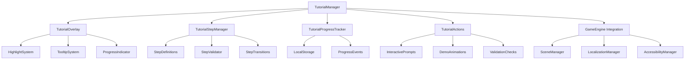

# チュートリアルシステム設計書

## 概要

チュートリアルシステムは、新規プレイヤーがゲームを段階的に学習できるインタラクティブなガイドシステムです。既存のゲームアーキテクチャと統合し、オーバーレイベースのUI、ステップ管理、進行状況の永続化を提供します。

## アーキテクチャ

### システム構成図



### レイヤー構造

1. **プレゼンテーション層**: TutorialOverlay, UI Components
2. **ビジネスロジック層**: TutorialManager, StepManager
3. **データ層**: ProgressTracker, LocalStorage
4. **統合層**: GameEngine Integration

## コンポーネントと インターフェース

### 1. TutorialManager (メインコントローラー)

```javascript
class TutorialManager {
    constructor(gameEngine)
    
    // 公開メソッド
    startTutorial(tutorialId = 'basic')
    pauseTutorial()
    resumeTutorial()
    skipTutorial()
    resetTutorial()
    
    // ステップ制御
    nextStep()
    previousStep()
    jumpToStep(stepId)
    
    // 状態管理
    isActive()
    getCurrentStep()
    getProgress()
    
    // イベント
    on(event, callback)
    emit(event, data)
}
```

### 2. TutorialOverlay (UI管理)

```javascript
class TutorialOverlay {
    constructor(gameEngine)
    
    // 表示制御
    show()
    hide()
    updateContent(stepData)
    
    // ハイライト機能
    highlightElement(selector, options)
    removeHighlight()
    
    // ツールチップ
    showTooltip(x, y, content, position)
    hideTooltip()
    
    // プログレス表示
    updateProgress(current, total)
    
    // アニメーション
    animateTransition(fromStep, toStep)
}
```

### 3. TutorialStepManager (ステップ管理)

```javascript
class TutorialStepManager {
    constructor(tutorialDefinitions)
    
    // ステップ管理
    loadTutorial(tutorialId)
    getCurrentStepData()
    validateStepCompletion(stepId, userAction)
    
    // ナビゲーション
    canGoNext()
    canGoPrevious()
    getNextStep()
    getPreviousStep()
    
    // 条件チェック
    checkStepConditions(stepId)
    evaluateStepTriggers(stepId, gameState)
}
```

### 4. TutorialProgressTracker (進行状況管理)

```javascript
class TutorialProgressTracker {
    constructor()
    
    // 進行状況
    saveProgress(tutorialId, stepId, data)
    loadProgress(tutorialId)
    resetProgress(tutorialId)
    
    // 完了状態
    markStepCompleted(stepId)
    markTutorialCompleted(tutorialId)
    isStepCompleted(stepId)
    isTutorialCompleted(tutorialId)
    
    // 統計
    getCompletionRate()
    getTimeSpent()
    getSkippedSteps()
}
```

### 5. TutorialActions (インタラクティブ機能)

```javascript
class TutorialActions {
    constructor(gameEngine)
    
    // デモンストレーション
    playDemo(actionType, targetElement)
    showClickAnimation(x, y)
    showDragAnimation(startX, startY, endX, endY)
    
    // 検証
    waitForUserAction(expectedAction, timeout)
    validateUserInput(input, expected)
    
    // ガイダンス
    showHint(message, type)
    showWarning(message)
    showSuccess(message)
    
    // インタラクション制御
    enableInteraction(elements)
    disableInteraction(elements)
    restrictToElement(element)
}
```

## データモデル

### チュートリアル定義構造

```javascript
const tutorialDefinition = {
    id: 'basic',
    name: 'Basic Tutorial',
    description: 'Learn the basics of BubblePop',
    version: '1.0',
    steps: [
        {
            id: 'welcome',
            type: 'introduction',
            title: 'Welcome to BubblePop!',
            content: 'Let\'s learn how to play...',
            position: 'center',
            actions: ['continue'],
            conditions: [],
            onEnter: 'showWelcomeAnimation',
            onExit: 'hideWelcomeAnimation'
        },
        {
            id: 'click_bubble',
            type: 'interactive',
            title: 'Click a Bubble',
            content: 'Try clicking on a bubble to pop it',
            target: '.bubble',
            highlight: true,
            expectedAction: 'click',
            validation: 'bubbleClicked',
            hint: 'Click anywhere on the bubble',
            timeout: 30000,
            onSuccess: 'showClickSuccess',
            onTimeout: 'showClickHint'
        }
    ],
    settings: {
        allowSkip: true,
        allowPause: true,
        autoProgress: false,
        showProgress: true,
        overlay: true
    }
};
```

### 進行状況データ構造

```javascript
const progressData = {
    tutorialId: 'basic',
    currentStep: 'click_bubble',
    completedSteps: ['welcome'],
    skippedSteps: [],
    startTime: 1640995200000,
    lastUpdateTime: 1640995800000,
    totalTimeSpent: 600000,
    stepTimes: {
        'welcome': 120000,
        'click_bubble': 480000
    },
    userActions: [
        {
            stepId: 'welcome',
            action: 'continue',
            timestamp: 1640995320000
        }
    ],
    settings: {
        volume: 0.8,
        animationSpeed: 1.0,
        showHints: true
    }
};
```

## エラーハンドリング

### エラー分類と対応

1. **初期化エラー**
   - Canvas要素が見つからない
   - 必要なマネージャーが未初期化
   - 対応: フォールバック表示、エラーログ

2. **ステップ実行エラー**
   - ターゲット要素が見つからない
   - アニメーションの失敗
   - 対応: ステップスキップ、代替表示

3. **データ永続化エラー**
   - LocalStorage書き込み失敗
   - データ破損
   - 対応: メモリ内保存、デフォルト値復元

4. **ユーザーインタラクションエラー**
   - 予期しない操作
   - タイムアウト
   - 対応: ヒント表示、ステップリセット

### エラーハンドリング実装

```javascript
class TutorialErrorHandler {
    static handleError(error, context, recovery) {
        // エラーログ
        console.error(`[Tutorial] ${context}:`, error);
        
        // GameEngineのErrorHandlerと統合
        gameEngine.errorHandler.handleError(error, 'TUTORIAL_ERROR', {
            context,
            tutorialId: context.tutorialId,
            stepId: context.stepId
        });
        
        // 復旧処理
        if (recovery) {
            recovery();
        }
    }
    
    static createFallbackStep(originalStep) {
        return {
            ...originalStep,
            type: 'fallback',
            content: 'このステップでエラーが発生しました。続行しますか？',
            actions: ['continue', 'skip']
        };
    }
}
```

## テスト戦略

### 1. ユニットテスト

- **TutorialManager**: ステップ遷移、状態管理
- **TutorialStepManager**: ステップ検証、条件チェック
- **TutorialProgressTracker**: データ永続化、進行状況計算
- **TutorialOverlay**: UI表示、アニメーション

### 2. 統合テスト

- **GameEngine統合**: シーン遷移、イベント連携
- **LocalizationManager統合**: 多言語対応
- **AccessibilityManager統合**: アクセシビリティ機能

### 3. E2Eテスト

- **完全なチュートリアルフロー**: 開始から完了まで
- **スキップ・復帰機能**: 中断・再開のテスト
- **エラー回復**: 異常状態からの復旧

### 4. ユーザビリティテスト

- **新規ユーザーテスト**: 実際の新規プレイヤーでのテスト
- **アクセシビリティテスト**: スクリーンリーダー、キーボード操作
- **パフォーマンステスト**: 低スペック端末での動作確認

## パフォーマンス考慮事項

### 1. メモリ管理

- **オーバーレイ要素の適切な削除**
- **イベントリスナーのクリーンアップ**
- **アニメーション用タイマーの管理**

### 2. レンダリング最適化

- **必要時のみオーバーレイ描画**
- **ハイライト効果の効率的な実装**
- **アニメーションのフレームレート制御**

### 3. データ最適化

- **進行状況データの圧縮**
- **不要なデータの定期削除**
- **LocalStorageサイズの監視**

## セキュリティ考慮事項

### 1. データ検証

- **ユーザー入力の検証**
- **進行状況データの整合性チェック**
- **XSS対策（動的コンテンツ生成時）**

### 2. プライバシー

- **個人情報の非収集**
- **匿名化された使用統計のみ**
- **ローカルストレージのみ使用**

## 国際化対応

### 1. 多言語サポート

- **LocalizationManagerとの統合**
- **動的言語切り替え対応**
- **RTL言語サポート**

### 2. 文化的適応

- **地域別のチュートリアル内容調整**
- **文化的に適切なUI要素**
- **現地化されたデモンストレーション**

## アクセシビリティ

### 1. スクリーンリーダー対応

- **ARIA属性の適切な設定**
- **音声読み上げ対応**
- **キーボードナビゲーション**

### 2. 視覚的配慮

- **高コントラストモード対応**
- **文字サイズ調整機能**
- **色覚異常への配慮**

### 3. 操作性向上

- **キーボードのみでの操作**
- **音声ガイド機能**
- **操作時間の調整機能**