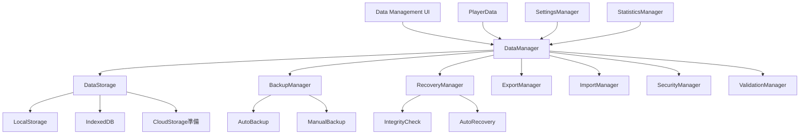

# データ管理強化 - 設計書

## 概要

Bubble Pop Web Gameのデータ管理システムを強化し、データ保護、移行、セキュリティ機能を包括的に実装します。既存のPlayerData、SettingsManager、StatisticsManagerとの統合を重視し、段階的な実装を行います。

## アーキテクチャ

### システム構成図



### レイヤー構成

1. **プレゼンテーション層**: データ管理UI
2. **アプリケーション層**: DataManager（統合管理）
3. **ドメイン層**: 各種マネージャー（Backup, Recovery, Export等）
4. **インフラストラクチャ層**: ストレージアダプター

## コンポーネント設計

### 1. DataManager（中央管理クラス）

```javascript
class DataManager {
    constructor(gameEngine) {
        this.gameEngine = gameEngine;
        this.storage = new DataStorage();
        this.backup = new BackupManager(this.storage);
        this.recovery = new RecoveryManager(this.storage, this.backup);
        this.export = new ExportManager();
        this.import = new ImportManager();
        this.security = new SecurityManager();
        this.validation = new ValidationManager();
        this.ui = new DataManagementUI(this);
    }
}
```

**責任:**
- 各種データ管理機能の統合
- 既存システム（PlayerData、SettingsManager等）との連携
- データ操作の統一インターフェース提供

### 2. DataStorage（ストレージ抽象化）

```javascript
class DataStorage {
    constructor() {
        this.adapters = {
            localStorage: new LocalStorageAdapter(),
            indexedDB: new IndexedDBAdapter(),
            cloudStorage: new CloudStorageAdapter() // 将来実装
        };
        this.primaryAdapter = 'localStorage';
        this.fallbackAdapter = 'indexedDB';
    }
}
```

**責任:**
- 複数ストレージの統一インターフェース
- フォールバック機能
- ストレージ容量管理

### 3. BackupManager（バックアップ管理）

```javascript
class BackupManager {
    constructor(storage) {
        this.storage = storage;
        this.autoBackupInterval = 5 * 60 * 1000; // 5分
        this.maxBackups = 10;
        this.backupQueue = [];
    }
}
```

**責任:**
- 自動バックアップスケジューリング
- 手動バックアップ実行
- バックアップ履歴管理
- 古いバックアップの自動削除

### 4. RecoveryManager（復旧管理）

```javascript
class RecoveryManager {
    constructor(storage, backupManager) {
        this.storage = storage;
        this.backupManager = backupManager;
        this.recoveryStrategies = [
            new AutoRecoveryStrategy(),
            new ManualRecoveryStrategy(),
            new FactoryResetStrategy()
        ];
    }
}
```

**責任:**
- データ整合性チェック
- 自動復旧処理
- 復旧オプション提示
- 復旧履歴管理

### 5. ExportManager（エクスポート管理）

```javascript
class ExportManager {
    constructor() {
        this.exportFormats = {
            json: new JSONExporter(),
            encrypted: new EncryptedExporter(),
            compressed: new CompressedExporter()
        };
    }
}
```

**責任:**
- 複数形式でのデータエクスポート
- エクスポートデータの検証
- メタデータ付与

### 6. ImportManager（インポート管理）

```javascript
class ImportManager {
    constructor() {
        this.importValidators = [
            new FormatValidator(),
            new VersionValidator(),
            new IntegrityValidator()
        ];
        this.conflictResolvers = [
            new MergeResolver(),
            new OverwriteResolver(),
            new SelectiveResolver()
        ];
    }
}
```

**責任:**
- インポートデータの検証
- バージョン互換性チェック
- データ競合解決

### 7. SecurityManager（セキュリティ管理）

```javascript
class SecurityManager {
    constructor() {
        this.encryption = new AESEncryption();
        this.integrity = new SHA256Integrity();
        this.privacy = new PrivacyManager();
    }
}
```

**責任:**
- データ暗号化/復号化
- 改ざん検出
- プライバシー保護
- GDPR準拠機能

## データモデル

### バックアップデータ構造

```javascript
const BackupData = {
    metadata: {
        version: "1.0.0",
        timestamp: 1640995200000,
        gameVersion: "2.1.0",
        dataTypes: ["playerData", "settings", "statistics"],
        checksum: "sha256hash",
        encrypted: true
    },
    data: {
        playerData: { /* PlayerDataの内容 */ },
        settings: { /* SettingsManagerの内容 */ },
        statistics: { /* StatisticsManagerの内容 */ },
        achievements: { /* AchievementManagerの内容 */ }
    },
    integrity: {
        signatures: { /* 各データブロックの署名 */ },
        checksums: { /* 各データブロックのチェックサム */ }
    }
};
```

### エクスポートデータ構造

```javascript
const ExportData = {
    header: {
        format: "BubblePopSave",
        version: "1.0",
        exportedAt: "2024-01-01T00:00:00Z",
        gameVersion: "2.1.0",
        platform: "web",
        language: "ja"
    },
    userData: {
        profile: { /* ユーザープロファイル */ },
        progress: { /* ゲーム進行状況 */ },
        settings: { /* 設定情報 */ },
        statistics: { /* 統計データ */ }
    },
    metadata: {
        dataSize: 12345,
        compressionRatio: 0.7,
        encryptionMethod: "AES-256-GCM"
    }
};
```

## インターフェース設計

### DataManager API

```javascript
// データ保存
await dataManager.save(dataType, data, options);

// データ読み込み
const data = await dataManager.load(dataType, options);

// バックアップ作成
await dataManager.createBackup(manual = false);

// データ復旧
await dataManager.recover(strategy = 'auto');

// データエクスポート
const exportData = await dataManager.export(format, options);

// データインポート
await dataManager.import(importData, conflictResolution);

// データ検証
const isValid = await dataManager.validate(dataType);

// データクリア
await dataManager.clear(dataType, secure = true);
```

### UI インターフェース

```javascript
// データ管理画面表示
dataManager.ui.show();

// バックアップ状況表示
dataManager.ui.showBackupStatus();

// エクスポート/インポートダイアログ
dataManager.ui.showExportDialog();
dataManager.ui.showImportDialog();

// データクリアダイアログ
dataManager.ui.showClearDialog();
```

## エラーハンドリング

### エラー分類

1. **ストレージエラー**: 容量不足、アクセス権限等
2. **データ整合性エラー**: 破損、改ざん検出等
3. **バージョン互換性エラー**: 形式不一致、バージョン差異等
4. **セキュリティエラー**: 暗号化失敗、認証エラー等
5. **ネットワークエラー**: クラウド同期関連（将来実装）

### エラー処理戦略

```javascript
const ErrorHandlingStrategy = {
    STORAGE_ERROR: {
        retry: true,
        maxRetries: 3,
        fallback: 'alternative_storage',
        userNotification: true
    },
    INTEGRITY_ERROR: {
        autoRecover: true,
        backupRestore: true,
        userConfirmation: true
    },
    VERSION_ERROR: {
        migration: true,
        userChoice: true,
        backupBeforeMigration: true
    }
};
```

## テスト戦略

### 単体テスト
- 各マネージャークラスの機能テスト
- データ変換・検証ロジックのテスト
- エラーハンドリングのテスト

### 統合テスト
- 既存システムとの連携テスト
- ストレージ間のフォールバックテスト
- バックアップ・復旧の一連の流れテスト

### E2Eテスト
- ユーザーシナリオベースのテスト
- データ移行シナリオのテスト
- 異常系シナリオのテスト

## パフォーマンス考慮事項

### 最適化戦略

1. **非同期処理**: バックアップ・復旧処理の非同期実行
2. **チャンク処理**: 大量データの分割処理
3. **キャッシュ機能**: 頻繁にアクセスするデータのメモリキャッシュ
4. **圧縮**: バックアップデータの圧縮保存
5. **遅延読み込み**: 必要時のみデータ読み込み

### パフォーマンス目標

- データ保存: < 100ms
- データ読み込み: < 50ms
- バックアップ作成: < 500ms（バックグラウンド）
- データ復旧: < 1000ms
- エクスポート/インポート: < 2000ms

## セキュリティ設計

### 暗号化仕様

- **アルゴリズム**: AES-256-GCM
- **キー管理**: ブラウザ固有キー + ユーザー派生キー
- **初期化ベクトル**: ランダム生成（保存時）

### プライバシー保護

- **データ最小化**: 必要最小限のデータのみ保存
- **匿名化**: 統計データの匿名化処理
- **削除権**: GDPR準拠の完全削除機能
- **透明性**: データ処理の透明性確保

## 段階的実装計画

### Phase 1: 基盤実装
- DataManager基本構造
- DataStorage抽象化
- 既存システムとの統合

### Phase 2: バックアップ・復旧
- BackupManager実装
- RecoveryManager実装
- 自動バックアップ機能

### Phase 3: エクスポート・インポート
- ExportManager実装
- ImportManager実装
- データ移行機能

### Phase 4: セキュリティ強化
- SecurityManager実装
- 暗号化機能
- 改ざん検出機能

### Phase 5: UI・UX改善
- データ管理UI実装
- ユーザーガイダンス
- エラー表示改善

### Phase 6: クラウド対応準備
- CloudStorageAdapter基盤
- 同期機能準備
- 競合解決機能