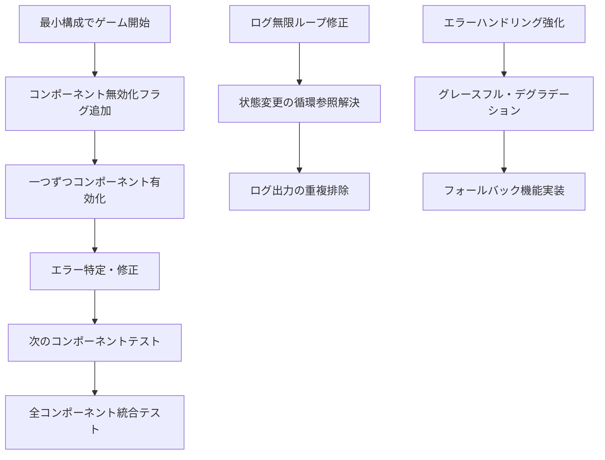

# Design Document

## Overview

GitHub Issue #113で報告されたゲーム開始不可問題を段階的デバッグアプローチで修正するための設計。複数のJavaScriptエラーとログの無限ループが発生しており、特にSafariブラウザでは実行ボタンが反応しない状態。コードベース調査により、以下の主要な問題が特定された：

1. **targetFPS undefined エラー**: 設定管理システムの初期化タイミング問題
2. **title undefined エラー**: オブジェクトの存在確認不足
3. **quality level null エラー**: 品質設定の初期化問題
4. **load null エラー**: オブジェクトの null チェック不足
5. **socialSharingManager.initialize エラー**: メソッド名の不一致（init vs initialize）
6. **ログの無限ループ**: 音響・視覚効果システムの状態変更の循環参照

## Architecture

### 段階的デバッグアプローチ



### コンポーネント無効化システム

```javascript
// 機能フラグによるコンポーネント制御
const FEATURE_FLAGS = {
    AUDIO_SYSTEM: true,
    PARTICLE_EFFECTS: true,
    SEASONAL_EFFECTS: true,
    SOCIAL_SHARING: true,
    ACHIEVEMENTS: true,
    STATISTICS: true,
    PERFORMANCE_OPTIMIZER: true,
    DEBUG_INTERFACE: true
};
```

## Components and Interfaces

### 1. FeatureFlagManager

コンポーネントの有効/無効を制御するシステム

```javascript
class FeatureFlagManager {
    constructor() {
        this.flags = new Map();
        this.loadFlags();
    }
    
    isEnabled(feature) {
        return this.flags.get(feature) !== false;
    }
    
    disable(feature) {
        this.flags.set(feature, false);
    }
    
    enable(feature) {
        this.flags.set(feature, true);
    }
}
```

### 2. SafeInitializer

安全な初期化を行うヘルパークラス

```javascript
class SafeInitializer {
    static async initializeComponent(componentName, initFunction, fallback = null) {
        try {
            return await initFunction();
        } catch (error) {
            console.warn(`Component ${componentName} failed to initialize:`, error);
            return fallback;
        }
    }
    
    static safePropertyAccess(obj, property, defaultValue = null) {
        return obj && obj[property] !== undefined ? obj[property] : defaultValue;
    }
}
```

### 3. LogDeduplicator

ログの重複を防ぐシステム

```javascript
class LogDeduplicator {
    constructor(timeWindow = 1000) {
        this.recentLogs = new Map();
        this.timeWindow = timeWindow;
    }
    
    shouldLog(message, data = null) {
        const key = this.generateKey(message, data);
        const now = Date.now();
        const lastLogged = this.recentLogs.get(key);
        
        if (!lastLogged || now - lastLogged > this.timeWindow) {
            this.recentLogs.set(key, now);
            return true;
        }
        return false;
    }
}
```

### 4. ComponentHealthMonitor

コンポーネントの健全性を監視するシステム

```javascript
class ComponentHealthMonitor {
    constructor() {
        this.componentStatus = new Map();
        this.healthChecks = new Map();
    }
    
    registerComponent(name, healthCheckFn) {
        this.componentStatus.set(name, 'unknown');
        this.healthChecks.set(name, healthCheckFn);
    }
    
    async checkHealth(componentName) {
        const healthCheck = this.healthChecks.get(componentName);
        if (!healthCheck) return false;
        
        try {
            const isHealthy = await healthCheck();
            this.componentStatus.set(componentName, isHealthy ? 'healthy' : 'unhealthy');
            return isHealthy;
        } catch (error) {
            this.componentStatus.set(componentName, 'error');
            return false;
        }
    }
}
```

## Data Models

### ComponentStatus

```javascript
const ComponentStatus = {
    UNKNOWN: 'unknown',
    INITIALIZING: 'initializing',
    HEALTHY: 'healthy',
    UNHEALTHY: 'unhealthy',
    ERROR: 'error',
    DISABLED: 'disabled'
};
```

### DebugSession

```javascript
class DebugSession {
    constructor() {
        this.sessionId = this.generateSessionId();
        this.startTime = Date.now();
        this.componentTests = [];
        this.errors = [];
        this.fixes = [];
    }
    
    addComponentTest(componentName, status, error = null) {
        this.componentTests.push({
            componentName,
            status,
            error,
            timestamp: Date.now()
        });
    }
}
```

## Error Handling

### 1. 特定エラーの修正戦略

#### targetFPS undefined エラー
- ConfigurationManagerの初期化タイミングを早める
- デフォルト値の設定を強化
- プロパティアクセス前の存在確認

#### title undefined エラー
- オブジェクトの存在確認を追加
- デフォルト値の提供
- 安全なプロパティアクセスパターンの適用

#### socialSharingManager.initialize エラー
- メソッド名を `init` から `initialize` に統一
- または `initialize` メソッドのエイリアスを追加

### 2. グレースフル・デグラデーション

```javascript
class GracefulDegradation {
    static handleComponentFailure(componentName, error, fallbackFn = null) {
        console.warn(`Component ${componentName} failed, using fallback`);
        
        if (fallbackFn) {
            try {
                return fallbackFn();
            } catch (fallbackError) {
                console.error(`Fallback for ${componentName} also failed:`, fallbackError);
            }
        }
        
        return null;
    }
}
```

### 3. ログ無限ループの解決

```javascript
class StateChangeManager {
    constructor() {
        this.stateHistory = new Map();
        this.changeInProgress = new Set();
    }
    
    safeStateChange(component, property, newValue) {
        const key = `${component}.${property}`;
        
        if (this.changeInProgress.has(key)) {
            console.warn(`Circular state change detected for ${key}`);
            return false;
        }
        
        const currentValue = this.stateHistory.get(key);
        if (currentValue === newValue) {
            return false; // 値が変わっていない
        }
        
        this.changeInProgress.add(key);
        try {
            // 状態変更処理
            this.stateHistory.set(key, newValue);
            return true;
        } finally {
            this.changeInProgress.delete(key);
        }
    }
}
```

## Testing Strategy

### 1. 段階的テスト手順

1. **最小構成テスト**: 全コンポーネント無効化でゲーム開始
2. **コア機能テスト**: Canvas、基本描画、入力処理のみ
3. **個別コンポーネントテスト**: 一つずつ有効化してテスト
4. **統合テスト**: 全コンポーネント有効化での動作確認

### 2. 自動テストスイート

```javascript
class ComponentIntegrationTest {
    async testComponentInitialization(componentName) {
        const startTime = Date.now();
        let result = {
            componentName,
            success: false,
            error: null,
            duration: 0
        };
        
        try {
            await this.initializeComponent(componentName);
            result.success = true;
        } catch (error) {
            result.error = error.message;
        } finally {
            result.duration = Date.now() - startTime;
        }
        
        return result;
    }
}
```

### 3. ブラウザ互換性テスト

- Chrome: 最新版での動作確認
- Firefox: 最新版での動作確認  
- Safari: 特に重点的にテスト（問題が深刻）
- Edge: 基本動作確認

### 4. パフォーマンステスト

- メモリ使用量の監視
- フレームレートの測定
- ログ出力量の確認
- 初期化時間の測定

## Implementation Plan

### Phase 1: 緊急修正
1. socialSharingManager.initialize エラーの修正
2. 基本的な null チェックの追加
3. ログ無限ループの暫定修正

### Phase 2: 段階的デバッグシステム構築
1. FeatureFlagManager の実装
2. SafeInitializer の実装
3. LogDeduplicator の実装

### Phase 3: 根本的問題解決
1. 設定管理システムの初期化順序修正
2. コンポーネント間の依存関係整理
3. エラーハンドリングの強化

### Phase 4: 統合テスト・検証
1. 全ブラウザでの動作確認
2. パフォーマンス測定
3. 回帰テストの実行