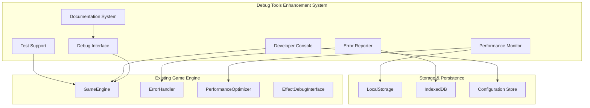

# Design Document

## Overview

デバッグツール強化システムは、既存の基本的なデバッグ機能を大幅に拡張し、開発者の生産性を向上させる包括的な開発支援環境を提供します。システムは以下の主要コンポーネントで構成されます：

1. **Enhanced Debug Interface** - 統合デバッグUI
2. **Performance Monitor** - 詳細パフォーマンス監視
3. **Developer Console** - インタラクティブコンソール
4. **Error Reporter** - 自動エラー収集・分析
5. **Test Support Tools** - テスト支援機能
6. **Documentation System** - 統合ヘルプシステム

## Architecture

### System Architecture Diagram



### Component Integration

既存システムとの統合を重視し、現在の`EffectDebugInterface`を拡張する形で実装します：

- **GameEngine**: 中央制御点として全デバッグツールを統合
- **ErrorHandler**: 既存エラーハンドリングを拡張してレポート機能を追加
- **PerformanceOptimizer**: パフォーマンス監視データの提供元
- **EffectDebugInterface**: 基盤として活用し、機能を大幅拡張

## Components and Interfaces

### 1. Enhanced Debug Interface (`EnhancedDebugInterface`)

既存の`EffectDebugInterface`を拡張し、統合デバッグUIを提供：

```javascript
class EnhancedDebugInterface {
    constructor(gameEngine) {
        this.gameEngine = gameEngine;
        this.panels = new Map(); // 複数パネル管理
        this.activePanel = 'overview';
        this.shortcuts = new Map(); // キーボードショートカット
    }
    
    // パネル管理
    registerPanel(name, panelClass) {}
    switchPanel(panelName) {}
    
    // ショートカット管理
    registerShortcut(key, action) {}
    
    // レイアウト管理
    setLayout(layout) {} // 'docked', 'floating', 'fullscreen'
}
```

#### Panels Structure:
- **Overview Panel**: システム全体の概要
- **Performance Panel**: パフォーマンス監視
- **Console Panel**: 開発者コンソール
- **Error Panel**: エラーレポート
- **Test Panel**: テスト支援
- **Settings Panel**: デバッグ設定

### 2. Advanced Performance Monitor (`AdvancedPerformanceMonitor`)

既存の`PerformanceOptimizer`を拡張：

```javascript
class AdvancedPerformanceMonitor {
    constructor(gameEngine) {
        this.gameEngine = gameEngine;
        this.metrics = new MetricsCollector();
        this.analyzer = new PerformanceAnalyzer();
        this.profiler = new DetailedProfiler();
    }
    
    // メトリクス収集
    collectMetrics() {}
    
    // 分析機能
    analyzePerformance() {}
    generateReport() {}
    
    // プロファイリング
    startProfiling(component) {}
    stopProfiling() {}
    getProfilingResults() {}
}
```

#### Metrics Collected:
- **Frame Metrics**: FPS, frame time, dropped frames
- **Memory Metrics**: Heap usage, GC frequency, memory leaks
- **Render Metrics**: Draw calls, texture usage, shader compilation
- **Game Metrics**: Entity count, update time, collision checks

### 3. Developer Console (`DeveloperConsole`)

インタラクティブなコマンドライン環境：

```javascript
class DeveloperConsole {
    constructor(gameEngine) {
        this.gameEngine = gameEngine;
        this.commands = new Map();
        this.history = [];
        this.autocomplete = new AutocompleteEngine();
    }
    
    // コマンド管理
    registerCommand(name, handler, description) {}
    executeCommand(commandLine) {}
    
    // 履歴・補完
    getHistory() {}
    getAutocompleteSuggestions(partial) {}
}
```

#### Built-in Commands:
- **Game State**: `game.pause()`, `game.setScore(1000)`, `game.addBubbles(10)`
- **Settings**: `config.set('audio.volume', 0.5)`, `config.get('performance')`
- **Testing**: `test.generateBubbles()`, `test.simulateCombo(5)`
- **Debug**: `debug.showHitboxes()`, `debug.logEvents()`

### 4. Error Reporter (`ErrorReporter`)

既存の`ErrorHandler`を拡張：

```javascript
class ErrorReporter {
    constructor(gameEngine) {
        this.gameEngine = gameEngine;
        this.collector = new ErrorCollector();
        this.analyzer = new ErrorAnalyzer();
        this.storage = new ErrorStorage();
    }
    
    // エラー収集
    collectError(error, context) {}
    
    // 分析機能
    analyzeErrorPatterns() {}
    generateErrorReport() {}
    
    // 通知機能
    notifyDeveloper(error) {}
}
```

#### Error Analysis Features:
- **Pattern Detection**: 類似エラーのグループ化
- **Frequency Analysis**: エラー発生頻度の分析
- **Context Correlation**: エラー発生時の状況分析
- **Recovery Tracking**: 復旧成功率の追跡

### 5. Test Support Tools (`TestSupportTools`)

テスト実行と支援機能：

```javascript
class TestSupportTools {
    constructor(gameEngine) {
        this.gameEngine = gameEngine;
        this.testRunner = new TestRunner();
        this.mockDataGenerator = new MockDataGenerator();
        this.benchmarkSuite = new BenchmarkSuite();
    }
    
    // テスト実行
    runTests(suite) {}
    runBenchmarks() {}
    
    // モックデータ生成
    generateTestData(type, count) {}
    
    // 結果分析
    analyzeTestResults() {}
}
```

### 6. Documentation System (`DocumentationSystem`)

統合ヘルプとドキュメント：

```javascript
class DocumentationSystem {
    constructor() {
        this.docs = new Map();
        this.searchEngine = new DocumentationSearchEngine();
        this.contextualHelp = new ContextualHelpProvider();
    }
    
    // ドキュメント管理
    registerDocumentation(topic, content) {}
    getDocumentation(topic) {}
    
    // 検索機能
    search(query) {}
    
    // コンテキストヘルプ
    getContextualHelp(context) {}
}
```

## Data Models

### Debug Session Model

```javascript
class DebugSession {
    constructor() {
        this.id = generateSessionId();
        this.startTime = Date.now();
        this.metrics = [];
        this.errors = [];
        this.commands = [];
        this.tests = [];
    }
}
```

### Performance Metrics Model

```javascript
class PerformanceMetrics {
    constructor() {
        this.timestamp = Date.now();
        this.fps = 0;
        this.frameTime = 0;
        this.memoryUsage = 0;
        this.renderTime = 0;
        this.updateTime = 0;
        this.gameSpecific = {};
    }
}
```

### Error Report Model

```javascript
class ErrorReport {
    constructor(error, context) {
        this.id = generateErrorId();
        this.timestamp = Date.now();
        this.message = error.message;
        this.stack = error.stack;
        this.context = context;
        this.gameState = captureGameState();
        this.browserInfo = captureBrowserInfo();
    }
}
```

## Error Handling

### Error Categories

1. **Debug Tool Errors**: デバッグツール自体のエラー
2. **Game Engine Errors**: ゲームエンジンのエラー
3. **Performance Errors**: パフォーマンス関連のエラー
4. **Configuration Errors**: 設定関連のエラー

### Error Recovery Strategies

- **Graceful Degradation**: デバッグ機能が失敗してもゲームは継続
- **Fallback Modes**: 基本機能への自動切り替え
- **Error Isolation**: エラーが他のコンポーネントに波及しない設計
- **Auto-Recovery**: 可能な場合は自動復旧を試行

## Testing Strategy

### Unit Testing

- 各デバッグコンポーネントの個別テスト
- モック環境でのテスト実行
- エラーハンドリングのテスト

### Integration Testing

- GameEngineとの統合テスト
- 既存システムとの互換性テスト
- パフォーマンス影響のテスト

### User Acceptance Testing

- 開発者ワークフローのテスト
- UI/UXの使いやすさテスト
- ドキュメントの完全性テスト

### Performance Testing

- デバッグツールのオーバーヘッド測定
- 大量データ処理のテスト
- メモリリークのテスト

## Implementation Phases

### Phase 1: Core Infrastructure
- `EnhancedDebugInterface`の基盤実装
- 既存`EffectDebugInterface`の拡張
- 基本的なパネルシステム

### Phase 2: Performance Monitoring
- `AdvancedPerformanceMonitor`の実装
- メトリクス収集システム
- リアルタイム表示機能

### Phase 3: Developer Console
- `DeveloperConsole`の実装
- 基本コマンドセット
- 自動補完機能

### Phase 4: Error Reporting
- `ErrorReporter`の実装
- エラー分析機能
- 通知システム

### Phase 5: Test Support
- `TestSupportTools`の実装
- モックデータ生成
- ベンチマーク機能

### Phase 6: Documentation & Polish
- `DocumentationSystem`の実装
- UI/UXの改善
- 最終統合テスト