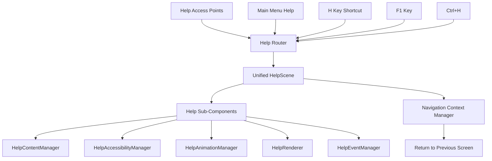
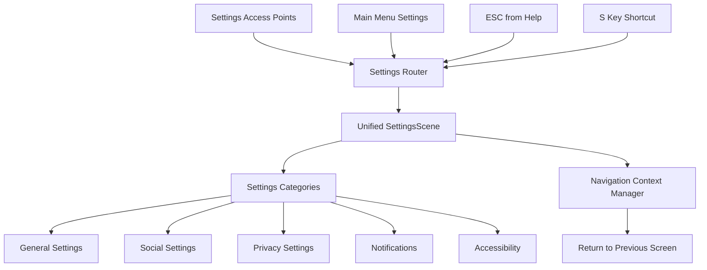

# Design Document

## Overview

This design addresses the consolidation of duplicate help and settings screen implementations in the BubblePop game. Through codebase analysis, I've identified that there are indeed multiple ways to access help and settings, but the actual implementations may be more complex than initially apparent. The solution involves analyzing existing implementations, identifying the best approach for each screen type, and creating unified access patterns while preserving all functionality.

## Architecture

### Current Implementation Analysis

#### Help Screen Implementations

1. **Primary HelpScene (`src/scenes/HelpScene.js`)**:
   - Full-featured scene with sub-components
   - Complex architecture with accessibility, content management, animation, and event handling
   - Registered as 'help' scene in SceneManager
   - Accessed via main menu navigation

2. **Keyboard Shortcut Access**:
   - H key shortcut defined in `LanguageSpecificAccessibility.js`
   - Maps to 'KeyH' for help functionality
   - May trigger different help display mechanism

3. **Contextual Help System (`src/debug/ContextualHelpSystem.js`)**:
   - F1 key and Ctrl+H shortcuts
   - Dynamic help based on context
   - Integrated with debug and documentation systems

#### Settings Screen Implementations

1. **Primary SettingsScene (`src/scenes/SettingsScene.js`)**:
   - Full-featured scene with comprehensive settings management
   - Categories: general, social, privacy, notifications, accessibility
   - Registered as 'settings' scene in SceneManager
   - Accessed via main menu navigation

2. **MainMenuScene Settings (`src/scenes/main-menu/SettingsRenderer.js`)**:
   - Settings rendering within main menu context
   - May be a different implementation or overlay

3. **Accessibility Settings (`src/accessibility/AccessibilitySettingsUI.js`)**:
   - Specialized accessibility configuration interface
   - ESC key handling for dismissal

### Consolidation Strategy

The design will consolidate these implementations by:

1. **Establishing Primary Implementations**: Use the most complete scene implementations as the foundation
2. **Unified Access Routing**: Route all access methods to the same scene implementations
3. **Context-Aware Navigation**: Preserve navigation context for proper return behavior
4. **Feature Integration**: Merge unique features from secondary implementations

## Components and Interfaces

### Unified Help System Architecture



### Unified Settings System Architecture



### Navigation Context Manager

```javascript
class NavigationContextManager {
    constructor() {
        this.navigationStack = [];
        this.currentContext = null;
    }
    
    pushContext(fromScene, accessMethod) {
        this.navigationStack.push({
            scene: fromScene,
            method: accessMethod,
            timestamp: Date.now()
        });
    }
    
    popContext() {
        return this.navigationStack.pop();
    }
    
    getReturnDestination() {
        const context = this.navigationStack[this.navigationStack.length - 1];
        return context ? context.scene : 'menu';
    }
}
```

### Keyboard Shortcut Router

```javascript
class KeyboardShortcutRouter {
    constructor(gameEngine) {
        this.gameEngine = gameEngine;
        this.navigationContext = new NavigationContextManager();
    }
    
    handleHelpShortcut(currentScene) {
        this.navigationContext.pushContext(currentScene, 'keyboard_h');
        this.gameEngine.sceneManager.switchScene('help');
    }
    
    handleSettingsShortcut(currentScene) {
        this.navigationContext.pushContext(currentScene, 'keyboard_s');
        this.gameEngine.sceneManager.switchScene('settings');
    }
    
    handleReturnNavigation() {
        const returnScene = this.navigationContext.getReturnDestination();
        this.navigationContext.popContext();
        this.gameEngine.sceneManager.switchScene(returnScene);
    }
}
```

## Data Models

### Navigation Context Model

```javascript
{
    navigationStack: [
        {
            scene: 'menu' | 'game' | 'stageSelect',
            method: 'menu_click' | 'keyboard_h' | 'keyboard_s' | 'esc_from_help',
            timestamp: number
        }
    ],
    currentContext: {
        scene: string,
        accessMethod: string
    }
}
```

### Screen Access Method Registry

```javascript
{
    help: {
        primary: 'HelpScene',
        accessMethods: [
            { trigger: 'menu_help_click', handler: 'navigateToHelp' },
            { trigger: 'keyboard_h', handler: 'shortcutToHelp' },
            { trigger: 'keyboard_f1', handler: 'contextualHelp' },
            { trigger: 'keyboard_ctrl_h', handler: 'documentationHelp' }
        ]
    },
    settings: {
        primary: 'SettingsScene',
        accessMethods: [
            { trigger: 'menu_settings_click', handler: 'navigateToSettings' },
            { trigger: 'keyboard_s', handler: 'shortcutToSettings' },
            { trigger: 'esc_from_help', handler: 'helpToSettings' }
        ]
    }
}
```

## Error Handling

### Consolidation Error Recovery

1. **Missing Implementation Detection**:
   ```javascript
   validateImplementations() {
       const requiredScenes = ['help', 'settings'];
       const missingScenes = requiredScenes.filter(scene => 
           !this.gameEngine.sceneManager.hasScene(scene)
       );
       
       if (missingScenes.length > 0) {
           throw new ConsolidationError(`Missing scenes: ${missingScenes.join(', ')}`);
       }
   }
   ```

2. **Feature Parity Validation**:
   ```javascript
   validateFeatureParity(originalFeatures, consolidatedFeatures) {
       const missingFeatures = originalFeatures.filter(feature => 
           !consolidatedFeatures.includes(feature)
       );
       
       if (missingFeatures.length > 0) {
           console.warn(`Features not migrated: ${missingFeatures.join(', ')}`);
           return false;
       }
       return true;
   }
   ```

3. **Navigation Fallback**:
   ```javascript
   handleNavigationFailure(targetScene, context) {
       console.error(`Failed to navigate to ${targetScene}`);
       
       // Fallback to main menu
       const fallbackSuccess = this.gameEngine.sceneManager.switchScene('menu');
       if (!fallbackSuccess) {
           // Ultimate fallback - reload page
           console.error('Critical navigation failure, reloading page');
           window.location.reload();
       }
   }
   ```

## Testing Strategy

### Feature Parity Testing

1. **Help Screen Feature Comparison**:
   - Document all features in current HelpScene
   - Document all features in keyboard shortcut help
   - Document all features in contextual help system
   - Create test matrix to verify all features work in consolidated version

2. **Settings Screen Feature Comparison**:
   - Document all features in current SettingsScene
   - Document all features in main menu settings
   - Document all features in accessibility settings
   - Create test matrix to verify all features work in consolidated version

### Navigation Testing

1. **Access Method Testing**:
   ```javascript
   describe('Help Screen Access Methods', () => {
       test('Main menu navigation', () => {
           // Test menu -> help -> back to menu
       });
       
       test('H key shortcut from game', () => {
           // Test game -> H key -> help -> ESC -> back to game
       });
       
       test('F1 key contextual help', () => {
           // Test contextual help display and dismissal
       });
   });
   ```

2. **Context Preservation Testing**:
   ```javascript
   describe('Navigation Context Preservation', () => {
       test('Returns to correct previous screen', () => {
           // Test various navigation paths and return behavior
       });
       
       test('Handles nested navigation', () => {
           // Test menu -> settings -> help -> back navigation
       });
   });
   ```

### Integration Testing

1. **Keyboard Shortcut Integration**:
   - Test all keyboard shortcuts work with consolidated screens
   - Verify shortcuts work from different starting contexts
   - Test shortcut conflicts and resolution

2. **Scene Manager Integration**:
   - Test scene registration and switching
   - Verify proper scene lifecycle management
   - Test error handling in scene transitions

## Implementation Approach

### Phase 1: Analysis and Documentation
1. **Comprehensive Feature Audit**:
   - Catalog all features in each help implementation
   - Catalog all features in each settings implementation
   - Identify unique features and overlaps
   - Document access patterns and user flows

2. **Duplicate Screen Investigation**:
   - Search codebase for other potential duplicate screens
   - Document findings and patterns
   - Create recommendations for prevention

### Phase 2: Architecture Setup
1. **Navigation Context Manager**:
   - Implement navigation context tracking
   - Create keyboard shortcut router
   - Set up unified access routing

2. **Primary Implementation Selection**:
   - Choose HelpScene as primary help implementation
   - Choose SettingsScene as primary settings implementation
   - Plan feature migration from secondary implementations

### Phase 3: Consolidation Implementation
1. **Help Screen Consolidation**:
   - Route all help access methods to HelpScene
   - Integrate unique features from other help implementations
   - Update keyboard shortcut handling

2. **Settings Screen Consolidation**:
   - Route all settings access methods to SettingsScene
   - Integrate unique features from other settings implementations
   - Update navigation patterns

### Phase 4: Cleanup and Testing
1. **Remove Duplicate Implementations**:
   - Remove or refactor secondary implementations
   - Update references throughout codebase
   - Clean up unused code and files

2. **Comprehensive Testing**:
   - Test all access methods work correctly
   - Verify feature parity with original implementations
   - Test navigation context preservation
   - Validate no regressions in existing functionality

## Compatibility Considerations

- **Backward Compatibility**: Maintain existing keyboard shortcuts and menu navigation
- **API Compatibility**: Preserve existing scene interfaces and methods
- **User Experience**: Ensure no disruption to existing user workflows
- **Performance**: Consolidation should improve performance by reducing duplicate code

## Security Considerations

- **Input Validation**: Maintain secure keyboard input handling
- **Scene Access Control**: Ensure proper scene access permissions
- **Navigation Security**: Prevent unauthorized scene transitions
- **Data Integrity**: Preserve settings and help content security