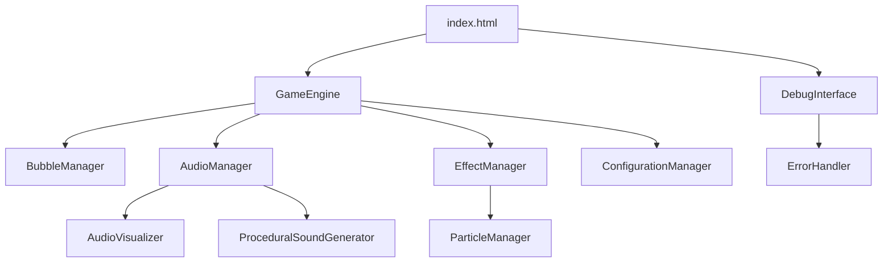

# Design Document

## Overview

This design outlines the systematic migration of features from various working test files into the main index.html. The approach follows a phased integration strategy, starting with the most critical audio functionality and progressively adding enhanced game mechanics, debugging tools, and performance optimizations. The design maintains the existing ES6 module architecture while ensuring backward compatibility and graceful degradation.

## Architecture

### Module Integration Strategy

The new index.html will use a layered initialization approach:

1. **Core Layer**: Basic GameEngine initialization (already working)
2. **Audio Layer**: AudioManager and AudioVisualizer integration
3. **Enhancement Layer**: Special effects, particle systems, and advanced interactions
4. **Debug Layer**: Development tools and monitoring systems
5. **Configuration Layer**: Settings management and persistence

### Component Dependencies



## Components and Interfaces

### 1. Enhanced Index.html Structure

**Main Container**
- Game canvas with responsive sizing
- Control panel with feature toggles
- Real-time information display
- Debug log panel (collapsible)
- Audio visualization area

**JavaScript Module Structure**
```javascript
// Core initialization
import { GameEngine } from './src/core/GameEngine.js';
import { AudioManager } from './src/audio/AudioManager.js';
import { AudioVisualizer } from './src/audio/AudioVisualizer.js';
import { getConfigurationManager } from './src/core/ConfigurationManager.js';
import { getErrorHandler } from './src/utils/ErrorHandler.js';
```

### 2. Audio System Integration

**AudioManager Integration**
- Initialize AudioManager alongside GameEngine
- Handle audio context creation and management
- Provide fallback for audio initialization failures
- Support for procedural sound generation

**AudioVisualizer Component**
- Canvas-based frequency visualization
- Real-time waveform display
- Configurable visualization types
- Accessibility-friendly visual indicators

**Sound Effect System**
- Bubble pop sounds with variations
- Special bubble effect sounds (healing, etc.)
- Background music management
- Volume and mute controls

### 3. Enhanced Game Mechanics

**Special Bubble Effects**
- Pink bubble healing effects (createHealEffect method)
- Drag particle systems (createDragParticles method)
- Enhanced visual feedback for interactions
- Smooth animation transitions

**Particle System Integration**
- Import and initialize ParticleManager
- Create particle effects for bubble interactions
- Manage particle lifecycle and cleanup
- Performance-optimized rendering

**Advanced Bubble Interactions**
- Improved click detection
- Drag and drop functionality
- Special bubble type handling
- Chain reaction effects

### 4. Debug and Development Tools

**Integrated Debug Panel**
- Real-time system status monitoring
- Performance metrics display
- Error logging and display
- Feature toggle controls

**Logging System**
- Categorized log messages (info, warning, error, success)
- Timestamped entries
- Scrollable log display
- Log level filtering

**Development Controls**
- Manual bubble spawning
- Effect testing buttons
- Audio system testing
- Performance profiling tools

### 5. Configuration Management

**Settings Persistence**
- localStorage-based configuration storage
- Default configuration fallbacks
- Runtime configuration updates
- Settings validation and sanitization

**Feature Toggles**
- Audio enable/disable
- Visual effects quality settings
- Debug mode activation
- Performance optimization levels

## Data Models

### GameState Model
```javascript
{
  isInitialized: boolean,
  isRunning: boolean,
  audioEnabled: boolean,
  debugMode: boolean,
  currentScore: number,
  bubbleCount: number,
  performanceMetrics: {
    fps: number,
    memoryUsage: number,
    audioLatency: number
  }
}
```

### AudioConfiguration Model
```javascript
{
  enabled: boolean,
  masterVolume: number,
  sfxVolume: number,
  bgmVolume: number,
  visualizationEnabled: boolean,
  visualizationType: string,
  audioQuality: string
}
```

### DebugConfiguration Model
```javascript
{
  enabled: boolean,
  logLevel: string,
  showPerformanceMetrics: boolean,
  enableErrorReporting: boolean,
  verboseLogging: boolean
}
```

## Error Handling

### Graceful Degradation Strategy

1. **Audio System Failures**
   - Continue game operation without audio
   - Display audio unavailable notification
   - Disable audio-dependent features
   - Provide manual retry mechanism

2. **Module Loading Failures**
   - Catch import errors for non-critical modules
   - Log detailed error information
   - Provide fallback implementations
   - Display user-friendly error messages

3. **Performance Issues**
   - Automatic quality reduction
   - Feature disabling under load
   - Memory cleanup procedures
   - Performance monitoring alerts

### Error Recovery Mechanisms

- Automatic retry for transient failures
- Manual reset buttons for critical systems
- State restoration from localStorage
- Progressive feature re-enabling

## Testing Strategy

### Integration Testing Approach

1. **Phase 1 Testing**: Audio system integration
   - AudioManager initialization
   - Sound effect playback
   - AudioVisualizer rendering
   - Configuration persistence

2. **Phase 2 Testing**: Enhanced mechanics
   - Special bubble effects
   - Particle system integration
   - Advanced interactions
   - Performance impact assessment

3. **Phase 3 Testing**: Debug tools
   - Logging system functionality
   - Error handling verification
   - Performance monitoring accuracy
   - Development control responsiveness

### Test Scenarios

- **Cold Start**: Fresh page load with no cached data
- **Hot Reload**: Page refresh with existing configuration
- **Error Conditions**: Simulated failures and recovery
- **Performance Stress**: High bubble count and effect load
- **Browser Compatibility**: Cross-browser functionality testing

### Validation Criteria

- All core game functionality remains operational
- Audio features work without breaking basic gameplay
- Debug tools provide accurate information
- Performance remains acceptable (>30 FPS)
- Error handling prevents application crashes

## Implementation Phases

### Phase 1: Audio System Foundation
- Integrate AudioManager initialization
- Add basic sound effect support
- Implement AudioVisualizer
- Create audio configuration UI

### Phase 2: Enhanced Game Features
- Add special bubble effect methods
- Integrate particle system
- Implement advanced interactions
- Add visual polish enhancements

### Phase 3: Debug and Monitoring
- Integrate debug logging system
- Add performance monitoring
- Create development control panel
- Implement error reporting

### Phase 4: Configuration and Polish
- Add comprehensive settings management
- Implement feature toggles
- Add accessibility enhancements
- Optimize performance and cleanup