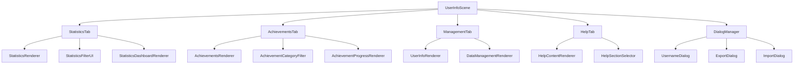

# Design Document

## Overview

This design addresses the optimization of large files in the Bubble Pop Web Game, specifically targeting UserInfoScene.js (3,734 lines, 133KB) and other large files that exceed AI development tool token limits. The solution involves modular decomposition while maintaining existing functionality and following established project patterns.

## Architecture

### Current State Analysis

**UserInfoScene.js Structure:**
- **Lines:** 3,734 (133KB)
- **Primary Responsibilities:**
  - Statistics rendering and management (~1,200 lines)
  - Achievements display and filtering (~800 lines)
  - User management and data operations (~600 lines)
  - Help system integration (~400 lines)
  - Dialog management (~500 lines)
  - Event handling and navigation (~234 lines)

**Other Large Files:**
- MobilePerformanceOptimizer.js: 3,378 lines (113KB)
- StatisticsManager.js: 2,259 lines (78KB)
- AchievementManager.js: 2,230 lines (78KB)

### Target Architecture

The design follows a **Component-Based Modular Architecture** where large monolithic classes are decomposed into focused, single-responsibility components that maintain the existing public interface.



## Components and Interfaces

### 1. Core Scene Class (UserInfoScene.js)

**Responsibilities:**
- Scene lifecycle management (enter, exit, update, render)
- Tab navigation and state management
- Component coordination and data flow
- Event delegation to appropriate components

**Reduced Size:** ~400-500 lines (from 3,734 lines)

**Interface:**
```javascript
export class UserInfoScene extends Scene {
    constructor(gameEngine)
    enter()
    exit()
    update(deltaTime)
    render(context)
    handleInput(event)
    handleClick(event)
}
```

### 2. Tab Components

#### StatisticsTab (src/scenes/components/StatisticsTab.js)
**Responsibilities:**
- Statistics data rendering
- Filter UI management
- Dashboard and chart integration
- Responsive layout handling

**Estimated Size:** ~800-900 lines

#### AchievementsTab (src/scenes/components/AchievementsTab.js)
**Responsibilities:**
- Achievement list rendering
- Category filtering
- Progress bar rendering
- Achievement statistics display

**Estimated Size:** ~600-700 lines

#### ManagementTab (src/scenes/components/ManagementTab.js)
**Responsibilities:**
- User information display
- Data management operations
- Export/Import functionality coordination

**Estimated Size:** ~400-500 lines

#### HelpTab (src/scenes/components/HelpTab.js)
**Responsibilities:**
- Help content rendering
- Section navigation
- Help system integration

**Estimated Size:** ~300-400 lines

### 3. Dialog Management

#### DialogManager (src/scenes/components/DialogManager.js)
**Responsibilities:**
- Dialog state management
- Dialog rendering coordination
- Dialog event handling

**Estimated Size:** ~200-300 lines

#### Individual Dialog Components
- **UsernameDialog:** Username change functionality
- **ExportDialog:** Data export operations
- **ImportDialog:** Data import operations with multi-step workflow

**Estimated Size:** ~100-150 lines each

### 4. Rendering Components

#### Specialized Renderers
- **StatisticsRenderer:** Complex statistics visualization
- **AchievementProgressRenderer:** Progress bars and achievement items
- **DataManagementRenderer:** User data management UI

## Data Models

### Component Communication Model

```javascript
// Event-based communication pattern
class ComponentEventBus {
    constructor() {
        this.listeners = new Map();
    }
    
    emit(event, data) { /* ... */ }
    on(event, callback) { /* ... */ }
    off(event, callback) { /* ... */ }
}

// Shared state management
class SceneState {
    constructor() {
        this.currentTab = 'statistics';
        this.dialogState = null;
        this.userData = null;
        this.statisticsData = null;
        this.achievementsData = null;
    }
}
```

### Component Interface Standard

```javascript
// Base component interface
class TabComponent {
    constructor(gameEngine, eventBus, state) {
        this.gameEngine = gameEngine;
        this.eventBus = eventBus;
        this.state = state;
    }
    
    render(context, x, y, width, height) { /* Abstract */ }
    handleClick(x, y) { /* Abstract */ }
    handleInput(event) { /* Abstract */ }
    update(deltaTime) { /* Optional */ }
}
```

## Error Handling

### Component-Level Error Handling

1. **Graceful Degradation:** Each component handles its own errors without affecting others
2. **Error Boundaries:** Main scene catches and handles component errors
3. **Fallback Rendering:** Components provide fallback UI when data is unavailable
4. **Error Reporting:** Centralized error logging through existing ErrorHandler

### Implementation Pattern

```javascript
class StatisticsTab extends TabComponent {
    render(context, x, y, width, height) {
        try {
            this.renderStatistics(context, x, y, width, height);
        } catch (error) {
            this.renderErrorFallback(context, x, y, width, height, error);
            this.eventBus.emit('component-error', { component: 'StatisticsTab', error });
        }
    }
}
```

## Testing Strategy

### Unit Testing Approach

1. **Component Isolation:** Each component can be tested independently
2. **Mock Dependencies:** Use mocks for gameEngine, eventBus, and state
3. **Render Testing:** Verify rendering output without actual canvas
4. **Event Testing:** Test event handling and component communication

### Integration Testing

1. **Component Integration:** Test component interaction through event bus
2. **Scene Integration:** Test full scene functionality with all components
3. **Backward Compatibility:** Ensure existing functionality remains unchanged

### Test Structure

```
tests/unit/scenes/
├── UserInfoScene.test.js (reduced scope)
├── components/
│   ├── StatisticsTab.test.js
│   ├── AchievementsTab.test.js
│   ├── ManagementTab.test.js
│   ├── HelpTab.test.js
│   └── DialogManager.test.js
└── integration/
    └── UserInfoSceneIntegration.test.js
```

## Performance Considerations

### Memory Management

1. **Lazy Loading:** Components are instantiated only when needed
2. **Component Caching:** Reuse component instances across tab switches
3. **Event Cleanup:** Proper event listener cleanup on component destruction

### Rendering Optimization

1. **Selective Rendering:** Only render active tab components
2. **Render Caching:** Cache rendered content when data hasn't changed
3. **Progressive Loading:** Load heavy components asynchronously

## Migration Strategy

### Phase 1: Extract Dialog Management
- **Target:** DialogManager and individual dialog components
- **Risk:** Low (dialogs are self-contained)
- **Validation:** Dialog functionality testing

### Phase 2: Extract Help Tab
- **Target:** HelpTab component
- **Risk:** Low (minimal dependencies)
- **Validation:** Help system functionality

### Phase 3: Extract Management Tab
- **Target:** ManagementTab component
- **Risk:** Medium (data operations)
- **Validation:** User management operations

### Phase 4: Extract Achievements Tab
- **Target:** AchievementsTab and related components
- **Risk:** Medium (complex filtering and rendering)
- **Validation:** Achievement display and filtering

### Phase 5: Extract Statistics Tab
- **Target:** StatisticsTab and related components
- **Risk:** High (most complex component)
- **Validation:** Statistics display and dashboard functionality

### Phase 6: Finalize Core Scene
- **Target:** Clean up main UserInfoScene class
- **Risk:** Low (mostly coordination code)
- **Validation:** Full scene integration testing

## Future Extensibility

### Reusable Patterns

The component architecture established for UserInfoScene can be applied to other large files:

1. **MobilePerformanceOptimizer.js:** Split into device detection, optimization strategies, and monitoring components
2. **StatisticsManager.js:** Separate data collection, analysis, and storage components
3. **AchievementManager.js:** Split achievement logic, progress tracking, and notification components

### Component Library

Extracted components can form the foundation of a reusable UI component library for the game, enabling:
- Consistent UI patterns across scenes
- Easier maintenance and testing
- Better code reuse and modularity