# Design Document

## Overview

Phase G: 最終残存ファイル分割対応は、4つの大容量ファイルを機能別に分割し、MCPツール完全互換（全ファイル2,500語以下）を達成する設計です。各ファイルの特性に応じた分割戦略を採用し、Main Controller Patternの適用により一貫したアーキテクチャを実現します。

## Architecture

### 分割戦略

#### 1. ツールファイル分割（tools/balance-adjuster.js）
- **戦略**: 機能別責任分離
- **パターン**: Modular Tool Pattern
- **目標**: 3,168語 → 各ファイル2,000語以下

#### 2. オーディオアクセシビリティ分割（src/audio/AudioAccessibilitySupport.js）
- **戦略**: 機能ドメイン分離
- **パターン**: Main Controller Pattern
- **目標**: 2,558語 → メインファイル1,800語以下

#### 3. ビジュアルフォーカス管理分割（src/core/VisualFocusManager.js）
- **戦略**: UI責任分離
- **パターン**: Main Controller Pattern
- **目標**: 2,520語 → メインファイル1,800語以下

#### 4. ビジュアルフィードバック管理分割（src/core/VisualFeedbackManager.js）
- **戦略**: エフェクト機能分離
- **パターン**: Main Controller Pattern
- **目標**: 2,501語 → メインファイル1,800語以下

## Components and Interfaces

### Phase G.1: ツールファイル分割

#### ディレクトリ構造
```
tools/balance/
├── balance-adjuster.js          # メインツール（エントリーポイント）
├── BalanceDataLoader.js         # データ読み込み・解析
├── BalanceCalculator.js         # バランス計算エンジン
├── BalanceValidator.js          # 検証・妥当性チェック
├── BalanceExporter.js           # 結果出力・レポート生成
└── BalanceConfigManager.js      # 設定管理
```

#### 主要インターフェース
```javascript
// balance-adjuster.js (メインツール)
class BalanceAdjuster {
    constructor()
    async showMainMenu()
    async executeAction(action)
    async handleExit()
}

// BalanceDataLoader.js
class BalanceDataLoader {
    loadCurrentConfiguration()
    getConfigValue(key)
    configKeyExists(key)
    validateInput(key, input)
}

// BalanceCalculator.js
class BalanceCalculator {
    async previewBalanceImpact(key, oldValue, newValue)
    async performDetailedImpactAnalysis()
    convertPendingChangesToAnalysisFormat()
}

// BalanceValidator.js
class BalanceValidator {
    async runQuickTests()
    async runBalanceTests()
    async testBubbleConfiguration(bubbleType)
    async testScoringConfiguration()
}

// BalanceExporter.js
class BalanceExporter {
    async saveChanges()
    async createConfigurationBackup()
    async applyChangesToConfigurationFiles()
    recordSession()
}

// BalanceConfigManager.js
class BalanceConfigManager {
    async viewCurrentConfiguration()
    async modifySettings()
    async selectConfigurationKey()
    async compareConfigurations()
}
```

### Phase G.2: オーディオアクセシビリティ分割

#### ディレクトリ構造
```
src/audio/accessibility/
├── AudioAccessibilitySupport.js    # メインサポート（Main Controller）
├── AudioDescriptionManager.js      # 音声説明管理
├── AudioCueManager.js              # 音声キュー管理
├── AudioFeedbackProcessor.js       # 音声フィードバック処理
├── AudioSettingsManager.js         # 設定管理
└── AudioCompatibilityChecker.js    # 互換性チェック
```

#### 主要インターフェース
```javascript
// AudioAccessibilitySupport.js (Main Controller)
class AudioAccessibilitySupport {
    constructor(audioManager)
    initialize()
    triggerAudioEvent(eventType, eventData)
    addAudioEventListener(eventType, callback)
}

// AudioDescriptionManager.js
class AudioDescriptionManager {
    showVisualNotification(options)
    showCaption(text)
    displayNextCaption()
    createNotificationContainer()
}

// AudioCueManager.js
class AudioCueManager {
    handleBubblePopEvent(event)
    handleComboEvent(event)
    handleAchievementEvent(event)
    handleGameStateEvent(event)
}

// AudioFeedbackProcessor.js
class AudioFeedbackProcessor {
    monitorAudioLevels()
    updateColorIndicator(level)
    processEventPattern(eventType, eventData)
    checkPatternMatches()
}

// AudioSettingsManager.js
class AudioSettingsManager {
    loadSettings()
    applySettings()
    setupConfigWatchers()
    applyHighContrastMode()
    applyLargeFonts()
}

// AudioCompatibilityChecker.js
class AudioCompatibilityChecker {
    initializeVibrationManager()
    updateVibrationManagerSettings()
    triggerHapticFeedback(type, data)
}
```

### Phase G.3: ビジュアルフォーカス管理分割

#### ディレクトリ構造
```
src/core/visual/focus/
├── VisualFocusManager.js        # メインマネージャー（Main Controller）
├── FocusStateManager.js         # フォーカス状態管理
├── FocusEffectRenderer.js       # フォーカス効果描画
├── FocusEventHandler.js         # フォーカスイベント処理
└── FocusAccessibilitySupport.js # アクセシビリティサポート
```

#### 主要インターフェース
```javascript
// VisualFocusManager.js (Main Controller)
class VisualFocusManager {
    constructor(accessibilityManager, focusManager)
    initialize()
    handleFocusChange(element, index, keyboardMode)
    handleFocusLost(element)
}

// FocusStateManager.js
class FocusStateManager {
    updateFocusVisuals(element, index)
    updateNavigationPath(element)
    detectAndApplySystemSettings()
    setHighContrastMode(enabled)
}

// FocusEffectRenderer.js
class FocusEffectRenderer {
    positionFocusRing(element)
    updateFocusOverlay(element)
    highlightLandmarks(element)
    updateGroupIndicators(element)
}

// FocusEventHandler.js
class FocusEventHandler {
    setupEventListeners()
    handleKeyDown(event)
    handleKeyUp(event)
    handleMouseDown(event)
    handleMouseMove(event)
}

// FocusAccessibilitySupport.js
class FocusAccessibilitySupport {
    showNavigationFeedback(element, index)
    showKeyboardHints(element)
    updateBreadcrumbTrail(element)
    generateKeyboardHints(element)
}
```

### Phase G.4: ビジュアルフィードバック管理分割

#### ディレクトリ構造
```
src/core/visual/feedback/
├── VisualFeedbackManager.js     # メインマネージャー（Main Controller）
├── FeedbackAnimationManager.js  # アニメーション管理
├── FeedbackEffectRenderer.js    # エフェクト描画
├── FeedbackTriggerHandler.js    # トリガー処理
└── FeedbackConfigManager.js     # 設定管理
```

#### 主要インターフェース
```javascript
// VisualFeedbackManager.js (Main Controller)
class VisualFeedbackManager {
    constructor(audioAccessibilityManager)
    initialize()
    triggerVisualFeedback(options)
    triggerGameEventFeedback(eventType, eventData)
}

// FeedbackAnimationManager.js
class FeedbackAnimationManager {
    createFlashEffect(params)
    createGlowEffect(params)
    createPulseEffect(params)
    createRippleEffect(params)
    createShakeEffect(params)
}

// FeedbackEffectRenderer.js
class FeedbackEffectRenderer {
    createColorEffect(params)
    createBorderEffect(params)
    createScaleEffect(params)
    startAudioVisualization()
}

// FeedbackTriggerHandler.js
class FeedbackTriggerHandler {
    setupEventListeners()
    selectFeedbackTarget(eventType, eventData)
    triggerVolumeBasedFeedback(volume)
    triggerEdgeFeedback(color, intensity)
}

// FeedbackConfigManager.js
class FeedbackConfigManager {
    loadUserPreferences()
    saveUserPreferences()
    createFeedbackElements()
    setupAudioAnalysis()
}
```

## Data Models

### 分割前後のファイルサイズ予測

#### tools/balance-adjuster.js
- **分割前**: 3,168語
- **分割後**:
  - balance-adjuster.js: ~1,800語 (メインロジック)
  - BalanceDataLoader.js: ~600語
  - BalanceCalculator.js: ~500語
  - BalanceValidator.js: ~700語
  - BalanceExporter.js: ~400語
  - BalanceConfigManager.js: ~500語

#### src/audio/AudioAccessibilitySupport.js
- **分割前**: 2,558語
- **分割後**:
  - AudioAccessibilitySupport.js: ~1,200語 (Main Controller)
  - AudioDescriptionManager.js: ~500語
  - AudioCueManager.js: ~400語
  - AudioFeedbackProcessor.js: ~600語
  - AudioSettingsManager.js: ~300語
  - AudioCompatibilityChecker.js: ~200語

#### src/core/VisualFocusManager.js
- **分割前**: 2,520語
- **分割後**:
  - VisualFocusManager.js: ~1,200語 (Main Controller)
  - FocusStateManager.js: ~500語
  - FocusEffectRenderer.js: ~600語
  - FocusEventHandler.js: ~400語
  - FocusAccessibilitySupport.js: ~500語

#### src/core/VisualFeedbackManager.js
- **分割前**: 2,501語
- **分割後**:
  - VisualFeedbackManager.js: ~1,200語 (Main Controller)
  - FeedbackAnimationManager.js: ~700語
  - FeedbackEffectRenderer.js: ~500語
  - FeedbackTriggerHandler.js: ~400語
  - FeedbackConfigManager.js: ~400語

### 依存関係マップ

```mermaid
graph TD
    A[balance-adjuster.js] --> B[BalanceDataLoader.js]
    A --> C[BalanceCalculator.js]
    A --> D[BalanceValidator.js]
    A --> E[BalanceExporter.js]
    A --> F[BalanceConfigManager.js]
    
    G[AudioAccessibilitySupport.js] --> H[AudioDescriptionManager.js]
    G --> I[AudioCueManager.js]
    G --> J[AudioFeedbackProcessor.js]
    G --> K[AudioSettingsManager.js]
    G --> L[AudioCompatibilityChecker.js]
    
    M[VisualFocusManager.js] --> N[FocusStateManager.js]
    M --> O[FocusEffectRenderer.js]
    M --> P[FocusEventHandler.js]
    M --> Q[FocusAccessibilitySupport.js]
    
    R[VisualFeedbackManager.js] --> S[FeedbackAnimationManager.js]
    R --> T[FeedbackEffectRenderer.js]
    R --> U[FeedbackTriggerHandler.js]
    R --> V[FeedbackConfigManager.js]
```



## Error Handling

### 分割時のエラー処理戦略

1. **段階的分割**: 一度に全てを分割せず、段階的に実行
2. **バックアップ作成**: 分割前に元ファイルのバックアップを作成
3. **テスト実行**: 各段階でテストを実行し、機能の完全性を確認
4. **ロールバック機能**: 問題発生時の迅速なロールバック

### エラーハンドリングパターン

```javascript
// 分割処理の基本パターン
class FileSplitter {
    async splitFile(sourceFile, targetStructure) {
        try {
            // バックアップ作成
            await this.createBackup(sourceFile);
            
            // 段階的分割
            for (const component of targetStructure) {
                await this.extractComponent(sourceFile, component);
                await this.validateComponent(component);
            }
            
            // 統合テスト
            await this.runIntegrationTests();
            
        } catch (error) {
            // ロールバック
            await this.rollback(sourceFile);
            throw error;
        }
    }
}
```

## Testing Strategy

### テスト段階

#### Phase G.1: ツールファイル分割テスト
1. **単体テスト**: 各分割ファイルの独立動作確認
2. **統合テスト**: ツール全体の動作確認
3. **機能テスト**: 既存の全機能が正常動作することを確認

#### Phase G.2-G.4: コア機能分割テスト
1. **単体テスト**: 各コンポーネントの独立動作確認
2. **統合テスト**: Main Controllerとサブコンポーネントの連携確認
3. **パフォーマンステスト**: 分割による性能影響の測定
4. **アクセシビリティテスト**: アクセシビリティ機能の品質確認

### テスト自動化

```javascript
// 分割後テストスイート
describe('Phase G File Splitting', () => {
    describe('Balance Adjuster Tool', () => {
        it('should maintain all CLI functionality', async () => {
            // ツール機能テスト
        });
        
        it('should preserve configuration loading', async () => {
            // 設定読み込みテスト
        });
    });
    
    describe('Audio Accessibility Support', () => {
        it('should maintain WCAG 2.1 AA compliance', async () => {
            // アクセシビリティテスト
        });
        
        it('should preserve real-time performance', async () => {
            // パフォーマンステスト
        });
    });
    
    describe('Visual Focus Manager', () => {
        it('should maintain keyboard navigation', async () => {
            // キーボードナビゲーションテスト
        });
    });
    
    describe('Visual Feedback Manager', () => {
        it('should maintain visual effects', async () => {
            // 視覚効果テスト
        });
    });
});
```

### 品質保証指標

1. **ファイルサイズ**: 全ファイル2,500語以下
2. **機能完全性**: 既存機能100%動作
3. **パフォーマンス**: 性能劣化5%以内
4. **テストカバレッジ**: 90%以上維持
5. **アクセシビリティ**: WCAG 2.1 AA準拠維持

## Implementation Phases

### Phase G.1: ツールファイル分割 (1-2日)
1. balance-adjuster.jsの機能分析
2. 責任分離設計の実装
3. 段階的分割実行
4. ツール動作確認

### Phase G.2: コア機能分割 (2-3日)
1. VisualFocusManager.js分割
2. VisualFeedbackManager.js分割
3. Main Controller Pattern適用
4. 統合テスト実施

### Phase G.3: オーディオ機能分割 (1-2日)
1. AudioAccessibilitySupport.js分割
2. アクセシビリティ機能確認
3. 音声品質テスト
4. 最終統合確認

### Phase G.4: 品質保証・ドキュメント (1日)
1. 全体テスト実行
2. パフォーマンス測定
3. ドキュメント更新
4. 完了報告作成