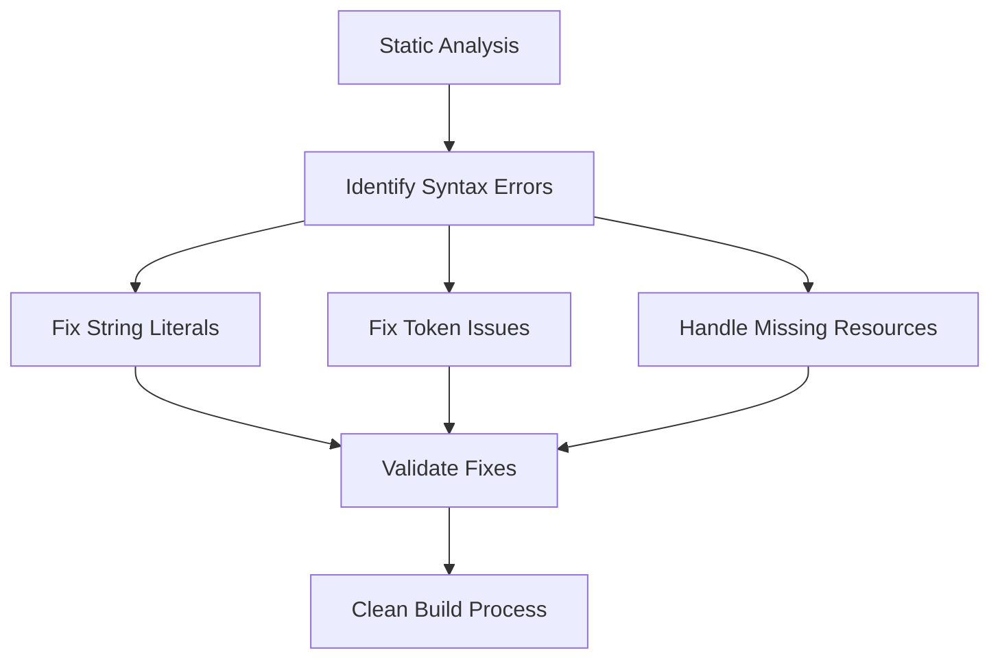

# Design Document

## Overview

開発サーバー起動時に発生する複数のSyntaxErrorを修正するための設計です。主な問題は以下の通りです：

1. test-error-handler.htmlでの文字列リテラル処理
2. LocalizationManager.jsでの予期しないトークンエラー
3. favicon.icoの404エラー

## Architecture

### Error Detection Strategy

静的解析を使用してSyntaxErrorを特定し、開発サーバーを起動せずに問題を解決します。



## Components and Interfaces

### 1. HTML File Syntax Validator

**Purpose:** test-error-handler.htmlの構文エラーを検出・修正

**Key Functions:**
- JavaScript内の文字列リテラルの検証
- HTMLエスケープの確認
- スクリプトタグ内の構文チェック

### 2. JavaScript Module Validator

**Purpose:** LocalizationManager.jsの構文エラーを検出・修正

**Key Functions:**
- トークンの妥当性チェック
- 比較演算子の構文確認
- モジュールエクスポートの検証

### 3. Resource Availability Checker

**Purpose:** 不足しているリソースの特定と対処

**Key Functions:**
- favicon.icoの存在確認
- 代替リソースの提供
- 404エラーの適切な処理

## Data Models

### Syntax Error Report

```javascript
{
  file: string,           // エラーが発生したファイル
  line: number,          // エラー行番号
  column: number,        // エラー列番号
  type: string,          // エラータイプ
  message: string,       // エラーメッセージ
  suggestion: string     // 修正提案
}
```

### Fix Strategy

```javascript
{
  errorType: string,     // エラーの種類
  pattern: RegExp,       // 検出パターン
  replacement: string,   // 置換文字列
  validation: Function   // 修正後の検証
}
```

## Error Handling

### 1. String Literal Errors

**Problem:** XSSテストコードの文字列が適切にエスケープされていない

**Solution:** 
- 文字列内の特殊文字をエスケープ
- テンプレートリテラルの使用を検討
- 適切なクォート処理

### 2. Token Errors

**Problem:** LocalizationManager.jsで予期しないトークンエラー

**Solution:**
- 構文解析による問題箇所の特定
- 不完全な文の修正
- 括弧やセミコロンの確認

### 3. Resource Errors

**Problem:** favicon.icoが存在しない

**Solution:**
- ファイルの存在確認
- 適切なfaviconの配置
- 404エラーの適切な処理

## Testing Strategy

### 1. Static Analysis Testing

```javascript
// 構文チェックのテスト
describe('Syntax Validation', () => {
  test('HTML files should have valid JavaScript', () => {
    // HTMLファイル内のJavaScriptの構文チェック
  });
  
  test('JavaScript modules should parse correctly', () => {
    // JavaScriptモジュールの構文チェック
  });
});
```

### 2. Build Process Testing

```javascript
// ビルドプロセスのテスト
describe('Build Process', () => {
  test('Development server should start without errors', () => {
    // 開発サーバーの起動テスト（モック使用）
  });
  
  test('All resources should be available', () => {
    // リソースの可用性テスト
  });
});
```

### 3. Integration Testing

```javascript
// 統合テスト
describe('Error-free Development Environment', () => {
  test('Complete build process should succeed', () => {
    // 完全なビルドプロセスのテスト
  });
});
```

## Implementation Approach

### Phase 1: Problem Identification
1. 静的解析による問題箇所の特定
2. エラーパターンの分類
3. 修正戦略の決定

### Phase 2: Syntax Fixes
1. test-error-handler.htmlの文字列リテラル修正
2. LocalizationManager.jsのトークンエラー修正
3. 構文検証の実行

### Phase 3: Resource Management
1. favicon.icoの配置または適切な処理
2. 不足リソースの特定と対処
3. 404エラーの適切な処理

### Phase 4: Validation
1. 修正後の構文チェック
2. ビルドプロセスの検証
3. 回帰テストの実行

## Performance Considerations

- 静的解析による高速な問題検出
- 開発サーバー起動時間の短縮
- ビルド警告の削減による開発効率向上

## Security Considerations

- XSSテストコードの適切な処理
- 文字列エスケープの確実な実行
- セキュリティテストの継続性確保