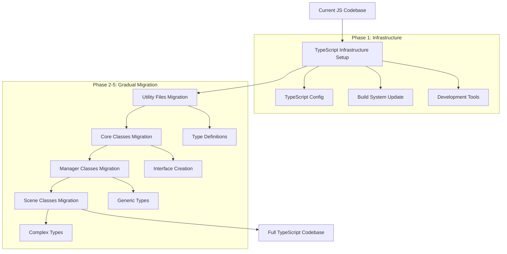

# Design Document

## Overview

This design outlines a comprehensive strategy for gradually migrating the BubblePop Web Game from JavaScript to TypeScript. The approach prioritizes safety, maintainability, and minimal disruption to the development workflow while establishing a robust foundation for type safety.

## Architecture

### Migration Strategy Architecture

The migration follows a **Hybrid Coexistence Pattern** where JavaScript and TypeScript files work together seamlessly during the transition period.



### File Organization Strategy

```
src/
├── types/                    # New: Shared TypeScript definitions
│   ├── core.ts              # Core game types
│   ├── managers.ts           # Manager interface types
│   ├── scenes.ts             # Scene-related types
│   └── utils.ts              # Utility types
├── core/                     # Mixed .js/.ts during migration
├── managers/                 # Mixed .js/.ts during migration
├── scenes/                   # Mixed .js/.ts during migration
└── utils/                    # First to migrate to .ts
```

## Components and Interfaces

### 1. TypeScript Configuration System

**tsconfig.json Structure:**
```typescript
{
  "compilerOptions": {
    "target": "ES2020",
    "module": "ES2020",
    "moduleResolution": "node",
    "allowJs": true,              // Critical: Allow JS files during migration
    "checkJs": false,             // Don't type-check JS files initially
    "strict": false,              // Gradually enable strict mode
    "noEmit": true,               // Use Vite for compilation
    "skipLibCheck": true,
    "esModuleInterop": true,
    "allowSyntheticDefaultImports": true,
    "resolveJsonModule": true,
    "isolatedModules": true,
    "baseUrl": "./src",
    "paths": {
      "@/*": ["*"],
      "@core/*": ["core/*"],
      "@utils/*": ["utils/*"],
      "@scenes/*": ["scenes/*"],
      "@managers/*": ["managers/*"]
    }
  },
  "include": ["src/**/*"],
  "exclude": ["node_modules", "dist", "tests"]
}
```

### 2. Build System Integration

**Vite Configuration Enhancement:**
- Add TypeScript plugin support
- Configure mixed .js/.ts file handling
- Maintain existing build optimization
- Ensure backward compatibility

**Key Changes:**
```javascript
// vite.config.js additions
import { defineConfig } from 'vite';

export default defineConfig({
  // ... existing config
  esbuild: {
    target: 'es2020',
    // Allow mixed JS/TS during migration
    loader: 'tsx',
    include: /\.(ts|tsx|js|jsx)$/,
  },
  resolve: {
    alias: {
      '@': path.resolve(__dirname, 'src'),
      '@core': path.resolve(__dirname, 'src/core'),
      '@utils': path.resolve(__dirname, 'src/utils'),
      // ... other aliases
    }
  }
});
```

### 3. Type Definition System

**Core Type Definitions:**
```typescript
// src/types/core.ts
export interface GameEngine {
  playerData: PlayerData;
  sceneManager: SceneManager;
  bubbleManager: BubbleManager;
  scoreManager: ScoreManager;
  // ... other managers
}

export interface PlayerData {
  username: string;
  level: number;
  experience: number;
  totalScore: number;
  hasValidData: boolean;
}

export interface GameConfig {
  canvas: {
    width: number;
    height: number;
  };
  performance: {
    targetFPS: number;
    enableOptimizations: boolean;
  };
  // ... other config
}
```

**Manager Interface Types:**
```typescript
// src/types/managers.ts
export interface Manager {
  initialize(): Promise<void>;
  cleanup(): void;
  isInitialized(): boolean;
}

export interface BubbleManagerInterface extends Manager {
  createBubble(type: string, x: number, y: number): Bubble;
  updateBubbles(deltaTime: number): void;
  getBubbles(): Bubble[];
}
```

### 4. Migration Validation System

**Type Checking Integration:**
- Custom ESLint rules for migration validation
- Automated type coverage reporting
- Build-time type checking with error reporting
- Runtime type validation for critical paths

## Data Models

### Migration Progress Tracking

```typescript
interface MigrationProgress {
  totalFiles: number;
  migratedFiles: number;
  currentPhase: MigrationPhase;
  completedBatches: string[];
  pendingBatches: string[];
  errors: MigrationError[];
}

interface MigrationError {
  file: string;
  type: 'TYPE_ERROR' | 'BUILD_ERROR' | 'TEST_FAILURE';
  message: string;
  severity: 'LOW' | 'MEDIUM' | 'HIGH' | 'CRITICAL';
}

enum MigrationPhase {
  INFRASTRUCTURE = 'infrastructure',
  UTILITIES = 'utilities',
  CORE = 'core',
  MANAGERS = 'managers',
  SCENES = 'scenes',
  COMPLETE = 'complete'
}
```

### File Dependency Mapping

```typescript
interface DependencyMap {
  [fileName: string]: {
    dependencies: string[];
    dependents: string[];
    complexity: number;
    migrationPriority: number;
    estimatedEffort: 'LOW' | 'MEDIUM' | 'HIGH';
  };
}
```

## Error Handling

### Migration Error Categories

1. **Type Conversion Errors**
   - Implicit any types
   - Missing interface definitions
   - Incompatible type assignments

2. **Build Integration Errors**
   - Import path resolution issues
   - Module compatibility problems
   - Build configuration conflicts

3. **Runtime Compatibility Errors**
   - JavaScript/TypeScript interop issues
   - Performance regressions
   - Browser compatibility problems

### Error Recovery Strategies

```typescript
interface ErrorRecoveryStrategy {
  errorType: string;
  recoveryActions: RecoveryAction[];
  rollbackProcedure: () => Promise<void>;
  validationSteps: ValidationStep[];
}

interface RecoveryAction {
  description: string;
  automated: boolean;
  execute: () => Promise<boolean>;
}
```

## Testing Strategy

### Multi-Phase Testing Approach

1. **Infrastructure Testing**
   - TypeScript configuration validation
   - Build system compatibility tests
   - Development tool integration tests

2. **Migration Validation Testing**
   - Type coverage measurement
   - Interface compliance testing
   - Cross-file dependency validation

3. **Functional Regression Testing**
   - Existing Jest test suite compatibility
   - Game functionality preservation tests
   - Performance benchmark comparisons

4. **Integration Testing**
   - Mixed JS/TS file interaction tests
   - Build artifact validation
   - Browser compatibility verification

### Test Configuration Updates

```typescript
// jest.config.ts (new TypeScript config)
export default {
  preset: 'ts-jest/presets/default-esm',
  extensionsToTreatAsEsm: ['.ts'],
  moduleNameMapping: {
    '^@/(.*)$': '<rootDir>/src/$1',
    '^@core/(.*)$': '<rootDir>/src/core/$1',
    // ... other mappings
  },
  transform: {
    '^.+\\.ts$': ['ts-jest', {
      useESM: true,
      tsconfig: {
        module: 'ES2020',
        target: 'ES2020'
      }
    }],
    '^.+\\.js$': 'babel-jest' // Keep JS transform for mixed files
  },
  // ... rest of config
};
```

## Implementation Phases

### Phase 1: Infrastructure Setup (Week 1)
- Install TypeScript and related dependencies
- Configure tsconfig.json with permissive settings
- Update Vite configuration for mixed JS/TS support
- Set up development tools (VS Code settings, ESLint rules)
- Create initial type definition files

### Phase 2: Utility Files Migration (Week 2)
- Migrate `/src/utils/` directory (lowest dependency complexity)
- Create utility type definitions
- Validate build system with mixed files
- Establish migration workflow and validation process

### Phase 3: Core Classes Migration (Week 3-4)
- Migrate core classes in dependency order
- Create comprehensive interface definitions
- Implement generic types for reusable components
- Validate cross-file type compatibility

### Phase 4: Manager Classes Migration (Week 5-6)
- Migrate manager classes with established interfaces
- Implement complex type relationships
- Add type safety to manager interactions
- Validate game functionality preservation

### Phase 5: Scene Classes Migration (Week 7-8)
- Migrate scene classes (highest complexity)
- Implement scene-specific type definitions
- Add type safety to UI interactions
- Complete comprehensive testing

### Phase 6: Finalization (Week 9)
- Enable strict TypeScript settings
- Remove JavaScript compatibility layers
- Optimize type definitions
- Complete documentation and guidelines

## Migration Tooling

### Automated Migration Scripts

```typescript
interface MigrationTool {
  analyzeFile(filePath: string): FileAnalysis;
  generateTypes(analysis: FileAnalysis): TypeDefinition[];
  convertFile(filePath: string, options: ConversionOptions): ConversionResult;
  validateMigration(filePath: string): ValidationResult[];
}

interface FileAnalysis {
  imports: ImportStatement[];
  exports: ExportStatement[];
  classes: ClassDefinition[];
  functions: FunctionDefinition[];
  complexity: number;
  dependencies: string[];
}
```

### Progress Monitoring Dashboard

- Real-time migration progress tracking
- Type coverage metrics
- Error rate monitoring
- Performance impact assessment
- Rollback capability status

This design ensures a systematic, safe, and efficient migration from JavaScript to TypeScript while maintaining the game's functionality and development velocity throughout the process.