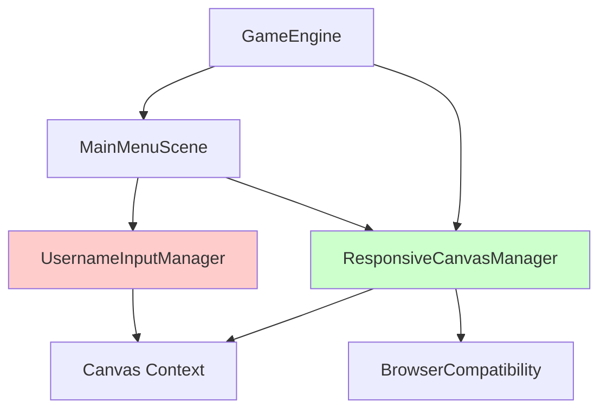
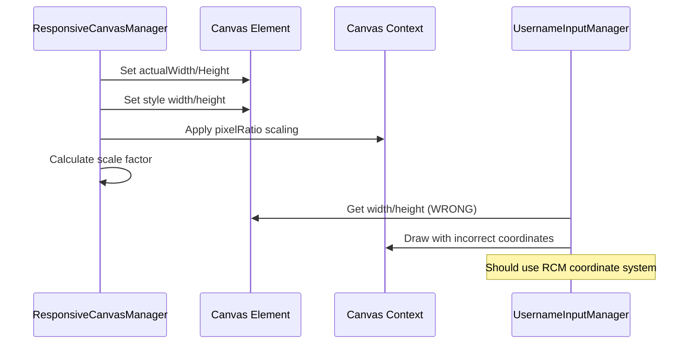

# Design Document

## Overview

ユーザー名入力フォームが画面の右下に表示される問題を修正するための設計文書。調査の結果、`UsernameInputManager`の座標変換ロジックと`ResponsiveCanvasManager`の座標システムの不整合が原因であることが判明した。

## Problem Analysis

### Current Implementation Issues

1. **座標変換の不整合**
   - `UsernameInputManager`では独自の座標変換を実装：`scaleX = canvas.width / 800`, `scaleY = canvas.height / 600`
   - `ResponsiveCanvasManager`では複雑な座標変換システムを使用：`pixelRatio`、`scale`、`displayWidth/Height`、`actualWidth/Height`を考慮

2. **高DPI対応の問題**
   - `ResponsiveCanvasManager`では`context.scale(pixelRatio, pixelRatio)`を適用
   - `UsernameInputManager`ではこの変換を考慮していない

3. **Canvas座標系の混乱**
   - 実際のCanvas解像度（`canvas.width/height`）と表示サイズ（`displayWidth/Height`）の違いを適切に処理していない

### Root Cause

`UsernameInputManager.renderUsernameInput()`メソッドで以下の問題のある実装：

```javascript
// 問題のあるコード
const canvasWidth = canvas.width;
const canvasHeight = canvas.height;
const scaleX = canvasWidth / 800;
const scaleY = canvasHeight / 600;
```

この実装では：
- `ResponsiveCanvasManager`が設定した`pixelRatio`による座標変換を無視
- 実際の表示サイズと内部解像度の違いを考慮していない

## Architecture

### Component Interaction



### Coordinate System Flow



## Components and Interfaces

### Modified UsernameInputManager

```javascript
class UsernameInputManager {
    renderUsernameInput(context) {
        // NEW: Use ResponsiveCanvasManager coordinate system
        const canvasInfo = this.gameEngine.responsiveCanvasManager?.getCanvasInfo();
        
        if (canvasInfo) {
            this.renderWithResponsiveCoordinates(context, canvasInfo);
        } else {
            this.renderWithFallbackCoordinates(context);
        }
    }
    
    renderWithResponsiveCoordinates(context, canvasInfo) {
        // Use ResponsiveCanvasManager's coordinate system
        const { scale, displayWidth, displayHeight, pixelRatio } = canvasInfo;
        // Implementation details...
    }
    
    renderWithFallbackCoordinates(context) {
        // Fallback for when ResponsiveCanvasManager is not available
        // Implementation details...
    }
}
```

### ResponsiveCanvasManager Integration

```javascript
// ResponsiveCanvasManager provides:
interface CanvasInfo {
    displayWidth: number;      // CSS display width
    displayHeight: number;     // CSS display height
    actualWidth: number;       // Canvas internal width
    actualHeight: number;      // Canvas internal height
    scale: number;             // Scale factor for base coordinates
    pixelRatio: number;        // Device pixel ratio
    baseWidth: number;         // Base coordinate system width (800)
    baseHeight: number;        // Base coordinate system height (600)
}
```

## Data Models

### Coordinate Transformation

```javascript
// Base coordinate system (design coordinates)
const BASE_WIDTH = 800;
const BASE_HEIGHT = 600;

// Transform base coordinates to actual canvas coordinates
function transformCoordinates(baseX, baseY, canvasInfo) {
    const { scale, pixelRatio } = canvasInfo;
    
    // Apply scale factor (handles responsive sizing)
    const scaledX = baseX * scale;
    const scaledY = baseY * scale;
    
    // Note: pixelRatio scaling is already applied to context
    // No additional transformation needed for pixelRatio
    
    return { x: scaledX, y: scaledY };
}
```

### Layout Calculations

```javascript
// Username input form layout in base coordinates
const LAYOUT = {
    title: { x: 400, y: 200 },           // Center X, fixed Y
    description: { x: 400, y: 240 },     // Center X, below title
    inputBox: { 
        x: 200,                          // (800 - 400) / 2
        y: 280, 
        width: 400, 
        height: 50 
    },
    buttons: {
        ok: { x: 290, y: 360, width: 100, height: 40 },      // (400/2 - 100 - 10)
        cancel: { x: 410, y: 360, width: 100, height: 40 }   // (400/2 + 10)
    },
    helpText: { x: 400, y: 450 }        // Center X, bottom
};
```

## Error Handling

### Graceful Degradation

1. **ResponsiveCanvasManager Not Available**
   ```javascript
   if (!this.gameEngine.responsiveCanvasManager) {
       console.warn('ResponsiveCanvasManager not available, using fallback coordinates');
       this.renderWithFallbackCoordinates(context);
       return;
   }
   ```

2. **Invalid Canvas Info**
   ```javascript
   const canvasInfo = this.gameEngine.responsiveCanvasManager.getCanvasInfo();
   if (!canvasInfo || !canvasInfo.scale) {
       console.error('Invalid canvas info, falling back to direct calculation');
       this.renderWithFallbackCoordinates(context);
       return;
   }
   ```

3. **Debug Information**
   ```javascript
   if (this.gameEngine.debug) {
       console.log('Username input coordinates:', {
           canvasInfo,
           transformedCoordinates: this.calculateTransformedCoordinates(canvasInfo)
       });
   }
   ```

## Testing Strategy

### Unit Tests

1. **Coordinate Transformation Tests**
   - Test coordinate transformation with different canvas sizes
   - Test with different pixel ratios (1x, 2x, 3x)
   - Test fallback behavior when ResponsiveCanvasManager is unavailable

2. **Layout Tests**
   - Verify all UI elements are positioned correctly
   - Test responsive behavior on different screen sizes
   - Test centering calculations

### Integration Tests

1. **ResponsiveCanvasManager Integration**
   - Test coordinate system consistency
   - Test canvas resize handling
   - Test high DPI display support

2. **Visual Regression Tests**
   - Screenshot tests for different screen sizes
   - Test on mobile and desktop viewports
   - Test with different pixel ratios

### Manual Testing Scenarios

1. **Desktop Testing**
   - Standard resolution (1920x1080)
   - High DPI displays (Retina, 4K)
   - Browser zoom levels (50%, 100%, 150%, 200%)

2. **Mobile Testing**
   - Portrait and landscape orientations
   - Different device sizes (phone, tablet)
   - Browser address bar show/hide behavior

3. **Edge Cases**
   - Very small screens (320px width)
   - Very large screens (4K+)
   - Extreme aspect ratios

## Implementation Plan

### Phase 1: Core Coordinate System Integration
- Modify `renderUsernameInput()` to use ResponsiveCanvasManager
- Implement coordinate transformation helper functions
- Add fallback mechanism

### Phase 2: Layout Refinement
- Update all UI element positioning calculations
- Ensure proper centering on all screen sizes
- Add debug logging for coordinate calculations

### Phase 3: Testing and Validation
- Implement unit tests for coordinate transformations
- Add visual regression tests
- Perform cross-device testing

### Phase 4: Performance Optimization
- Optimize coordinate calculations
- Cache transformed coordinates when possible
- Minimize redundant calculations

## Security Considerations

- No security implications for this coordinate system fix
- Ensure debug logging doesn't expose sensitive information
- Validate canvas dimensions to prevent potential overflow issues

## Performance Considerations

- Coordinate transformations are lightweight operations
- Cache canvas info when possible to avoid repeated calls
- Use efficient rendering techniques to maintain 60fps
- Consider batching coordinate calculations for multiple UI elements