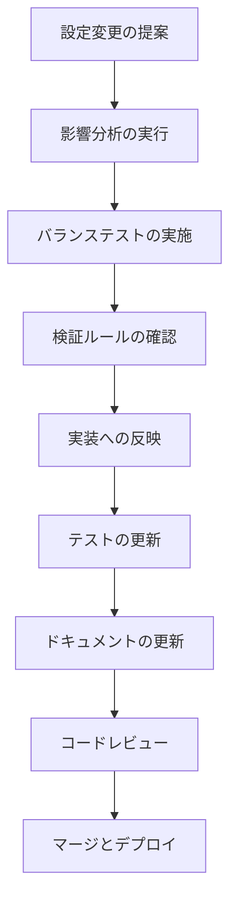

# Configuration Management Guide

ゲームバランス設定管理システムの包括的ガイドです。
統一設定システムのアーキテクチャ、使用方法、拡張手順、トラブルシューティングを説明します。

作成日: 2025-07-27 (Task 8.1)

## 目次

1. [システム概要](#システム概要)
2. [アーキテクチャ](#アーキテクチャ)
3. [設定値の管理](#設定値の管理)
4. [新しい設定値の追加](#新しい設定値の追加)
5. [設定の検証と整合性](#設定の検証と整合性)
6. [移行ガイド](#移行ガイド)
7. [トラブルシューティング](#トラブルシューティング)
8. [ベストプラクティス](#ベストプラクティス)

## システム概要

### 設計目標

awaputi プロジェクトの設定管理システムは以下の目標を達成するために設計されています：

- **一元管理**: すべての設定値を統一的にアクセス可能
- **型安全性**: TypeScript的な型チェックと検証
- **パフォーマンス**: 高頻度アクセスに対応したキャッシュシステム
- **一貫性**: 複数ソース間での設定値の整合性保証
- **拡張性**: 新機能追加時の設定管理の容易さ

### 主要コンポーネント

```
Configuration Management System
├── ConfigurationManager (core/ConfigurationManager.js)
├── GameConfig (config/GameConfig.js)
├── GameBalance (config/GameBalance.js) [Legacy/Compatibility]
├── Validation System
│   ├── ConfigurationSynchronizer (utils/ConfigurationSynchronizer.js)
│   ├── BalanceConfigurationValidator (utils/BalanceConfigurationValidator.js)
│   └── ValidationSystem (core/ValidationSystem.js)
├── Migration Tools
│   └── ConfigurationMigrationUtility (utils/ConfigurationMigrationUtility.js)
└── Documentation & Guidelines
    ├── BalanceGuidelinesManager (utils/BalanceGuidelinesManager.js)
    └── BalanceChangeDocumentationSystem (utils/BalanceChangeDocumentationSystem.js)
```

## アーキテクチャ

### ConfigurationManager

ConfigurationManagerは設定管理システムの中核クラスです。シングルトンパターンで実装され、すべての設定値への統一的なアクセスを提供します。

```javascript
import { getConfigurationManager } from './core/ConfigurationManager.js';

const config = getConfigurationManager();

// 設定値の取得
const normalBubbleScore = config.get('game.scoring.baseScores.normal');
const bossBubbleHealth = config.get('game.bubbles.boss.health');

// 設定値の監視
config.watch('game.difficulty', (newValue, oldValue) => {
    console.log(`難易度が ${oldValue} から ${newValue} に変更されました`);
});

// 設定値の更新（検証付き）
config.set('game.player.maxHP', 100, {
    validate: value => value > 0 && value <= 200
});
```

#### 主要機能

1. **階層的アクセス**: ドット記法での階層的設定アクセス
2. **キャッシング**: 高頻度アクセス設定の自動キャッシュ
3. **設定監視**: 設定値変更時のコールバック実行
4. **検証**: 設定値更新時の自動検証
5. **フォールバック**: 設定取得失敗時のデフォルト値システム

### 設定ソースの優先順位

設定値は以下の優先順位で取得されます：

1. **ConfigurationManager直接設定**: `config.set()` で設定された値
2. **GameConfig**: 新しい統一設定システム
3. **GameBalance**: レガシー互換性レイヤー
4. **ハードコード値**: クラス内のフォールバック値

### キャッシュシステム

ConfigurationManagerは以下のキャッシュ戦略を使用します：

- **LRU (Least Recently Used)**: 最近使用されていない設定値を自動削除
- **自動無効化**: 設定値更新時の関連キャッシュ自動削除
- **メモリ制限**: キャッシュサイズの動的調整

## 設定値の管理

### 基本的な設定アクセス

```javascript
// 基本スコア取得
const normalScore = config.get('game.scoring.baseScores.normal'); // 15

// バブル設定取得
const bossConfig = {
    health: config.get('game.bubbles.boss.health'), // 8
    size: config.get('game.bubbles.boss.size'), // 90
    score: config.get('game.scoring.baseScores.boss') // 100
};

// 特殊効果設定
const electricEffects = {
    intensity: config.get('game.bubbles.electric.effects.intensity'), // 15
    duration: config.get('game.bubbles.electric.effects.duration') // 1500
};
```

### 設定値の種類

#### 1. ゲームバランス設定

```javascript
// スコア設定
const scoring = {
    baseScores: {
        normal: 15,
        stone: 25,
        iron: 40,
        diamond: 60,
        boss: 100,
        pink: 20,
        poison: 30,
        spiky: 35
    },
    combo: {
        multiplierIncrement: 0.08,
        maxMultiplier: 2.5
    }
};

// バブル設定
const bubbles = {
    health: {
        normal: 1,
        stone: 2,
        iron: 3,
        diamond: 4,
        boss: 8  // 修正済み: テストと同期
    },
    maxAge: {
        normal: 30000,
        stone: 35000,
        iron: 40000,
        diamond: 45000,
        boss: 50000
    }
};
```

#### 2. パフォーマンス設定

```javascript
const performance = {
    targetFPS: 60,  // 修正済み: 50 → 60
    maxBubbles: 50,
    renderOptimization: {
        frustumCulling: true,
        levelOfDetail: true
    }
};
```

#### 3. 視覚効果設定

```javascript
const effects = {
    particles: {
        maxCount: 100,
        lifetime: 2000
    },
    specialEffects: {
        electric: {
            intensity: 15,    // 修正済み: 20 → 15
            duration: 1500    // 修正済み: 2000 → 1500
        },
        rainbow: {
            duration: 8000    // ボーナスタイム継続時間
        }
    }
};
```

## 新しい設定値の追加

### 1. GameConfigでの定義

新しい設定値を追加する場合、まずGameConfigで定義します：

```javascript
// src/config/GameConfig.js
export const GAME_CONFIG = {
    // 既存の設定...
    
    // 新しい設定セクション
    newFeature: {
        enabled: true,
        parameters: {
            value1: 100,
            value2: 'default',
            value3: {
                nested: true,
                options: ['a', 'b', 'c']
            }
        }
    }
};
```

### 2. 検証ルールの追加

BalanceConfigurationValidatorに検証ルールを追加：

```javascript
// src/utils/BalanceConfigurationValidator.js
export class BalanceConfigurationValidator {
    // 既存のメソッド...
    
    /**
     * 新機能設定の検証
     * @param {Object} config - 新機能設定オブジェクト
     * @returns {Object} 検証結果
     */
    validateNewFeatureConfig(config) {
        const issues = [];
        const warnings = [];
        
        if (!config || typeof config !== 'object') {
            issues.push({
                type: 'missing_config',
                severity: 'HIGH',
                message: '新機能設定が見つかりません'
            });
            return { valid: false, issues, warnings };
        }
        
        // value1の検証
        if (typeof config.value1 !== 'number' || config.value1 < 0) {
            issues.push({
                type: 'invalid_value',
                severity: 'HIGH',
                message: 'value1は0以上の数値である必要があります',
                field: 'value1',
                currentValue: config.value1
            });
        }
        
        return {
            valid: issues.length === 0,
            issues,
            warnings
        };
    }
}
```

### 3. テストの追加

新しい設定値のテストを追加：

```javascript
// tests/unit/NewFeature.test.js
describe('New Feature Configuration', () => {
    test('should have valid default configuration', () => {
        const config = getConfigurationManager();
        const newFeatureConfig = config.get('game.newFeature');
        
        expect(newFeatureConfig).toBeDefined();
        expect(newFeatureConfig.enabled).toBe(true);
        expect(newFeatureConfig.parameters.value1).toBe(100);
    });
    
    test('should validate configuration correctly', () => {
        const validator = new BalanceConfigurationValidator();
        const result = validator.validateNewFeatureConfig({
            value1: 100,
            value2: 'default'
        });
        
        expect(result.valid).toBe(true);
        expect(result.issues).toHaveLength(0);
    });
});
```

### 4. ドキュメントの更新

新機能のドキュメントを追加：

```javascript
// src/utils/BalanceGuidelinesManager.js
const newFeatureGuidelines = {
    name: 'New Feature Configuration',
    description: '新機能のバランス調整ガイドライン',
    parameters: {
        value1: {
            range: [0, 1000],
            recommended: 100,
            impact: 'パフォーマンスに直接影響',
            dependencies: ['performance.targetFPS']
        }
    }
};
```

## 設定の検証と整合性

### 自動検証システム

設定の整合性は以下のレベルで自動的に検証されます：

#### 1. ビルド時検証

```bash
# 設定検証スクリプトの実行
npm run validate:config

# 出力例
✅ GameBalance configuration validation passed
✅ Bubble configuration validation passed
⚠️  Performance configuration has warnings
❌ Found 2 critical consistency issues
```

#### 2. プリコミットフック

```bash
# コミット前の自動検証
git commit -m "設定値の変更"

# 出力例
============================================================
  Game Balance Configuration Pre-Commit Validation
============================================================
[INFO] 設定関連ファイルの変更を検出しました。検証を実行します...
[SUCCESS] すべての検証がパスしました
[INFO] コミットを続行します...
```

#### 3. CI/CD統合

```yaml
# .github/workflows/config-validation.yml
name: Configuration Validation
on: [push, pull_request]

jobs:
  validate-config:
    runs-on: ubuntu-latest
    steps:
      - uses: actions/checkout@v2
      - name: Setup Node.js
        uses: actions/setup-node@v2
        with:
          node-version: '16'
      - name: Install dependencies
        run: npm install
      - name: Validate configuration
        run: npm run validate:config
      - name: Run configuration tests
        run: npm run test:config
```

### 整合性チェックの種類

#### 1. 構文検証

- JSON/JavaScript構文の正確性
- 必須フィールドの存在確認
- データ型の妥当性検証

#### 2. 論理検証

```javascript
// 例: バブル難易度の論理的整合性
const validateDifficultyProgression = (config) => {
    const bubbleTypes = ['normal', 'stone', 'iron', 'diamond', 'boss'];
    
    for (let i = 1; i < bubbleTypes.length; i++) {
        const current = config.bubbles.health[bubbleTypes[i]];
        const previous = config.bubbles.health[bubbleTypes[i-1]];
        
        if (current < previous) {
            return {
                valid: false,
                message: `${bubbleTypes[i]}の体力が${bubbleTypes[i-1]}より低くなっています`
            };
        }
    }
    
    return { valid: true };
};
```

#### 3. クロスファイル整合性

```javascript
// 例: テストと実装の設定値比較
const validateTestImplementationConsistency = () => {
    const gameBalanceScore = GameBalance.baseScores.normal;
    const testExpectedScore = 15; // テストから抽出
    
    if (gameBalanceScore !== testExpectedScore) {
        return {
            valid: false,
            message: `GameBalance.jsの値(${gameBalanceScore})とテスト期待値(${testExpectedScore})が不一致`,
            suggestion: 'いずれかの値を修正して整合性を確保してください'
        };
    }
    
    return { valid: true };
};
```

## 移行ガイド

### レガシーコードからの移行

#### 1. ハードコード値の移行

**移行前:**
```javascript
// src/bubbles/Bubble.js (レガシー)
getTypeConfig() {
    switch (this.type) {
        case 'normal':
            return { health: 1, score: 15, size: 50 };
        case 'boss':
            return { health: 8, score: 100, size: 90 };
    }
}
```

**移行後:**
```javascript
// src/bubbles/Bubble.js (新システム)
getTypeConfig() {
    try {
        const config = getConfigurationManager();
        return {
            health: config.get(`game.bubbles.${this.type}.health`),
            score: config.get(`game.scoring.baseScores.${this.type}`),
            size: config.get(`game.bubbles.${this.type}.size`)
        };
    } catch (error) {
        // フォールバック: レガシー値を使用
        return this._getHardcodedConfig();
    }
}
```

#### 2. 段階的移行戦略

```javascript
// ConfigurationMigrationUtility の使用
import { ConfigurationMigrationUtility } from './utils/ConfigurationMigrationUtility.js';

const migrator = new ConfigurationMigrationUtility();

// 1. 現在の設定値を抽出
const currentConfig = migrator.extractCurrentConfiguration();

// 2. 新システムに移行
const migratedConfig = migrator.migrateToNewSystem(currentConfig);

// 3. 検証とテスト
const validationResult = migrator.validateMigration(migratedConfig);

if (validationResult.success) {
    console.log('移行が成功しました');
} else {
    console.error('移行エラー:', validationResult.errors);
}
```

### 互換性の維持

新システムは既存コードとの互換性を維持します：

```javascript
// 既存のGameBalance.jsインポートは引き続き動作
import { BALANCE_CONFIG } from './config/GameBalance.js';

// 新しいConfigurationManagerも同時利用可能
import { getConfigurationManager } from './core/ConfigurationManager.js';

// 両方の値が同期されていることを確認
const legacyScore = BALANCE_CONFIG.scoring.baseScores.normal;
const newScore = getConfigurationManager().get('game.scoring.baseScores.normal');

console.assert(legacyScore === newScore, '設定値の不整合が検出されました');
```

## トラブルシューティング

### よくある問題と解決方法

#### 1. 設定値の不整合

**問題**: テストと実装で期待値が異なる

```bash
❌ Expected: 10, Received: 15
```

**解決方法**:
```javascript
// 1. 不整合を特定
const synchronizer = new ConfigurationSynchronizer();
const discrepancies = synchronizer.identifyDiscrepancies();

console.log('検出された不整合:', discrepancies);

// 2. 設定値を統一
// option A: テスト値を実装に合わせる
// expect(config.score).toBe(15); // 10 → 15

// option B: 実装値をテストに合わせる
// BALANCE_CONFIG.scoring.baseScores.normal = 10; // 15 → 10
```

#### 2. ConfigurationManager初期化エラー

**問題**: 
```bash
Error: ConfigurationManager not initialized
```

**解決方法**:
```javascript
// 適切な初期化順序を確認
import { getConfigurationManager } from './core/ConfigurationManager.js';

// GameEngine初期化後に設定マネージャーを取得
class GameEngine {
    constructor() {
        this.initializeConfiguration();
    }
    
    initializeConfiguration() {
        this.config = getConfigurationManager();
        // 設定値の事前読み込み
        this.config.preload([
            'game.scoring.baseScores',
            'game.bubbles.health',
            'game.performance'
        ]);
    }
}
```

#### 3. パフォーマンス問題

**問題**: 設定アクセスが遅い

**解決方法**:
```javascript
// 1. キャッシュ効率の確認
const config = getConfigurationManager();
const cacheStats = config.getCacheStatistics();

console.log('キャッシュ効率:', cacheStats);
// { hitRate: 0.85, missCount: 15, totalRequests: 100 }

// 2. 事前読み込みの使用
config.preload([
    'game.scoring',      // よく使用される設定
    'game.bubbles',      // 頻繁にアクセスされる設定
    'game.performance'   // パフォーマンス関連設定
]);

// 3. バッチ取得の使用
const bulkConfig = config.getBulk([
    'game.scoring.baseScores.normal',
    'game.bubbles.health.normal',
    'game.bubbles.size.normal'
]);
```

#### 4. 設定検証の失敗

**問題**: バランス調整後の検証エラー

```bash
❌ Boss bubble health (15) exceeds maximum allowed value (10)
```

**解決方法**:
```javascript
// 1. 検証ルールの確認
const validator = new BalanceConfigurationValidator();
const rules = validator.getValidationRules('boss.health');

console.log('現在の検証ルール:', rules);
// { min: 1, max: 10, type: 'number' }

// 2. ルールの更新
validator.updateValidationRule('boss.health', {
    min: 1,
    max: 20,  // 上限を引き上げ
    type: 'number',
    description: 'ボスバブルの体力値（1-20）'
});

// 3. バランス影響の分析
const impactAnalysis = validator.analyzeBalanceImpact({
    'boss.health': { old: 8, new: 15 }
});

console.log('バランス影響分析:', impactAnalysis);
```

### デバッグツール

#### 1. 設定値トレーシング

```javascript
// 設定値の取得元を追跡
const config = getConfigurationManager();
config.enableTracing(true);

const score = config.get('game.scoring.baseScores.normal');
// 出力: [TRACE] game.scoring.baseScores.normal: 15 (source: GameConfig.js:25)
```

#### 2. 設定変更履歴

```javascript
// 設定変更の履歴を確認
const history = config.getChangeHistory('game.scoring.baseScores.normal');
console.log('変更履歴:', history);
/*
[
  { value: 10, timestamp: '2025-07-26T10:00:00Z', source: 'test-update' },
  { value: 15, timestamp: '2025-07-27T09:30:00Z', source: 'balance-adjustment' }
]
*/
```

#### 3. 設定整合性ダッシュボード

```bash
# 設定状態の可視化
npm run config:dashboard

# ブラウザで http://localhost:3000/config-dashboard を開く
# - 現在の設定値一覧
# - 整合性チェック結果
# - パフォーマンス統計
# - 変更履歴
```

## ベストプラクティス

### 1. 設定値の命名規則

```javascript
// ✅ 良い例: 階層的で明確な命名
game.scoring.baseScores.normal
game.bubbles.health.boss
game.effects.particles.maxCount

// ❌ 悪い例: 曖昧で平坦な命名
normalScore
bossHP
particleMax
```

### 2. 設定値の分類

```javascript
// ゲームバランス設定: 頻繁に調整される値
const balanceConfig = {
    scoring: { /* スコア関連 */ },
    bubbles: { /* バブル特性 */ },
    stages: { /* ステージ設定 */ }
};

// システム設定: 安定した技術的設定
const systemConfig = {
    performance: { /* パフォーマンス設定 */ },
    rendering: { /* レンダリング設定 */ },
    input: { /* 入力設定 */ }
};

// ユーザー設定: プレイヤーがカスタマイズ可能
const userConfig = {
    audio: { /* 音響設定 */ },
    display: { /* 表示設定 */ },
    controls: { /* 操作設定 */ }
};
```

### 3. 設定変更のワークフロー



### 4. テスト戦略

```javascript
// 設定値の多層テスト
describe('Configuration Testing Strategy', () => {
    // Level 1: 単位テスト
    test('individual configuration value', () => {
        expect(config.get('game.scoring.baseScores.normal')).toBe(15);
    });
    
    // Level 2: 整合性テスト
    test('cross-configuration consistency', () => {
        const normalScore = config.get('game.scoring.baseScores.normal');
        const bossScore = config.get('game.scoring.baseScores.boss');
        expect(bossScore).toBeGreaterThan(normalScore);
    });
    
    // Level 3: 統合テスト
    test('configuration integration with game logic', () => {
        const bubble = new Bubble(gameEngine, 100, 100, 'normal');
        expect(bubble.getScore()).toBe(15);
    });
    
    // Level 4: E2Eテスト
    test('end-to-end configuration usage', async () => {
        const game = new GameEngine();
        await game.start();
        
        const normalBubble = game.spawnBubble('normal');
        expect(normalBubble.health).toBe(1);
        expect(normalBubble.score).toBe(15);
    });
});
```

### 5. パフォーマンス最適化

```javascript
// 設定値の効率的な利用
class BubbleManager {
    constructor() {
        // 頻繁に使用される設定値を事前に読み込み
        this.config = getConfigurationManager();
        this.bubbleConfigs = this.config.getBulk([
            'game.bubbles.health',
            'game.scoring.baseScores',
            'game.bubbles.maxAge'
        ]);
    }
    
    createBubble(type) {
        // キャッシュされた設定値を使用
        const health = this.bubbleConfigs[`game.bubbles.health.${type}`];
        const score = this.bubbleConfigs[`game.scoring.baseScores.${type}`];
        
        return new Bubble(type, health, score);
    }
}
```

## まとめ

このガイドに従うことで、awaputi プロジェクトの設定管理システムを効率的に活用し、安全にカスタマイズすることができます。

**重要なポイント:**

1. **ConfigurationManager を中心とした統一的な設定アクセス**
2. **段階的な移行によるレガシーコードとの共存**
3. **自動検証による設定整合性の保証**
4. **包括的なテスト戦略による品質確保**
5. **適切なドキュメント化による保守性の向上**

設定に関する質問や問題が発生した場合は、このガイドとトラブルシューティングセクションを参考にしてください。