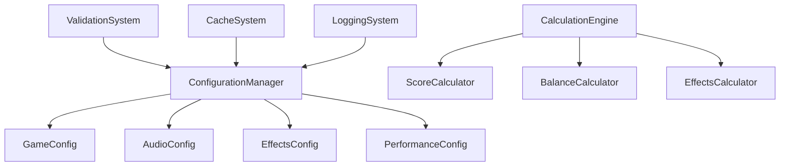

# 設定システム API ドキュメント

## 概要

新しい設定システムは、ゲームの設定値と計算処理を統一的に管理するためのシステムです。従来の分散した設定管理を改善し、型安全性、パフォーマンス、保守性を向上させます。

## アーキテクチャ



## 主要コンポーネント

### 1. ConfigurationManager

中央設定管理クラス。全ての設定値への統一されたアクセスポイントを提供します。

#### インポート

```javascript
import { getConfigurationManager } from '../core/ConfigurationManager.js';
```

#### 基本的な使用方法

```javascript
const configManager = getConfigurationManager();

// 設定値の取得
const masterVolume = configManager.get('audio', 'volumes.master', 0.7);

// 設定値の設定
configManager.set('audio', 'volumes.master', 0.8);

// 設定の監視
const watchId = configManager.watch('audio', 'volumes.master', (newValue, oldValue) => {
    console.log(`音量が ${oldValue} から ${newValue} に変更されました`);
});

// 監視の解除
configManager.unwatch(watchId);
```

#### API リファレンス

##### `get(category, key, defaultValue)`

設定値を取得します。

**パラメータ:**
- `category` (string): 設定カテゴリ ('game', 'audio', 'effects', 'performance')
- `key` (string): 設定キー (ドット記法対応: 'volumes.master')
- `defaultValue` (any): デフォルト値

**戻り値:** 設定値

**例:**
```javascript
const baseScore = configManager.get('game', 'scoring.baseScores.normal', 15);
const maxBubbles = configManager.get('performance', 'optimization.maxBubbles', 20);
```

##### `set(category, key, value)`

設定値を設定します。

**パラメータ:**
- `category` (string): 設定カテゴリ
- `key` (string): 設定キー
- `value` (any): 設定値

**戻り値:** boolean (設定成功フラグ)

**例:**
```javascript
configManager.set('game', 'scoring.baseScores.normal', 20);
configManager.set('audio', 'volumes.sfx', 0.9);
```

##### `validate(category, key, value)`

設定値を検証します。

**パラメータ:**
- `category` (string): 設定カテゴリ
- `key` (string): 設定キー
- `value` (any): 検証する値

**戻り値:** boolean (検証結果)

##### `watch(category, key, callback)`

設定変更を監視します。

**パラメータ:**
- `category` (string): 設定カテゴリ
- `key` (string): 設定キー
- `callback` (function): コールバック関数 `(newValue, oldValue, category, key) => {}`

**戻り値:** string (監視ID)

##### `unwatch(watchId)`

設定監視を解除します。

**パラメータ:**
- `watchId` (string): 監視ID

**戻り値:** boolean (解除成功フラグ)

##### `reset(category)`

設定をリセットします。

**パラメータ:**
- `category` (string, optional): リセットするカテゴリ (省略時は全て)

**戻り値:** boolean (リセット成功フラグ)

### 2. GameConfig

ゲーム設定を管理するクラス。スコア、ステージ、アイテム、泡の設定を提供します。

#### インポート

```javascript
import { getGameConfig } from '../config/GameConfig.js';
```

#### 基本的な使用方法

```javascript
const gameConfig = getGameConfig();

// スコア設定の取得
const scoreConfig = gameConfig.getScoreConfig();
console.log(scoreConfig.baseScores.normal); // 15

// 特定の泡タイプの基本スコア
const bubbleScore = gameConfig.getBubbleBaseScore('diamond');

// コンボ倍率の計算
const comboMultiplier = gameConfig.calculateComboMultiplier(5);

// アイテムコストの計算
const itemCost = gameConfig.calculateItemCost('scoreMultiplier', 2);
```

#### API リファレンス

##### `getScoreConfig()`

スコア設定を取得します。

**戻り値:** Object
```javascript
{
    baseScores: { normal: 15, stone: 35, ... },
    combo: { multiplierIncrement: 0.08, maxMultiplier: 2.5, ... },
    ageBonus: { earlyBonus: 2.0, lateBonus: 3.0, ... }
}
```

##### `getBubbleBaseScore(bubbleType)`

特定の泡タイプの基本スコアを取得します。

**パラメータ:**
- `bubbleType` (string): 泡タイプ

**戻り値:** number

##### `getStageConfig()`

ステージ設定を取得します。

**戻り値:** Object
```javascript
{
    unlockRequirements: { hard: 500, veryHard: 2000, ... },
    difficulty: { normal: { spawnRate: 1.5, maxBubbles: 20 }, ... }
}
```

##### `getItemConfig()`

アイテム設定を取得します。

**戻り値:** Object
```javascript
{
    baseCosts: { scoreMultiplier: 75, revival: 150, ... },
    costMultiplier: 1.3,
    effects: { scoreMultiplier: 1.3, ... },
    maxLevels: { scoreMultiplier: 5, ... }
}
```

##### `getBubbleConfig()`

泡設定を取得します。

**戻り値:** Object
```javascript
{
    maxAge: { normal: 12000, stone: 16000, ... },
    health: { normal: 1, stone: 2, ... },
    specialEffects: { ... }
}
```

##### `calculateScore(bubbleType, ageRatio)`

スコアを計算します（BalanceHelperからの移行）。

**パラメータ:**
- `bubbleType` (string): 泡タイプ
- `ageRatio` (number): 年齢比率 (0-1)

**戻り値:** number

##### `calculateComboMultiplier(comboCount)`

コンボ倍率を計算します。

**パラメータ:**
- `comboCount` (number): コンボ数

**戻り値:** number

##### `calculateItemCost(itemId, currentLevel)`

アイテムコストを計算します。

**パラメータ:**
- `itemId` (string): アイテムID
- `currentLevel` (number): 現在のレベル

**戻り値:** number

##### `isStageUnlocked(stageId, playerTAP)`

ステージの開放状態をチェックします。

**パラメータ:**
- `stageId` (string): ステージID
- `playerTAP` (number): プレイヤーのTAP値

**戻り値:** boolean

### 3. AudioConfig

音声設定を管理するクラス。音量、音質、音響効果の設定を提供します。

#### インポート

```javascript
import { getAudioConfig } from '../config/AudioConfig.js';
```

#### 基本的な使用方法

```javascript
const audioConfig = getAudioConfig();

// 音量設定の取得
const volumeConfig = audioConfig.getVolumeConfig();
console.log(volumeConfig.master); // 0.7

// マスター音量の設定
audioConfig.setMasterVolume(0.8);

// ミュート状態の切り替え
const newMuteState = audioConfig.toggleMute();

// AudioManagerとの連携
audioConfig.applyToAudioManager(audioManager);
```

#### API リファレンス

##### `getVolumeConfig()`

音量設定を取得します。

**戻り値:** Object
```javascript
{
    master: 0.7,
    sfx: 0.8,
    bgm: 0.5,
    muted: false
}
```

##### `getMasterVolume()` / `getSfxVolume()` / `getBgmVolume()`

各音量を取得します。

**戻り値:** number (0-1)

##### `setMasterVolume(volume)` / `setSfxVolume(volume)` / `setBgmVolume(volume)`

各音量を設定します。

**パラメータ:**
- `volume` (number): 音量 (0-1)

**戻り値:** boolean

##### `isMuted()` / `setMuted(muted)` / `toggleMute()`

ミュート状態の取得・設定・切り替えを行います。

##### `getQualityConfig()`

音質設定を取得します。

**戻り値:** Object
```javascript
{
    sampleRate: 44100,
    bufferSize: 4096,
    channels: 1,
    bitDepth: 16
}
```

##### `getEffectConfig()`

音響効果設定を取得します。

**戻り値:** Object
```javascript
{
    reverb: true,
    compression: true,
    compressor: { threshold: -20, knee: 40, ... },
    reverb: { duration: 2.0, decay: 0.5, ... }
}
```

##### `applyToAudioManager(audioManager)`

AudioManagerに設定を適用します。

**パラメータ:**
- `audioManager` (AudioManager): AudioManagerインスタンス

### 4. EffectsConfig

視覚効果設定を管理するクラス。パーティクル、画面効果、アニメーションの設定を提供します。

#### インポート

```javascript
import { getEffectsConfig } from '../config/EffectsConfig.js';
```

#### 基本的な使用方法

```javascript
const effectsConfig = getEffectsConfig();

// パーティクル設定の取得
const particleConfig = effectsConfig.getParticleConfig();
console.log(particleConfig.maxCount); // 500

// 最大パーティクル数の設定
effectsConfig.setMaxParticleCount(300);

// 画面効果の有効/無効
effectsConfig.setScreenEffectEnabled(false);

// ParticleManagerとの連携
effectsConfig.applyToParticleManager(particleManager);
```

#### API リファレンス

##### `getParticleConfig()`

パーティクル設定を取得します。

**戻り値:** Object
```javascript
{
    maxCount: 500,
    poolSize: 100,
    quality: 1.0,
    enabled: true,
    bubble: { count: 15, size: 3, speed: 100, life: 800 },
    star: { count: 10, size: 4, speed: 80, life: 1200 },
    explosion: { count: 30, size: 5, speed: 150, life: 1500 }
}
```

##### `getMaxParticleCount()` / `setMaxParticleCount(count)`

最大パーティクル数の取得・設定を行います。

##### `getParticleQuality()` / `setParticleQuality(quality)`

パーティクル品質の取得・設定を行います。

**パラメータ:**
- `quality` (number): 品質 (0.1-2.0)

##### `getScreenEffectConfig()`

画面効果設定を取得します。

**戻り値:** Object
```javascript
{
    shakeIntensity: 1.0,
    flashDuration: 200,
    zoomSensitivity: 1.0,
    enabled: true,
    shake: { intensity: 10, duration: 500, damping: 0.9 },
    flash: { intensity: 0.5, duration: 200 },
    zoom: { min: 0.8, max: 1.2, speed: 0.3 },
    tint: { intensity: 0.3, duration: 500 }
}
```

##### `getAnimationConfig()`

アニメーション設定を取得します。

**戻り値:** Object
```javascript
{
    duration: 300,
    easing: 'easeOut',
    enabled: true,
    pop: { duration: 300, scale: 1.2, easing: 'easeOutBack' },
    fade: { duration: 500, easing: 'easeInOut' },
    slide: { duration: 400, distance: 50, easing: 'easeOutQuad' },
    bounce: { duration: 600, height: 30, easing: 'easeOutBounce' }
}
```

##### `applyToParticleManager(particleManager)`

ParticleManagerに設定を適用します。

**パラメータ:**
- `particleManager` (ParticleManager): ParticleManagerインスタンス

##### `applyToEffectManager(effectManager)`

EffectManagerに設定を適用します。

**パラメータ:**
- `effectManager` (EffectManager): EffectManagerインスタンス

### 5. PerformanceConfig

パフォーマンス設定を管理するクラス。最適化、リソース制限、品質の設定を提供します。

#### インポート

```javascript
import { getPerformanceConfig } from '../config/PerformanceConfig.js';
```

#### 基本的な使用方法

```javascript
const performanceConfig = getPerformanceConfig();

// 最適化設定の取得
const optimizationConfig = performanceConfig.getOptimizationConfig();
console.log(optimizationConfig.targetFPS); // 60

// パフォーマンスレベルの設定
performanceConfig.setPerformanceLevel('medium');

// 品質プリセットの適用
performanceConfig.applyQualityPreset('low');

// PerformanceOptimizerとの連携
performanceConfig.applyToPerformanceOptimizer(optimizer);
```

#### API リファレンス

##### `getOptimizationConfig()`

最適化設定を取得します。

**戻り値:** Object
```javascript
{
    targetFPS: 60,
    adaptiveMode: true,
    optimizationInterval: 1000,
    maxHistorySize: 30,
    performanceLevel: 'high',
    maxBubbles: 20,
    maxParticles: 500,
    workloadDistribution: true,
    maxTimePerFrame: 8
}
```

##### `getResourceLimitConfig()`

リソース制限設定を取得します。

**戻り値:** Object
```javascript
{
    memoryThreshold: 100,
    fpsThreshold: 30,
    maxTextureSize: 2048,
    maxAssetSize: 5,
    autoAdjust: true,
    warningThreshold: 0.8,
    criticalThreshold: 0.95,
    cleanupInterval: 30000
}
```

##### `getQualityConfig()`

品質設定を取得します。

**戻り値:** Object
```javascript
{
    renderQuality: 1.0,
    particleQuality: 1.0,
    effectQuality: 1.0,
    audioQuality: 1.0,
    enableShadows: true,
    enableBlur: true,
    enableAntiAliasing: true,
    enableReflections: true
}
```

##### `getPerformanceLevel()` / `setPerformanceLevel(level)`

パフォーマンスレベルの取得・設定を行います。

**パラメータ:**
- `level` (string): パフォーマンスレベル ('low', 'medium', 'high')

##### `applyQualityPreset(presetName)`

品質プリセットを適用します。

**パラメータ:**
- `presetName` (string): プリセット名 ('low', 'medium', 'high')

**戻り値:** boolean

##### `applyToPerformanceOptimizer(optimizer)`

PerformanceOptimizerに設定を適用します。

**パラメータ:**
- `optimizer` (PerformanceOptimizer): PerformanceOptimizerインスタンス

## 計算処理システム

### 1. CalculationEngine

計算処理の統一管理クラス。各種計算処理を登録して使用します。

#### インポート

```javascript
import { getCalculationEngine } from '../core/CalculationEngine.js';
```

#### 基本的な使用方法

```javascript
const calcEngine = getCalculationEngine();

// スコア計算
const scoreResult = calcEngine.calculate('score', 'calculateTotalScore', [{
    bubbleType: 'diamond',
    ageRatio: 0.8,
    comboCount: 5,
    specialMultiplier: 1.2
}]);

// バランス計算
const itemCost = calcEngine.calculate('balance', 'calculateItemCost', ['scoreMultiplier', 2]);

// エフェクト計算
const particleCount = calcEngine.calculate('effects', 'calculateParticleCount', ['bubble_pop', 1.0]);
```

#### API リファレンス

##### `calculate(type, method, params, options)`

計算を実行します。

**パラメータ:**
- `type` (string): 計算タイプ ('score', 'balance', 'effects')
- `method` (string): 計算メソッド名
- `params` (Array): 計算パラメータ
- `options` (Object): オプション

**戻り値:** 計算結果

##### `registerCalculator(type, calculator)`

計算処理クラスを登録します。

**パラメータ:**
- `type` (string): 計算タイプ
- `calculator` (Object): 計算処理クラスのインスタンス

##### `getCachedResult(key)` / `setCachedResult(key, result)`

キャッシュの取得・設定を行います。

##### `clearCache(type)`

キャッシュをクリアします。

**パラメータ:**
- `type` (string, optional): 特定のタイプのみクリア

##### `getCacheStats()`

キャッシュ統計を取得します。

**戻り値:** Object
```javascript
{
    size: 150,
    maxSize: 2000,
    hits: 1250,
    misses: 300,
    totalRequests: 1550,
    hitRate: "80.65%"
}
```

### 2. ScoreCalculator

スコア計算の専門クラス。

#### 主要メソッド

##### `calculateBaseScore(bubbleType, ageRatio)`

基本スコアを計算します。

**パラメータ:**
- `bubbleType` (string): 泡タイプ
- `ageRatio` (number): 年齢比率 (0-1)

**戻り値:** number

##### `calculateComboMultiplier(comboCount)`

コンボ倍率を計算します。

**パラメータ:**
- `comboCount` (number): コンボ数

**戻り値:** number

##### `calculateTotalScore(params)`

総合スコアを計算します。

**パラメータ:**
- `params` (Object): 計算パラメータ
  - `bubbleType` (string): 泡タイプ
  - `ageRatio` (number): 年齢比率
  - `comboCount` (number): コンボ数
  - `specialMultiplier` (number): 特殊効果倍率
  - `itemMultiplier` (number): アイテム倍率

**戻り値:** Object
```javascript
{
    baseScore: 120,
    finalScore: 180,
    comboBonus: 40,
    multipliers: {
        age: 3.0,
        combo: 1.32,
        special: 1.2,
        item: 1.0,
        total: 4.752
    },
    breakdown: {
        bubbleType: 'diamond',
        ageRatio: 0.9,
        comboCount: 5
    }
}
```

### 3. BalanceCalculator

ゲームバランス計算の専門クラス。

#### 主要メソッド

##### `calculateDifficulty(stageId, playerLevel)`

難易度調整を計算します。

**パラメータ:**
- `stageId` (string): ステージID
- `playerLevel` (number): プレイヤーレベル

**戻り値:** Object
```javascript
{
    spawnRate: 1.5,
    maxBubbles: 20,
    originalSpawnRate: 1.5,
    originalMaxBubbles: 20,
    levelAdjustment: {
        spawnRateMultiplier: 1.0,
        maxBubblesMultiplier: 1.0,
        playerLevel: 1
    }
}
```

##### `calculateItemCost(itemId, currentLevel)`

アイテムコストを計算します。

**パラメータ:**
- `itemId` (string): アイテムID
- `currentLevel` (number): 現在のレベル

**戻り値:** number

##### `isStageUnlocked(stageId, playerTAP)`

ステージの開放状態をチェックします。

**パラメータ:**
- `stageId` (string): ステージID
- `playerTAP` (number): プレイヤーのTAP値

**戻り値:** boolean

### 4. EffectsCalculator

エフェクト関連計算の専門クラス。

#### 主要メソッド

##### `calculateParticleCount(effectType, intensity, modifiers)`

パーティクル数を計算します。

**パラメータ:**
- `effectType` (string): エフェクトタイプ
- `intensity` (number): 強度 (0-1)
- `modifiers` (Object): 修正値

**戻り値:** number

##### `calculateAnimationDuration(effectType, complexity, modifiers)`

アニメーション時間を計算します。

**パラメータ:**
- `effectType` (string): エフェクトタイプ
- `complexity` (number): 複雑度 (0-1)
- `modifiers` (Object): 修正値

**戻り値:** number (ミリ秒)

##### `calculateEffectIntensity(baseIntensity, modifiers)`

効果強度を計算します。

**パラメータ:**
- `baseIntensity` (number): 基本強度
- `modifiers` (Array): 修正値の配列

**戻り値:** number

## 使用例とベストプラクティス

### 基本的な設定管理

```javascript
// 設定の取得と設定
const configManager = getConfigurationManager();

// 音量設定
const masterVolume = configManager.get('audio', 'volumes.master', 0.7);
configManager.set('audio', 'volumes.master', 0.8);

// ゲーム設定
const maxBubbles = configManager.get('game', 'bubbles.maxAge.normal', 12000);
configManager.set('performance', 'optimization.maxBubbles', 25);
```

### 設定の監視と動的反映

```javascript
// 音量変更の監視
const volumeWatchId = configManager.watch('audio', 'volumes.master', (newValue, oldValue) => {
    audioManager.setMasterVolume(newValue);
    console.log(`マスター音量: ${oldValue} → ${newValue}`);
});

// パーティクル数変更の監視
const particleWatchId = configManager.watch('effects', 'particles.maxCount', (newValue) => {
    particleManager.setMaxParticles(newValue);
});

// 監視の解除（コンポーネント破棄時など）
configManager.unwatch(volumeWatchId);
configManager.unwatch(particleWatchId);
```

### 計算処理の使用

```javascript
const calcEngine = getCalculationEngine();

// スコア計算
const scoreData = calcEngine.calculate('score', 'calculateTotalScore', [{
    bubbleType: 'diamond',
    ageRatio: 0.9,
    comboCount: 8,
    specialMultiplier: 1.5,
    itemMultiplier: 1.3
}]);

console.log(`最終スコア: ${scoreData.finalScore}`);
console.log(`コンボボーナス: ${scoreData.comboBonus}`);

// アイテムコスト計算
const upgradeCost = calcEngine.calculate('balance', 'calculateItemCost', ['scoreMultiplier', 3]);
console.log(`アップグレードコスト: ${upgradeCost}`);

// エフェクト計算
const particleCount = calcEngine.calculate('effects', 'calculateParticleCount', ['explosion', 1.0, {
    countMultiplier: 1.2,
    countBonus: 5
}]);
console.log(`パーティクル数: ${particleCount}`);
```

### 設定クラスの直接使用

```javascript
// GameConfigの使用
const gameConfig = getGameConfig();
const bubbleScore = gameConfig.getBubbleBaseScore('rainbow');
const comboMultiplier = gameConfig.calculateComboMultiplier(10);

// AudioConfigの使用
const audioConfig = getAudioConfig();
audioConfig.setMasterVolume(0.9);
audioConfig.applyToAudioManager(audioManager);

// EffectsConfigの使用
const effectsConfig = getEffectsConfig();
effectsConfig.setMaxParticleCount(300);
effectsConfig.applyToParticleManager(particleManager);

// PerformanceConfigの使用
const performanceConfig = getPerformanceConfig();
performanceConfig.applyQualityPreset('medium');
performanceConfig.applyToPerformanceOptimizer(optimizer);
```

### パフォーマンス最適化

```javascript
// キャッシュ統計の確認
const cacheStats = calcEngine.getCacheStats();
console.log(`キャッシュヒット率: ${cacheStats.hitRate}`);

// 頻繁にアクセスされる設定のプリロード
configManager.addPreloadKey('game', 'scoring.baseScores.normal');
configManager.addPreloadKey('performance', 'optimization.maxBubbles');

// キャッシュのウォームアップ
configManager.warmupCache();

// メモ化の有効化
calcEngine.enableMemoization('score', ['calculateBaseScore', 'calculateComboMultiplier']);
```

### エラーハンドリング

```javascript
try {
    // 設定値の検証
    const isValid = configManager.validate('audio', 'volumes.master', 1.5);
    if (!isValid) {
        console.warn('音量値が範囲外です');
    }
    
    // 計算実行
    const result = calcEngine.calculate('score', 'calculateTotalScore', [params]);
} catch (error) {
    console.error('設定または計算でエラーが発生しました:', error);
    // フォールバック処理
}
```

## ベストプラクティス

### 1. 設定の命名規則

- カテゴリ: 'game', 'audio', 'effects', 'performance'
- キー: ドット記法を使用 ('volumes.master', 'scoring.baseScores.normal')
- 一貫性のある命名を心がける

### 2. パフォーマンス考慮事項

- 頻繁にアクセスされる設定はプリロードキーに追加
- 重い計算処理にはメモ化を活用
- キャッシュ統計を定期的に確認

### 3. 設定の監視

- コンポーネント破棄時は必ず監視を解除
- 監視コールバックでは軽量な処理のみ実行
- 必要に応じてデバウンス処理を実装

### 4. エラーハンドリング

- 設定値には常にデフォルト値を指定
- 検証ルールを適切に設定
- エラー時のフォールバック処理を実装

### 5. 型安全性

- TypeScriptを使用する場合は適切な型定義を作成
- 設定値の型を統一
- 検証ルールで型チェックを実装

## トラブルシューティング

### よくある問題と解決方法

#### 1. 設定値が反映されない

**原因:** キャッシュが古い、または監視が正しく設定されていない

**解決方法:**
```javascript
// キャッシュをクリア
configManager.clearCache();

// 設定の監視を確認
const watchId = configManager.watch('category', 'key', callback);
```

#### 2. パフォーマンスが低下する

**原因:** キャッシュヒット率が低い、または重い計算が頻繁に実行されている

**解決方法:**
```javascript
// キャッシュ統計を確認
const stats = calcEngine.getCacheStats();
console.log('ヒット率:', stats.hitRate);

// メモ化を有効化
calcEngine.enableMemoization('score', ['heavyCalculationMethod']);
```

#### 3. 設定値の検証エラー

**原因:** 検証ルールに適合しない値が設定されている

**解決方法:**
```javascript
// 検証ルールを確認
const isValid = configManager.validate('category', 'key', value);
if (!isValid) {
    // 適切な値に修正
    configManager.set('category', 'key', defaultValue);
}
```

#### 4. メモリ使用量の増加

**原因:** キャッシュサイズが大きすぎる、またはメモリリークが発生している

**解決方法:**
```javascript
// キャッシュサイズを調整
configManager.cacheConfig.maxSize = 1000;

// 定期的なクリーンアップ
setInterval(() => {
    configManager.clearCache();
}, 300000); // 5分間隔
```

## 関連ドキュメント

- [既存システムからの移行ガイド](./migration-guide.md)
- [設計ドキュメント](../specs/configuration-refactoring/design.md)
- [要件定義書](../specs/configuration-refactoring/requirements.md)
- [実装タスクリスト](../specs/configuration-refactoring/tasks.md)