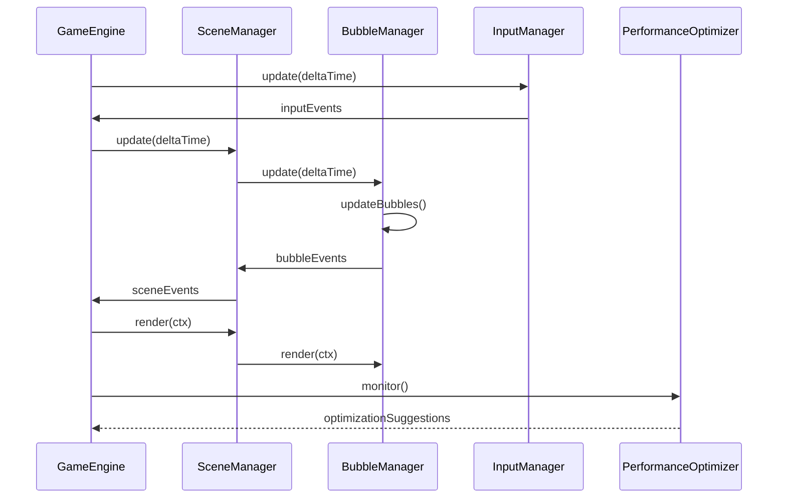
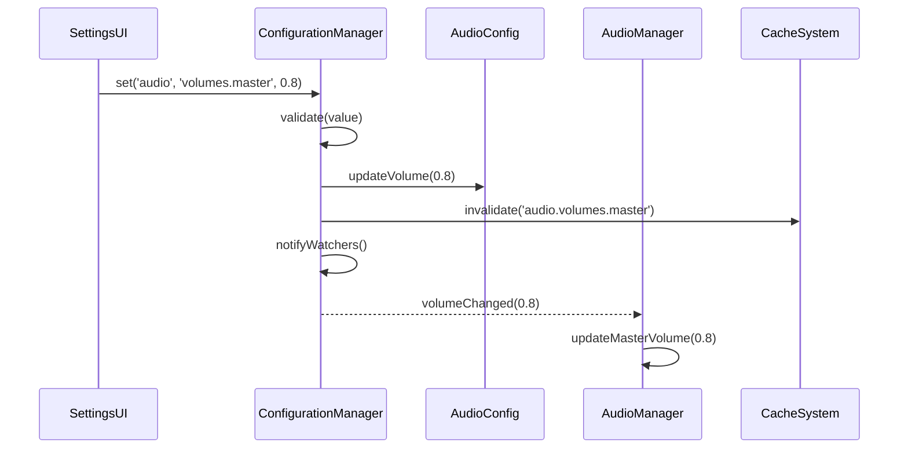

# アーキテクチャガイド

## 概要

BubblePop (awaputi) は、モダンな Web 技術とクリーンアーキテクチャの原則に基づいて設計されたブラウザゲームです。このガイドでは、プロジェクトのアーキテクチャパターン、設計方針、およびコーディング規約について詳しく説明します。

## アーキテクチャ原則

### 1. 設計方針

#### モジュラー設計
- **責任分離**: 各コンポーネントは単一の責任を持つ
- **低結合**: コンポーネント間の依存関係を最小化
- **高凝集**: 関連する機能を1つのモジュールにまとめる
- **拡張性**: 新しい機能を容易に追加できる構造

#### パフォーマンス重視
- **60FPS 維持**: スムーズなゲーム体験の保証
- **メモリ効率**: リソースの適切な管理
- **レスポンシブ**: 様々なデバイスサイズに対応
- **最適化**: 継続的なパフォーマンス改善

#### 開発者体験
- **保守性**: コードの理解と修正が容易
- **テスタビリティ**: 包括的なテスト可能性
- **ドキュメント**: 充実した技術文書
- **ツール**: 開発効率を向上させるツール群

### 2. 技術スタック

#### 核となる技術
```javascript
// ES6+ Modules - モジュールシステム
import { GameEngine } from './core/GameEngine.js';
export { BubbleManager };

// Canvas 2D API - レンダリング
const ctx = canvas.getContext('2d');

// Web APIs - ブラウザ機能
localStorage.setItem('playerData', JSON.stringify(data));
navigator.language; // 言語検出
```

#### 開発・テストツール
- **Jest**: ユニット・統合テスト
- **Playwright**: E2E テスト
- **ESLint**: コード品質チェック
- **Vite**: 開発環境（テスト用）

## システムアーキテクチャ

### 1. 全体構成

```mermaid
graph TB
    subgraph "プレゼンテーション層"
        A[GameEngine] --> B[SceneManager]
        B --> C[MainMenuScene]
        B --> D[GameScene]
        B --> E[ShopScene]
        B --> F[UserInfoScene]
    end
    
    subgraph "ビジネスロジック層"
        G[BubbleManager] --> H[Bubble]
        I[ScoreManager] --> J[ComboSystem]
        K[StageManager] --> L[DifficultySystem]
        M[ItemSystem] --> N[ShopManager]
    end
    
    subgraph "データアクセス層"
        O[PlayerData] --> P[LocalStorage]
        Q[ConfigurationManager] --> R[GameConfig]
        Q --> S[AudioConfig]
        Q --> T[EffectsConfig]
        Q --> U[PerformanceConfig]
    end
    
    subgraph "インフラストラクチャ層"
        V[InputManager] --> W[TouchInput]
        V --> X[MouseInput]
        Y[AudioManager] --> Z[SoundEffects]
        AA[PerformanceOptimizer] --> BB[ObjectPool]
        CC[ErrorHandler] --> DD[Logging]
    end
    
    A --> G
    A --> I
    A --> K
    A --> M
    A --> O
    A --> Q
    A --> V
    A --> Y
    A --> AA
    A --> CC
```



### 2. レイヤード アーキテクチャ

#### プレゼンテーション層 (Presentation Layer)
**責任**: ユーザーインターフェース、ユーザーインタラクション

```javascript
// GameEngine.js - メインゲームループ
class GameEngine {
    constructor(canvas) {
        this.canvas = canvas;
        this.ctx = canvas.getContext('2d');
        this.sceneManager = new SceneManager(this);
        this.inputManager = new InputManager(this.canvas);
        
        // システム初期化
        this.initializeSystems();
    }
    
    update(deltaTime) {
        // ゲーム状態更新
        this.sceneManager.update(deltaTime);
        this.inputManager.update(deltaTime);
    }
    
    render() {
        // 描画処理
        this.sceneManager.render(this.ctx);
    }
}
```

#### ビジネスロジック層 (Business Logic Layer)
**責任**: ゲームルール、計算処理、状態管理

```javascript
// BubbleManager.js - バブル管理ロジック
class BubbleManager {
    constructor(gameEngine) {
        this.gameEngine = gameEngine;
        this.bubbles = [];
        this.objectPool = new ObjectPool(Bubble, 50);
        
        // 設定の取得
        this.config = getConfigurationManager();
        this.maxBubbles = this.config.get('performance', 'optimization.maxBubbles', 20);
    }
    
    spawnBubble(type, position) {
        // ビジネスルール: 最大バブル数チェック
        if (this.bubbles.length >= this.maxBubbles) {
            return null;
        }
        
        // オブジェクトプールから取得
        const bubble = this.objectPool.acquire();
        bubble.initialize(type, position);
        
        this.bubbles.push(bubble);
        return bubble;
    }
    
    popBubble(bubbleId) {
        const bubble = this.findBubble(bubbleId);
        if (!bubble || !bubble.canBePoppedNow()) {
            return false;
        }
        
        // スコア計算 (ビジネスロジック)
        const score = this.calculatePopScore(bubble);
        this.gameEngine.scoreManager.addScore(score);
        
        // バブル削除
        this.removeBubble(bubble);
        return true;
    }
}
```

#### データアクセス層 (Data Access Layer)
**責任**: データ永続化、設定管理、外部データアクセス

```javascript
// ConfigurationManager.js - 統一設定管理
class ConfigurationManager {
    constructor() {
        this.configs = new Map();
        this.cache = new CacheSystem();
        this.validators = new Map();
        this.watchers = new Map();
    }
    
    get(category, key, defaultValue = null) {
        // キャッシュから取得を試行
        const cacheKey = `${category}.${key}`;
        const cached = this.cache.get(cacheKey);
        if (cached !== null) {
            return cached;
        }
        
        // 設定値を取得
        const config = this.getConfig(category);
        const value = this.getNestedValue(config, key, defaultValue);
        
        // キャッシュに保存
        this.cache.set(cacheKey, value);
        return value;
    }
    
    set(category, key, value) {
        // 検証
        if (!this.validate(category, key, value)) {
            throw new Error(`Invalid value for ${category}.${key}: ${value}`);
        }
        
        // 設定値を更新
        const config = this.getConfig(category);
        this.setNestedValue(config, key, value);
        
        // キャッシュ更新
        const cacheKey = `${category}.${key}`;
        this.cache.set(cacheKey, value);
        
        // ウォッチャーに通知
        this.notifyWatchers(category, key, value);
        
        return true;
    }
}
```

#### インフラストラクチャ層 (Infrastructure Layer)
**責任**: 外部システム連携、横断的関心事

```javascript
// PerformanceOptimizer.js - パフォーマンス最適化
class PerformanceOptimizer {
    constructor() {
        this.metrics = new PerformanceMetrics();
        this.thresholds = {
            fps: 30,
            memoryUsage: 100 * 1024 * 1024, // 100MB
            renderTime: 16 // 16ms
        };
    }
    
    monitor() {
        const fps = this.metrics.getFPS();
        const memory = this.metrics.getMemoryUsage();
        const renderTime = this.metrics.getRenderTime();
        
        // パフォーマンス閾値チェック
        if (fps < this.thresholds.fps) {
            this.optimizeFPS();
        }
        
        if (memory > this.thresholds.memoryUsage) {
            this.optimizeMemory();
        }
        
        if (renderTime > this.thresholds.renderTime) {
            this.optimizeRendering();
        }
    }
    
    optimizeFPS() {
        // 品質を下げてFPSを改善
        const effectsConfig = getEffectsConfig();
        effectsConfig.setParticleQuality(0.5);
        effectsConfig.setMaxParticleCount(250);
    }
}
```

## 設計パターン

### 1. Singleton パターン

システム全体で単一インスタンスが必要なクラスに使用：

```javascript
// ConfigurationManager - 設定管理の単一点
let configurationManagerInstance = null;

export function getConfigurationManager() {
    if (!configurationManagerInstance) {
        configurationManagerInstance = new ConfigurationManager();
    }
    return configurationManagerInstance;
}

// 使用例
const config = getConfigurationManager();
const masterVolume = config.get('audio', 'volumes.master', 0.7);
```

### 2. Observer パターン

設定変更やゲームイベントの監視に使用：

```javascript
// EventEmitter による実装
class EventEmitter {
    constructor() {
        this.events = new Map();
    }
    
    on(eventName, callback) {
        if (!this.events.has(eventName)) {
            this.events.set(eventName, []);
        }
        this.events.get(eventName).push(callback);
    }
    
    emit(eventName, ...args) {
        const callbacks = this.events.get(eventName);
        if (callbacks) {
            callbacks.forEach(callback => callback(...args));
        }
    }
}

// 使用例: スコア変更の監視
class ScoreManager extends EventEmitter {
    addScore(points) {
        this.score += points;
        this.emit('scoreChanged', this.score, points);
    }
}

const scoreManager = new ScoreManager();
scoreManager.on('scoreChanged', (newScore, addedPoints) => {
    console.log(`スコア追加: +${addedPoints} (合計: ${newScore})`);
});
```

### 3. Strategy パターン

泡の種類ごとの異なる振る舞いを実装：

```javascript
// バブルタイプごとの戦略
class BubbleStrategy {
    pop(bubble) {
        throw new Error('pop method must be implemented');
    }
    
    update(bubble, deltaTime) {
        throw new Error('update method must be implemented');
    }
}

class NormalBubbleStrategy extends BubbleStrategy {
    pop(bubble) {
        return bubble.baseScore;
    }
    
    update(bubble, deltaTime) {
        bubble.age += deltaTime;
    }
}

class RainbowBubbleStrategy extends BubbleStrategy {
    pop(bubble) {
        // ボーナスタイム発動
        bubble.gameEngine.startBonusTime();
        return bubble.baseScore * 2;
    }
}

// Bubble クラスでの使用
class Bubble {
    constructor(type, position) {
        this.type = type;
        this.position = position;
        this.strategy = this.createStrategy(type);
    }
    
    createStrategy(type) {
        const strategies = {
            'normal': new NormalBubbleStrategy(),
            'rainbow': new RainbowBubbleStrategy(),
            'stone': new StoneBubbleStrategy(),
            // 他のタイプ...
        };
        return strategies[type] || new NormalBubbleStrategy();
    }
    
    pop() {
        return this.strategy.pop(this);
    }
    
    update(deltaTime) {
        this.strategy.update(this, deltaTime);
    }
}
```

### 4. Factory パターン

設定オブジェクトやバブルの生成に使用：

```javascript
// ConfigFactory - 設定オブジェクト生成
class ConfigFactory {
    static createConfig(type) {
        switch (type) {
            case 'game':
                return new GameConfig();
            case 'audio':
                return new AudioConfig();
            case 'effects':
                return new EffectsConfig();
            case 'performance':
                return new PerformanceConfig();
            default:
                throw new Error(`Unknown config type: ${type}`);
        }
    }
}

// BubbleFactory - バブル生成
class BubbleFactory {
    constructor() {
        this.objectPools = new Map();
        
        // タイプごとのオブジェクトプール
        const bubbleTypes = ['normal', 'stone', 'rainbow', 'boss'];
        bubbleTypes.forEach(type => {
            this.objectPools.set(type, new ObjectPool(() => new Bubble(type), 20));
        });
    }
    
    createBubble(type, position) {
        const pool = this.objectPools.get(type);
        if (!pool) {
            throw new Error(`Unknown bubble type: ${type}`);
        }
        
        const bubble = pool.acquire();
        bubble.reset(position);
        return bubble;
    }
    
    releaseBubble(bubble) {
        const pool = this.objectPools.get(bubble.type);
        if (pool) {
            pool.release(bubble);
        }
    }
}
```

### 5. Object Pool パターン

頻繁に生成・削除されるオブジェクトの最適化：

```javascript
// ObjectPool - 汎用オブジェクトプール
class ObjectPool {
    constructor(createFn, initialSize = 10) {
        this.createFn = createFn;
        this.pool = [];
        this.used = new Set();
        
        // 初期オブジェクト生成
        for (let i = 0; i < initialSize; i++) {
            this.pool.push(this.createFn());
        }
    }
    
    acquire() {
        let obj;
        if (this.pool.length > 0) {
            obj = this.pool.pop();
        } else {
            obj = this.createFn();
        }
        
        this.used.add(obj);
        return obj;
    }
    
    release(obj) {
        if (this.used.has(obj)) {
            this.used.delete(obj);
            obj.reset?.(); // リセットメソッドがあれば呼び出し
            this.pool.push(obj);
        }
    }
    
    getStats() {
        return {
            poolSize: this.pool.length,
            usedCount: this.used.size,
            totalCount: this.pool.length + this.used.size
        };
    }
}

// 使用例
const bubblePool = new ObjectPool(() => new Bubble(), 50);

// バブル取得
const bubble = bubblePool.acquire();
bubble.initialize('normal', { x: 100, y: 100 });

// バブル返却
bubblePool.release(bubble);
```

## データフロー

### 1. ゲームループのデータフロー



### 2. 設定変更のデータフロー



### 3. スコア計算のデータフロー

```javascript
// スコア計算パイプライン
class ScoreCalculationPipeline {
    constructor() {
        this.calculationEngine = getCalculationEngine();
        this.steps = [
            this.calculateBaseScore,
            this.applyAgeBonus,
            this.applyComboMultiplier,
            this.applyItemMultiplier,
            this.applySpecialEffects
        ];
    }
    
    calculateScore(bubbleData) {
        let result = {
            baseScore: 0,
            finalScore: 0,
            multipliers: {},
            breakdown: {}
        };
        
        // パイプライン実行
        for (const step of this.steps) {
            result = step.call(this, bubbleData, result);
        }
        
        return result;
    }
    
    calculateBaseScore(bubbleData, result) {
        const baseScore = this.calculationEngine.calculate(
            'score', 'calculateBaseScore', 
            [bubbleData.type, bubbleData.ageRatio]
        );
        
        result.baseScore = baseScore;
        result.finalScore = baseScore;
        result.breakdown.baseScore = baseScore;
        
        return result;
    }
    
    applyComboMultiplier(bubbleData, result) {
        const comboMultiplier = this.calculationEngine.calculate(
            'score', 'calculateComboMultiplier',
            [bubbleData.comboCount]
        );
        
        result.multipliers.combo = comboMultiplier;
        result.finalScore *= comboMultiplier;
        result.breakdown.comboBonus = result.finalScore - result.baseScore;
        
        return result;
    }
}
```

## コンポーネント設計

### 1. コア コンポーネント

#### GameEngine - 中央制御
```javascript
class GameEngine {
    constructor(canvas) {
        // 基本システム
        this.canvas = canvas;
        this.ctx = canvas.getContext('2d');
        this.running = false;
        this.lastTime = 0;
        
        // マネージャー初期化
        this.sceneManager = new SceneManager(this);
        this.inputManager = new InputManager(this.canvas);
        this.audioManager = new AudioManager();
        this.performanceOptimizer = new PerformanceOptimizer();
        
        // 設定管理
        this.configManager = getConfigurationManager();
        
        // エラーハンドリング
        this.errorHandler = new ErrorHandler('GameEngine');
        
        // システム統合
        this.initializeSystems();
    }
    
    initializeSystems() {
        // 設定の監視とシステム連携
        this.configManager.watch('audio', 'volumes.master', (newValue) => {
            this.audioManager.setMasterVolume(newValue);
        });
        
        this.configManager.watch('performance', 'optimization.maxBubbles', (newValue) => {
            this.sceneManager.currentScene?.bubbleManager?.setMaxBubbles(newValue);
        });
    }
    
    gameLoop(currentTime) {
        try {
            const deltaTime = currentTime - this.lastTime;
            this.lastTime = currentTime;
            
            // システム更新
            this.update(deltaTime);
            this.render();
            
            // パフォーマンス監視
            this.performanceOptimizer.monitor();
            
            if (this.running) {
                requestAnimationFrame(this.gameLoop.bind(this));
            }
        } catch (error) {
            this.errorHandler.handle(error, {
                context: 'gameLoop',
                currentTime: currentTime,
                severity: 'critical'
            });
        }
    }
}
```

#### Scene システム
```javascript
// BaseScene - 共通シーン機能
class BaseScene {
    constructor(gameEngine) {
        this.gameEngine = gameEngine;
        this.initialized = false;
        this.components = new Map();
        this.eventListeners = new Map();
    }
    
    addComponent(name, component) {
        this.components.set(name, component);
        
        // コンポーネントにシーン参照を設定
        if (component.setScene) {
            component.setScene(this);
        }
        
        return component;
    }
    
    getComponent(name) {
        return this.components.get(name);
    }
    
    update(deltaTime) {
        if (!this.initialized) return;
        
        // 全コンポーネント更新
        for (const [name, component] of this.components) {
            if (component.update) {
                component.update(deltaTime);
            }
        }
    }
    
    render(ctx) {
        if (!this.initialized) return;
        
        // 背景クリア
        ctx.clearRect(0, 0, this.gameEngine.canvas.width, this.gameEngine.canvas.height);
        
        // 全コンポーネント描画
        for (const [name, component] of this.components) {
            if (component.render) {
                component.render(ctx);
            }
        }
    }
    
    cleanup() {
        // イベントリスナー解除
        for (const [element, listeners] of this.eventListeners) {
            for (const [event, handler] of listeners) {
                element.removeEventListener(event, handler);
            }
        }
        this.eventListeners.clear();
        
        // コンポーネントクリーンアップ
        for (const [name, component] of this.components) {
            if (component.cleanup) {
                component.cleanup();
            }
        }
        this.components.clear();
    }
}

// GameScene - メインゲーム画面
class GameScene extends BaseScene {
    initialize() {
        if (this.initialized) return;
        
        // ゲーム固有コンポーネント
        this.addComponent('bubbleManager', new BubbleManager(this.gameEngine));
        this.addComponent('scoreManager', new ScoreManager(this.gameEngine));
        this.addComponent('particleManager', new ParticleManager(this.gameEngine));
        this.addComponent('effectManager', new EffectManager(this.gameEngine));
        
        // UI コンポーネント
        this.addComponent('gameUI', new GameUI(this.gameEngine));
        this.addComponent('pauseDialog', new PauseDialog(this.gameEngine));
        
        // ゲーム状態管理
        this.gameState = {
            playing: false,
            paused: false,
            gameTime: 0,
            maxTime: 300000 // 5分
        };
        
        super.initialize();
    }
    
    startGame() {
        this.gameState.playing = true;
        this.gameState.gameTime = 0;
        
        // バブル生成開始
        const bubbleManager = this.getComponent('bubbleManager');
        bubbleManager.startSpawning();
        
        // BGM 開始
        this.gameEngine.audioManager.playBGM('game');
    }
    
    update(deltaTime) {
        super.update(deltaTime);
        
        if (this.gameState.playing && !this.gameState.paused) {
            this.gameState.gameTime += deltaTime;
            
            // ゲーム終了チェック
            if (this.gameState.gameTime >= this.gameState.maxTime) {
                this.endGame();
            }
        }
    }
}
```

### 2. ユーティリティ コンポーネント

#### ErrorHandler - エラー処理
```javascript
class ErrorHandler {
    constructor(context = 'Unknown') {
        this.context = context;
        this.errorCounts = new Map();
        this.maxErrorsPerType = 10;
    }
    
    handle(error, details = {}) {
        const errorInfo = {
            context: this.context,
            message: error.message,
            stack: error.stack,
            timestamp: new Date().toISOString(),
            ...details
        };
        
        // エラー頻度チェック
        const errorKey = `${error.name}-${error.message}`;
        const count = this.errorCounts.get(errorKey) || 0;
        
        if (count >= this.maxErrorsPerType) {
            console.warn(`Error suppressed (max ${this.maxErrorsPerType} per type):`, errorKey);
            return;
        }
        
        this.errorCounts.set(errorKey, count + 1);
        
        // エラーレベル別処理
        switch (details.severity) {
            case 'critical':
                this.handleCriticalError(errorInfo);
                break;
            case 'warning':
                this.handleWarning(errorInfo);
                break;
            default:
                this.handleNormalError(errorInfo);
        }
        
        // ログ記録
        this.logError(errorInfo);
    }
    
    handleCriticalError(errorInfo) {
        console.error('CRITICAL ERROR:', errorInfo);
        
        // ゲーム停止やセーフモード移行などの処理
        if (typeof window !== 'undefined' && window.gameEngine) {
            window.gameEngine.enterSafeMode?.(errorInfo);
        }
    }
    
    logError(errorInfo) {
        // ローカルストレージにエラーログ保存
        const logs = JSON.parse(localStorage.getItem('errorLogs') || '[]');
        logs.push(errorInfo);
        
        // 最新100件のみ保持
        if (logs.length > 100) {
            logs.splice(0, logs.length - 100);
        }
        
        localStorage.setItem('errorLogs', JSON.stringify(logs));
    }
}
```

#### CacheSystem - キャッシュ管理
```javascript
class CacheSystem {
    constructor(maxSize = 1000, ttl = 300000) { // 5分間のTTL
        this.cache = new Map();
        this.maxSize = maxSize;
        this.ttl = ttl;
        this.stats = {
            hits: 0,
            misses: 0,
            evictions: 0
        };
    }
    
    get(key) {
        const entry = this.cache.get(key);
        
        if (!entry) {
            this.stats.misses++;
            return null;
        }
        
        // TTL チェック
        if (Date.now() - entry.timestamp > this.ttl) {
            this.cache.delete(key);
            this.stats.misses++;
            return null;
        }
        
        // LRU 更新
        this.cache.delete(key);
        this.cache.set(key, entry);
        
        this.stats.hits++;
        return entry.value;
    }
    
    set(key, value) {
        // サイズ制限チェック
        if (this.cache.size >= this.maxSize && !this.cache.has(key)) {
            // 最も古いエントリを削除 (LRU)
            const firstKey = this.cache.keys().next().value;
            this.cache.delete(firstKey);
            this.stats.evictions++;
        }
        
        this.cache.set(key, {
            value: value,
            timestamp: Date.now()
        });
    }
    
    clear() {
        this.cache.clear();
        this.stats = { hits: 0, misses: 0, evictions: 0 };
    }
    
    getStats() {
        return {
            ...this.stats,
            size: this.cache.size,
            maxSize: this.maxSize,
            hitRate: this.stats.hits / (this.stats.hits + this.stats.misses) * 100
        };
    }
}
```

## パフォーマンス最適化

### 1. レンダリング最適化

#### Dirty Rectangle 管理
```javascript
class DirtyRectManager {
    constructor(canvasWidth, canvasHeight) {
        this.canvasWidth = canvasWidth;
        this.canvasHeight = canvasHeight;
        this.dirtyRects = [];
        this.fullRedraw = false;
    }
    
    addDirtyRect(x, y, width, height) {
        if (this.fullRedraw) return;
        
        // 境界チェック
        x = Math.max(0, x);
        y = Math.max(0, y);
        width = Math.min(width, this.canvasWidth - x);
        height = Math.min(height, this.canvasHeight - y);
        
        this.dirtyRects.push({ x, y, width, height });
        
        // 多数の領域がある場合は全体再描画
        if (this.dirtyRects.length > 10) {
            this.markFullRedraw();
        }
    }
    
    markFullRedraw() {
        this.fullRedraw = true;
        this.dirtyRects = [];
    }
    
    render(ctx, renderCallback) {
        if (this.fullRedraw) {
            // 全体再描画
            ctx.clearRect(0, 0, this.canvasWidth, this.canvasHeight);
            renderCallback(ctx, 0, 0, this.canvasWidth, this.canvasHeight);
        } else {
            // 部分再描画
            for (const rect of this.dirtyRects) {
                ctx.save();
                ctx.beginPath();
                ctx.rect(rect.x, rect.y, rect.width, rect.height);
                ctx.clip();
                
                ctx.clearRect(rect.x, rect.y, rect.width, rect.height);
                renderCallback(ctx, rect.x, rect.y, rect.width, rect.height);
                
                ctx.restore();
            }
        }
        
        // リセット
        this.dirtyRects = [];
        this.fullRedraw = false;
    }
}
```

#### オフスクリーンキャンバス活用
```javascript
class OffscreenRenderer {
    constructor(width, height) {
        this.canvas = document.createElement('canvas');
        this.canvas.width = width;
        this.canvas.height = height;
        this.ctx = this.canvas.getContext('2d');
        
        this.cache = new Map();
    }
    
    renderBubble(bubbleType, size) {
        const cacheKey = `${bubbleType}-${size}`;
        
        if (this.cache.has(cacheKey)) {
            return this.cache.get(cacheKey);
        }
        
        // オフスクリーンで描画
        const offscreen = document.createElement('canvas');
        offscreen.width = size;
        offscreen.height = size;
        const ctx = offscreen.getContext('2d');
        
        // バブル描画ロジック
        this.drawBubbleShape(ctx, bubbleType, size);
        
        // キャッシュに保存
        this.cache.set(cacheKey, offscreen);
        return offscreen;
    }
    
    drawBubbleShape(ctx, bubbleType, size) {
        const radius = size / 2;
        const centerX = radius;
        const centerY = radius;
        
        ctx.save();
        
        // タイプ別描画
        switch (bubbleType) {
            case 'normal':
                this.drawNormalBubble(ctx, centerX, centerY, radius);
                break;
            case 'rainbow':
                this.drawRainbowBubble(ctx, centerX, centerY, radius);
                break;
            // 他のタイプ...
        }
        
        ctx.restore();
    }
}
```

### 2. メモリ管理

#### オブジェクトプールの活用
```javascript
class AdvancedObjectPool {
    constructor(createFn, resetFn, initialSize = 10, maxSize = 100) {
        this.createFn = createFn;
        this.resetFn = resetFn;
        this.maxSize = maxSize;
        
        this.available = [];
        this.used = new Set();
        
        // 初期オブジェクト生成
        for (let i = 0; i < initialSize; i++) {
            this.available.push(this.createFn());
        }
        
        // 統計情報
        this.stats = {
            created: initialSize,
            acquired: 0,
            released: 0,
            peakUsed: 0
        };
    }
    
    acquire() {
        let obj;
        
        if (this.available.length > 0) {
            obj = this.available.pop();
        } else {
            obj = this.createFn();
            this.stats.created++;
        }
        
        this.used.add(obj);
        this.stats.acquired++;
        this.stats.peakUsed = Math.max(this.stats.peakUsed, this.used.size);
        
        return obj;
    }
    
    release(obj) {
        if (!this.used.has(obj)) {
            return false;
        }
        
        this.used.delete(obj);
        this.stats.released++;
        
        // リセット
        if (this.resetFn) {
            this.resetFn(obj);
        }
        
        // プールサイズ制限
        if (this.available.length < this.maxSize) {
            this.available.push(obj);
        }
        
        return true;
    }
    
    cleanup() {
        // 使用済みオブジェクトを強制回収
        for (const obj of this.used) {
            if (this.resetFn) {
                this.resetFn(obj);
            }
        }
        
        this.used.clear();
        this.available = [];
        this.stats = { created: 0, acquired: 0, released: 0, peakUsed: 0 };
    }
}
```

## テスト戦略

### 1. ユニットテスト

```javascript
// ConfigurationManager.test.js
describe('ConfigurationManager', () => {
    let configManager;
    
    beforeEach(() => {
        configManager = new ConfigurationManager();
    });
    
    afterEach(() => {
        configManager.reset();
    });
    
    describe('設定値の取得', () => {
        test('既存の設定値を正しく取得できる', () => {
            const gameConfig = new GameConfig();
            configManager.registerConfig('game', gameConfig);
            
            const baseScore = configManager.get('game', 'scoring.baseScores.normal');
            expect(baseScore).toBe(15);
        });
        
        test('存在しない設定値はデフォルト値を返す', () => {
            const defaultValue = 999;
            const value = configManager.get('nonexistent', 'key', defaultValue);
            expect(value).toBe(defaultValue);
        });
    });
    
    describe('設定値の監視', () => {
        test('設定変更時にウォッチャーが呼び出される', (done) => {
            const gameConfig = new GameConfig();
            configManager.registerConfig('game', gameConfig);
            
            configManager.watch('game', 'scoring.baseScores.normal', (newValue, oldValue) => {
                expect(newValue).toBe(20);
                expect(oldValue).toBe(15);
                done();
            });
            
            configManager.set('game', 'scoring.baseScores.normal', 20);
        });
    });
});
```

### 2. 統合テスト

```javascript
// GameEngine.integration.test.js
describe('GameEngine 統合テスト', () => {
    let canvas;
    let gameEngine;
    
    beforeEach(() => {
        canvas = document.createElement('canvas');
        canvas.width = 800;
        canvas.height = 600;
        gameEngine = new GameEngine(canvas);
    });
    
    afterEach(() => {
        gameEngine.stop();
    });
    
    test('ゲーム開始から終了までの完全フロー', async () => {
        // ゲーム開始
        gameEngine.start();
        expect(gameEngine.running).toBe(true);
        
        // メインメニューシーンから開始
        expect(gameEngine.sceneManager.currentScene).toBeInstanceOf(MainMenuScene);
        
        // ゲームシーンに移行
        gameEngine.sceneManager.switchTo('game');
        expect(gameEngine.sceneManager.currentScene).toBeInstanceOf(GameScene);
        
        // バブルマネージャーが初期化されている
        const bubbleManager = gameEngine.sceneManager.currentScene.getComponent('bubbleManager');
        expect(bubbleManager).toBeDefined();
        
        // 設定変更がシステムに反映される
        const configManager = getConfigurationManager();
        configManager.set('audio', 'volumes.master', 0.5);
        
        expect(gameEngine.audioManager.getMasterVolume()).toBe(0.5);
    });
});
```

### 3. E2E テスト

```javascript
// game-flow.e2e.test.js
import { test, expect } from '@playwright/test';

test.describe('ゲーム完全フロー', () => {
    test('新規プレイヤーのゲーム体験', async ({ page }) => {
        await page.goto('http://localhost:8000');
        
        // メインメニューの確認
        await expect(page.locator('.main-menu')).toBeVisible();
        await expect(page.locator('[data-testid="start-game-button"]')).toBeVisible();
        
        // プレイヤー名入力
        await page.fill('[data-testid="player-name-input"]', 'テストプレイヤー');
        
        // ゲーム開始
        await page.click('[data-testid="start-game-button"]');
        
        // ゲーム画面の確認
        await expect(page.locator('.game-scene')).toBeVisible();
        await expect(page.locator('[data-testid="score-display"]')).toBeVisible();
        
        // バブルが生成されることを確認
        await page.waitForSelector('.bubble', { timeout: 5000 });
        
        // バブルクリックでスコア増加
        const initialScore = await page.textContent('[data-testid="score-display"]');
        await page.click('.bubble');
        
        // スコアが増加したことを確認
        await page.waitForFunction(
            (initial) => {
                const current = document.querySelector('[data-testid="score-display"]').textContent;
                return parseInt(current) > parseInt(initial);
            },
            initialScore
        );
    });
});
```

## 保守性・拡張性

### 1. 依存性注入

```javascript
// 依存性の明示的な注入
class BubbleManager {
    constructor(dependencies) {
        this.gameEngine = dependencies.gameEngine;
        this.configManager = dependencies.configManager || getConfigurationManager();
        this.objectPool = dependencies.objectPool || new ObjectPool(Bubble, 50);
        this.errorHandler = dependencies.errorHandler || new ErrorHandler('BubbleManager');
    }
}

// ファクトリーメソッドでの依存性管理
class GameEngineFactory {
    static create(canvas, dependencies = {}) {
        const gameEngine = new GameEngine(canvas);
        
        // カスタム依存性注入
        if (dependencies.audioManager) {
            gameEngine.audioManager = dependencies.audioManager;
        }
        
        if (dependencies.performanceOptimizer) {
            gameEngine.performanceOptimizer = dependencies.performanceOptimizer;
        }
        
        return gameEngine;
    }
}
```

### 2. イベント駆動アーキテクチャ

```javascript
// 中央イベントバス
class GameEventBus {
    constructor() {
        this.events = new Map();
        this.middleware = [];
    }
    
    on(eventName, handler, priority = 0) {
        if (!this.events.has(eventName)) {
            this.events.set(eventName, []);
        }
        
        const handlers = this.events.get(eventName);
        handlers.push({ handler, priority });
        
        // 優先度でソート
        handlers.sort((a, b) => b.priority - a.priority);
    }
    
    emit(eventName, data) {
        // ミドルウェア処理
        let processedData = data;
        for (const middleware of this.middleware) {
            processedData = middleware(eventName, processedData);
            if (processedData === null) {
                return; // イベント中止
            }
        }
        
        // ハンドラー実行
        const handlers = this.events.get(eventName);
        if (handlers) {
            handlers.forEach(({ handler }) => {
                try {
                    handler(processedData);
                } catch (error) {
                    console.error(`Event handler error for ${eventName}:`, error);
                }
            });
        }
    }
    
    addMiddleware(middleware) {
        this.middleware.push(middleware);
    }
}

// 使用例
const eventBus = new GameEventBus();

// ログミドルウェア
eventBus.addMiddleware((eventName, data) => {
    console.log(`Event: ${eventName}`, data);
    return data;
});

// イベント購読
eventBus.on('bubble.popped', (data) => {
    console.log(`Bubble popped: score +${data.score}`);
}, 10); // 高優先度

eventBus.on('bubble.popped', (data) => {
    // パーティクル効果
    particleManager.createPopEffect(data.position);
}, 5); // 中優先度

// イベント発火
eventBus.emit('bubble.popped', {
    score: 15,
    position: { x: 100, y: 100 },
    bubbleType: 'normal'
});
```

### 3. プラグインアーキテクチャ

```javascript
// プラグインベースシステム
class PluginManager {
    constructor() {
        this.plugins = new Map();
        this.hooks = new Map();
    }
    
    registerPlugin(name, plugin) {
        if (this.plugins.has(name)) {
            throw new Error(`Plugin ${name} already registered`);
        }
        
        this.plugins.set(name, plugin);
        
        // プラグイン初期化
        if (plugin.initialize) {
            plugin.initialize(this);
        }
        
        // フック登録
        if (plugin.hooks) {
            for (const [hookName, handler] of Object.entries(plugin.hooks)) {
                this.addHook(hookName, handler);
            }
        }
    }
    
    addHook(hookName, handler) {
        if (!this.hooks.has(hookName)) {
            this.hooks.set(hookName, []);
        }
        this.hooks.get(hookName).push(handler);
    }
    
    executeHook(hookName, data) {
        const handlers = this.hooks.get(hookName);
        if (!handlers) return data;
        
        let result = data;
        for (const handler of handlers) {
            result = handler(result) || result;
        }
        
        return result;
    }
}

// プラグイン例: スコアマルチプライヤー
class ScoreMultiplierPlugin {
    initialize(pluginManager) {
        this.pluginManager = pluginManager;
    }
    
    hooks = {
        'score.calculate': (scoreData) => {
            // 特定条件でスコア倍率適用
            if (scoreData.bubbleType === 'golden') {
                scoreData.finalScore *= 2;
                scoreData.multipliers.golden = 2.0;
            }
            return scoreData;
        },
        
        'bubble.spawned': (bubbleData) => {
            // 1%の確率でゴールデンバブル生成
            if (Math.random() < 0.01) {
                bubbleData.type = 'golden';
            }
            return bubbleData;
        }
    };
}

// 使用例
const pluginManager = new PluginManager();
pluginManager.registerPlugin('scoreMultiplier', new ScoreMultiplierPlugin());

// フック実行
const scoreData = pluginManager.executeHook('score.calculate', {
    bubbleType: 'golden',
    baseScore: 15,
    finalScore: 15,
    multipliers: {}
});
```

## セキュリティ・信頼性

### 1. 入力検証

```javascript
// 包括的入力検証システム
class InputValidator {
    static validatePlayerName(name) {
        if (typeof name !== 'string') {
            throw new Error('プレイヤー名は文字列である必要があります');
        }
        
        if (name.length < 1 || name.length > 20) {
            throw new Error('プレイヤー名は1-20文字で入力してください');
        }
        
        // 危険な文字の除去
        const sanitized = name.replace(/[<>\"'&]/g, '');
        if (sanitized !== name) {
            throw new Error('使用できない文字が含まれています');
        }
        
        return sanitized;
    }
    
    static validateScore(score) {
        if (typeof score !== 'number' || !Number.isFinite(score)) {
            throw new Error('無効なスコア値です');
        }
        
        if (score < 0 || score > 1000000) {
            throw new Error('スコア値が範囲外です');
        }
        
        return Math.floor(score);
    }
    
    static sanitizeConfigValue(key, value) {
        const rules = {
            'audio.volumes.master': (v) => Math.max(0, Math.min(1, parseFloat(v) || 0)),
            'performance.optimization.maxBubbles': (v) => Math.max(1, Math.min(100, parseInt(v) || 20)),
            'effects.particles.maxCount': (v) => Math.max(0, Math.min(2000, parseInt(v) || 500))
        };
        
        const rule = rules[key];
        return rule ? rule(value) : value;
    }
}
```

### 2. データ整合性

```javascript
// データ整合性チェック
class DataIntegrityChecker {
    static validateGameState(gameState) {
        const errors = [];
        
        // 必須フィールド確認
        const required = ['score', 'level', 'timeRemaining'];
        for (const field of required) {
            if (!(field in gameState)) {
                errors.push(`必須フィールド '${field}' が不足しています`);
            }
        }
        
        // 値の範囲確認
        if (gameState.score < 0) {
            errors.push('スコアが負の値です');
        }
        
        if (gameState.timeRemaining < 0) {
            errors.push('残り時間が負の値です');
        }
        
        return {
            valid: errors.length === 0,
            errors: errors
        };
    }
    
    static validatePlayerData(playerData) {
        try {
            // JSON 構造確認
            const parsed = typeof playerData === 'string' ? JSON.parse(playerData) : playerData;
            
            // 必須フィールド確認
            const required = ['name', 'totalAP', 'highScores'];
            for (const field of required) {
                if (!(field in parsed)) {
                    throw new Error(`必須フィールド '${field}' が不足しています`);
                }
            }
            
            // データ型確認
            if (typeof parsed.name !== 'string') {
                throw new Error('プレイヤー名は文字列である必要があります');
            }
            
            if (typeof parsed.totalAP !== 'number' || parsed.totalAP < 0) {
                throw new Error('総APは0以上の数値である必要があります');
            }
            
            return { valid: true, data: parsed };
        } catch (error) {
            return { valid: false, error: error.message };
        }
    }
}
```

---

このアーキテクチャガイドは、BubblePop プロジェクトの技術的基盤を理解し、高品質なコードを書くための包括的な指針を提供します。新しい機能を追加する際や既存コードを修正する際は、これらの原則とパターンに従うことで、保守しやすく拡張可能なシステムを維持できます。