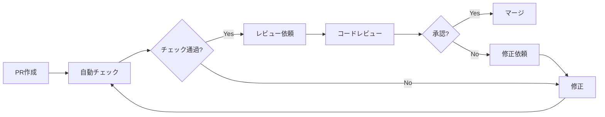

# コントリビューションガイド

## 概要

BubblePop (awaputi) プロジェクトへのコントリビューションにご興味をお持ちいただき、ありがとうございます！このガイドでは、プロジェクトに効果的に貢献するための手順、ガイドライン、ベストプラクティスを説明します。

## コントリビューション方針

### プロジェクトの目標
- **高品質なゲーム体験**: 楽しく魅力的なバブルポップゲームの提供
- **技術的な優秀性**: モダンな Web 技術による高性能な実装
- **アクセシビリティ**: 全てのユーザーが楽しめるインクルーシブなデザイン
- **国際化対応**: 多言語・多文化への対応
- **開発者体験**: 保守しやすく拡張しやすいコードベース

### 歓迎するコントリビューション
- 🐛 **バグ修正**: ゲーム動作の問題や不具合の解決
- ✨ **新機能**: ゲーム体験を向上させる新しい機能
- 📚 **ドキュメント**: API ドキュメント、ガイド、チュートリアルの改善
- 🧪 **テスト**: テストカバレッジの向上、新しいテストケース
- 🎨 **UI/UX**: ユーザーインターフェースやユーザー体験の改善
- 🌐 **国際化**: 新しい言語の翻訳、ローカライゼーション
- ♻️ **リファクタリング**: コード品質の改善、パフォーマンス最適化
- 🔧 **インフラ**: ビルドプロセス、CI/CD、開発環境の改善

## 始める前に

### 1. プロジェクトの理解
1. [README.md](../../README.md) を読んでプロジェクト概要を把握
2. [CLAUDE.md](../../CLAUDE.md) でプロジェクトの詳細仕様を確認
3. [セットアップガイド](./setup-guide.md) に従って開発環境を構築
4. 実際にゲームをプレイして機能を理解

### 2. コードベース探索
```bash
# 主要なファイルを確認
ls src/core/        # コアシステム
ls src/scenes/      # ゲームシーン
ls src/config/      # 設定管理
ls test/           # テストファイル

# API ドキュメントを参照
open docs/api-reference/README.md
```

### 3. 既存の Issue・Discussion の確認
- [Open Issues](https://github.com/taku-o/awaputi/issues) で既存の問題を確認
- [Discussions](https://github.com/taku-o/awaputi/discussions) で議論をチェック
- Good First Issue ラベルの問題から始めることを推奨

## コントリビューション手順

### 1. Issue の選択・作成

#### 既存 Issue への取り組み
```bash
# Issue を選んで宣言
# Issue にコメント: "この問題に取り組みます (I'll work on this issue)"
```

#### 新しい Issue の作成
新しい機能やバグを見つけた場合は、まず Issue を作成してください：

**バグ報告テンプレート:**
```markdown
## バグの説明
簡潔にバグを説明してください。

## 再現手順
1. '...' に移動
2. '...' をクリック
3. '...' まで下スクロール
4. エラーを確認

## 期待される動作
何が起こるべきかを明確に説明してください。

## 実際の動作
実際に何が起こったかを説明してください。

## 環境情報
- OS: [例: Windows 10, macOS 12.0]
- ブラウザ: [例: Chrome 95, Firefox 91]
- ゲームバージョン: [例: v1.2.0]

## スクリーンショット
可能であれば、問題を示すスクリーンショットを添付してください。
```

**機能要望テンプレート:**
```markdown
## 機能の概要
追加したい機能を簡潔に説明してください。

## 解決する問題
この機能がどのような問題を解決するかを説明してください。

## 提案する解決策
実装方法についてのアイデアがあれば説明してください。

## 代替案
検討した他の方法があれば説明してください。

## 追加情報
その他の関連情報やスクリーンショットがあれば追加してください。
```

### 2. 開発ブランチの作成

```bash
# master ブランチから最新を取得
git checkout master
git pull origin master

# 適切な命名規則でブランチ作成
git checkout -b <type>/<description>

# ブランチ命名規則の例:
# feature/magnetic-bubble-implementation
# fix/score-calculation-bug
# docs/api-documentation-update
# test/bubble-manager-unit-tests
# refactor/configuration-system-optimization
```

### 3. 開発実行

#### コード品質の維持
```bash
# 開発中のテスト実行
npm test                    # ユニットテスト
npm run test:e2e           # E2E テスト
npm run test:performance   # パフォーマンステスト

# コード品質チェック
npm run lint               # ESLint チェック
```

#### 開発ガイドライン
- **ES6+ 構文**: モダンな JavaScript を使用
- **コメント**: 日本語でのコメント記述
- **エラーハンドリング**: 適切な例外処理を実装
- **テスト**: 新機能には必ずテストを追加
- **パフォーマンス**: メモリリークや性能問題を考慮

### 4. テスト・品質チェック

#### 必須チェック項目
```bash
# 1. 全テストが通過することを確認
npm run test:all

# 2. ゲームが正常に動作することを確認
python -m http.server 8000
# http://localhost:8000 でゲームテスト

# 3. デバッグモードでエラーがないことを確認
# http://localhost:8000?debug=true

# 4. パフォーマンスに問題がないことを確認
npm run test:performance
```

#### コード品質基準
- **ユニットテストカバレッジ**: 80% 以上
- **E2E テスト**: 主要機能の動作確認
- **ESLint**: エラー・警告ゼロ
- **パフォーマンス**: 60FPS 維持、メモリリークなし

### 5. コミット・プッシュ

#### コミットメッセージ規約
```bash
# Conventional Commits + 絵文字形式
git commit -m "<絵文字> <type>: <description>"

# 良い例:
git commit -m "✨ feat: 磁力バブル（Magnetic）の実装"
git commit -m "🐛 fix: スコア計算でNaNが発生する問題を修正"
git commit -m "📚 docs: ConfigurationManager のAPIドキュメント更新"
git commit -m "🧪 test: BubbleManager のユニットテスト追加"
git commit -m "♻️ refactor: パーティクルシステムのパフォーマンス改善"
```

#### プッシュ前チェックリスト
- [ ] テストが全て通過している
- [ ] ESLint エラーが修正済み
- [ ] ゲームが正常に動作する
- [ ] 関連ドキュメントが更新されている
- [ ] パフォーマンスへの悪影響がない

```bash
# ブランチをプッシュ
git push origin <branch-name>
```

### 6. プルリクエスト作成

#### GitHub CLI を使用 (推奨)
```bash
# プルリクエスト作成
gh pr create --title "✨ feat: 新機能の実装" --body "$(cat <<'EOF'
## 概要
この PR で実装した機能の概要を説明してください。

## 変更内容
- [ ] 新機能 A の実装
- [ ] 関連テストの追加
- [ ] ドキュメントの更新

## 関連 Issue
- Closes #123
- Related to #456

## テスト計画
- [ ] ユニットテスト: 新機能のテストケース追加
- [ ] E2E テスト: 主要シナリオの動作確認
- [ ] 手動テスト: ブラウザでの動作確認

## スクリーンショット・デモ
（スクリーンショットや GIF があれば追加）

## チェックリスト
- [ ] 全テストが通過している
- [ ] ESLint エラーが修正済み
- [ ] ドキュメントが更新されている
- [ ] パフォーマンステストが通過している

## レビューポイント
特に注意してレビューしてほしい点があれば記載してください。

🤖 Generated with [Claude Code](https://claude.ai/code)
EOF
)"
```

#### PR タイトル・説明のガイドライン
- **タイトル**: 絵文字 + Conventional Commits 形式
- **説明**: 変更内容、テスト計画、関連 Issue を明記
- **スクリーンショット**: UI 変更がある場合は必須
- **チェックリスト**: 品質チェック項目を確認

### 7. コードレビュー対応

#### レビューを受ける側として
- **迅速な対応**: コメントには24時間以内に返答
- **建設的な議論**: 異なる意見も尊重し、技術的根拠を示す
- **変更の反映**: 指摘事項は適切に修正
- **追加テスト**: 必要に応じてテストケースを追加

#### レビューを行う側として
- **建設的なフィードバック**: 問題点と改善案を具体的に提示
- **コード品質**: 可読性、保守性、パフォーマンスの観点で評価
- **テスト確認**: 適切なテストが追加されているか確認
- **ドキュメント**: 必要な場合はドキュメント更新を要求

## コーディング規約

### 1. JavaScript スタイル

#### 命名規則
```javascript
// 変数・関数: camelCase (英語)
const bubbleCount = 10;
const calculateScore = (bubbleType) => { ... };

// クラス名: PascalCase (英語)
class BubbleManager { ... }
class ConfigurationManager { ... }

// 定数: UPPER_SNAKE_CASE (英語)
const MAX_BUBBLE_COUNT = 20;
const DEFAULT_GAME_DURATION = 300000;

// ファイル名: PascalCase + .js
// GameEngine.js, BubbleManager.js, ConfigurationManager.js
```

#### コメント規則
```javascript
/**
 * バブルマネージャー - バブルの生成、管理、削除を担当
 * 
 * 主要機能:
 * - バブルの自動生成とスポーン
 * - 衝突検出と物理演算
 * - ライフサイクル管理
 */
class BubbleManager {
    /**
     * 新しいバブルを生成する
     * @param {string} bubbleType - バブルの種類 ('normal', 'stone', 'rainbow' など)
     * @param {Object} position - 生成位置 {x, y}
     * @returns {Bubble} 生成されたバブルインスタンス
     */
    createBubble(bubbleType, position) {
        // バブルタイプの検証
        if (!this.isValidBubbleType(bubbleType)) {
            throw new Error(`無効なバブルタイプ: ${bubbleType}`);
        }
        
        // バブル生成ロジック
        const bubble = new Bubble(bubbleType, position);
        return bubble;
    }
}
```

#### ES6+ 機能の活用
```javascript
// ES6 モジュール (必須)
import { GameEngine } from './core/GameEngine.js';
export { BubbleManager };

// アロー関数
const calculateScore = (bubbleType, ageRatio) => {
    return baseScore * ageRatio;
};

// 分割代入
const { x, y } = bubble.position;
const { baseScores, combo } = this.gameConfig.getScoreConfig();

// テンプレートリテラル
const message = `スコア: ${score}, コンボ: ${combo}`;

// async/await
async loadConfiguration() {
    try {
        const config = await this.configLoader.load();
        return config;
    } catch (error) {
        this.errorHandler.handle(error);
    }
}
```

### 2. エラーハンドリング

```javascript
// ErrorHandler を使用した統一エラー処理
import { ErrorHandler } from '../utils/ErrorHandler.js';

class BubbleManager {
    constructor() {
        this.errorHandler = new ErrorHandler('BubbleManager');
    }
    
    popBubble(bubbleId) {
        try {
            const bubble = this.findBubble(bubbleId);
            if (!bubble) {
                throw new Error(`バブルが見つかりません: ${bubbleId}`);
            }
            
            // バブル削除処理
            return this.removeBubble(bubble);
        } catch (error) {
            // 統一エラーハンドリング
            this.errorHandler.handle(error, {
                context: 'popBubble',
                bubbleId: bubbleId,
                severity: 'warning'
            });
            return null;
        }
    }
}
```

### 3. テスト規約

#### ユニットテスト (Jest)
```javascript
// src/core/BubbleManager.test.js
import { BubbleManager } from './BubbleManager.js';

describe('BubbleManager', () => {
    let bubbleManager;
    
    beforeEach(() => {
        bubbleManager = new BubbleManager();
    });
    
    describe('createBubble', () => {
        test('正常な場合：通常バブルが生成される', () => {
            const bubble = bubbleManager.createBubble('normal', { x: 100, y: 100 });
            
            expect(bubble).toBeDefined();
            expect(bubble.type).toBe('normal');
            expect(bubble.position).toEqual({ x: 100, y: 100 });
        });
        
        test('異常な場合：無効なバブルタイプでエラー', () => {
            expect(() => {
                bubbleManager.createBubble('invalid', { x: 0, y: 0 });
            }).toThrow('無効なバブルタイプ: invalid');
        });
    });
});
```

#### E2E テスト (Playwright)
```javascript
// test/e2e/game-basic-flow.spec.js
import { test, expect } from '@playwright/test';

test.describe('ゲーム基本フロー', () => {
    test('メインメニューからゲーム開始', async ({ page }) => {
        await page.goto('http://localhost:8000');
        
        // メインメニューが表示される
        await expect(page.locator('.main-menu')).toBeVisible();
        
        // ゲーム開始ボタンをクリック
        await page.click('[data-testid="start-game-button"]');
        
        // ゲーム画面に遷移
        await expect(page.locator('.game-scene')).toBeVisible();
        
        // バブルが表示される
        await expect(page.locator('.bubble')).toBeVisible();
    });
});
```

## 特別な貢献領域

### 1. 新しいバブルタイプの追加

新しいバブルタイプを追加する場合の手順：

#### 必要なファイル
```javascript
// 1. バブル定義の追加
// src/bubbles/Bubble.js にタイプを追加

// 2. 設定の追加
// src/config/GameBalance.js にバランス設定を追加

// 3. マネージャーの更新
// src/managers/BubbleManager.js にスポーンロジックを追加

// 4. テストの追加
// test/bubbles/NewBubbleType.test.js を作成
```

#### 実装例
```javascript
// src/bubbles/Bubble.js
class Bubble {
    constructor(type, position) {
        switch (type) {
            case 'newBubbleType':
                this.initializeNewBubbleType();
                break;
            // 他のケース...
        }
    }
    
    initializeNewBubbleType() {
        this.health = 1;
        this.maxAge = 15000;
        this.specialEffect = 'newEffect';
        // 特殊な初期化処理
    }
}
```

### 2. 新しい言語の追加

多言語対応への貢献：

#### 翻訳ファイルの追加
```javascript
// src/locales/[language-code]/
// 例: src/locales/fr/ (フランス語)
//     src/locales/de/ (ドイツ語)
//     src/locales/es/ (スペイン語)

// 各カテゴリの翻訳ファイル
// common.json     - 共通用語
// menu.json       - メニュー関連
// game.json       - ゲーム内メッセージ
// settings.json   - 設定画面
// errors.json     - エラーメッセージ
// achievements.json - 実績関連
// help.json       - ヘルプコンテンツ
```

#### 言語設定の追加
```javascript
// src/locales/config/languages.json に追加
{
  "fr": {
    "name": "Français",
    "nativeName": "Français",
    "direction": "ltr",
    "fontFamily": "system-ui",
    "pluralizationRules": ["one", "other"]
  }
}
```

### 3. パフォーマンス最適化

パフォーマンス改善への貢献：

#### 測定・分析
```javascript
// パフォーマンス測定の実装
class PerformanceProfiler {
    measureBubbleSpawn() {
        const start = performance.now();
        // バブル生成処理
        const end = performance.now();
        
        console.log(`バブル生成時間: ${end - start}ms`);
    }
}
```

#### 最適化手法
- **オブジェクトプーリング**: 頻繁に生成・削除されるオブジェクト
- **キャッシュ**: 計算結果や設定値
- **遅延読み込み**: 必要時に読み込み
- **バッチ処理**: 複数の操作をまとめて実行

## 品質基準

### 1. コード品質

#### 必須要件
- **ESLint**: エラー・警告なし
- **テストカバレッジ**: 80% 以上
- **パフォーマンス**: 60FPS 維持
- **メモリリーク**: なし
- **ブラウザ互換性**: Chrome, Firefox, Safari, Edge

#### 推奨事項
- **可読性**: 意図が明確なコード
- **再利用性**: 汎用的なコンポーネント設計
- **拡張性**: 新機能追加が容易
- **保守性**: 変更時の影響範囲が限定的

### 2. ドキュメント

#### 必須ドキュメント
- **API ドキュメント**: 公開メソッドの説明
- **README 更新**: 新機能の使用方法
- **CHANGELOG**: 変更履歴の記録
- **コメント**: 複雑なロジックの説明

#### 推奨ドキュメント
- **アーキテクチャ図**: システム構成の視覚化
- **サンプルコード**: 使用例の提供
- **トラブルシューティング**: よくある問題と解決方法

## レビュープロセス

### 1. レビュー基準

#### 機能性
- [ ] 要件を正確に実装している
- [ ] エッジケースが考慮されている
- [ ] エラーハンドリングが適切
- [ ] パフォーマンスへの悪影響がない

#### コード品質
- [ ] 可読性が高い
- [ ] 一貫したスタイル
- [ ] 適切な抽象化レベル
- [ ] DRY 原則に従っている

#### テスト
- [ ] 十分なテストカバレッジ
- [ ] 境界値のテスト
- [ ] 異常系のテスト
- [ ] E2E テストの追加（必要に応じて）

### 2. レビューフロー



### 3. マージ条件

#### 必須条件
- [ ] 全自動テストが通過
- [ ] 1人以上のレビュアーによる承認
- [ ] すべてのコメントが解決済み
- [ ] 最新の master ブランチとのマージ済み

#### 推奨条件
- [ ] パフォーマンステストが通過
- [ ] 関連ドキュメントの更新
- [ ] 後方互換性の維持

## コミュニティガイドライン

### 1. 行動規範

#### 基本方針
- **尊重**: すべての参加者を尊重する
- **包括性**: 多様性を歓迎し、差別をしない
- **建設的**: 建設的な議論とフィードバック
- **協力**: チームワークを重視する

#### 禁止事項
- 個人攻撃やハラスメント
- 差別的言動
- スパムや無関係な投稿
- 著作権侵害

### 2. コミュニケーション

#### 議論の進め方
- **技術的根拠**: 意見には技術的根拠を示す
- **具体性**: 抽象的でなく具体的な提案
- **代替案**: 問題を指摘する場合は代替案も提示
- **尊重**: 異なる意見も尊重する

#### 質問の仕方
- **事前調査**: 既存のドキュメントや Issue を確認
- **具体性**: 問題を具体的に説明
- **再現手順**: バグの場合は再現手順を明記
- **環境情報**: 必要な環境情報を提供

## 認識・感謝

### コントリビューター認識

プロジェクトに貢献してくださった方は以下の方法で認識されます：

- **README.md**: Contributors セクションに掲載
- **CHANGELOG.md**: 各リリースでの貢献を記録
- **GitHub**: Contributors ページでの表示
- **リリースノート**: 重要な機能の貢献者を明記

### 貢献レベル

#### 🥉 Bronze Contributor
- 1-5 個の PR がマージされた
- バグ修正やドキュメント改善

#### 🥈 Silver Contributor  
- 6-15 個の PR がマージされた
- 新機能の実装や大幅な改善

#### 🥇 Gold Contributor
- 16+ 個の PR がマージされた
- アーキテクチャレベルの貢献

#### 💎 Core Contributor
- 継続的な貢献とメンテナンス
- プロジェクトの方向性への参画

## サポート・質問

### ヘルプが必要な場合

1. **ドキュメント確認**: まず関連ドキュメントを確認
2. **既存 Issue 検索**: 同様の問題がないか検索
3. **Discussion 投稿**: 一般的な質問は Discussion で
4. **Issue 作成**: バグや具体的な問題は Issue で

### 連絡方法

- **GitHub Issues**: バグ報告・機能要望
- **GitHub Discussions**: 質問・アイデア・議論
- **Pull Request**: コードの貢献
- **Email**: 機密事項やコミュニティ問題

---

**コントリビューションを始める準備はできましたか？**

まずは [Good First Issue](https://github.com/taku-o/awaputi/labels/good%20first%20issue) から始めて、プロジェクトの雰囲気を掴んでください。質問があれば遠慮なく Discussion や Issue で聞いてください。

あなたの貢献をお待ちしています！🎉