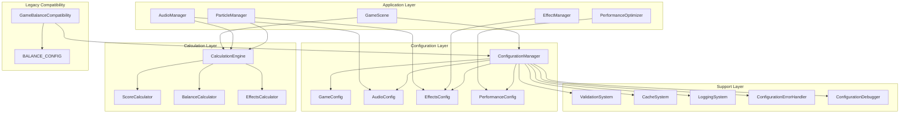

# 設定システム詳細設計書

## 概要

本ドキュメントでは、Bubble Pop Web Gameの新しい設定システムの詳細な設計について説明します。このシステムは、従来の分散した設定管理を統一し、型安全性、パフォーマンス、保守性を向上させることを目的としています。

## システムアーキテクチャ

### 全体構成図



### レイヤー構造

#### 1. Application Layer（アプリケーション層）
- **役割**: ゲームの各コンポーネントが設定システムを利用
- **コンポーネント**: GameScene, AudioManager, ParticleManager, EffectManager, PerformanceOptimizer
- **責任**: 設定値の取得、設定変更の監視、計算処理の実行

#### 2. Configuration Layer（設定管理層）
- **役割**: 設定値の統一管理と提供
- **コンポーネント**: ConfigurationManager, 各種Configクラス
- **責任**: 設定値の保存・取得、検証、監視機能の提供

#### 3. Calculation Layer（計算処理層）
- **役割**: 各種計算処理の統一管理
- **コンポーネント**: CalculationEngine, 各種Calculatorクラス
- **責任**: 計算処理の実行、結果のキャッシュ、パフォーマンス最適化

#### 4. Support Layer（サポート層）
- **役割**: システム全体を支える基盤機能
- **コンポーネント**: ValidationSystem, CacheSystem, LoggingSystem
- **責任**: 検証、キャッシュ、ログ、エラーハンドリング、デバッグ

#### 5. Legacy Compatibility Layer（互換性層）
- **役割**: 既存システムとの互換性保証
- **コンポーネント**: GameBalanceCompatibility
- **責任**: 旧APIの提供、段階的移行の支援

## 詳細設計

### 1. ConfigurationManager

#### クラス構造

```javascript
class ConfigurationManager {
    constructor() {
        this.configurations = new Map();      // 設定データストレージ
        this.watchers = new Map();           // 設定監視用コールバック
        this.validationRules = new Map();   // 検証ルール
        this.defaultValues = new Map();     // デフォルト値
        this.changeHistory = [];            // 変更履歴
        this.cache = getCacheSystem();      // キャッシュシステム
        this.accessStats = {};              // アクセス統計
        this.lazyLoaders = new Map();       // 遅延読み込み
        this.preloadKeys = new Set();       // プリロードキー
    }
}
```

#### 主要メソッド

##### get(category, key, defaultValue)
```javascript
get(category, key, defaultValue = null) {
    // 1. アクセス統計を更新
    this._updateAccessStats(`${category}.${key}`);
    
    // 2. キャッシュから取得を試行
    const cachedValue = this.cache.get(`${category}.${key}`);
    if (cachedValue !== null) {
        this.accessStats.cacheHits++;
        return cachedValue;
    }
    
    // 3. 遅延読み込みの確認
    if (this.lazyLoaders.has(`${category}.${key}`)) {
        const loader = this.lazyLoaders.get(`${category}.${key}`);
        const value = loader();
        this._cacheValue(`${category}.${key}`, value);
        return value;
    }
    
    // 4. 通常の設定値取得
    const value = this._getDirectValue(category, key, defaultValue);
    
    // 5. 頻繁にアクセスされるキーはキャッシュに保存
    if (this._shouldCache(`${category}.${key}`)) {
        this._cacheValue(`${category}.${key}`, value);
    }
    
    return value;
}
```

##### set(category, key, value)
```javascript
set(category, key, value) {
    // 1. 検証実行
    if (!this.validate(category, key, value)) {
        return false;
    }
    
    // 2. 値を設定
    const oldValue = this._getDirectValue(category, key);
    this._setDirectValue(category, key, value);
    
    // 3. キャッシュを無効化
    this.cache.delete(`${category}.${key}`);
    
    // 4. 変更履歴を記録
    this._recordChange(category, key, oldValue, value);
    
    // 5. 監視者に通知
    this._notifyWatchers(category, key, value, oldValue);
    
    return true;
}
```

#### パフォーマンス最適化

##### インテリジェントキャッシュ
```javascript
_setIntelligentCachedResult(key, result, calculationTime) {
    // 適応的TTLを計算
    const adaptiveTtl = this._calculateAdaptiveTtl(key, calculationTime);
    
    // 優先度を計算
    const priority = this._calculateCachePriority(key, calculationTime);
    
    const now = Date.now();
    this.cache.set(key, {
        value: result,
        expiry: now + adaptiveTtl,
        timestamp: now,
        calculationTime,
        accessCount: 1,
        lastAccess: now,
        priority
    });
}
```

##### プリロード機能
```javascript
warmupCache() {
    let warmedCount = 0;
    
    // プリロードキーをキャッシュに読み込み
    for (const fullKey of this.preloadKeys) {
        const [category, key] = fullKey.split('.');
        if (this.has(category, key)) {
            const value = this._getDirectValue(category, key);
            this._cacheValue(fullKey, value);
            warmedCount++;
        }
    }
    
    this._logDebug(`キャッシュウォームアップ完了: ${warmedCount}キーを読み込み`);
}
```

### 2. GameConfig

#### 設定構造

```javascript
const GameConfigStructure = {
    scoring: {
        baseScores: {
            normal: 15,
            stone: 35,
            iron: 65,
            diamond: 120,
            rainbow: 400,
            // ... その他の泡タイプ
        },
        combo: {
            multiplierIncrement: 0.08,
            maxMultiplier: 2.5,
            bonusInterval: 5,
            bonusMultiplier: 8,
            baseTimeout: 2000
        },
        ageBonus: {
            earlyBonus: 2.0,
            lateBonus: 3.0,
            midBonus: 1.5
        }
    },
    stages: {
        unlockRequirements: {
            hard: 500,
            veryHard: 2000,
            special: 5000,
            // ... その他のステージ
        },
        difficulty: {
            normal: { spawnRate: 1.5, maxBubbles: 20 },
            hard: { spawnRate: 1.6, maxBubbles: 22 },
            // ... その他の難易度
        }
    },
    items: {
        baseCosts: {
            scoreMultiplier: 75,
            revival: 150,
            rareRate: 100,
            // ... その他のアイテム
        },
        costMultiplier: 1.3,
        effects: {
            scoreMultiplier: 1.3,
            rareRate: 1.3,
            // ... その他の効果
        },
        maxLevels: {
            scoreMultiplier: 5,
            revival: 2,
            // ... その他の最大レベル
        }
    },
    bubbles: {
        maxAge: {
            normal: 12000,
            stone: 16000,
            iron: 20000,
            // ... その他の泡タイプ
        },
        health: {
            normal: 1,
            stone: 2,
            iron: 3,
            // ... その他の耐久値
        },
        specialEffects: {
            rainbow: { bonusTimeMultiplier: 1.5 },
            spiky: { chainRadius: 120 },
            // ... その他の特殊効果
        }
    }
};
```

#### 計算メソッドの実装

```javascript
calculateScore(bubbleType, ageRatio = 0) {
    try {
        const baseScore = this.getBubbleBaseScore(bubbleType);
        let multiplier = 1;
        
        // 年齢ボーナス適用
        const ageBonus = this.getAgeBonusConfig();
        if (ageRatio < 0.1) {
            multiplier = ageBonus.earlyBonus || 2.0;
        } else if (ageRatio > 0.9) {
            multiplier = ageBonus.lateBonus || 3.0;
        } else if (ageRatio >= 0.5 && ageRatio <= 0.7) {
            multiplier = ageBonus.midBonus || 1.5;
        }
        
        return Math.floor(baseScore * multiplier);
    } catch (error) {
        this._handleError(error, 'calculateScore', { bubbleType, ageRatio });
        return 15; // デフォルト値
    }
}
```

### 3. CalculationEngine

#### アーキテクチャ

```javascript
class CalculationEngine {
    constructor() {
        this.calculators = new Map();           // 計算処理クラスの登録
        this.cache = new Map();                 // 計算結果のキャッシュ
        this.cacheStats = {};                   // キャッシュ統計
        this.performanceStats = new Map();     // パフォーマンス統計
        this.frequentCalculations = new Map(); // 頻繁な計算のトラッキング
        this.batchQueue = new Map();           // バッチ処理キュー
        this.cacheConfig = {};                 // キャッシュ設定
        this.optimizationConfig = {};          // 最適化設定
    }
}
```

#### インテリジェントキャッシュシステム

##### 適応的TTL計算
```javascript
_calculateAdaptiveTtl(key, calculationTime) {
    let baseTtl = this.cacheConfig.ttl;
    
    // 重い計算は長時間キャッシュ
    if (calculationTime > this.cacheConfig.heavyCalculationThreshold) {
        baseTtl = this.cacheConfig.heavyCalculationTtl;
        this.cacheStats.heavyCalculations++;
    }
    
    // 頻繁にアクセスされる計算は長時間キャッシュ
    const frequency = this.frequentCalculations.get(key) || 0;
    if (frequency > this.cacheConfig.preloadThreshold) {
        baseTtl *= 2; // 2倍の時間キャッシュ
    }
    
    return baseTtl;
}
```

##### キャッシュ優先度システム
```javascript
_calculateCachePriority(key, calculationTime) {
    let priority = 0;
    
    // 計算時間による優先度（重い計算ほど高優先度）
    priority += Math.min(calculationTime, 100) * 10;
    
    // アクセス頻度による優先度
    const frequency = this.frequentCalculations.get(key) || 0;
    priority += frequency * 5;
    
    return priority;
}
```

##### 最も価値の低いキャッシュの削除
```javascript
_evictLeastValuableCache() {
    let leastValuableKey = null;
    let lowestScore = Infinity;
    const now = Date.now();
    
    for (const [key, cached] of this.cache.entries()) {
        // 価値スコアを計算（低いほど削除対象）
        const timeSinceLastAccess = now - cached.lastAccess;
        const accessFrequency = cached.accessCount || 1;
        const calculationCost = cached.calculationTime || 1;
        
        // スコア = (優先度 * アクセス頻度 * 計算コスト) / 最終アクセスからの時間
        const score = (cached.priority * accessFrequency * calculationCost) / (timeSinceLastAccess + 1);
        
        if (score < lowestScore) {
            lowestScore = score;
            leastValuableKey = key;
        }
    }
    
    if (leastValuableKey) {
        this.cache.delete(leastValuableKey);
    }
}
```

#### バッチ処理システム

```javascript
_processBatch(type, method, params, options) {
    const batchKey = `${type}:${method}`;
    
    return new Promise((resolve, reject) => {
        // バッチキューに追加
        if (!this.batchQueue.has(batchKey)) {
            this.batchQueue.set(batchKey, {
                requests: [],
                timeout: null
            });
        }
        
        const batch = this.batchQueue.get(batchKey);
        batch.requests.push({ params, resolve, reject, options });
        
        // バッチ処理のタイマーを設定
        if (!batch.timeout) {
            batch.timeout = setTimeout(() => {
                this._executeBatch(type, method, batchKey);
            }, 10); // 10ms後にバッチ実行
        }
    });
}
```

### 4. ValidationSystem

#### 検証ルールの構造

```javascript
const ValidationRuleStructure = {
    type: 'number',                    // データ型
    min: 0,                           // 最小値
    max: 100,                         // 最大値
    required: true,                   // 必須フラグ
    validator: (value) => boolean,    // カスタム検証関数
    sanitizer: (value) => value,      // 値の正規化関数
    errorMessage: 'エラーメッセージ'    // エラーメッセージ
};
```

#### 検証処理の実装

```javascript
validate(category, key, value, rule) {
    const validationResult = {
        isValid: true,
        errors: [],
        warnings: [],
        sanitizedValue: value
    };
    
    try {
        // 1. 必須チェック
        if (rule.required && (value === null || value === undefined)) {
            validationResult.isValid = false;
            validationResult.errors.push('必須項目です');
            return validationResult;
        }
        
        // 2. 型チェック
        if (rule.type && typeof value !== rule.type) {
            validationResult.isValid = false;
            validationResult.errors.push(`型が不正です。期待値: ${rule.type}, 実際: ${typeof value}`);
        }
        
        // 3. 範囲チェック（数値の場合）
        if (typeof value === 'number') {
            if (rule.min !== undefined && value < rule.min) {
                validationResult.isValid = false;
                validationResult.errors.push(`値が最小値を下回ります。最小値: ${rule.min}, 実際: ${value}`);
            }
            if (rule.max !== undefined && value > rule.max) {
                validationResult.isValid = false;
                validationResult.errors.push(`値が最大値を上回ります。最大値: ${rule.max}, 実際: ${value}`);
            }
        }
        
        // 4. カスタム検証
        if (rule.validator && typeof rule.validator === 'function') {
            if (!rule.validator(value)) {
                validationResult.isValid = false;
                validationResult.errors.push(rule.errorMessage || 'カスタム検証に失敗しました');
            }
        }
        
        // 5. 値の正規化
        if (rule.sanitizer && typeof rule.sanitizer === 'function') {
            validationResult.sanitizedValue = rule.sanitizer(value);
        }
        
        return validationResult;
        
    } catch (error) {
        validationResult.isValid = false;
        validationResult.errors.push(`検証中にエラーが発生しました: ${error.message}`);
        return validationResult;
    }
}
```

### 5. CacheSystem

#### キャッシュアーキテクチャ

```javascript
class CacheSystem {
    constructor(options = {}) {
        this.maxSize = options.maxSize || 1000;
        this.ttl = options.ttl || 300000; // 5分
        this.cleanupInterval = options.cleanupInterval || 60000; // 1分
        
        this.cache = new Map();
        this.accessOrder = new Map(); // LRU用
        this.stats = {
            hits: 0,
            misses: 0,
            evictions: 0,
            size: 0
        };
        
        this.startCleanupTimer();
    }
}
```

#### LRU (Least Recently Used) 実装

```javascript
get(key) {
    const entry = this.cache.get(key);
    
    if (!entry) {
        this.stats.misses++;
        return null;
    }
    
    // TTLチェック
    if (Date.now() > entry.expiry) {
        this.cache.delete(key);
        this.accessOrder.delete(key);
        this.stats.misses++;
        return null;
    }
    
    // アクセス順序を更新（LRU）
    this.accessOrder.delete(key);
    this.accessOrder.set(key, Date.now());
    
    this.stats.hits++;
    return entry.value;
}

set(key, value, options = {}) {
    // サイズ制限チェック
    if (this.cache.size >= this.maxSize && !this.cache.has(key)) {
        this._evictLRU();
    }
    
    const ttl = options.ttl || this.ttl;
    const priority = options.priority || 0;
    
    const entry = {
        value,
        expiry: Date.now() + ttl,
        priority,
        timestamp: Date.now()
    };
    
    this.cache.set(key, entry);
    this.accessOrder.set(key, Date.now());
    this.stats.size = this.cache.size;
}

_evictLRU() {
    // 最も古いアクセスのキーを削除
    const oldestKey = this.accessOrder.keys().next().value;
    if (oldestKey) {
        this.cache.delete(oldestKey);
        this.accessOrder.delete(oldestKey);
        this.stats.evictions++;
    }
}
```

### 6. LoggingSystem

#### ログレベルと構造

```javascript
const LogLevels = {
    ERROR: 0,
    WARN: 1,
    INFO: 2,
    DEBUG: 3,
    TRACE: 4
};

const LogEntry = {
    timestamp: Date.now(),
    level: 'INFO',
    category: 'configuration',
    message: 'ログメッセージ',
    context: {
        key: 'value',
        // ... その他のコンテキスト情報
    },
    stackTrace: null // エラーの場合のみ
};
```

#### ログ出力の実装

```javascript
log(level, category, message, context = {}) {
    if (level > this.currentLogLevel) {
        return; // ログレベルが低い場合は出力しない
    }
    
    const logEntry = {
        timestamp: Date.now(),
        level: this._getLevelName(level),
        category,
        message,
        context,
        stackTrace: level === LogLevels.ERROR ? new Error().stack : null
    };
    
    // ログの出力
    this._outputLog(logEntry);
    
    // ログの保存（履歴用）
    this._storeLog(logEntry);
    
    // 重要なログの場合は通知
    if (level <= LogLevels.WARN) {
        this._notifyImportantLog(logEntry);
    }
}
```

### 7. エラーハンドリングシステム

#### エラー分類

```javascript
const ErrorTypes = {
    CONFIGURATION_ERROR: 'CONFIGURATION_ERROR',
    VALIDATION_ERROR: 'VALIDATION_ERROR',
    CALCULATION_ERROR: 'CALCULATION_ERROR',
    CACHE_ERROR: 'CACHE_ERROR',
    SYSTEM_ERROR: 'SYSTEM_ERROR'
};

const ErrorSeverity = {
    LOW: 1,      // 警告レベル
    MEDIUM: 2,   // 注意レベル
    HIGH: 3,     // エラーレベル
    CRITICAL: 4  // 致命的レベル
};
```

#### エラーハンドリングの実装

```javascript
handleError(error, type, context = {}) {
    const errorInfo = {
        timestamp: Date.now(),
        type,
        message: error.message,
        stack: error.stack,
        context,
        severity: this._calculateSeverity(type, error),
        recoveryAction: this._determineRecoveryAction(type, error)
    };
    
    // ログに記録
    this.loggingSystem.log(LogLevels.ERROR, 'error-handler', errorInfo.message, errorInfo);
    
    // 復旧処理の実行
    if (errorInfo.recoveryAction) {
        try {
            this._executeRecoveryAction(errorInfo.recoveryAction, context);
        } catch (recoveryError) {
            // 復旧処理でもエラーが発生した場合
            this.loggingSystem.log(LogLevels.ERROR, 'error-handler', 
                `復旧処理でエラーが発生: ${recoveryError.message}`, { originalError: errorInfo });
        }
    }
    
    // 重要なエラーの場合は通知
    if (errorInfo.severity >= ErrorSeverity.HIGH) {
        this._notifyError(errorInfo);
    }
    
    return errorInfo;
}
```

## パフォーマンス最適化

### 1. メモリ管理

#### オブジェクトプール

```javascript
class ObjectPool {
    constructor(createFn, resetFn, initialSize = 10) {
        this.createFn = createFn;
        this.resetFn = resetFn;
        this.pool = [];
        this.active = new Set();
        
        // 初期オブジェクトを作成
        for (let i = 0; i < initialSize; i++) {
            this.pool.push(this.createFn());
        }
    }
    
    acquire() {
        let obj;
        if (this.pool.length > 0) {
            obj = this.pool.pop();
        } else {
            obj = this.createFn();
        }
        
        this.active.add(obj);
        return obj;
    }
    
    release(obj) {
        if (this.active.has(obj)) {
            this.active.delete(obj);
            this.resetFn(obj);
            this.pool.push(obj);
        }
    }
}
```

#### ガベージコレクション対策

```javascript
// 循環参照の回避
class ConfigurationManager {
    destroy() {
        // イベントリスナーの削除
        for (const [watchKey, callbacks] of this.watchers) {
            callbacks.clear();
        }
        this.watchers.clear();
        
        // キャッシュのクリア
        this.cache.clear();
        
        // タイマーの停止
        if (this.cleanupTimer) {
            clearInterval(this.cleanupTimer);
        }
        
        // 参照の削除
        this.configurations = null;
        this.validationRules = null;
        this.defaultValues = null;
    }
}
```

### 2. 計算最適化

#### 遅延評価

```javascript
class LazyValue {
    constructor(computeFn) {
        this.computeFn = computeFn;
        this.computed = false;
        this.value = null;
    }
    
    get() {
        if (!this.computed) {
            this.value = this.computeFn();
            this.computed = true;
        }
        return this.value;
    }
    
    invalidate() {
        this.computed = false;
        this.value = null;
    }
}
```

#### 並列処理（Web Workers）

```javascript
class ParallelCalculationEngine {
    constructor() {
        this.workers = [];
        this.taskQueue = [];
        this.workerCount = navigator.hardwareConcurrency || 4;
        
        this.initializeWorkers();
    }
    
    initializeWorkers() {
        for (let i = 0; i < this.workerCount; i++) {
            const worker = new Worker('calculation-worker.js');
            worker.onmessage = this.handleWorkerMessage.bind(this);
            this.workers.push(worker);
        }
    }
    
    calculateParallel(tasks) {
        return new Promise((resolve, reject) => {
            const results = new Array(tasks.length);
            let completedCount = 0;
            
            tasks.forEach((task, index) => {
                const worker = this.workers[index % this.workers.length];
                worker.postMessage({ task, index });
                
                const handleResult = (event) => {
                    if (event.data.index === index) {
                        results[index] = event.data.result;
                        completedCount++;
                        
                        if (completedCount === tasks.length) {
                            resolve(results);
                        }
                        
                        worker.removeEventListener('message', handleResult);
                    }
                };
                
                worker.addEventListener('message', handleResult);
            });
        });
    }
}
```

## セキュリティ考慮事項

### 1. 設定値の検証

```javascript
// XSS対策
const sanitizeString = (value) => {
    if (typeof value !== 'string') return value;
    
    return value
        .replace(/</g, '&lt;')
        .replace(/>/g, '&gt;')
        .replace(/"/g, '&quot;')
        .replace(/'/g, '&#x27;')
        .replace(/\//g, '&#x2F;');
};

// インジェクション対策
const validateConfigKey = (key) => {
    const allowedPattern = /^[a-zA-Z0-9._-]+$/;
    return allowedPattern.test(key);
};
```

### 2. アクセス制御

```javascript
class SecureConfigurationManager extends ConfigurationManager {
    constructor() {
        super();
        this.accessRules = new Map();
        this.currentUser = null;
    }
    
    setAccessRule(category, key, rule) {
        this.accessRules.set(`${category}.${key}`, rule);
    }
    
    checkAccess(category, key, operation) {
        const rule = this.accessRules.get(`${category}.${key}`);
        if (!rule) return true; // デフォルトは許可
        
        return rule.check(this.currentUser, operation);
    }
    
    get(category, key, defaultValue) {
        if (!this.checkAccess(category, key, 'read')) {
            throw new Error(`アクセス拒否: ${category}.${key} の読み取り権限がありません`);
        }
        
        return super.get(category, key, defaultValue);
    }
    
    set(category, key, value) {
        if (!this.checkAccess(category, key, 'write')) {
            throw new Error(`アクセス拒否: ${category}.${key} の書き込み権限がありません`);
        }
        
        return super.set(category, key, value);
    }
}
```

## テスト戦略

### 1. 単体テスト

```javascript
describe('ConfigurationManager', () => {
    let configManager;
    
    beforeEach(() => {
        configManager = new ConfigurationManager();
    });
    
    afterEach(() => {
        configManager.destroy();
    });
    
    describe('get/set operations', () => {
        it('should store and retrieve values correctly', () => {
            configManager.set('test', 'key', 'value');
            expect(configManager.get('test', 'key')).toBe('value');
        });
        
        it('should return default value when key does not exist', () => {
            expect(configManager.get('test', 'nonexistent', 'default')).toBe('default');
        });
        
        it('should validate values before setting', () => {
            configManager.setValidationRule('test', 'number', {
                type: 'number',
                min: 0,
                max: 100
            });
            
            expect(configManager.set('test', 'number', 150)).toBe(false);
            expect(configManager.set('test', 'number', 50)).toBe(true);
        });
    });
    
    describe('caching', () => {
        it('should cache frequently accessed values', () => {
            configManager.set('test', 'cached', 'value');
            
            // 複数回アクセスしてキャッシュを有効化
            for (let i = 0; i < 5; i++) {
                configManager.get('test', 'cached');
            }
            
            const stats = configManager.getPerformanceStats();
            expect(stats.cacheHits).toBeGreaterThan(0);
        });
    });
});
```

### 2. 統合テスト

```javascript
describe('Configuration System Integration', () => {
    let configManager, gameConfig, calcEngine;
    
    beforeEach(() => {
        configManager = getConfigurationManager();
        gameConfig = getGameConfig();
        calcEngine = getCalculationEngine();
    });
    
    it('should integrate GameConfig with ConfigurationManager', () => {
        // GameConfigが設定値を正しく取得できることを確認
        const baseScore = gameConfig.getBubbleBaseScore('normal');
        expect(typeof baseScore).toBe('number');
        expect(baseScore).toBeGreaterThan(0);
    });
    
    it('should integrate CalculationEngine with configuration', () => {
        // 計算エンジンが設定値を使用して正しく計算できることを確認
        const result = calcEngine.calculate('score', 'calculateBaseScore', ['normal', 0.5]);
        expect(typeof result).toBe('number');
        expect(result).toBeGreaterThan(0);
    });
    
    it('should handle configuration changes dynamically', (done) => {
        // 設定変更が計算結果に反映されることを確認
        const originalScore = gameConfig.getBubbleBaseScore('normal');
        
        configManager.watch('game', 'scoring.baseScores.normal', (newValue) => {
            const newScore = gameConfig.getBubbleBaseScore('normal');
            expect(newScore).toBe(newValue);
            expect(newScore).not.toBe(originalScore);
            done();
        });
        
        configManager.set('game', 'scoring.baseScores.normal', originalScore + 10);
    });
});
```

### 3. パフォーマンステスト

```javascript
describe('Performance Tests', () => {
    it('should handle high-frequency access efficiently', () => {
        const configManager = getConfigurationManager();
        const startTime = performance.now();
        
        // 10000回のアクセス
        for (let i = 0; i < 10000; i++) {
            configManager.get('game', 'scoring.baseScores.normal', 15);
        }
        
        const endTime = performance.now();
        const duration = endTime - startTime;
        
        // 10000回のアクセスが1秒以内に完了することを確認
        expect(duration).toBeLessThan(1000);
        
        // キャッシュヒット率が80%以上であることを確認
        const stats = configManager.getPerformanceStats();
        const hitRate = parseFloat(stats.hitRate);
        expect(hitRate).toBeGreaterThan(80);
    });
    
    it('should handle complex calculations efficiently', () => {
        const calcEngine = getCalculationEngine();
        const startTime = performance.now();
        
        // 1000回の複雑な計算
        for (let i = 0; i < 1000; i++) {
            calcEngine.calculate('score', 'calculateTotalScore', [{
                bubbleType: 'diamond',
                ageRatio: Math.random(),
                comboCount: Math.floor(Math.random() * 10),
                specialMultiplier: 1 + Math.random(),
                itemMultiplier: 1 + Math.random()
            }]);
        }
        
        const endTime = performance.now();
        const duration = endTime - startTime;
        
        // 1000回の計算が500ms以内に完了することを確認
        expect(duration).toBeLessThan(500);
    });
});
```

## 監視とメトリクス

### 1. パフォーマンスメトリクス

```javascript
class PerformanceMonitor {
    constructor() {
        this.metrics = {
            configAccess: {
                totalRequests: 0,
                averageResponseTime: 0,
                cacheHitRate: 0
            },
            calculations: {
                totalCalculations: 0,
                averageCalculationTime: 0,
                cacheHitRate: 0
            },
            memory: {
                heapUsed: 0,
                heapTotal: 0,
                cacheSize: 0
            }
        };
        
        this.startMonitoring();
    }
    
    startMonitoring() {
        setInterval(() => {
            this.collectMetrics();
        }, 30000); // 30秒間隔
    }
    
    collectMetrics() {
        // メモリ使用量
        if (performance.memory) {
            this.metrics.memory.heapUsed = performance.memory.usedJSHeapSize;
            this.metrics.memory.heapTotal = performance.memory.totalJSHeapSize;
        }
        
        // 設定アクセス統計
        const configManager = getConfigurationManager();
        const configStats = configManager.getPerformanceStats();
        this.metrics.configAccess = {
            totalRequests: configStats.totalAccesses,
            averageResponseTime: configStats.averageAccessTime,
            cacheHitRate: parseFloat(configStats.hitRate)
        };
        
        // 計算統計
        const calcEngine = getCalculationEngine();
        const calcStats = calcEngine.getExtendedCacheStats();
        this.metrics.calculations = {
            totalCalculations: calcStats.totalRequests,
            averageCalculationTime: parseFloat(calcStats.averageCalculationTime),
            cacheHitRate: parseFloat(calcStats.hitRate)
        };
        
        // アラートチェック
        this.checkAlerts();
    }
    
    checkAlerts() {
        // メモリ使用量アラート
        if (this.metrics.memory.heapUsed > 100 * 1024 * 1024) { // 100MB
            console.warn('メモリ使用量が高くなっています:', this.metrics.memory.heapUsed);
        }
        
        // キャッシュヒット率アラート
        if (this.metrics.configAccess.cacheHitRate < 70) {
            console.warn('設定アクセスのキャッシュヒット率が低下しています:', this.metrics.configAccess.cacheHitRate);
        }
        
        if (this.metrics.calculations.cacheHitRate < 60) {
            console.warn('計算処理のキャッシュヒット率が低下しています:', this.metrics.calculations.cacheHitRate);
        }
    }
}
```

### 2. エラー監視

```javascript
class ErrorMonitor {
    constructor() {
        this.errorCounts = new Map();
        this.errorHistory = [];
        this.alertThresholds = {
            errorRate: 0.05,      // 5%のエラー率でアラート
            criticalErrors: 3,    // 3回の致命的エラーでアラート
            timeWindow: 300000    // 5分間のウィンドウ
        };
    }
    
    recordError(error, type, severity) {
        const errorKey = `${type}:${severity}`;
        const currentCount = this.errorCounts.get(errorKey) || 0;
        this.errorCounts.set(errorKey, currentCount + 1);
        
        this.errorHistory.push({
            timestamp: Date.now(),
            type,
            severity,
            message: error.message
        });
        
        // 古いエラー履歴を削除
        const cutoffTime = Date.now() - this.alertThresholds.timeWindow;
        this.errorHistory = this.errorHistory.filter(e => e.timestamp > cutoffTime);
        
        // アラートチェック
        this.checkErrorAlerts();
    }
    
    checkErrorAlerts() {
        const recentErrors = this.errorHistory.filter(
            e => e.timestamp > Date.now() - this.alertThresholds.timeWindow
        );
        
        // 致命的エラーのチェック
        const criticalErrors = recentErrors.filter(e => e.severity === 'CRITICAL');
        if (criticalErrors.length >= this.alertThresholds.criticalErrors) {
            this.sendAlert('CRITICAL', `致命的エラーが${criticalErrors.length}回発生しました`);
        }
        
        // エラー率のチェック
        const totalOperations = this.getTotalOperations();
        if (totalOperations > 0) {
            const errorRate = recentErrors.length / totalOperations;
            if (errorRate > this.alertThresholds.errorRate) {
                this.sendAlert('HIGH', `エラー率が${(errorRate * 100).toFixed(2)}%に上昇しました`);
            }
        }
    }
}
```

## 関連ドキュメント

- [API ドキュメント](./configuration-system-api.md)
- [移行ガイド](./migration-guide.md)
- [要件定義書](../.kiro/specs/configuration-refactoring/requirements.md)
- [実装タスクリスト](../.kiro/specs/configuration-refactoring/tasks.md)